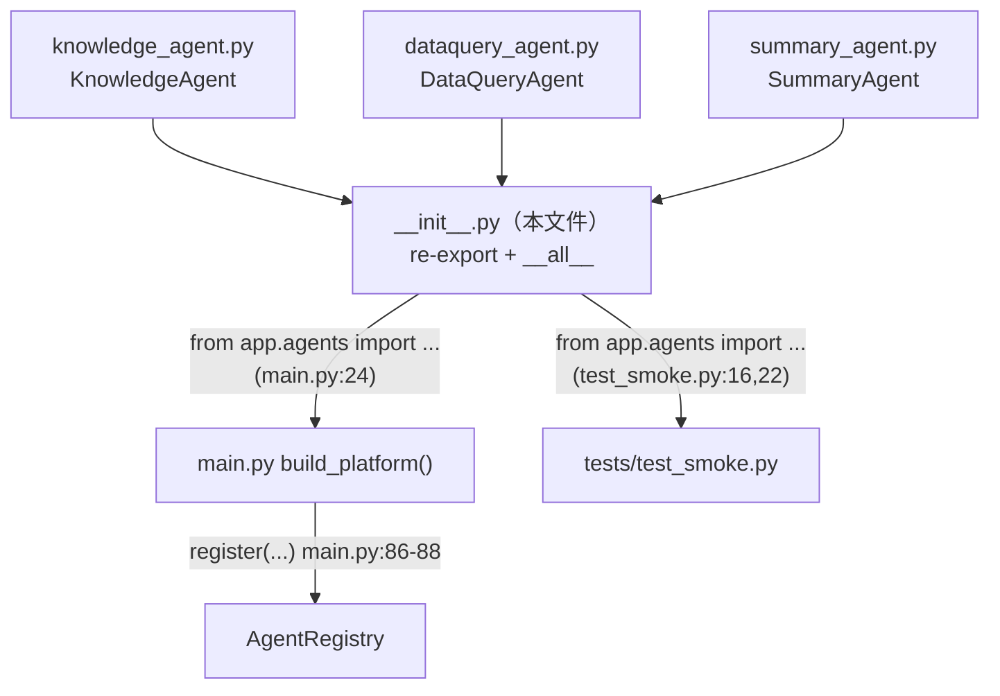
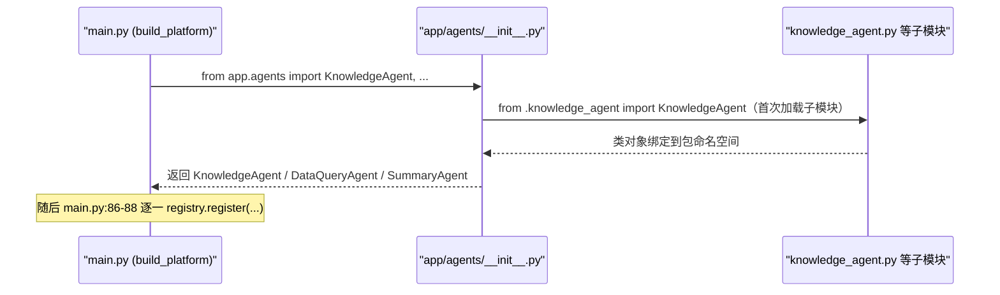

# 基本设计书（代码解说版）
## `backend/app/agents/__init__.py` — 智能体包的统一导出口（re-export 聚合）

> 本书面向初学者，用图和表解说「这个文件：以什么为输入、输出什么、被谁调用、内部如何运作、与哪些部件相互调用」。专业术语在 §7 术语表附中文注释。

---

## 0. 文档信息

| 项目 | 内容 |
|---|---|
| 对象文件 | `backend/app/agents/__init__.py` |
| 作用（一句话） | 把 `app/agents` 包内三个智能体类**集中再导出（re-export）**，让外部用 `from app.agents import KnowledgeAgent, DataQueryAgent, SummaryAgent` 一处取齐，不必记各自的子模块路径 |
| 层级 | 智能体层（`app/agents`）的**包入口** |
| 公开符号 | `KnowledgeAgent` / `DataQueryAgent` / `SummaryAgent`（均经 `__all__` 公开） |
| 依赖（import）方 | `.dataquery_agent.DataQueryAgent` / `.knowledge_agent.KnowledgeAgent` / `.summary_agent.SummaryAgent`（同包子模块） |
| 直接调用方 | `app/main.py:24`（`from .agents import DataQueryAgent, KnowledgeAgent, SummaryAgent`）／ `tests/test_smoke.py:16,22`（`from app.agents import ...`） |

---

## 1. 概述（这个部件做什么）

`__init__.py` 是 Python 包 `app/agents` 的**入口文件**。本文件不含任何业务逻辑，只做一件事：把三个智能体类从各自的子模块**提升到包顶层**再导出。

- 没有这个文件时，外部得写 `from app.agents.knowledge_agent import KnowledgeAgent`（暴露内部文件结构）。
- 有了它，外部只需 `from app.agents import KnowledgeAgent`——即把「包对外的公开面」与「包内部的文件划分」解耦。

> 💡 **设计意图（封装边界）**：`__init__.py` 充当包的**门面（facade）**。把三个 agent 一并对外，使 `main.py` 的 `build_platform()` 能用一行 import 取齐全部 agent（见 `main.py:24`），随后在 `main.py:86-88` 逐一 `registry.register(...)` 注册。日后若拆分/重命名子模块（如 `knowledge_agent.py` 改名），只需改本文件的 import，**外部调用方一行都不用动**。

> 💡 **`__all__` 的意义**：`__all__ = ["KnowledgeAgent", "DataQueryAgent", "SummaryAgent"]` 显式声明「`from app.agents import *` 时导出哪些」。它既是给人看的「公开 API 清单」，也避免通配导入把无意暴露的名字带出去。

---

## 2. 系统内的位置（调用关系图）

`__init__.py` 处在「子模块」与「外部使用方」之间，是一层薄薄的转发：

- **IN（被调用一侧）**：`main.py` 和 `tests/test_smoke.py` 从本包顶层 import 三个类。
- **OUT（向外调用一侧）**：本文件向三个子模块 import 各自的类（仅转发，不调用其方法）。

---

## 3. 公开接口一览

本文件不定义函数/类，仅**重新导出**三个类符号。

| 公开符号 | 来源子模块 | 实体说明 | 文档 |
|---|---|---|---|
| `KnowledgeAgent` | `.knowledge_agent` | 知识检索智能体（简易 RAG） | 见 `knowledge_agent.md` |
| `DataQueryAgent` | `.dataquery_agent` | 客户数据检索智能体（NL2SQL 安全版） | 见 `dataquery_agent.md` |
| `SummaryAgent` | `.summary_agent` | 摘要智能体 | 见 `summary_agent.md` |

---

## 4. 方法详细设计

本文件**无方法/函数**，整体即「import 三行 + `__all__` 一行」的声明式聚合。以下把这唯一的逻辑单元按统一栏目拆解。

### 4.1 包级 re-export（行1〜5）

- **作用**：把三个 agent 类从子模块导入到本包命名空间，并经 `__all__` 公开，使 `app.agents` 成为三者的统一取用口。
- **输入(IN)**

| 来源 | 导入的符号 | 含义 |
|---|---|---|
| `.dataquery_agent` | `DataQueryAgent` | 数据检索 agent 类 |
| `.knowledge_agent` | `KnowledgeAgent` | 知识检索 agent 类 |
| `.summary_agent` | `SummaryAgent` | 摘要 agent 类 |

- **输出(OUT)**：包顶层暴露 `KnowledgeAgent` / `DataQueryAgent` / `SummaryAgent` 三个名字；`__all__` 同名三项约束 `import *` 的导出面。
- **调用处（被谁调用）**：`app/main.py:24`、`tests/test_smoke.py:16`、`tests/test_smoke.py:22`
- **调用谁（依赖）**：同包三个子模块 `dataquery_agent` / `knowledge_agent` / `summary_agent`（仅 import，不执行其逻辑）
- **处理逻辑（分步编号）**：
  1. import 时 Python 加载 `app.agents` 包并执行 `__init__.py`
  2. 三条 `from .xxx import Xxx` 触发各子模块加载，把类对象绑定到本包命名空间
  3. `__all__` 列出对外公开的三个名字
  4. 之后 `from app.agents import KnowledgeAgent` 即从本命名空间直接取得，无需知道子模块文件名
- **注意点**：
  - 本文件**不做实例化**——三个类只是被导入，真正 `new`（注入 llm/embedder/repo）发生在 `main.py:86-88` 的 `build_platform()`。
  - import 顺序不影响行为（三者互不依赖）；改子模块文件名时记得同步本文件的相对 import。

---

## 5. 数据流（import 解析的流程）

外部一句 `from app.agents import KnowledgeAgent` 是如何被本文件满足的：

---

## 6. 相互引用表

| 本文件的单元 | 调用处（被谁调用） | 调用谁（依赖） |
|---|---|---|
| 包级 re-export（行1〜5） | `main.py:24`, `test_smoke.py:16,22` | `.knowledge_agent`, `.dataquery_agent`, `.summary_agent`（仅 import） |

> 相关文件：`agents/knowledge_agent.py`／`agents/dataquery_agent.py`／`agents/summary_agent.py`（被聚合的三个实体）；`app/main.py`（在 `build_platform()` 中 import 并于 `main.py:86-88` 注册）；`tests/test_smoke.py`（测试用 import）

---

## 7. 术语表

| 术语（日/英） | 中文注释 |
|---|---|
| `__init__.py` | **包初始化文件**。Python 把含此文件的目录视为「包」；import 该包时它会被执行，常用于集中导出 |
| re-export / 再エクスポート | **再导出**。在包入口把子模块的符号重新导入并对外暴露，使调用方从包顶层即可取用 |
| `__all__` | **公开导出清单**。一个字符串列表，限定 `from pkg import *` 时导出哪些名字；也充当人类可读的「公开 API 列表」 |
| ファサード / facade | **门面模式**。用一个简单入口收拢内部多个部件，调用方只面对入口、不接触内部结构 |
| カプセル化 / encapsulation | **封装**。把内部实现（子模块划分）藏在稳定的对外接口之后，内部变动不外溢 |
| 名前空間 / namespace | **命名空间**。符号所属的作用域；本文件把三个类提升到 `app.agents` 这一层命名空间 |
| 相対インポート / relative import | **相对导入**。`from .knowledge_agent import ...` 中的 `.` 表示「同一个包内」，与包的安装路径解耦 |
