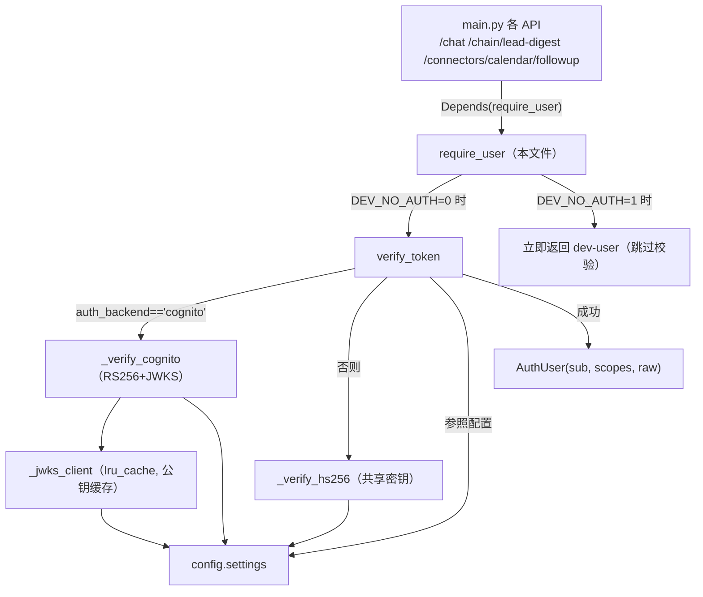
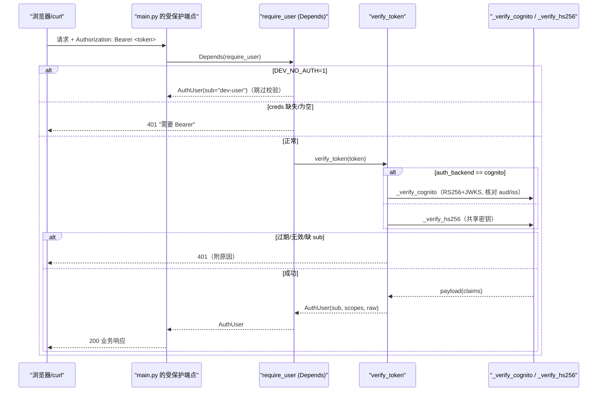
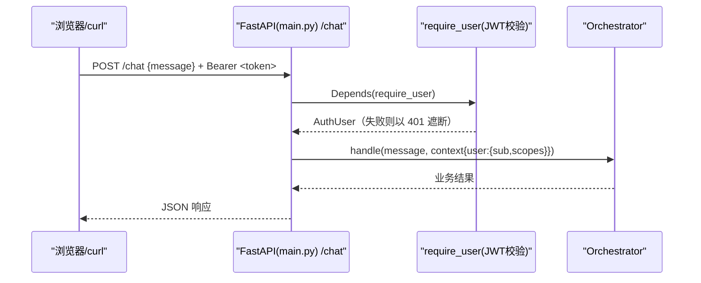

# 基本设计书（代码解说版）
## `backend/app/security/auth.py` — JWT 校验的依赖项(Depends)

> 本书面向初学者，用图与表说明「这个文件以什么为输入、输出什么、被谁调用、内部如何运作、与哪些部件相互调用」。专业术语在 §7 术语表附中文注释。

---

## 0. 文档信息

| 项目 | 内容 |
|---|---|
| 目标文件 | `backend/app/security/auth.py` |
| 作用（一句话） | **校验 JWT 的接收入口**。各端点只需加 1 行 `Depends(require_user)` 即可受保护，并用 `AUTH_BACKEND` 在 HS256(本地) ↔ Cognito(生产) 间切换 |
| 所在层 | 安全层（`app/security`） |
| 公开符号 | `AuthUser`（dataclass）／ `require_user`（Depends 依赖项）／ `verify_token`（校验本体） |
| 内部函数 | `_jwks_client` / `_verify_hs256` / `_verify_cognito` |
| 依赖（import）对象 | `jwt`(PyJWT) / `fastapi`(Depends, HTTPException, status) / `fastapi.security`(HTTPBearer 等) / `..config.settings` |
| 直接调用方 | `app/main.py`（`/chat`・`/chain/lead-digest`・`/connectors/calendar/followup` 各端点的 `Depends(require_user)`） |

---

## 1. 概述（这个部件做什么）

本文件**不是「签发令牌」的一方**。签发是 Cognito（认证负责方）的职责，而本侧（平台侧）只准备**校验 JWT 的接收入口**。

要做的有 3 件事：

1. **接收** — 从 `Authorization: Bearer <token>` 头取出 JWT（`HTTPBearer`）。
2. **校验** — 检查签名・有效期・必须 claim。后端在 2 种方式间切换：
   - `hs256`（本地开发／共享密钥 `JWT_SECRET`）
   - `cognito`（生产／RS256 + JWKS 公钥校验，并固定 `aud`/`iss`）
3. **整形** — 从校验后的 payload 取出 `sub`/`scopes`/`raw` 组成 `AuthUser` 返回。失败一律 `HTTPException(401)`。

> 💡 **设计意图（纵深防御／横切关注点）**：生产环境在 API Gateway 侧也挂 Cognito JWT Authorizer，未认证在到达 Lambda 前就被挡下。这里的再次校验是 **defense-in-depth（纵深防御）**，并便于在 FastAPI 内干净地处理 claims。把校验逻辑集中在一处（`verify_token`），各端点只写 `Depends(require_user)`＝**把认证这个横切关注点声明式地注入**的设计。

---

## 2. 系统内的位置（调用关系图）

`require_user` 的关系是「被 API 用 Depends 调用」「内部使用校验函数与 config」：

- **IN（进来一侧）**：`main.py` 各端点用 `user: AuthUser = Depends(require_user)` 调用（FastAPI 自动注入）。
- **OUT（出去一侧）**：调用 `config.settings`（后端种类・密钥・Cognito 配置）与 `jwt`(PyJWT) 进行校验，返回 `AuthUser` 或抛 `HTTPException(401)`。

---

## 3. 公开接口一览

| 符号 | 类别 | IN（主要输入） | OUT（返回值） | 大致用途 |
|---|---|---|---|---|
| `AuthUser` | dataclass | sub, scopes, raw | （实例） | 校验后的最小用户信息 |
| `require_user` | 异步(Depends) | creds（Bearer） | `AuthUser` | **保护入口**：每个 API 加 1 行 |
| `verify_token` | 同步 | token(str) | `AuthUser` | 校验本体。失败为 401 |
| `_jwks_client` | 同步(内部, lru_cache) | （无） | `PyJWKClient` | 取得・缓存 Cognito 公钥 |
| `_verify_hs256` | 同步(内部) | token(str) | `dict`(payload) | 本地 HS256 校验 |
| `_verify_cognito` | 同步(内部) | token(str) | `dict`(payload) | 生产 RS256+JWKS 校验 |

---

## 4. 方法详细设计

各符号按「作用 / IN / OUT / 调用处 / 调用谁 / 处理逻辑 / 注意点」拆解。

### 4.1 `AuthUser`（dataclass, 行33〜38）

- **作用**：把从校验后令牌取出的**最小用户信息**汇总成一个类型。
- **字段**

| 字段 | 类型 | 含义 |
|---|---|---|
| `sub` | `str` | 用户唯一 ID（JWT 的 `sub` claim） |
| `scopes` | `list[str]` | 授予的作用域（权限）清单 |
| `raw` | `dict` | 校验后的整个 payload（后段想看其他 claim 时用） |

- **OUT**：实例（`@dataclass` 自动生成 `__init__`）
- **调用处（被谁调用）**：
  - `verify_token` `auth.py:92`（生成后返回）
  - `require_user` `auth.py:104`（DEV 模式的临时用户生成）
  - 作为类型注解 `main.py:161, 174, 186`（`user: AuthUser = Depends(require_user)`）
- **注意点**：`raw` 持有整个 payload，所以端点侧可参照额外 claim。`scopes` 在此已规范化为 `list[str]`。

---

### 4.2 `_jwks_client`（JWKS 客户端, 行41〜47, lru_cache）

- **作用**：创建取得 Cognito **JWKS（公钥集合）** 的 `PyJWKClient`。用 `lru_cache(maxsize=1)` **只建 1 个**并复用。
- **IN**：无
- **OUT**：`jwt.PyJWKClient`
- **调用处（被谁调用）**：`_verify_cognito` `auth.py:65`
- **调用谁（依赖）**：`jwt.PyJWKClient(settings.cognito_jwks_url)`（`config.settings` 的 JWKS URL）
- **处理逻辑（分步）**：
  1. 传入 `settings.cognito_jwks_url` 生成 `PyJWKClient`
  2. 借 `@functools.lru_cache(maxsize=1)` 只首次生成，之后返回同一实例
- **注意点**：意在**Lambda 容器复用时复用密钥**。不在每个请求都 HTTP 拉取 JWKS＝降低延迟・成本。`PyJWKClient` 自身也缓存密钥。

---

### 4.3 `_verify_hs256`（本地 HS256 校验, 行50〜57）

- **作用**：本地开发用，以**共享密钥（对称密钥）HS256**校验令牌。
- **IN**：`token: str`
- **OUT**：`dict`（校验后的 payload）
- **调用处（被谁调用）**：`verify_token` `auth.py:81`（`auth_backend` 非 cognito 时）
- **调用谁（依赖）**：`jwt.decode(token, settings.jwt_secret, algorithms=["HS256"], options={"verify_aud": False})`
- **处理逻辑（分步）**：
  1. 用 `settings.jwt_secret`（共享密钥）与 `HS256` 校验签名・有效期
  2. 用 `verify_aud=False` 省略 `aud`（接收者）检查（本地简化）
- **注意点**：HS256 是**签发侧与校验侧共享同一密钥**的方式。密钥泄露就能伪造令牌，故生产不用、仅限本地。

---

### 4.4 `_verify_cognito`（生产 RS256+JWKS 校验, 行60〜72）⭐

- **作用**：以生产 Cognito 的 **RS256（公钥密码）+ JWKS** 校验令牌。设想用 `id_token`。
- **IN**：`token: str`
- **OUT**：`dict`（校验后的 payload）
- **调用处（被谁调用）**：`verify_token` `auth.py:79`（`auth_backend == "cognito"` 时）
- **调用谁（依赖）**：
  - `_jwks_client().get_signing_key_from_jwt(token)`（取得与令牌 `kid` 匹配的公钥）
  - `jwt.decode(token, signing_key, algorithms=["RS256"], audience=..., issuer=...)`
- **处理逻辑（分步）**：
  1. 从 JWKS 取出对应此令牌的**签名校验用公钥**
  2. 用 `RS256` 校验签名，同时**固定并核对** `audience=settings.cognito_app_client_id`（应用客户端 ID）与 `issuer=settings.cognito_issuer`（用户池）
- **注意点**：RS256 是**用私钥签名・用公钥校验**的非对称方式。校验侧只需持公钥、不共享私钥＝更安全。固定 `aud`/`iss` 可防止别的应用・别的池的令牌被挪用。

---

### 4.5 `verify_token`（校验本体, 行75〜92）⭐

- **作用**：选择后端调用校验函数，把 payload 整形为 `AuthUser`。失败一律 `HTTPException(401)`。
- **IN**：`token: str`
- **OUT**：`AuthUser`
- **调用处（被谁调用）**：
  - `require_user` `auth.py:111`（`verify_token(creds.credentials)`）
  - `security/__init__.py:1`（作为公开符号 re-export）
- **调用谁（依赖）**：`_verify_cognito` 或 `_verify_hs256`、`settings.auth_backend`、`AuthUser`
- **处理逻辑（分步）**：
  1. `settings.auth_backend == "cognito"` 则调 `_verify_cognito`，否则调 `_verify_hs256`（**用配置切换**）
  2. `jwt.ExpiredSignatureError` → 401「令牌已过期」
  3. `jwt.InvalidTokenError`（签名不正等基类异常） → 401「无效的令牌: …」
  4. 没有 `sub` claim 则 401「缺少 sub 声明」
  5. 取出 `scope`，若是字符串则按空格 `split()`，若是数组则直接 `list` 化（**吸收类型差异**）
  6. 返回 `AuthUser(sub, scopes, raw=payload)`
- **注意点**：异常**在此处统一转成 401**（横切关注点集中化）。`InvalidTokenError` 是 PyJWT 各种失败的基类，捕获它即可统一兜住签名不符・格式不正等。

---

### 4.6 `require_user`（保护入口 Depends, 行95〜111）⭐

- **作用**：FastAPI 的 **依赖项(Depends)**。在想保护的端点只写 1 行 `user: AuthUser = Depends(require_user)` 即可启用认证。
- **IN**

| 参数 | 类型 | 含义 |
|---|---|---|
| `creds` | `HTTPAuthorizationCredentials \| None` | 由 `Depends(_bearer)` 从 `Authorization: Bearer <token>` 自动抽取（无则 `None`） |

- **OUT**：`AuthUser` ／ **异步(async)**
- **调用处（被谁调用）**：
  - `main.py:161`（`/chat` 的 `chat()`）
  - `main.py:174`（`/chain/lead-digest` 的 `chain_lead_digest()`）
  - `main.py:186`（`/connectors/calendar/followup` 的 `calendar_followup()`）
- **调用谁（依赖）**：`verify_token(creds.credentials)`、`settings.dev_no_auth`、`AuthUser`
- **处理逻辑（分步）**：
  1. 若 `settings.dev_no_auth`（`DEV_NO_AUTH=1`）为真，则不校验、返回临时 `AuthUser(sub="dev-user", scopes=["dev"], ...)`（**便于本地 curl 练习的后门。生产必须为 0**）
  2. 若 `creds` 为 `None` 或为空则 401「需要 Authorization: Bearer <token>」＋ `WWW-Authenticate: Bearer` 头
  3. 否则委托 `verify_token(creds.credentials)` 取得 `AuthUser`
- **注意点**：由于 `HTTPBearer(auto_error=False)`（`_bearer`, 行30），头缺失时 FastAPI 不会自动报 403，而能**用自定义信息返回 401**。

---

## 5. 数据流（一条受保护端点的流程）

`POST /chat` 进来后、到进入业务处理为止，认证如何插入其中：

- 要点：认证通过后才进入 `Orchestrator.handle()`。`user.sub`/`user.scopes` 装进 `context` 传给下游（`main.py:168` 等）。

---

## 6. 相互引用表

把「从哪来、到哪去」汇总成一张表，作为代码追踪的地图使用。

| 本文件符号 | 调用处（被谁调用） | 调用谁（依赖） |
|---|---|---|
| `AuthUser` | `verify_token`(`auth.py:92`), `require_user`(`auth.py:104`), 类型注解 `main.py:161,174,186` | — |
| `require_user` | `main.py:161`(`/chat`), `main.py:174`(`/chain/lead-digest`), `main.py:186`(`/connectors/calendar/followup`) | `settings.dev_no_auth`, `verify_token`, `AuthUser` |
| `verify_token` | `require_user`(`auth.py:111`), 再公开 `security/__init__.py:1` | `_verify_cognito`/`_verify_hs256`, `settings.auth_backend`, `AuthUser` |
| `_jwks_client` | `_verify_cognito`(`auth.py:65`) | `jwt.PyJWKClient`, `settings.cognito_jwks_url` |
| `_verify_hs256` | `verify_token`(`auth.py:81`) | `jwt.decode`, `settings.jwt_secret` |
| `_verify_cognito` | `verify_token`(`auth.py:79`) | `_jwks_client`, `jwt.decode`, `settings.cognito_app_client_id/cognito_issuer` |

> 相关文件：`config.py`（`settings`：`auth_backend`/`jwt_secret`/`cognito_*`/`dev_no_auth`）／`security/__init__.py`（公开 `AuthUser`/`require_user`/`verify_token`）／`main.py`（`Depends(require_user)` 的调用方）

---

## 7. 术语表

| 术语（日/英） | 中文注释 |
|---|---|
| JWT / JSON Web Token | **JSON 网络令牌**。由 `header.payload.signature` 三部分构成的带签名令牌。可检测篡改 |
| Bearer / ベアラトークン | **持有者令牌**。用 `Authorization: Bearer <token>` 头发送。持有者即视为本人 |
| Depends / 依存性注入(FastAPI) | **依赖注入**。FastAPI 自动执行参数的依赖函数并注入结果。用 `Depends(require_user)` 一行注入认证 |
| 横断的関心事 / cross-cutting concern | **横切关注点**。认证・日志等全端点共通之事。集中一处并声明式生效 |
| 二重防御 / defense-in-depth | **纵深防御**。在 API Gateway 的 Authorizer 与本代码两段校验。一方被绕过也由另一方守护 |
| Cognito / Amazon Cognito | **AWS 的认证服务**。负责令牌签发（用户池）。本代码仅负责校验侧 |
| JWKS / JSON Web Key Set | **JSON 网络密钥集**。公钥的集合（`.well-known/jwks.json`）。按 `kid` 选对应密钥校验签名 |
| HS256 / HMAC-SHA256 | **对称签名**。签发・校验共享同一密钥。简便但怕密钥泄露 → 本地用 |
| RS256 / RSA-SHA256 | **非对称签名**。用私钥签名・用公钥校验。校验侧只需公钥 → 生产用 |
| claim / クレーム | **声明**。令牌内的各项信息（`sub`/`aud`/`iss`/`exp`/`scope` 等） |
| sub（subject） | **主体标识**。表示用户唯一 ID 的 claim |
| aud（audience）/ iss（issuer） | **受众 / 签发者**。令牌的目标应用・发行方。固定核对以防挪用 |
| scope / スコープ | **作用域/权限范围**。授予令牌的权限清单 |
| lru_cache | **最近最少使用缓存**。缓存 1 个函数结果以防重建。Lambda 复用时复用密钥 |
| スタブ / stub | **桩**。此处不涉及。本文件是真实校验（可对接生产 Cognito） |
| 非同期 / async・await | **异步**。`require_user` 是 `async`。I/O 等待期间可处理其他请求 |
| 構造化データ / structured data | 像 `AuthUser`（dataclass）或 payload(dict) 那样的机器可处理数据 |

---

> **将本模板套用到其他文件时**：§0〜§7 的框架照旧使用，§4 把「作用/IN/OUT/调用处/调用谁/逻辑/注意点」逐一对应到各方法填写。
