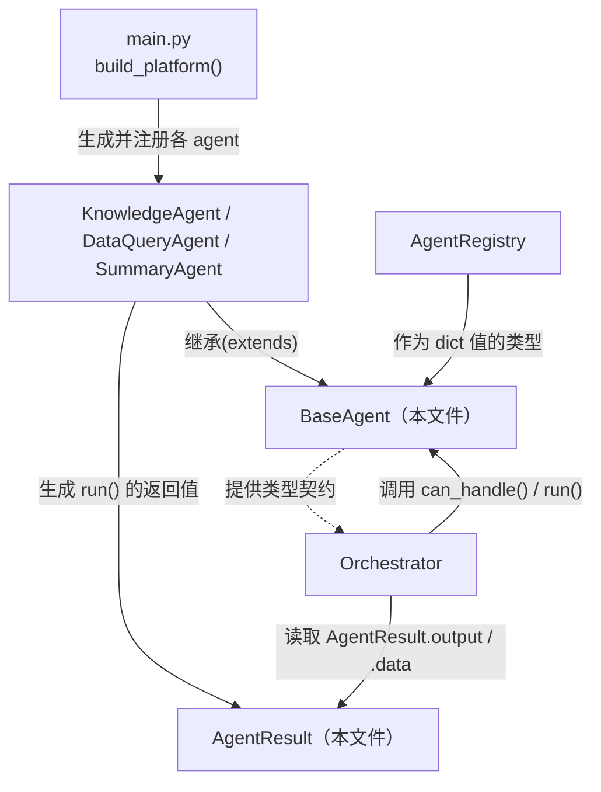
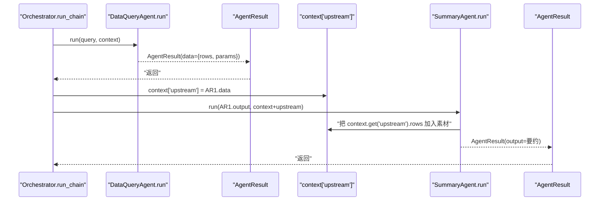

# 基本设计书（代码解说版）
## `backend/app/core/base_agent.py` — agent 抽象（核心契约）

> 本书面向初学者，用图和表解说「这个文件以什么为输入、输出什么、被谁调用、内部如何运转、与哪些部件相互调用」。专业术语在 §7 术语表附中文注释。

---

## 0. 文档信息

| 项目 | 内容 |
|---|---|
| 对象文件 | `backend/app/core/base_agent.py` |
| 作用（一句话） | 定义全体 agent 须遵守的**统一契约（contract）**。只有 `BaseAgent`（抽象基类）和 `AgentResult`（执行结果的统一格式）两个 |
| 所属层 | 核心层（`app/core`） |
| 公开类 | `AgentResult`（dataclass）／ `BaseAgent`（ABC＝抽象基类） |
| 依赖（import）对象 | 仅标准库（`abc` / `dataclasses` / `typing`）。**完全不 import 任何业务类** |
| 直接调用方 | `core/registry.py`（类型注解）／ `core/orchestrator.py`（使用 `AgentResult`）／ `agents/*`（全部 agent 继承）／ `app/main.py`（注册） |

---

## 1. 概述

这个文件是**平台的地基**，自己不做任何业务，只决定「全体 agent 共同应遵守的形状」：

1. **`AgentResult`** — 任何 agent 的结果都装进这个**同一个箱子**返回。因此 orchestrator 不必关心内容，就能把上游 agent 的输出传给下游 agent（＝chain 串联的前提）。
2. **`BaseAgent`** — 全体 agent 继承的抽象基类。最少只要填好 `name` / `description` / `run()` 就成为一个 agent。`can_handle()` 返回「自己处理这条输入的自信度」，作为路由的判断材料。

> 💡 **设计意图（OCP）**：为了让 orchestrator 不必写 `if isinstance(agent, KnowledgeAgent): ...` 这种分支，把所有 agent 收敛到**同样的 3 项能力**（自我描述 / can_handle / run）。即使加新 agent，平台本体（registry / orchestrator / API）也**一行都不用改**，这就是「插件化」的本质。

---

## 2. 系统内的位置（调用关系图）

`base_agent.py` 是「被所有人引用的最底层」。反过来说**它自己谁也不调用**（零业务依赖）：

- **IN（引用过来的一侧）**：各 agent 继承 `BaseAgent`、组装 `AgentResult`。registry / orchestrator 把它当类型引用并调用方法。
- **OUT（出去的一侧）**：**无**。除标准库外不依赖任何东西，是最底层的纯契约。

---

## 3. 公开接口一览

| 名称 | 类型 | IN（主要输入） | OUT（返回值） | 大致用途 |
|---|---|---|---|---|
| `AgentResult` | dataclass | （生成时）agent, output, data, meta | （实例） | 全 agent 通用的结果格式 |
| `BaseAgent` | ABC（抽象基类） | — | — | 全 agent 的公共接口 |
| `BaseAgent.name` | 类属性 | — | `str`（默认 `"base"`） | 唯一标识符（registry 键・路由结果标签） |
| `BaseAgent.description` | 类属性 | — | `str` | 传给 LLM 意图分类提示词的说明文 |
| `BaseAgent.can_handle` | 同步方法 | query, context | `float`（默认 `0.0`） | 返回「自己能处理的自信度」 |
| `BaseAgent.run` | 异步・抽象方法 | query, context | `AgentResult` | **实处理**（继承方必须实现） |

---

## 4. 类・方法详细设计

每个要素拆为「作用 / 输入(IN) / 输出(OUT) / 调用处 / 调用谁 / 处理逻辑 / 注意点」。

### 4.1 `AgentResult`（dataclass, 行29〜41）⭐

- **作用**：agent 执行结果的**统一格式**。把输出统一到同一结构，使 orchestrator 在 chain（串联）时能「以相同方式读上游 agent 的产物、传给下游 agent」。
- **输入(IN)（字段）**

| 字段 | 类型 | 默认值 | 含义 |
|---|---|---|---|
| `agent` | `str` | （必填） | 由哪个 agent 产出（出处） |
| `output` | `str` | （必填） | 人类可读的最终文本（给用户看的回答） |
| `data` | `dict[str, Any]` | `{}`（`field(default_factory=dict)`） | 结构化数据。chain 时下游读取（例：`rows` / `params`） |
| `meta` | `dict[str, Any]` | `{}`（同上） | 调试信息（命中文档 ID・生成的 SQL・backend 名等） |

- **输出(OUT)**：`AgentResult` 实例
- **调用处**：
  - `agents/knowledge_agent.py:83`（低相似度拒答时）, `:98`（grounded 回答时）
  - `agents/dataquery_agent.py:104`（检索结果）
  - `agents/summary_agent.py:46`（要约结果）
  - 读取侧：`core/orchestrator.py:126`（取 `result.output, result.data`）、`:159`（`dq.data.get('rows')`）、`:185-186`
- **调用谁**：无（纯数据容器）
- **处理逻辑（分步）**：
  1. `@dataclass` 装饰器自动生成 `__init__`（以字段为参数的构造函数）。
  2. `data` / `meta` 用 `field(default_factory=dict)`，**每次都新建空 dict**（规避可变默认参数被共享的 bug）。
- **注意点**：`data` 与 `meta` 的分工是关键。`data` 是**下游机器处理的正式数据**，`meta` 是**人类调试时看的附带信息**。chain 中传递的始终是 `data`。

---

### 4.2 `BaseAgent`（抽象基类, 行44〜80）⭐

- **作用**：全体 agent 实现的**公共接口**。继承 `ABC`（抽象基类）、把 `run()` 标为 `@abstractmethod`，从而在**语言层面强制**「不实现 `run()` 的 agent 无法实例化」。
- **类属性**

| 属性 | 类型 | 默认值 | 含义 |
|---|---|---|---|
| `name` | `str` | `"base"` | 唯一标识符。作 registry 的键、路由结果的标签。继承方必须覆盖 |
| `description` | `str` | `"base agent"` | 传给 LLM 路由（意图分类）提示词的说明文。**它左右分类精度** |

- **继承的最低要求**：填好 `name` / `description` / `run()` 三项。`can_handle()` 可保持默认 0.0（＝也能造出不参与路由的幕后 agent）。
- **调用处**：
  - `agents/knowledge_agent.py:34` `class KnowledgeAgent(BaseAgent)`
  - `agents/dataquery_agent.py:34` `class DataQueryAgent(BaseAgent)`
  - `agents/summary_agent.py:20` `class SummaryAgent(BaseAgent)`
  - 类型注解：`core/registry.py:29,31,37,43`（`dict[str, BaseAgent]` 等）
- **调用谁**：`abc.ABC`
- **处理逻辑**：继承 `ABC` 声明抽象基类，定义 `name`/`description` 类属性，把 `run` 标为抽象、`can_handle` 给默认实现。
- **注意点**：虽继承 `ABC`，但抽象方法只有 `run()`，所以继承方只需实现 `run()`。`can_handle()` 有具体实现（`return 0.0`），故**不是抽象的**＝可选。

---

### 4.3 `BaseAgent.can_handle`（路由自信度, 行58〜69）

- **作用**：以 **0.0〜1.0 的自信度（score）** 返回「这条输入自己能否处理」。是规则式路由的判断材料。
- **输入(IN)**

| 参数 | 类型 | 含义 |
|---|---|---|
| `query` | `str` | 用户输入文本 |
| `context` | `dict[str, Any]` | 共享状态（默认实现未使用，仅为统一签名） |

- **输出(OUT)**：`float`（默认 `0.0`）
- **调用处**：`core/orchestrator.py:54`（`route_by_rule()` 内 `a.can_handle(query, context)`）
- **调用谁**：无（默认实现直接 `return 0.0`）
- **处理逻辑（默认）**：什么都不做，`return 0.0`＝「自己不主动举手」。
- **覆盖示例（参考）**：各 agent 按关键词命中数加分。
  - `knowledge_agent.py:61` → 基础分 0.3 + 命中词×0.15（上限 0.9）
  - `dataquery_agent.py:45` → 基础分 0.2 + 命中词×0.2（上限 0.95）
  - `summary_agent.py:29` → 基础分 0.3 + 命中词×0.2（上限 0.9）
- **注意点**：**为何用 float（score）而非 bool** ＝ 多个 agent 都说「能处理」时，bool 分不出优劣。改用 score 后 orchestrator 就能选「分数最高者」（＝可做**冲突消解**）。将来 agent 增多也不崩溃的设计。

---

### 4.4 `BaseAgent.run`（实处理・抽象方法, 行71〜80）⭐

- **作用**：agent 的实处理。`@abstractmethod` ＋ `async` 强制「继承方必须以异步实现」。
- **输入(IN)**

| 参数 | 类型 | 含义 |
|---|---|---|
| `query` | `str` | 用户输入（chain 时是上游整形过的文本） |
| `context` | `dict[str, Any]` | 共享状态（认证用户・上一 agent 的输出 `upstream`・连接器群等） |

- **输出(OUT)**：`AgentResult`（4.1）／ **异步(async)**
- **调用处**：
  - `core/orchestrator.py:102`（`_run_agent()` 内用 `asyncio.wait_for` 带超时执行 `agent.run(query, context)`）
  - `core/orchestrator.py:157`（`run_chain` step1：`registry.get("data_query").run(...)`）
  - `core/orchestrator.py:177`（`run_chain` step2：`registry.get("summary").run(...)`）
  - `app/main.py:196`（`/chain/lead-digest` 中 `orch.registry.get("data_query").run(...)`）
- **调用谁**：基类里 `raise NotImplementedError`（实体在各 agent 侧）
- **处理逻辑（基类）**：`raise NotImplementedError`。**不会被直接调用**（无法实例化）。实体是继承方的 `run()`。
- **注意点**：**为何用 async** ＝ LLM / DB / 外部 API 都是 I/O 等待，作为平台要支撑高并发就必须异步。可经由 `context` **承接 agent 间状态**（例：用 `context["upstream"]` 传上游结果 → `summary_agent.py:36` 接收）。

---

## 5. 数据流

`base_agent.py` 的存在意义是「**把结果的箱子统一**」。下图展示 chain（DataQuery→Summary）中 `AgentResult` 如何流动：

- 要点：把上游的 `AgentResult.data` 塞进 `context["upstream"]` 传给下游。**agent 彼此不知道对方的类**，正因为有 `AgentResult` 这个共同的箱子，串联才得以成立。

---

## 6. 相互引用表

把「从哪来、到哪去」汇成一表，作为代码追踪的地图使用。

| 本文件的要素 | 调用处 | 调用谁（依赖） |
|---|---|---|
| `AgentResult`（生成） | `knowledge_agent.py:83,98`, `dataquery_agent.py:104`, `summary_agent.py:46` | — |
| `AgentResult`（读取） | `orchestrator.py:126,159,185-186` | — |
| `BaseAgent`（继承） | `knowledge_agent.py:34`, `dataquery_agent.py:34`, `summary_agent.py:20`, `registry.py:29`(类型) | `abc.ABC` |
| `can_handle` | `orchestrator.py:54`（`route_by_rule`） | — |
| `run`（实体在各 agent） | `orchestrator.py:102,157,177`, `main.py:196` | （各 agent 的 `run` 实现） |

> 关联文件：`registry.py`（按 name 保管 `BaseAgent`）／`orchestrator.py`（调用 `can_handle`/`run` 并读 `AgentResult`）／`agents/*`（继承方的实体）／`main.py`（生成・注册）

---

## 7. 术语表

| 术语（日/英） | 中文注释 |
|---|---|
| 抽象基底クラス / ABC（Abstract Base Class） | **抽象基类**。本身不能实例化，只规定子类必须实现的方法。Python 用 `abc.ABC` + `@abstractmethod` 实现 |
| 抽象メソッド / abstract method | **抽象方法**。基类只声明签名、不写实现；子类不实现就无法实例化（`run()` 即是） |
| 契約 / contract（インターフェース） | **契约/接口**。各组件之间约定好的「输入输出形状」，互不关心内部实现 |
| データクラス / dataclass | **数据类**。`@dataclass` 自动生成 `__init__` 等样板代码的轻量结构体（`AgentResult`） |
| `field(default_factory=dict)` | 可变默认值的正确写法。每次实例化都新建一个空 dict，避免所有实例**共享同一个 dict** 的经典 bug |
| OCP（開放閉鎖原則 / Open-Closed Principle） | **开放封闭原则**。对扩展开放、对修改封闭。加新 agent 不改本体 |
| プラグイン化 / plugin architecture | **插件化**。把每个功能做成「实现统一契约的可插拔件」，主体零改动即可增减 |
| ルーティング / routing | **路由**。决定「这条输入交给哪个 agent 处理」 |
| 自信度 / score（置信度） | **置信度**。`can_handle()` 返回的 0.0〜1.0 浮点数，用于多 agent 竞争时分高下 |
| 競合解決 / conflict resolution | **冲突消解**。多个 agent 都能处理时，按 score 取最高者 |
| 非同期 / async・await | **异步**。I/O 等待时可切去处理别的请求，是支撑多并发的前提 |
| 構造化データ / structured data | **结构化数据**。`AgentResult.data` 这种机器可处理的 dict/list 形态 |
| 状態共有 / state sharing | **状态共享**。agent 间通过 `context` 字典（如 `context["upstream"]`）传递中间结果 |
| 関心の分離 / separation of concerns | **关注点分离**。每个 agent 只管自己那一件事，不关心数据从哪来、给谁用 |

---

> **把此模板套到其他文件时**：§0〜§7 框架照用，把 §4 的「作用/IN/OUT/调用处/调用谁/逻辑/注意点」逐个套到每个类・方法上填写即可。
