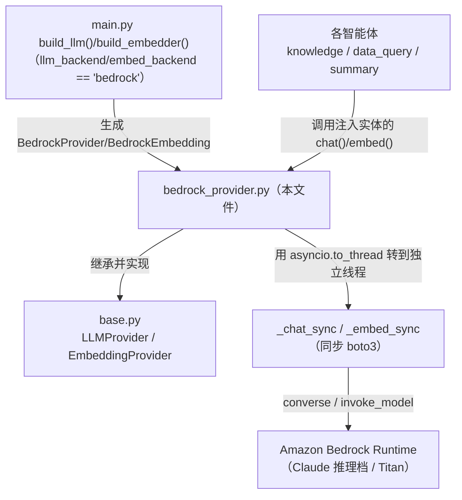
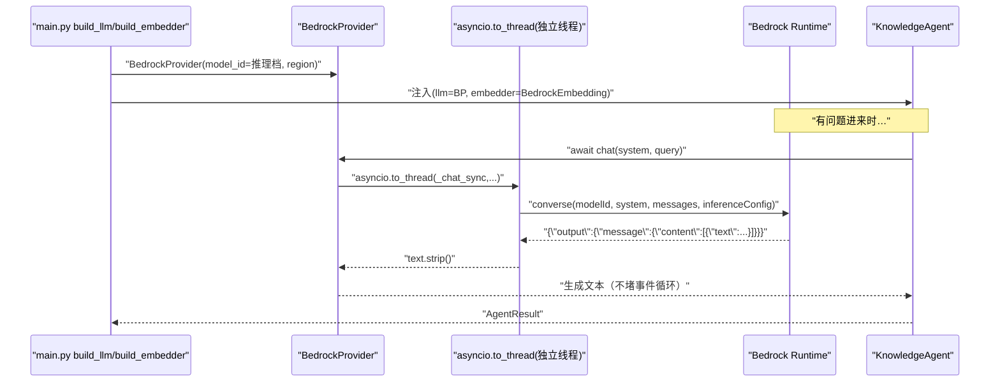

# 基本设计书（代码解说版）
## `backend/app/providers/bedrock_provider.py` — Amazon Bedrock 实现（生产环境的 LLM/嵌入）

> 本书面向初学者，用图和表解说「这个文件以什么为输入、输出什么、从哪里被调用、内部如何运作、与哪些部件相互调用」。专业术语在 §7 术语表中附中文注释。

---

## 0. 文档信息

| 项目 | 内容 |
|---|---|
| 对象文件 | `backend/app/providers/bedrock_provider.py` |
| 作用（一句话） | 用 **Amazon Bedrock** 实现 `LLMProvider`/`EmbeddingProvider`，是 Provider 抽象的「正牌替换目标」。接口相同，所以智能体侧一行都不用改 |
| 所属层 | Provider 层（`app/providers`） |
| 公开类 | `BedrockProvider`(LLMProvider 实现) / `BedrockEmbedding`(EmbeddingProvider 实现) |
| 依赖（import）对象 | `asyncio` / `json` / `boto3`（AWS SDK）／ `.base.EmbeddingProvider,LLMProvider` |
| 直接调用方 | `main.py:48,56`（`build_llm`/`build_embedder` 的 `backend == "bedrock"` 分支） |

---

## 1. 概述（这个部件做什么）

`bedrock_provider.py` 是**把生产用的 AWS 托管 LLM/嵌入**按平台契约来调用的实现：

1. **`BedrockProvider`** — `LLMProvider` 的实现。用 Bedrock 的 **converse API**（可用统一格式调各家模型）生成文本。
2. **`BedrockEmbedding`** — `EmbeddingProvider` 的实现。用 **Amazon Titan Embeddings v2**（1024 维·多语言）通过 `invoke_model` 做向量化。

> 💡 **设计意图＆东京区域的注意（重要）**：
> - Claude 系**必须用 INFERENCE_PROFILE**。直接用 model-id 调会报 `ValidationException: model identifier is invalid` → 使用 `BEDROCK_MODEL_ID=jp.anthropic.claude-haiku-4-5-...`（区域推理档）。
> - 嵌入的 Titan(`amazon.*`) 是普通模型，所以**直接用 model-id 调即可**。
> - IAM 的 `bedrock:InvokeModel` 资源里**需要同时含 foundation-model ARN 和 inference-profile ARN 两者**。
> - **异步化**：`boto3` 是同步 SDK。为了不堵住 FastAPI/Lambda 的事件循环，用 **`asyncio.to_thread`** 逃到工作线程（Lambda 是 1 次调用=1 请求，这样就够）。

只是把 `OllamaProvider` 的同一接口用 Bedrock 实现而已＝抽象的好处让智能体无需改动。

---

## 2. 系统内的位置（调用关系图）

`bedrock_provider.py` 处于「被上层(main.py)选中」「实现契约(base.py)」「调用外部(AWS Bedrock)」的关系中：

- **IN（生成方）**：`main.py` 的 `bedrock` 分支传入 `model_id`/`region` 生成。
- **OUT（实现方）**：继承 `base.py` 的抽象，填充 `chat()`/`embed()`。
- **外部依赖**：用 `boto3` 的 `bedrock-runtime` 客户端调 AWS（**把同步调用逃到独立线程**）。

---

## 3. 公开接口一览（方法速查表）

| 类.方法 | 种类 | IN（主要输入） | OUT（返回值） | 大致用途 |
|---|---|---|---|---|
| `BedrockProvider.__init__` | 同步 | model_id, region, max_tokens=1024 | （生成） | 保存 model_id/上限 tokens＋生成客户端 |
| `BedrockProvider.chat` | 异步 | system, user, temperature | `str` | 在独立线程执行 `_chat_sync` |
| `BedrockProvider._chat_sync` | 同步(内部) | system, user, temperature | `str` | 用 converse API 生成文本 |
| `BedrockEmbedding.__init__` | 同步 | model_id, region | （生成） | 保存 model_id＋生成客户端 |
| `BedrockEmbedding.embed` | 异步 | text | `list[float]` | 在独立线程执行 `_embed_sync` |
| `BedrockEmbedding._embed_sync` | 同步(内部) | text | `list[float]` | 用 invoke_model(Titan) 向量化 |

---

## 4. 方法详细设计

将每个方法拆解为「作用 / IN / OUT / 调用处（被谁调用） / 调用谁 / 处理逻辑 / 注意点」。

### 4.1 `BedrockProvider.__init__`（构造函数, 行30〜34）

- **作用**：保存模型 ID·token 上限，并生成一个 `bedrock-runtime` 客户端。
- **输入(IN)**

| 输入(IN) | 类型 | 含义 |
|---|---|---|
| `model_id` | `str` | Claude 的**推理档 ID**（例 `jp.anthropic.claude-haiku-4-5-...`） |
| `region` | `str` | AWS 区域（例 `ap-northeast-1`） |
| `max_tokens` | `int`=`1024`（关键字专用） | 生成的最大 token 数 |

- **输出(OUT)**：无（实例生成）
- **调用处（被谁调用）**：`main.py:48`（`build_llm` 的 `llm_backend == "bedrock"` 分支）
- **调用谁（依赖）**：`boto3.client("bedrock-runtime", region_name=region)`
- **处理逻辑**：保存 `self.model_id`/`self.max_tokens`，在 `self._client` 生成 `bedrock-runtime`（带 `converse`/`invoke_model`）。
- **注意点**：客户端**每个实例只生成 1 次**，不在每次请求时创建（复用连接）。

---

### 4.2 `BedrockProvider.chat`（文本生成·异步包装, 行36〜37）⭐

- **作用**：`LLMProvider.chat` 的实现。**把同步的 `_chat_sync` 用 `asyncio.to_thread` 逃到独立线程**，不堵住事件循环。
- **输入(IN)**：`system: str`、`user: str`、`temperature: float`=`0.2`（关键字专用）
- **输出(OUT)**：`str`（生成文本）／ **异步(async)**
- **调用处（被谁调用）**：（在 `main.py:48` 生成）→ 实际调用在 `knowledge_agent.py:97`、`dataquery_agent.py:58`、`summary_agent.py:45`、`orchestrator.py`(意图分类)
- **调用谁（依赖）**：`asyncio.to_thread(self._chat_sync, system, user, temperature)`
- **处理逻辑（分步）**：
  1. 把 `_chat_sync` 连同参数传给 `asyncio.to_thread`
  2. 用 `await` 等结果（`str`）并返回
- **注意点**：**boto3 是同步 SDK**。在 `async def` 里直接调 `converse()` 会堵住事件循环，让其他请求堆积。用 `to_thread` 逃到工作线程是惯例做法。

---

### 4.3 `BedrockProvider._chat_sync`（converse API 本体, 行39〜47）

- **作用**：实际调 Bedrock 的 **converse API** 生成文本的同步处理。
- **输入(IN)**：`system: str`、`user: str`、`temperature: float`
- **输出(OUT)**：`str`（生成文本，已去除首尾空白）／ **同步**
- **调用处（被谁调用）**：`BedrockProvider.chat`（`bedrock_provider.py:37`，经 `asyncio.to_thread`）
- **调用谁（依赖）**：`self._client.converse(...)`
- **处理逻辑（分步）**：
  1. 调 `converse(modelId, system=[{text}], messages=[{role:user, content:[{text}]}], inferenceConfig={maxTokens, temperature})`
  2. 从响应取 `output.message.content[0].text`，`.strip()` 后返回
- **注意点**：**converse API 可用统一格式调各家模型**（吸收提供商差异），所以换模型时这段调用代码基本不变。响应结构（`output.message.content[0].text`）是 converse 的共通形式。

---

### 4.4 `BedrockEmbedding.__init__`（构造函数, 行53〜55）

- **作用**：保存嵌入用的 model_id，并生成 `bedrock-runtime` 客户端。
- **输入(IN)**：`model_id: str`（Titan 的 ID，例 `amazon.titan-embed-text-v2:0`）、`region: str`
- **输出(OUT)**：无（实例生成）
- **调用处（被谁调用）**：`main.py:56`（`build_embedder` 的 `embed_backend == "bedrock"` 分支）
- **调用谁（依赖）**：`boto3.client("bedrock-runtime", region_name=region)`
- **处理逻辑**：保存 `self.model_id`，生成 `self._client`。

---

### 4.5 `BedrockEmbedding.embed`（向量化·异步包装, 行57〜58）

- **作用**：`EmbeddingProvider.embed` 的实现。用 `asyncio.to_thread` 在独立线程执行 `_embed_sync`。
- **输入(IN)**：`text: str`
- **输出(OUT)**：`list[float]`（Titan v2 = 1024 维）／ **异步(async)**
- **调用处（被谁调用）**：（在 `main.py:56` 生成）→ 实际调用在 `knowledge_agent.py:57`(文档侧)、`knowledge_agent.py:72`(查询侧)
- **调用谁（依赖）**：`asyncio.to_thread(self._embed_sync, text)`
- **处理逻辑**：在独立线程执行 `_embed_sync`，用 `await` 等待。
- **注意点**：与 chat 一样，为把同步 boto3 隔离出事件循环而用 `to_thread`。

---

### 4.6 `BedrockEmbedding._embed_sync`（invoke_model 本体, 行60〜64）

- **作用**：用 `invoke_model` 调 Titan 模型把文本向量化的同步处理。
- **输入(IN)**：`text: str`
- **输出(OUT)**：`list[float]`（嵌入向量）／ **同步**
- **调用处（被谁调用）**：`BedrockEmbedding.embed`（`bedrock_provider.py:58`，经 `asyncio.to_thread`）
- **调用谁（依赖）**：`json.dumps`、`self._client.invoke_model(...)`、`json.loads`、`resp["body"].read()`
- **处理逻辑（分步）**：
  1. `body = json.dumps({"inputText": text})`（Titan 的请求格式）
  2. 调 `invoke_model(modelId, body)`
  3. 把响应的 `body`（流）`.read()` 后用 `json.loads` 解析
  4. 返回 `data["embedding"]`
- **注意点**：用的是 **`invoke_model`** 而非 `converse`（嵌入不支持 converse）。响应的 `body` 是**流**，要先 `.read()` 再做 JSON 解析。维度(1024)与 `HashingEmbedding`(256) 不兼容。

---

## 5. 数据流（bedrock backend 下 /chat 如何运作）

---

## 6. 相互引用表

| 本文件的方法 | 调用处（被谁调用） | 调用谁（依赖） |
|---|---|---|
| `BedrockProvider.__init__` | `main.py:48` | `boto3.client("bedrock-runtime")` |
| `BedrockProvider.chat` | 实调: `knowledge_agent.py:97`, `dataquery_agent.py:58`, `summary_agent.py:45`, `orchestrator.py`(意图分类) | `asyncio.to_thread`, `self._chat_sync` |
| `BedrockProvider._chat_sync` | `BedrockProvider.chat`(`bedrock_provider.py:37`) | `self._client.converse` |
| `BedrockEmbedding.__init__` | `main.py:56` | `boto3.client("bedrock-runtime")` |
| `BedrockEmbedding.embed` | 实调: `knowledge_agent.py:57,72` | `asyncio.to_thread`, `self._embed_sync` |
| `BedrockEmbedding._embed_sync` | `BedrockEmbedding.embed`(`bedrock_provider.py:58`) | `json.dumps/loads`, `self._client.invoke_model` |

> 相关文件：`base.py`（实现的契约）／`local_provider.py`（无模型时的降级）／`ollama_provider.py`（本地免费 LLM 的替换目标）／`main.py`（`build_llm`/`build_embedder` 的选择）

---

## 7. 术语表

| 术语（日/英） | 中文注释 |
|---|---|
| Amazon Bedrock | AWS 的托管生成式 AI 基座，可经 API 使用各家基础模型 |
| `boto3` | AWS 的 Python SDK。以**同步**方式运行（非 async） |
| `bedrock-runtime` | Bedrock 的推理用客户端，带 `converse` / `invoke_model` |
| converse API | Bedrock 的**统一会话 API**，可用相同格式调各家模型（吸收提供商差异） |
| `invoke_model` | 用模型特有的原始格式调用的 API，嵌入(Titan)时使用 |
| INFERENCE_PROFILE / 推論プロファイル | **推理配置文件**。跨区域跑推理的逻辑 ID。东京的 Claude 不能直接用 model-id，必须用它 |
| foundation model / 基盤モデル | **基础模型**。Claude/Titan 等的原始模型。IAM 里需要 FM ARN 和推理档 ARN 两者 |
| ValidationException | 输入校验错误。直接用 model-id 调时会以「model identifier is invalid」报出 |
| Titan Embeddings v2 | Amazon 的嵌入模型（1024 维·多语言） |
| 埋め込み / embedding | **嵌入/向量化**。把文本转成定长向量 |
| 次元数 / dimension | 向量的长度。Titan v2=1024、HashingEmbedding=256，互不兼容 |
| `asyncio.to_thread` | 把同步函数放到**工作线程**执行并使其可 `await`，不堵事件循环 |
| イベントループ / event loop | **事件循环**。异步处理的心脏。在此处用同步处理堵住会让全部请求堆积 |
| 同期SDK / synchronous | 等到结果返回才继续的调用。在 `async` 里直接用会堵住循环 |
| IAM | AWS 的权限管理。用 `bedrock:InvokeModel` 等「动作×资源」来授权 |
| max_tokens / トークン上限 | 生成的最大 token 数，长文截断的上限 |
| temperature | 生成的随机度，越接近 0 越确定 |

---

> **若要把本模板套用到其他文件**：§0〜§7 的框架照搬，§4 的「作用/IN/OUT/调用处/调用谁/逻辑/注意点」逐个方法填入即可。
