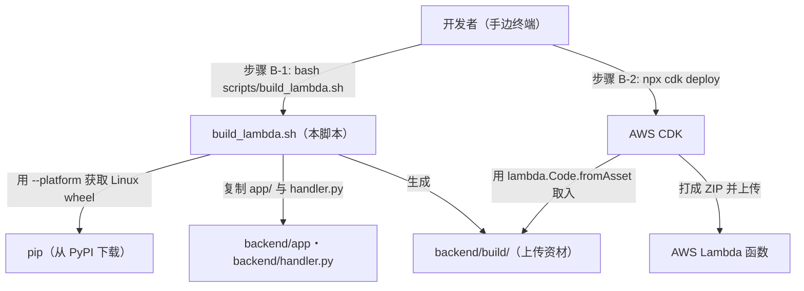

# 基本设计书（代码解说版）
## `scripts/build_lambda.sh` — Lambda 部署包构建脚本

> 本书面向初学者，用图和表讲解「这个脚本以什么为输入、输出什么、何时由谁执行、内部如何运作、与哪些命令相互调用」。专业术语在 §7 术语表中附中文注释。

---

## 0. 文档信息

| 项目 | 内容 |
|---|---|
| 对象文件 | `scripts/build_lambda.sh` |
| 作用（一句话） | **无需 Docker**即可构建用于 Lambda(Amazon Linux x86_64) 的 Python 包。即使在 Windows 上也能获取 Linux 用 wheel，把依赖＋应用代码汇总到 `backend/build/` |
| 类别 | 运维脚本（bash） |
| 执行环境 | 手边任意 OS（Windows / WSL / Linux）。只要 `bash` 与 `pip` 能跑即可 |
| 执行时机 | README **步骤 B-1**（CDK 部署的**正前方**）。CDK 通过 `lambda.Code.fromAsset` 取入 `backend/build/` |
| 主要依赖 | `pip`（`--platform` 跨平台安装）/ `cp` / `find` / `rm` / `mkdir` |
| 产物 | `backend/build/`（依赖库 + `app/` + `handler.py`） |

---

## 1. 概述（这个脚本做什么）

`build_lambda.sh` 是一个只负责**组装出一个要上传到 Lambda 的文件夹 `backend/build/`** 的 shell 脚本。要做的只有以下 4 个阶段：

1. **清理（clean）** — 删除上次的 `backend/build/` 并重新创建（每次都从零开始）。
2. **获取依赖（pip install）** — 把 `requirements-lambda.txt` 里的库，以**面向 Lambda 执行环境(Amazon Linux x86_64 / Python 3.12) 的 wheel** 放进 `build/`。这里是本脚本的核心。
3. **同梱应用** — 把 `backend/app/` 与 `backend/handler.py` 复制到 `build/`。
4. **清理（strip）** — 删除 `__pycache__`。但 `*.dist-info` **保留**（因为 `importlib.metadata` 需要它来解析版本）。

> 💡 **设计意图**：通常「Lambda 用的构建用 Docker(Amazon Linux 镜像) 固定下来」是惯用做法。但像 `cryptography`(Rust 扩展) 或 `pydantic-core`(同) 这样的 **C/Rust 扩展**，如果直接把开发机(Windows)的 wheel 放进去，在 Lambda 上就跑不起来。于是利用 `pip` 的 **`--platform manylinux2014_x86_64`**，**完全不启动 Docker**就「下载面向另一个 OS 的二进制 wheel」。这把 Claude 记忆里「Windows 上也能把 Linux wheel 做成 Layer」的手法脚本化了。

---

## 2. 系统内的位置（执行时机流程）

把「何时、由谁执行、对哪个产物／AWS 资源起作用」画成图：



- **IN（输入侧）**：开发者在部署前敲 `bash scripts/build_lambda.sh`。
- **OUT（作用侧）**：生成 `backend/build/`。**此时不触碰任何 AWS**（纯本地处理）。反映到 AWS 由下一道工序的 `cdk deploy` 负责，CDK 把 `build/` 作为资产上传到 Lambda。

---

## 3. 输入(参数/环境变量)·输出 一览

### 3.1 输入（参数·环境变量）

| 类别 | 名称 | 默认值 | 含义 |
|---|---|---|---|
| 参数 | （无） | — | 本脚本不接收位置参数。只用 `bash scripts/build_lambda.sh` |
| 环境变量 | `PYTHON` | `python` | 构建时用的 **pip 本体的 python**。即使手边是 3.10 也没关系，因为指定了 `--python-version 3.12`。可用 `PYTHON=python3.12 bash ...` 等覆盖 |
| 文件 | `backend/requirements-lambda.txt` | （固定） | 要同梱的依赖清单（`fastapi` / `mangum` / `PyJWT` / `cryptography` / `httpx`）。`boto3`・`uvicorn`・`pytest` 被**有意排除**（Lambda 运行时自带、生产不需要） |

### 3.2 输出（产物·副作用）

| 类别 | 内容 |
|---|---|
| 生成目录 | `backend/build/`（**每次都先 `rm -rf` 再重建**） |
| 内容 | ① `requirements-lambda.txt` 的依赖（展开 Linux x86_64 / py3.12 wheel）② `app/`（应用本体）③ `handler.py`（Lambda 入口） |
| 标准输出 | `[1/4]`〜`[4/4]` 的进度，最后是 `OK -> <build 路径>` |
| 退出码 | 成功 `0` / 中途失败则**立即停止**（因 `set -euo pipefail` 而非 0） |

---

## 4. 处理步骤详细

把整个脚本按「作用 / IN / OUT / 执行时机 / 依赖 / 处理逻辑 / 注意点」拆解。

### 4.0 前段：shell 选项与路径计算（行12〜19）

- **作用**：搭建让后续所有步骤安全运行的地基。
- **输入(IN)**：环境变量 `PYTHON`（可选）
- **输出(OUT)**：内部变量 `ROOT` / `BACKEND` / `BUILD` / `PY`
- **依赖**：`set` / `cd` / `dirname` / `pwd`
- **处理逻辑（分步）**：
  1. 立起 `set -euo pipefail`：**出错即停止**(`-e`)·**遇未定义变量停止**(`-u`)·**管道中途失败也检测**(`-o pipefail`)。
  2. `ROOT="$(cd "$(dirname "$0")/.." && pwd)"` 从脚本位置以**绝对路径**求出项目根（无论从哪敲，都建在同一处）。
  3. 导出 `BACKEND="$ROOT/backend"`、`BUILD="$BACKEND/build"`。
  4. `PY="${PYTHON:-python}"` 决定跑 pip 的 python。
- **注意点**：由于有 `set -e`，后续任何命令出错都会**就地停止**＝防止握着坏掉的 `build/` 就进入 `cdk deploy` 的事故。

---

### 4.1 `[1/4]` clean — 重建构建目标（行21〜23）⭐

- **作用**：完全删除上次的产物，准备空的 `build/`。
- **输入(IN)**：`$BUILD`
- **输出(OUT)**：空的 `backend/build/` 目录
- **执行时机**：脚本开头。**每次执行**。
- **依赖**：`rm -rf` / `mkdir -p`
- **处理逻辑（分步）**：
  1. `rm -rf "$BUILD"`：连目录一起删除旧 `build/`。
  2. `mkdir -p "$BUILD"`：以空目录重建。
- **注意点**：不做增量构建（**每次全量清理**）。从结构上防止「忘删依赖导致旧 wheel 混入」的事故＝优先可复现性。

---

### 4.2 `[2/4]` pip install — 获取 Linux 用 wheel（行25〜32）⭐⭐

- **作用**：本脚本的**心脏部分**。把面向 Lambda 执行环境的依赖展开到 `build/`。
- **输入(IN)**：`backend/requirements-lambda.txt`、`$PY`、`$BUILD`
- **输出(OUT)**：`build/` 直下的各库（`fastapi/` `cryptography/` … 与 `*.dist-info`）
- **执行时机**：clean 之后紧接着。
- **依赖**：`pip install`（有访问 PyPI 的网络）
- **处理逻辑（分步）**：
  1. 执行 `"$PY" -m pip install`，带以下跨平台安装用选项：
     - `--platform manylinux2014_x86_64`：把要获取的 wheel 的 **目标 OS/CPU** 固定为 Amazon Linux 兼容(x86_64)。
     - `--python-version 3.12`：把要获取的 wheel 的 **目标 Python** 固定为 3.12（手边是 3.10 也行）。
     - `--implementation cp`：限定为 CPython 用 wheel。
     - `--only-binary=:all:`：**禁止从源码构建**＝必须使用现成 wheel（＝**不让本地编译**＝免 Docker 的核心）。
     - `--target "$BUILD"`：展开到 **`build/` 直下**而非 site-packages（Lambda 从 ZIP 直下 import）。
     - `-r "$BACKEND/requirements-lambda.txt"`：要安装的清单。
- **注意点**：
  - 由于 `--only-binary=:all:`，对于在 PyPI 上**没有**对应平台 wheel 的库会**在此报错**（被 `set -e` 停止）。`cryptography`(Rust) / `pydantic-core`(Rust) 都分发了 manylinux wheel，所以能通过。
  - **不装 `boto3`**：Lambda 运行时已自带。`uvicorn`/`pytest` 生产也不需要，故已在 `requirements-lambda.txt` 侧排除（避免包体膨胀＝冷启动恶化）。

---

### 4.3 `[3/4]` copy app code — 同梱应用本体（行34〜36）

- **作用**：往只有依赖的 `build/` 里，加上自己写的应用代码。
- **输入(IN)**：`backend/app/`、`backend/handler.py`
- **输出(OUT)**：`build/app/`、`build/handler.py`
- **执行时机**：获取依赖之后。
- **依赖**：`cp -r` / `cp`
- **处理逻辑（分步）**：
  1. `cp -r "$BACKEND/app" "$BUILD/app"`：复制 FastAPI 本体一整套。
  2. `cp "$BACKEND/handler.py" "$BUILD/handler.py"`：复制 Lambda 的**入口点**（Mangum 把 ASGI 桥接到 Lambda handler 的入口）。
- **注意点**：handler 必须放在 `build/` 直下（因为 Lambda 的 `Handler` 设置以 `handler.<函数名>` 的形式查看**根直下**）。

---

### 4.4 `[4/4]` strip `__pycache__` — 去除无用物（行38〜39）

- **作用**：为减小 ZIP 而删除 `__pycache__`。但 `*.dist-info` **保留**。
- **输入(IN)**：`$BUILD`
- **输出(OUT)**：去掉 `__pycache__` 后的 `build/`
- **执行时机**：最后。
- **依赖**：`find ... -prune -exec rm -rf {} +`
- **处理逻辑（分步）**：
  1. 用 `find "$BUILD" -type d -name "__pycache__" -prune -exec rm -rf {} +` 一次性删除所有 `__pycache__`。
  2. 末尾的 `2>/dev/null || true`，让**即使没有可删对象也不停止脚本**（`set -e` 的例外处理）。
- **注意点**：如注释所述 **不删除 `*.dist-info`**。因为 `importlib.metadata`（＝运行时读取包的版本/元信息的机制）会引用 `*.dist-info`，删了会让部分库在启动时损坏。

---

### 4.5 完成输出（行41）

- **作用**：向人告知成功。
- **输出(OUT)**：标准输出 `OK -> <build 的绝对路径>`
- **处理逻辑**：`echo "OK -> $BUILD"`。到达此处＝全步骤成功（中途失败的话早已被 `set -e` 停止）。

---

## 5. 执行示例（命令）

```bash
# 标准（在项目根执行）
bash scripts/build_lambda.sh

# 想明确指定跑 pip 的 python 时（手边有多个 python）
PYTHON=python3.12 bash scripts/build_lambda.sh

# 确认产物
ls backend/build              # fastapi/ cryptography/ ... app/ handler.py 并列

# 紧接着 CDK 部署（build/ 作为资产被取入）
cd infra && export AWS_REGION=ap-northeast-1 && npx cdk deploy
```

> 预期的标准输出（摘录）：
> ```
> [1/4] clean .../backend/build
> [2/4] pip install (linux x86_64 / py3.12 wheels) -> build/
> [3/4] copy app code
> [4/4] strip __pycache__ (dist-info は残す: importlib.metadata 用)
> OK -> .../backend/build
> ```

---

## 6. 相互引用表

| 区分 | 对象 | 关系 |
|---|---|---|
| 执行方（人/步骤） | README **步骤 B-1** | 在 CDK 部署的正前方由开发者手动执行 |
| 输入文件 | `backend/requirements-lambda.txt` | 同梱依赖的唯一真实来源（排除方针也写在这里） |
| 输入代码 | `backend/app/`、`backend/handler.py` | 应用本体·Lambda 入口。复制到 `build/` |
| 调用命令 | `pip`（`--platform`/`--only-binary`）/ `cp` / `find` / `rm` / `mkdir` | 外部工具。只有 `pip` 用网络 |
| 输出（产物） | `backend/build/` | 由后工序消费 |
| 后工序（消费者） | `infra/`（CDK, `lambda.Code.fromAsset`） | 把 `build/` 打成 ZIP 上传到 Lambda |
| 相关文档 | `seed_dynamo.md`（步骤 B-3）/ `make_token.md` | 部署后的初始数据投入·令牌发行，一脉相承 |

---

## 7. 术语表

| 术语（日/英） | 中文注释 |
|---|---|
| Lambda パッケージング / Lambda packaging | **Lambda 打包**。把依赖库＋自写代码汇总成一个 ZIP（或 Layer），做成可上传到 Lambda 的形态 |
| `manylinux2014` wheel | 一种**通用 Linux 二进制包标准**（基于 glibc 2.17）。Amazon Linux 也遵循它，所以放这种 wheel 就能在 Lambda 上直接跑 |
| wheel（轮子 / `.whl`） | **预编译的 Python 二进制包**。安装时无需编译，因而快、抗环境差异 |
| `--platform` 跨平台安装 / cross install | **跨平台安装**。pip 的功能：把「与运行所在 OS/CPU/Python 不同的环境用」的 wheel，不当场构建而直接下载展开 |
| C/Rust 扩展 / native extension | 用 C 或 Rust 写的**原生扩展模块**（如 `cryptography`・`pydantic-core`）。含依赖 OS/CPU 的二进制，因此不能把开发机的东西直接挪到生产 |
| `--only-binary=:all:` | 命令 pip「**不许从源码构建、必须用现成 wheel**」的指定。正因有它才不需要 Docker(编译环境) |
| `--target` | pip 的选项：把展开目标改为**指定文件夹直下**而非 site-packages。契合 Lambda 的 ZIP 直下结构 |
| `importlib.metadata` / dist-info | 运行时**读取包的版本·元信息**的机制，以及装着这些信息的 `*.dist-info` 文件夹。删了会让部分库损坏 |
| Mangum | 把 ASGI(FastAPI) 应用**转换为 Lambda handler** 的适配器。生产中代替 `uvicorn` 来驱动 ASGI |
| `lambda.Code.fromAsset` | CDK 的功能。**把指定文件夹作为资产打成 ZIP 并上传到 Lambda**。这里传入 `backend/build/` |
| `set -euo pipefail` | bash 的安全阀。**出错即停 / 遇未定义变量停 / 管道失败也检测**。是不把坏产物传给后工序的惯用做法 |
| 冷启动 / cold start | Lambda 启动新执行环境时的首次延迟。包越大越恶化，所以**不放无用物（boto3 等）** |

---

> **若把本模板套用到其他文件**：§0〜§7 的框架照用，§4 的「作用/IN/OUT/执行时机/依赖/处理逻辑/注意点」逐个步骤（或函数）填进去即可。
