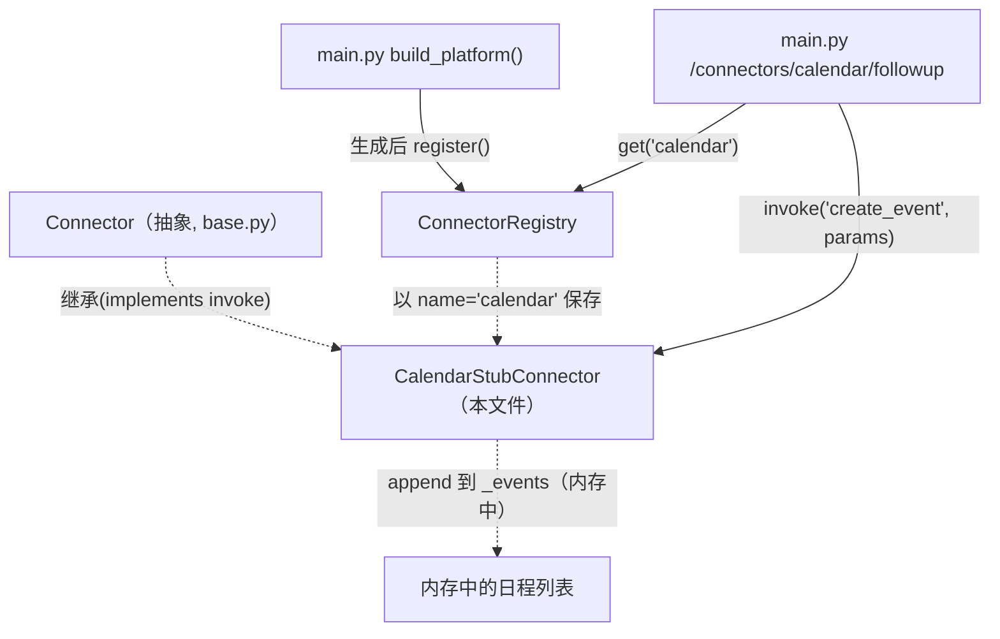
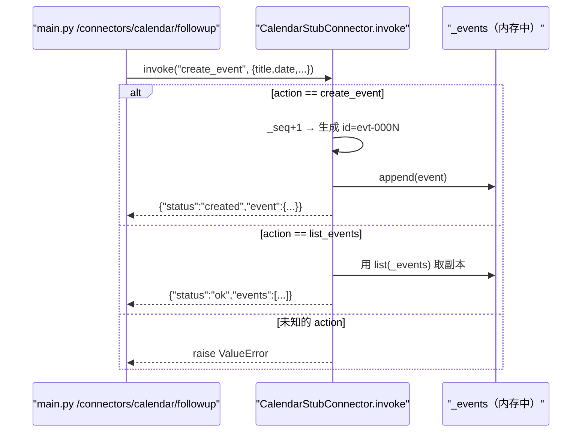
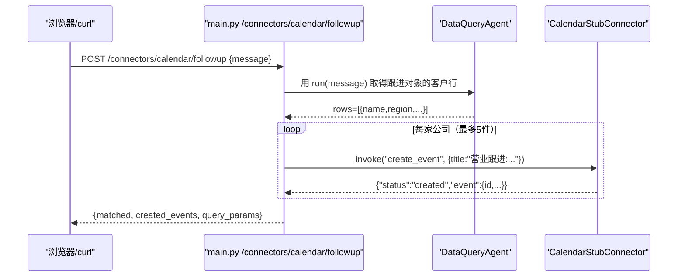

# 基本设计书（代码解说版）
## `backend/app/connectors/calendar_stub.py` — 日历 API 桩（模拟外部服务）

> 本书面向初学者，用图与表说明「这个文件以什么为输入、输出什么、被谁调用、内部如何运作、与哪些部件相互调用」。专业术语在 §7 术语表附中文注释。

---

## 0. 文档信息

| 项目 | 内容 |
|---|---|
| 目标文件 | `backend/app/connectors/calendar_stub.py` |
| 作用（一句话） | 代替调用真实 Google Calendar / Outlook API，**在内存中管理日程的假外部服务**。用于演示「外部服务由 agent 调用」的结构 |
| 所在层 | 连接器层（`app/connectors`） |
| 公开类 | `CalendarStubConnector`（继承 `Connector`） |
| 依赖（import）对象 | `.base.Connector`（抽象基类） / `typing.Any` |
| 直接调用方 | `app/main.py`（在 `build_platform()` 中生成・登记，在 `/connectors/calendar/followup` 中 `invoke`） |

---

## 1. 概述（这个部件做什么）

`CalendarStubConnector`（日历桩）是 `Connector` 的**具体实现之一**。它不调用真实日历 API，而是把日程攒在**内存（内存中的列表）**里。

提供的操作（`actions`）有 2 个：

1. **`create_event`** — 创建 1 条日程。生成连号 ID，保存 `title`/`date`/`attendees`/`note`。若是真 API 则返回相当于 201 Created 的结果。
2. **`list_events`** — 返回已保存的全部日程。

> 💡 **设计意图（桩的价值）**：本类在遵守 `Connector` 的 `invoke(action, params) -> dict` 契约的同时，把内容从「真实 SDK 调用」换成「内存操作」。因此**换成真物时只需把 `invoke()` 的内容改写为 SDK 调用即可**，接口（即 `Connector`）和调用方（`main.py`）**一行都不用改**。无需打网络、就能在测试・演示中运行，正是桩的优点。设想用于营业跟进的日程登记等。

---

## 2. 系统内的位置（调用关系图）

`CalendarStubConnector` 的关系是「继承抽象」「被 API 调用」：

- **IN（进来一侧）**：`main.py` 生成 `CalendarStubConnector()` 并登记到 `ConnectorRegistry`。API 调用 `invoke("create_event", ...)`。
- **OUT（出去一侧）**：不做外部通信，只读写内部的 `self._events` 列表并返回 `dict`。

---

## 3. 公开接口一览

| 类.成员 | 类别 | IN（主要输入） | OUT（返回值） | 大致用途 |
|---|---|---|---|---|
| `name`（类属性） | 属性 | — | `str`=`"calendar"` | 登记键（用 `get("calendar")` 取出） |
| `actions`（类属性） | 属性 | — | `["create_event", "list_events"]` | 提供的操作清单 |
| `__init__` | 同步 | （无） | （生成） | 准备空日程列表＋连号计数器 |
| `invoke` | 异步 | action, params | `dict`（相当于 JSON） | **执行入口**：按 action 分支，创建/枚举日程 |

---

## 4. 方法详细设计

各成员按「作用 / IN / OUT / 调用处 / 调用谁 / 处理逻辑 / 注意点」拆解。

### 4.1 类属性 `name` / `actions`（行19〜20）

- **作用**：声明本连接器的标识名与提供的操作。覆盖抽象 `Connector` 的默认值。
- **值**

| 属性 | 值 | 含义 |
|---|---|---|
| `name` | `"calendar"` | `ConnectorRegistry` 的登记键。通过 `conns.get("calendar")` 取出 |
| `actions` | `["create_event", "list_events"]` | 用于 `/connectors` 目录展示的操作清单 |

- **调用处（被谁调用）**：
  - `name`：登记时 `register()` 把它当键读取（`base.py:41`）
  - `actions`：`main.py:157`（在 `/connectors` 中列出 `c.actions`）
- **注意点**：`actions` 里写的名称必须与 `invoke` 的分支一致（目录与实现保持一致）。

---

### 4.2 `__init__`（构造函数, 行22〜25）

- **作用**：初始化代替真 API 的**内存存储**。
- **IN**：无
- **OUT**：无（实例生成）
- **调用处（被谁调用）**：`app/main.py:91`（`connectors.register(CalendarStubConnector())`）
- **调用谁（依赖）**：无
- **处理逻辑（分步）**：
  1. `self._events: list[dict[str, Any]] = []` — 攒日程的列表
  2. `self._seq = 0` — 为日程 ID 生成连号的计数器
- **注意点**：状态只在实例的内存里。**进程重启就会消失**（因为不是真实的 DB/API）。当作单进程内的演示用途即可。

---

### 4.3 `invoke`（执行入口：按 action 分支, 行27〜44）⭐

- **作用**：抽象 `Connector.invoke` 的具体实现。看 `action` 名执行「创建日程」或「日程一览」，返回结果 `dict`。
- **IN**

| 参数 | 类型 | 含义 |
|---|---|---|
| `action` | `str` | `"create_event"` 或 `"list_events"` |
| `params` | `dict[str, Any]` | 操作参数。`create_event` 时读取 `title`/`date`/`attendees`/`note` |

- **OUT**：`dict[str, Any]`（相当于 JSON）／ **异步(async)**
  - `create_event` → `{"status": "created", "event": {...}}`
  - `list_events` → `{"status": "ok", "events": [...]}`
- **调用处（被谁调用）**：`app/main.py:203`（`await calendar.invoke("create_event", {...})`）
- **调用谁（依赖）**：`self._events.append(...)` / `params.get(...)`（仅标准字典操作）
- **处理逻辑（分步）**：
  1. 当 `action == "create_event"` 时：
     - 用 `self._seq += 1` 推进连号，生成 `f"evt-{self._seq:04d}"`（例 `evt-0001`）的 ID
     - 用 `params.get(...)` 取出 `title`(默认`（無題）`)/`date`(默认`未定`)/`attendees`(默认`[]`)/`note`(默认`""`) 组成 `event`（**即使缺键也用默认值避免崩溃**）
     - 追加到 `self._events`，返回 `{"status": "created", "event": event}`（相当于真 API 的 201 Created）
  2. 当 `action == "list_events"` 时：返回 `{"status": "ok", "events": list(self._events)}`（**返回副本**，外部无法破坏内部列表）
  3. 当是其他 action 时：`raise ValueError(f"calendar コネクタが知らない action: {action!r}")`（**未支持的操作立即报错**）

- **注意点**：虽是 `async def` 但内部无 `await`（仅内存操作）。之所以仍设为 `async`，是为了**换成真 API 时能写 `await sdk.call()`，让签名贴合 `Connector` 的契约**。这是先把接口固定下来的设计。

---

## 5. 数据流（营业跟进日程登记的流程）

`POST /connectors/calendar/followup` 中，DataQuery → 日历登记的整套流程：

---

## 6. 相互引用表

把「从哪来、到哪去」汇总成一张表，作为代码追踪的地图使用。

| 本文件成员 | 调用处（被谁调用） | 调用谁（依赖） |
|---|---|---|
| `class CalendarStubConnector` | 生成：`main.py:91`／继承源：`base.py:23`（`Connector`） | 继承 `.base.Connector` |
| `name` / `actions` | `name`→`register()`(`base.py:41`)／`actions`→`main.py:157`(`/connectors`) | — |
| `__init__` | `main.py:91`（`CalendarStubConnector()`） | — |
| `invoke` | `main.py:203`（`calendar.invoke("create_event", ...)`） | `list.append`, `dict.get`（仅标准操作） |

> 相关文件：`base.py`（抽象 `Connector`/`ConnectorRegistry`）／`connectors/__init__.py`（公开符号）／`main.py`（生成・登记・使用方，`/connectors/calendar/followup`）

---

## 7. 术语表

| 术语（日/英） | 中文注释 |
|---|---|
| スタブ / stub | **桩**。代替真物、只做最小限度运作的临时实现。这里是在内存中管理日程的假日历 |
| モック / mock | **模拟对象**。测试・开发中替换真实外部依赖（真 API）的假物 |
| コネクタ / Connector | **连接器**。表示外部服务入口的部件。本类是其具体实现之一 |
| Connector抽象 / abstract connector | **连接器抽象**。只定 `invoke(action, params)->dict` 契约的父类（`base.py`） |
| 外部API連携 / external API integration | **外部API集成**。从程序调用 Calendar/Slack/CRM 等外部服务 |
| インメモリ / in-memory | **内存中**。不用 DB/文件、而用内存中的变量持有状态。重启即消失 |
| 採番 / sequence numbering | **序号生成**。一边递增 `_seq` 一边分配像 `evt-0001` 的唯一 ID |
| 非同期 / async・await | **异步**。I/O 等待期间可推进其他工作的机制。为换真 API 时方便而预先对齐签名 |
| インターフェース / interface | **接口**。调用方与实现方共同遵守的「约定形态」。死守 `invoke(action, params)->dict` |
| 多態性 / polymorphism | **多态**。作为 `Connector` 类型来用，实体是桩或真物都能用相同方式调用 |
| 構造化データ / structured data | 像 `invoke` 返回的 `dict`（`status`/`event`/`events`）那样的机器可读数据 |
| 既定値 / default value | **默认值**。像 `params.get(key, 默认)` 那样、即使缺键也不崩溃而准备的值 |
| 早期失敗 / fail-fast | **快速失败**。对未支持的 action 用 `ValueError` 立即告知 |

---

> **将本模板套用到其他文件时**：§0〜§7 的框架照旧使用，§4 把「作用/IN/OUT/调用处/调用谁/逻辑/注意点」逐一对应到各方法填写。
