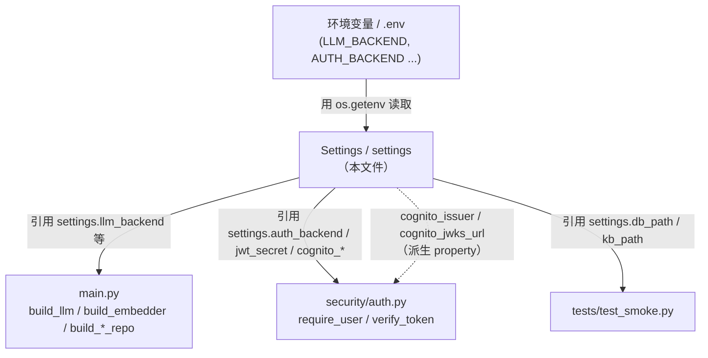
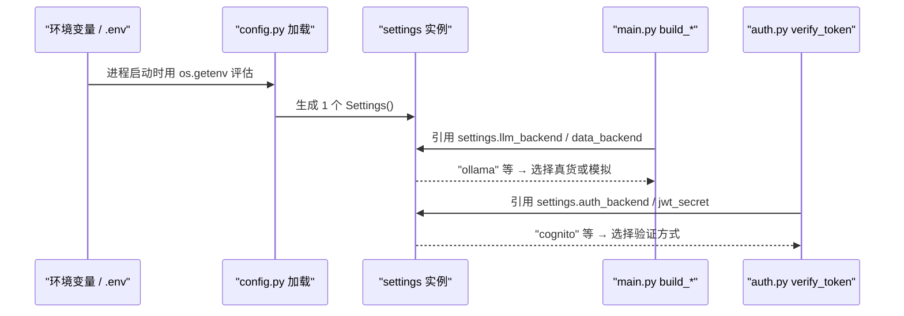

# 基本设计书（代码解说版）
## `backend/app/config.py` — 配置（Configuration）层

> 本书面向初学者，用图和表说明「这个文件以什么为输入、输出什么、被谁调用、内部如何运作、和哪些部件相互调用」。专业术语在 §7 术语表给出中文注释。

---

## 0. 文档信息

| 项目 | 内容 |
|---|---|
| 目标文件 | `backend/app/config.py` |
| 作用（一句话） | 整个平台**配置的唯一入口**。读取环境变量，汇总到 `Settings` 数据类中，并通过各个 `*_backend` 开关切换「本地（免费）」与「生产（AWS）」 |
| 所在层 | 配置层（位于 `app` 直下，被横向广泛引用） |
| 公开对象 | `Settings`(dataclass) / `settings`(唯一实例) |
| 依赖（import）对象 | 仅标准库（`os` / `dataclasses` / `pathlib`）。**不使用 pydantic-settings**（依赖最小化） |
| 直接调用方 | `app/main.py`（Provider/Repo 组装）、`app/security/auth.py`（认证）、`tests/test_smoke.py` |

---

## 1. 概述（这个部件做什么）

`config.py` 的作用是**不让代码任何地方直接写死「配置值」**。它只做以下 3 件事：

1. **读取环境变量** — 用 `os.getenv("XXX", 默认值)` 集中到一处。可通过 `.env` 或部署时的环境变量覆盖。
2. **提供 backend 开关** — 以字符串持有 4 个切换轴（LLM / Embedding / Data / Auth），`main.py` 侧据此选择「真货（AWS）」还是「模拟（本地）」。
3. **计算派生值** — 像 Cognito 的 `issuer` / `jwks_url` 这种由多个配置组合而成的值，用 `@property` 提供。

> 💡 **设计意图**：**刻意不使用** `pydantic-settings`，只用 `os.getenv` 来写。这是为了「把依赖降到最小、让 Lambda 包更轻、让初学者更易读」。需要配置的模块都用 `from .config import settings` 共享**同一个实例**（单例）。

---

## 2. 系统内的位置（调用关系图）

`config.py` 是「自下而上被大家引用」的基座。它自己不调用任何人（只用标准库）：

- **IN（输入侧）**：OS 的环境变量（在部署时、`.env`、`export` 中给出）。
- **OUT（输出侧）**：通过 `settings` 实例，把配置值分发给 `main.py` / `auth.py` / 测试。

---

## 3. 配置项一览（速查表）

`Settings` 的各字段。将**类型、环境变量名、默认值、用途**列成一览。

### 3.1 backend 开关（4 个切换轴）★最重要

| 字段 | 环境变量 | 默认值 | 取值范围 | 用途 |
|---|---|---|---|---|
| `llm_backend` | `LLM_BACKEND` | `"echo"` | `echo` / `ollama` / `bedrock` | 选择 LLM 的实体 |
| `embed_backend` | `EMBED_BACKEND` | `"hashing"` | `hashing` / `ollama` / `bedrock` | 选择嵌入（向量化）的实体 |
| `data_backend` | `DATA_BACKEND` | `"sqlite"` | `sqlite` / `dynamo` | 选择数据保存位置 |
| `auth_backend` | `AUTH_BACKEND` | `"hs256"` | `hs256` / `cognito` | 选择 JWT 验证方式 |

### 3.2 Ollama（本地 LLM/嵌入）

| 字段 | 环境变量 | 默认值 | 用途 |
|---|---|---|---|
| `ollama_base_url` | `OLLAMA_BASE_URL` | `http://localhost:11434` | Ollama 服务器 URL |
| `ollama_model` | `OLLAMA_MODEL` | `qwen3:8b` | 生成用模型名 |
| `ollama_embed_model` | `OLLAMA_EMBED_MODEL` | `bge-m3` | 嵌入用模型名 |

### 3.3 Bedrock（生产 LLM/嵌入·东京区域）

| 字段 | 环境变量 | 默认值 | 用途 |
|---|---|---|---|
| `aws_region` | `AWS_REGION` | `ap-northeast-1` | AWS 区域 |
| `bedrock_model_id` | `BEDROCK_MODEL_ID` | `jp.anthropic.claude-haiku-4-5-20251001-v1:0` | Claude 模型。**必须用 INFERENCE_PROFILE**（直接用 model-id 调用不可） |
| `bedrock_embed_model` | `BEDROCK_EMBED_MODEL` | `amazon.titan-embed-text-v2:0` | Titan 嵌入模型 |

### 3.4 本地数据 / DynamoDB

| 字段 | 环境变量 | 默认值 | 用途 |
|---|---|---|---|
| `db_path` | `DB_PATH` | `<config.py 所在目录>/data/sales.db` | SQLite 文件路径 |
| `kb_path` | `KB_PATH` | `<同上>/data/knowledge_base.json` | 知识库 JSON 路径 |
| `customers_table` | `CUSTOMERS_TABLE` | `ai-agent-platform-customers` | DynamoDB 顾客表名 |
| `knowledge_table` | `KNOWLEDGE_TABLE` | `ai-agent-platform-knowledge` | DynamoDB 知识表名 |

### 3.5 认证（JWT / Cognito）

| 字段 | 环境变量 | 默认值 | 用途 |
|---|---|---|---|
| `jwt_secret` | `JWT_SECRET` | `dev-secret-change-me` | HS256 的共享密钥（**生产环境务必更改**） |
| `jwt_algorithm` | `JWT_ALGORITHM` | `HS256` | 签名算法名 |
| `dev_no_auth` | `DEV_NO_AUTH` | `False`(=`"0"`) | 设为 `1/true/yes/on` 则跳过认证（仅本地用的旁路） |
| `cognito_region` | `COGNITO_REGION`(没有则用 `AWS_REGION`) | `ap-northeast-1` | Cognito 的区域 |
| `cognito_user_pool_id` | `COGNITO_USER_POOL_ID` | `""` | 用户池 ID |
| `cognito_app_client_id` | `COGNITO_APP_CLIENT_ID` | `""` | 应用客户端 ID（用于 `aud` 验证） |

### 3.6 编排（Orchestration）

| 字段 | 环境变量 | 默认值 | 用途 |
|---|---|---|---|
| `step_timeout` | `STEP_TIMEOUT` | `60.0`(float) | 单步的最大等待秒数（传给 `Orchestrator`） |

### 3.7 派生属性（@property，计算值）

| 属性 | 返回值 | 计算式 |
|---|---|---|
| `cognito_issuer` | `str` | `https://cognito-idp.{cognito_region}.amazonaws.com/{cognito_user_pool_id}` |
| `cognito_jwks_url` | `str` | `{cognito_issuer}/.well-known/jwks.json` |

---

## 4. 方法详细设计

将每个定义按「作用 / 输入(IN) / 输出(OUT) / 调用处 / 调用谁 / 处理逻辑 / 注意点」拆解。

### 4.1 `_flag`（辅助函数, 行19〜20）

- **作用**：把环境变量当作**布尔值**读取。把字符串 `"1"/"true"/"yes"/"on"`（忽略大小写）转换为 `True`。
- **输入(IN)**

| 参数 | 类型 | 含义 |
|---|---|---|
| `name` | `str` | 想读取的环境变量名 |
| `default` | `str`=`"0"` | 未设置时的默认字符串 |

- **输出(OUT)**：`bool`
- **调用处**：`config.py:53`（`dev_no_auth` 的 `default_factory` 内）
- **调用谁**：`os.getenv`
- **处理逻辑（分步）**：
  1. 用 `os.getenv(name, default)` 取得字符串
  2. `.lower()` 后判断是否包含于 `("1","true","yes","on")`，返回 `True/False`
- **注意点**：环境变量**总是字符串**。`"0"`/`"false"` 不会变成 `True`（空字符串 `""` 也是 `False`）。

---

### 4.2 `Settings`（dataclass, 行23〜69）★主体

- **作用**：把所有配置值汇集到一个对象。各字段**在定义时**评估 `os.getenv(...)` 来确定默认值。
- **输入(IN)**：无参生成（`Settings()`）。值通过环境变量注入。
- **输出(OUT)**：`Settings` 实例（以属性持有各配置值）
- **调用处**：`config.py:72`（在模块末尾仅生成 1 个 → `settings`）
- **处理逻辑（要点）**：
  1. 大多数字段是 `字段 = os.getenv("ENV", "default")` 的形式（**在类定义加载时只评估一次**）。
  2. 只有 `dev_no_auth` 使用 `field(default_factory=lambda: _flag("DEV_NO_AUTH","0"))`。原因是「希望把 `_flag()` 的**调用结果**作为默认值」（`field(default_factory=...)` 是用于延迟评估的 dataclass 机制）。
  3. `step_timeout` 用 `float(os.getenv("STEP_TIMEOUT","60"))` **数值化**后再持有。
  4. `cognito_region` 用 `os.getenv("COGNITO_REGION", os.getenv("AWS_REGION", "ap-northeast-1"))` 做**两段回退**（没有 COGNITO_REGION 则用 AWS_REGION，再没有则用东京）。
- **注意点**：
  - 字段的默认值在**进程启动时确定一次**。启动后改环境变量不会反映（需要重启）。
  - 用 `_BASE = Path(__file__).resolve().parent`（行16）以**本文件所在位置**为基准来拼 `data/` 路径，因此无论从哪里启动路径都不会错位。

---

### 4.3 `cognito_issuer`（@property, 行62〜65）

- **作用**：组装 Cognito 的 `iss`（发行者 URL）。在 JWKS 获取和 issuer 验证两处使用。
- **输入(IN)**：无（引用 `self.cognito_region` / `self.cognito_user_pool_id`）
- **输出(OUT)**：`str`（例 `https://cognito-idp.ap-northeast-1.amazonaws.com/ap-northeast-1_xxxx`）
- **调用处**：`security/auth.py:71`（`_verify_cognito` 的 `issuer=` 参数）；内部也被 `cognito_jwks_url` 引用
- **注意点**：若 `cognito_user_pool_id` 为空会得到非法 URL。前提是 `auth_backend=cognito` 时务必设置好环境变量。

### 4.4 `cognito_jwks_url`（@property, 行67〜69）

- **作用**：公钥集合(JWKS)的获取 URL。`cognito_issuer + "/.well-known/jwks.json"`。
- **输入(IN)**：无 ／ **输出(OUT)**：`str`
- **调用处**：`security/auth.py:47`（传给 `jwt.PyJWKClient(...)`）

### 4.5 `settings`（模块级实例, 行72）

- **作用**：**只**生成 1 个 `Settings()`，在整个应用中共享（实质单例）。
- **调用处**：所有 `from .config import settings` 的模块（`main.py` / `auth.py` / `tests` 等）

---

## 5. 数据流（配置值被使用前的全过程）

环境变量经由 `settings` 抵达各部件的过程：

---

## 6. 相互引用表（调用处与依赖一览）

把「哪个配置在哪里被使用」整理成一表，可作为追踪代码的地图。

| 本文件的定义 | 主要调用处 | 调用谁（依赖） |
|---|---|---|
| `_flag` | `config.py:53`（`dev_no_auth`） | `os.getenv` |
| `Settings`(dataclass) | `config.py:72`（生成 `settings`） | `os.getenv` / `Path` / `_flag` |
| `cognito_issuer` | `auth.py:71`、内部 `cognito_jwks_url` | — |
| `cognito_jwks_url` | `auth.py:47` | `cognito_issuer` |
| `settings.llm/embed/data_backend` | `main.py:47,49,55,57,63,69`、`/health`(`main.py:140-143`) | — |
| `settings.ollama_*` | `main.py:50,58`（`build_llm`/`build_embedder`） | — |
| `settings.bedrock_*` / `aws_region` | `main.py:48,56,64,70` | — |
| `settings.db_path` / `kb_path` | `main.py:65,71,106`、`test_smoke.py:27,30,31` | — |
| `settings.customers_table` / `knowledge_table` | `main.py:64,70` | — |
| `settings.step_timeout` | `main.py:50,97`（注入 `Orchestrator`） | — |
| `settings.auth_backend` / `jwt_secret` / `dev_no_auth` / `cognito_app_client_id` | `auth.py:78,54,103,70` | — |

> 关联文件：`main.py`（最大的消费者）／`security/auth.py`（认证相关的消费者）／各 `providers/*`·`data/*`（经由 `main.py` 接收配置值）

---

## 7. 术语表

| 术语（日/英） | 中文注释 |
|---|---|
| 環境変数 / environment variable | **环境变量**。在 OS/部署时传给进程的配置值。不改代码即可切换行为 |
| 環境変数スイッチ / backend switch | **后端开关**。用 `LLM_BACKEND` 等字符串切换「真货(AWS) / 模拟(本地)」的方式 |
| データクラス / dataclass | **数据类**。用 `@dataclass` 汇集属性的轻量类，自动生成 `__init__` |
| `field(default_factory=...)` | dataclass 中把**每次调用的函数**作为默认值的机制。需要延迟评估可变值或函数结果时使用 |
| `@property` | **看起来像属性的计算方法**。用 `settings.cognito_issuer` 即可不带 `()` 调用，用于计算派生值 |
| pydantic-settings | pydantic 出的配置库。本实现**刻意不用**，改用 `os.getenv` 以减少依赖 |
| シングルトン / singleton | **单例**。只创建 1 个实例供全局共享，`settings` 即是 |
| フォールバック / fallback | **降级/退避**。值不存在时切换到另一个值（`COGNITO_REGION`→`AWS_REGION`→东京） |
| issuer / iss | **JWT 发行者**。标识令牌由谁发出。Cognito 验证时固定 `iss` 做比对 |
| JWKS | **JSON Web Key Set**。公钥的集合。为做 RS256 签名验证而从 Cognito 获取 |
| INFERENCE_PROFILE | Bedrock 的**推理档案**。东京区域的 Claude 不能直接用 model-id 调用，必须经由它 |
| HS256 / RS256 | JWT 签名方式。HS256=**共享密钥**(面向本地)，RS256=**公钥加密**(Cognito 生产) |

---

> **将本模板套用到其他文件时**：§0〜§7 的框架照用，§4 的「作用/IN/OUT/调用处/调用谁/逻辑/注意点」逐个套到各定义上填写。
