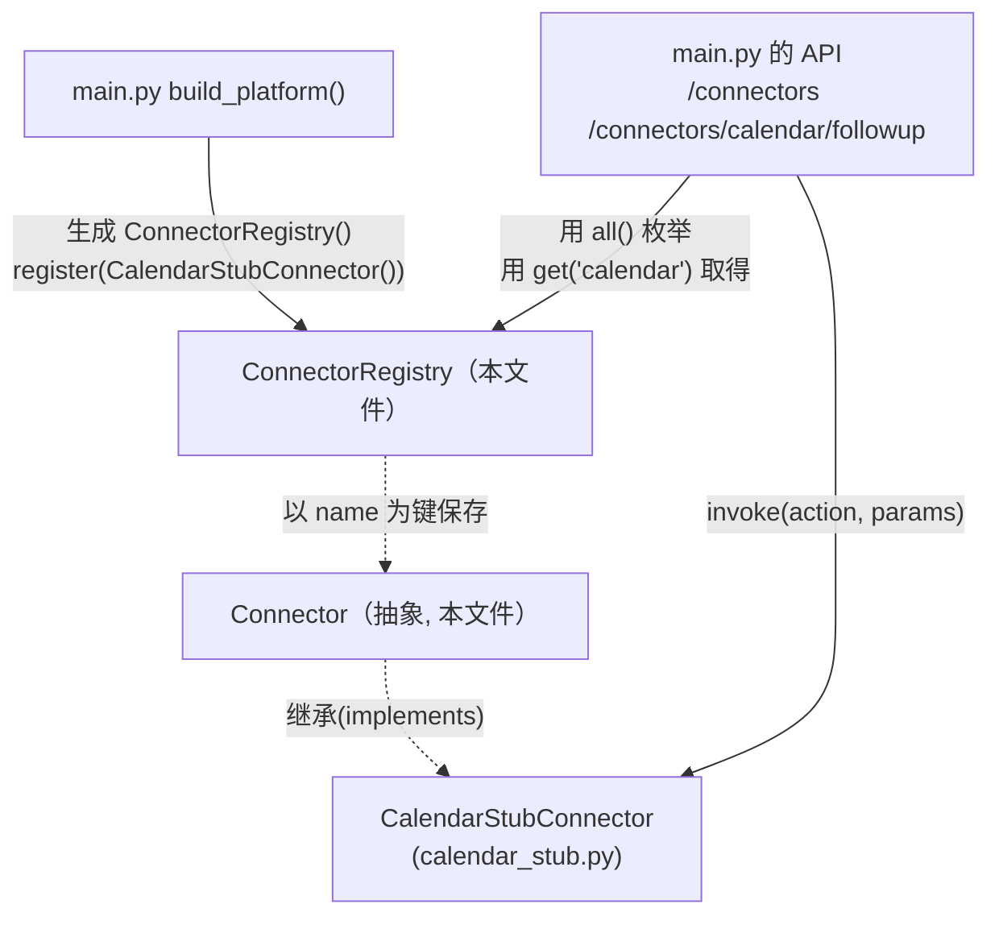
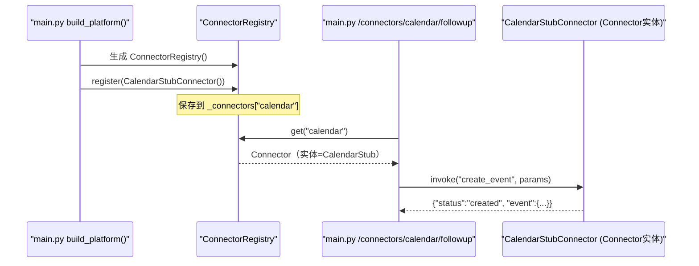

# 基本设计书（代码解说版）
## `backend/app/connectors/base.py` — 外部服务连接器抽象层

> 本书面向初学者，用图与表说明「这个文件以什么为输入、输出什么、被谁调用、内部如何运作、与哪些部件相互调用」。专业术语在 §7 术语表附中文注释。

---

## 0. 文档信息

| 项目 | 内容 |
|---|---|
| 目标文件 | `backend/app/connectors/base.py` |
| 作用（一句话） | 抽象化 agent 调用的**外部 SaaS（Calendar/Slack/CRM…）入口**。规定「能力(action)」与「调用方式(invoke)」，具体实现交给子类 |
| 所在层 | 连接器层（`app/connectors`） |
| 公开类 | `Connector`（抽象基类, ABC）／ `ConnectorRegistry`（登记簿） |
| 依赖（import）对象 | 仅 `abc.ABC, abstractmethod` / `typing.Any`（**不依赖外部库**） |
| 直接调用方 | `app/main.py`（在 `build_platform()` 中登记，在 `/connectors`、`/connectors/calendar/followup` 中使用）／子类 `calendar_stub.py` 继承本类 |

---

## 1. 概述（这个部件做什么）

本文件只定义**2 个部件**，自身完全不做任何外部通信。

1. **`Connector`（抽象基类／连接器契约）** — 只规定「name（连接器名）」「actions（提供的操作清单）」「`invoke(action, params)`（执行入口）」这套**统一的形态(接口)**，不含具体内容。
2. **`ConnectorRegistry`（连接器登记簿）** — 按名称登记/取出连接器的间接层。与 `AgentRegistry` 同一思路的「外部服务版」。

> 💡 **设计意图（为什么抽象）**：如果各 agent 直接写 `requests.post("https://api.xxx.com")`，就会出现 3 个问题：(1) 鉴权/重试/超时各自重复实现、易出错；(2) 测试时不得不真打网络，难以 mock；(3) 更换供应商要改 agent 本体。通过 `Connector` 把「能力」与「调用方式」固定下来，将实现（真实 API 或桩）封闭进子类，agent 只需记住 `invoke(action, params)` 这**一种调用方式**即可。这就是「外部服务由 agent 调用」的标准结构。

---

## 2. 系统内的位置（调用关系图）

`Connector`/`ConnectorRegistry` 的关系是「被上层(API)使用」「向下统管(具体连接器)」：

- **IN（进来一侧）**：`main.py` 的 `build_platform()` 创建 `ConnectorRegistry`，用 `register()` 放入具体连接器。各 API 用 `all()`/`get()` 取出连接器。
- **OUT（出去一侧）**：`ConnectorRegistry` 自身不通信。其持有的 `Connector`（实体是 `CalendarStubConnector` 等子类）的 `invoke()` 才调用外部服务。

---

## 3. 公开接口一览

| 类.成员 | 类别 | IN（主要输入） | OUT（返回值） | 大致用途 |
|---|---|---|---|---|
| `Connector.name` | 类属性 | — | `str`=`"connector"` | 连接器的标识名（登记键） |
| `Connector.actions` | 类属性 | — | `list[str]`=`[]` | 提供的操作清单（用于 `/connectors` 展示） |
| `Connector.invoke` | 异步(抽象) | action, params | `dict`（相当于 JSON） | **执行入口**：子类必须实现 |
| `ConnectorRegistry.__init__` | 同步 | （无） | （生成） | 内部持有一个空 `dict` |
| `ConnectorRegistry.register` | 同步 | connector | 无 | 以 name 为键登记 |
| `ConnectorRegistry.get` | 同步 | name | `Connector` | 按名称取得（不存在则 `KeyError`） |
| `ConnectorRegistry.all` | 同步 | （无） | `list[Connector]` | 枚举已登记的全部 |

---

## 4. 方法详细设计

各成员按「作用 / IN / OUT / 调用处 / 调用谁 / 处理逻辑 / 注意点」拆解。

### 4.1 `class Connector(ABC)`（连接器抽象基类, 行23〜31）⭐

- **作用**：定义所有具体连接器必须满足的**契约(接口)**。由于是 `ABC`（抽象基类），**单独无法实例化**。只给出共通的「形态」。
- **类属性**

| 属性 | 类型 | 默认值 | 含义 |
|---|---|---|---|
| `name` | `str` | `"connector"` | 连接器标识名。作为 `ConnectorRegistry` 的登记键。子类覆盖（例：`"calendar"`） |
| `actions` | `list[str]` | `[]` | 本连接器提供的操作名清单。用于 `/connectors` 目录展示及路由 |

- **抽象方法 `invoke`**

| 参数 | 类型 | 含义 |
|---|---|---|
| `action` | `str` | 想执行的操作名（`actions` 之一） |
| `params` | `dict[str, Any]` | 传给操作的参数（相当于 JSON 的字典） |

- **OUT**：`dict[str, Any]`（相当于 JSON 的返回）／ **异步(async)**。本体为 `raise NotImplementedError`（子类未实现则抛异常）
- **调用处（被谁调用）**：
  - 作为继承源 `calendar_stub.py:18`（`class CalendarStubConnector(Connector)`）
  - 作为类型注解 `main.py:38`（`self._connectors: dict[str, Connector]`）、`main.py` 的 API（`conns.get(...)` 的返回类型）
- **调用谁（依赖）**：无（抽象。内容由子类编写）
- **处理逻辑（分步）**：
  1. 加上 `@abstractmethod`，强制 Python「若子类未实现 `invoke` 则不允许实例化」
  2. 万一被直接调用，作为保险 `raise NotImplementedError`
- **注意点**：`invoke` 是 `async def`。外部 API 会有 I/O 等待，设计上用 `await` 避免阻塞其他请求。所有子类**都遵守这个签名 `invoke(action, params) -> dict`**，从而调用方无需关心实现差异（多态/多态性）。

---

### 4.2 `ConnectorRegistry.__init__`（构造函数, 行37〜38）

- **作用**：仅在内部准备一个「name → Connector」的空字典 `self._connectors`。
- **IN**：无
- **OUT**：无（实例生成）
- **调用处（被谁调用）**：`app/main.py:90`（`connectors = ConnectorRegistry()`）
- **调用谁（依赖）**：无
- **处理逻辑**：初始化 `self._connectors: dict[str, Connector] = {}`。

---

### 4.3 `ConnectorRegistry.register`（登记连接器, 行40〜41）

- **作用**：把传入的连接器，以其 `name` 属性为键放入登记簿。
- **IN**

| 参数 | 类型 | 含义 |
|---|---|---|
| `connector` | `Connector` | 要登记的具体连接器（例：`CalendarStubConnector()`） |

- **OUT**：无
- **调用处（被谁调用）**：`app/main.py:91`（`connectors.register(CalendarStubConnector())`）
- **调用谁（依赖）**：无（仅字典赋值）
- **处理逻辑（分步）**：
  1. `self._connectors[connector.name] = connector`。重复登记相同 `name` 会**覆盖**
- **注意点**：登记键不是参数名，而是**连接器自身的 `name` 属性**。即 `CalendarStubConnector.name = "calendar"`，所以用 `"calendar"` 即可取出。

---

### 4.4 `ConnectorRegistry.get`（按名称取得, 行43〜46）⭐

- **作用**：传入名称返回已登记的连接器。未登记则以 `KeyError` 立即告知。
- **IN**：`name: str`（例：`"calendar"`）
- **OUT**：`Connector`（实体是子类。例：`CalendarStubConnector`）
- **调用处（被谁调用）**：
  - `app/main.py:200`（`calendar = conns.get("calendar")`）
- **调用谁（依赖）**：无
- **处理逻辑（分步）**：
  1. 若 `name` 不在 `self._connectors` 中则 `raise KeyError(f"未登録のコネクタ: {name!r}")`（**快速失败**，明示原因）
  2. 存在则返回对应的 `Connector`
- **注意点**：返回值的静态类型是抽象 `Connector`，但实体是登记的子类。调用方通过 `invoke()` 使用，因此无需关心是哪个子类。

---

### 4.5 `ConnectorRegistry.all`（全部枚举, 行48〜49）

- **作用**：把已登记的连接器全部以列表返回。用于目录展示。
- **IN**：无
- **OUT**：`list[Connector]`
- **调用处（被谁调用）**：`app/main.py:157`（`for c in conns.all()` — 在 `/connectors` 中列出 `name`/`actions`）
- **调用谁（依赖）**：无
- **处理逻辑（分步）**：
  1. 用 `list(self._connectors.values())` 把内部字典的值列表化后返回
- **注意点**：返回的不是内部字典本身，而是**新列表**，因此调用方改动其内容也不会破坏登记簿。

---

## 5. 数据流（一次连接器调用的流程）

`POST /connectors/calendar/followup` 时，连接器经登记簿被调用的流程：

---

## 6. 相互引用表

把「从哪来、到哪去」汇总成一张表，作为代码追踪的地图使用。

| 本文件成员 | 调用处（被谁调用） | 调用谁（依赖） |
|---|---|---|
| `Connector`（抽象类） | 继承：`calendar_stub.py:18`／类型注解：`base.py:38`, `main.py` 各处 | — |
| `Connector.invoke`（抽象） | 子类实现。使用在 `main.py:203`（`calendar.invoke(...)`） | — |
| `ConnectorRegistry.__init__` | `main.py:90` | — |
| `ConnectorRegistry.register` | `main.py:91` | `dict` 赋值 |
| `ConnectorRegistry.get` | `main.py:200` | `dict` 引用（不存在则 `KeyError`） |
| `ConnectorRegistry.all` | `main.py:157`（`/connectors`） | `dict.values()` |

> 相关文件：`calendar_stub.py`（具体实现＝模拟）／`connectors/__init__.py`（公开符号）／`main.py`（生成・登记・使用方）／`core/trace.py`（预期以 `connector:calendar` 步骤名被计量）

---

## 7. 术语表

| 术语（日/英） | 中文注释 |
|---|---|
| コネクタ / Connector | **连接器**。表示外部服务（SaaS/API）入口的部件。统一「能力」与「调用方式」 |
| Connector抽象 / abstract connector | **连接器抽象**。不持具体实现，只定「形态(接口)」的基类 |
| 抽象基底クラス / ABC（Abstract Base Class） | **抽象基类**。只定义共通契约、单独无法实例化的类 |
| 抽象メソッド / abstractmethod | **抽象方法**。不含内容、强制子类实现的方法（`@abstractmethod`） |
| インターフェース / interface | **接口**。调用方与实现方共同遵守的「约定形态」。本实现是 `invoke(action, params)->dict` |
| 多態性 / polymorphism | **多态**。用相同调用方式、实体不同也能正确运作。`get()` 的返回是子类也能用 `invoke` 同样处理 |
| レジストリ / registry | **登记簿/注册表**。登记部件后按名称取出的间接层 |
| スタブ / stub | **桩**。代替真物、只做最小限度运作的临时实现（这里是 `CalendarStubConnector`） |
| モック / mock | **模拟对象**。测试或开发中替换真实外部依赖的假物 |
| 外部API連携 / external API integration | **外部API集成**。从程序调用 Calendar/Slack/CRM 等外部服务 |
| 早期失敗 / fail-fast | **快速失败**。不把错误后置，对未登记等情况当场用 `KeyError` 等告知 |
| 非同期 / async・await | **异步**。I/O 等待期间可推进其他工作的机制。外部 API 调用必备 |
| 構造化データ / structured data | 像 `invoke` 返回的 `dict` 那样、机器可处理的数据形态 |
| 依存性注入 / DI | **依赖注入**。用 `register()` 从外部插入连接器。不改本体即可替换 |

---

> **将本模板套用到其他文件时**：§0〜§7 的框架照旧使用，§4 把「作用/IN/OUT/调用处/调用谁/逻辑/注意点」逐一对应到各方法填写。
