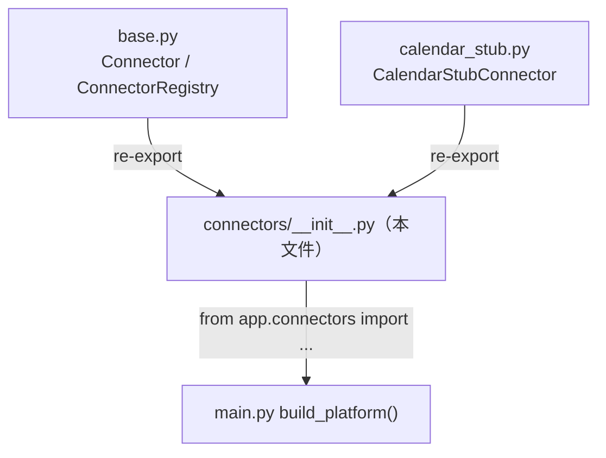
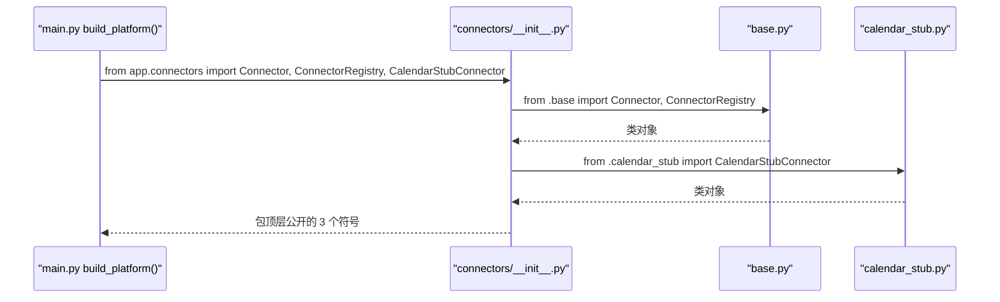

# 基本设计书（代码解说版）
## `backend/app/connectors/__init__.py` — 连接器层的公开符号聚合（re-export）

> 本书面向初学者，用图与表说明「这个文件以什么为输入、输出什么、被谁调用、内部如何运作、与哪些部件相互调用」。专业术语在 §7 术语表附中文注释。

---

## 0. 文档信息

| 项目 | 内容 |
|---|---|
| 目标文件 | `backend/app/connectors/__init__.py` |
| 作用（一句话） | 把连接器层散落在各子模块里的公开类**集中再导出(re-export)**，让外部用 `from app.connectors import X` 一处取到，隐藏内部文件结构 |
| 所在层 | 连接器层（`app/connectors`）的包入口 |
| 公开符号 | `Connector` / `ConnectorRegistry`（来自 `base.py`）／ `CalendarStubConnector`（来自 `calendar_stub.py`） |
| 依赖（import）对象 | `.base`（`Connector, ConnectorRegistry`）／ `.calendar_stub`（`CalendarStubConnector`） |
| 直接调用方 | `app/main.py`（`build_platform()` 中 `from .connectors import ...` 取得这些类） |

---

## 1. 概述（这个部件做什么）

本文件**不含任何逻辑**，只做 2 件事：

1. **聚合 re-export** — 用 `from .base import ...` / `from .calendar_stub import ...` 把各子模块的公开类汇到包顶层。这样调用方写 `from app.connectors import Connector, ConnectorRegistry, CalendarStubConnector` 即可一处取齐，无需关心它们各自在哪个文件。
2. **声明公开面 `__all__`** — 用 `__all__` 明示「本包对外公开的名字」，作为公开 API 的契约（也决定 `from app.connectors import *` 会导入什么）。

> 💡 **设计意图（包入口的价值）**：把 `base.py`（抽象）与 `calendar_stub.py`（具体实现）拆成多个文件便于维护，但若让外部直接 `from app.connectors.calendar_stub import ...`，文件结构就泄露给了调用方——日后改名/移动文件就会牵连各处。让 `__init__.py` 充当**统一门面(facade)**，外部只认包名，内部可自由重构。这是 Python 包组织的标准做法。

---

## 2. 系统内的位置（调用关系图）

`__init__.py` 是「下层各子模块」与「上层 `main.py`」之间的聚合门面：

- **IN（进来一侧）**：从 `.base` / `.calendar_stub` 各子模块导入公开类。
- **OUT（出去一侧）**：把这些类作为包顶层符号公开，`main.py` 由此一处取得。

---

## 3. 公开接口一览

本文件只是符号聚合，自身没有可调用的函数/方法，公开的是「再导出的名字」。

| 公开符号 | 来源模块 | 类别 | 大致用途 |
|---|---|---|---|
| `Connector` | `.base` | 抽象基类(ABC) | 连接器契约。详见 `connectors_base.md` |
| `ConnectorRegistry` | `.base` | 类 | 连接器登记簿。详见 `connectors_base.md` |
| `CalendarStubConnector` | `.calendar_stub` | 类 | 日历连接器的具体实现(桩)。详见 `calendar_stub.md` |
| `__all__` | 本文件 | 列表 | 公开面声明＝`["Connector", "ConnectorRegistry", "CalendarStubConnector"]` |

---

## 4. 方法详细设计

本文件无方法/函数定义，仅由 import 语句与 `__all__` 赋值构成。以下按同一框架解说这些「语句」。

### 4.1 re-export 语句（行1〜2）

- **作用**：把各子模块的公开类抬到包顶层，供外部一处导入。
- **输入(IN)**

| 项目 | 内容 |
|---|---|
| `from .base import Connector, ConnectorRegistry` | 从同包 `base.py` 导入抽象基类与登记簿 |
| `from .calendar_stub import CalendarStubConnector` | 从同包 `calendar_stub.py` 导入具体连接器 |

- **输出(OUT)**：把 `Connector` / `ConnectorRegistry` / `CalendarStubConnector` 绑定到 `app.connectors` 包命名空间
- **调用处（被谁调用，`文件:行号`）**：`main.py:?`（`build_platform()` 中 `from .connectors import ...`；导入本包时这些语句自动执行）
- **调用谁（依赖）**：`.base`、`.calendar_stub`（同包子模块）
- **处理逻辑（分步编号）**：
  1. 首次 `import app.connectors` 时，Python 执行本 `__init__.py`
  2. 依次执行两条 `from ... import ...`，把类对象绑到包顶层
- **注意点**：导入是有顺序与副作用的——`calendar_stub.py` 内部 `from .base import Connector`，所以 `base` 会被先加载。本文件不引入循环依赖（`base` 不反向 import `calendar_stub`）。

---

### 4.2 `__all__` 公开面声明（行4）

- **作用**：明示本包对外公开的名字清单，作为公开 API 的契约。
- **输入(IN)**：无（静态字面量）
- **输出(OUT)**：`__all__ = ["Connector", "ConnectorRegistry", "CalendarStubConnector"]`
- **调用处（被谁调用，`文件:行号`）**：`from app.connectors import *` 时由 Python 解释器读取（限定 `*` 导入的范围）；也作为给读者/工具的「公开符号」说明
- **调用谁（依赖）**：无
- **处理逻辑（分步编号）**：
  1. 把要公开的 3 个名字写成字符串列表赋给 `__all__`
- **注意点**：`__all__` 只影响 `import *` 的范围与文档/linter 的判断，**不会**阻止显式 `from app.connectors import 其他名字`。要让公开面与实际 re-export 一致，新增 re-export 时也要同步更新此列表。

---

## 5. 数据流（导入解析的流程）

`main.py` 取得连接器类时，导入如何解析：

---

## 6. 相互引用表

| 本文件元素 | 调用处（被谁调用） | 调用谁（依赖） |
|---|---|---|
| re-export `Connector` / `ConnectorRegistry` | `main.py`（`from .connectors import ...`） | `.base` |
| re-export `CalendarStubConnector` | `main.py`（`from .connectors import ...`） | `.calendar_stub` |
| `__all__` | `from app.connectors import *` 时的解释器 | — |

> 相关文件：`base.py`（抽象 `Connector`/`ConnectorRegistry`，详见 `connectors_base.md`）／`calendar_stub.py`（具体实现，详见 `calendar_stub.md`）／`main.py`（导入并使用这些类的上层）

---

## 7. 术语表

| 术语（日/英） | 中文注释 |
|---|---|
| パッケージ初期化 / package `__init__.py` | **包初始化文件**。`import 包名` 时自动执行的文件，定义包的对外门面 |
| re-export / 再エクスポート | **再导出**。把子模块的符号抬到包顶层，让外部从一处导入 |
| `__all__` | **公开符号清单**。`from 包 import *` 时导入哪些名字的声明，也作为公开 API 的契约 |
| ファサード / facade | **门面**。隐藏内部多文件结构、对外只露统一入口的设计模式 |
| 名前空間 / namespace | **命名空间**。名字的归属作用域。本文件把类绑定到 `app.connectors` 包命名空间 |
| 循環依存 / circular import | **循环导入**。模块互相 import 导致加载失败。本包顺序为 `base`→`calendar_stub`，无循环 |
| コネクタ / Connector | **连接器**。外部服务入口的抽象。详细见 `connectors_base.md` |

---

> **将本模板套用到其他文件时**：§0〜§7 的框架照旧使用，§4 把「作用/IN/OUT/调用处/调用谁/逻辑/注意点」逐一对应填写。
