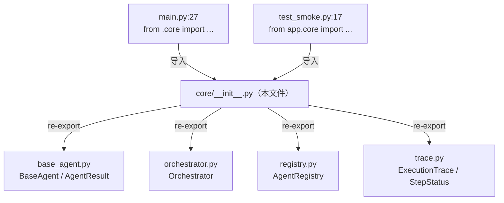
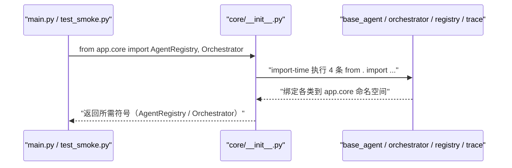

# 基本设计书（代码解说版）
## `backend/app/core/__init__.py` — 核心层的 re-export 聚合包

> 本书面向初学者，用图和表解说「这个文件以什么为输入、输出什么、被谁调用、内部如何运转、与哪些部件相互调用」。专业术语在 §7 术语表附中文注释。

---

## 0. 文档信息

| 项目 | 内容 |
|---|---|
| 对象文件 | `backend/app/core/__init__.py` |
| 作用（一句话） | 核心层的**门面（facade）**。把 `base_agent` / `orchestrator` / `registry` / `trace` 各子模块的公开符号**重导出（re-export）**到 `app.core` 一级，让外部能写 `from app.core import ...` 一句导入 |
| 所属层 | 核心层（`app/core`）的包入口 |
| 公开符号 | `BaseAgent` / `AgentResult` / `AgentRegistry` / `Orchestrator` / `ExecutionTrace` / `StepStatus`（由 `__all__` 声明） |
| 依赖（import）对象 | 同包子模块 `.base_agent` / `.orchestrator` / `.registry` / `.trace` |
| 直接调用方 | `app/main.py:27`（`from .core import AgentRegistry, Orchestrator`）／ `tests/test_smoke.py:17`（`from app.core import AgentRegistry, Orchestrator`） |

---

## 1. 概述

`__init__.py` **不含任何逻辑**，只做一件事：把分散在 4 个子模块里的核心类**集中重导出**到 `app.core` 这一层。这样上层（`main.py`、测试）就不必逐个写 `from app.core.registry import AgentRegistry`，而能一句 `from app.core import AgentRegistry, Orchestrator` 搞定。

它把 4 个子模块的公开类汇成「核心层的对外清单」：

1. 来自 `base_agent` → `BaseAgent`（抽象基类）、`AgentResult`（结果统一格式）
2. 来自 `orchestrator` → `Orchestrator`（编排器）
3. 来自 `registry` → `AgentRegistry`（注册簿）
4. 来自 `trace` → `ExecutionTrace`（执行追踪）、`StepStatus`（步骤状态枚举）

> 💡 **设计意图**：这是「门面/聚合包（facade package）」做法。好处有二：① **导入路径稳定** ＝ 即便将来把某个类挪到别的子文件，只要在此处保持重导出，外部的 `from app.core import X` 就不必改。② **暴露面清晰** ＝ `__all__` 明确声明「核心层对外只认这 6 个」，子模块内部的辅助符号（如 `_StepTimer`）不外泄。

---

## 2. 系统内的位置（调用关系图）

`__init__.py` 夹在「上层导入方」与「下层子模块」之间，只做转发：

- **IN（导入过来的一侧）**：`main.py`、`test_smoke.py` 从这里取核心类。
- **OUT（出去的一侧）**：从 4 个同包子模块各取若干公开符号，原样向上暴露。

---

## 3. 公开接口一览

本文件无方法，公开的是**重导出的符号**（由 `__all__` 定义）：

| 符号 | 来源子模块 | 类型 | 用途 |
|---|---|---|---|
| `BaseAgent` | `.base_agent` | 抽象基类（ABC） | 全 agent 的公共契约 |
| `AgentResult` | `.base_agent` | dataclass | agent 结果的统一格式 |
| `AgentRegistry` | `.registry` | 类 | 按名字登记・取出 agent 的注册簿 |
| `Orchestrator` | `.orchestrator` | 类 | 路由・执行・串联・追踪的编排器 |
| `ExecutionTrace` | `.trace` | dataclass | 1 次请求的执行追踪 |
| `StepStatus` | `.trace` | Enum | 步骤状态（running/success/error/timeout） |

---

## 4. 定义详细（语句逐条说明）

本文件没有方法/函数，只有 import 与 `__all__`。逐条说明如下。

### 4.1 重导出 import（行1〜4）

- **作用**：从 4 个子模块各取核心类，引入 `app.core` 命名空间，从而被「重导出」。
- **逐行**

| 行号 | 语句 | 引入的符号 |
|---|---|---|
| 1 | `from .base_agent import AgentResult, BaseAgent` | `AgentResult` / `BaseAgent` |
| 2 | `from .orchestrator import Orchestrator` | `Orchestrator` |
| 3 | `from .registry import AgentRegistry` | `AgentRegistry` |
| 4 | `from .trace import ExecutionTrace, StepStatus` | `ExecutionTrace` / `StepStatus` |

- **调用处**：本包被导入时（`main.py:27`、`test_smoke.py:17`）由 Python 自动执行。
- **调用谁**：同包子模块 `.base_agent` / `.orchestrator` / `.registry` / `.trace`。
- **处理逻辑**：相对导入（`.` 前缀＝同包）把各子模块的类绑定到 `app.core` 命名空间。
- **注意点**：用**相对导入**（`.base_agent`）而非绝对导入，使包整体可被改名/迁移而内部引用不破。

### 4.2 `__all__`（行6〜13）

- **作用**：声明「`from app.core import *` 时应导出哪些名字」，同时作为本包**对外公开面的正式清单**。
- **内容**：`["BaseAgent", "AgentResult", "AgentRegistry", "Orchestrator", "ExecutionTrace", "StepStatus"]`
- **调用处**：`from app.core import *` 时被 Python 参照（本项目实际多为具名导入，但 `__all__` 仍是「公开约定」的文档）。
- **调用谁**：无。
- **处理逻辑**：定义一个字符串列表，限定 `*` 导入的范围。
- **注意点**：未列入 `__all__` 的子模块内部符号（如 `_StepTimer`、`StepTrace`）不会被 `*` 导出，体现「最小暴露面」。

---

## 5. 数据流

`__init__.py` 不参与运行时数据流，只在**导入时（import-time）**起转发作用：

- 要点：这是**一次性的导入期转发**，运行时（处理 HTTP 请求时）此文件不再介入。

---

## 6. 相互引用表

| 本文件的要素 | 调用处 | 调用谁（依赖） |
|---|---|---|
| 包整体（导入触发） | `main.py:27`, `test_smoke.py:17` | `.base_agent`, `.orchestrator`, `.registry`, `.trace` |
| `BaseAgent` / `AgentResult`（重导出） | 经 `app.core` 被各处引用 | `base_agent.py` |
| `Orchestrator`（重导出） | `main.py`, `test_smoke.py` | `orchestrator.py` |
| `AgentRegistry`（重导出） | `main.py`, `test_smoke.py` | `registry.py` |
| `ExecutionTrace` / `StepStatus`（重导出） | 经 `app.core` 被引用 | `trace.py` |

> 关联文件：`base_agent.py` / `orchestrator.py` / `registry.py` / `trace.py`（被重导出的 4 个子模块）／`main.py`・`test_smoke.py`（导入方）

---

## 7. 术语表

| 术语（日/英） | 中文注释 |
|---|---|
| パッケージ初期化 / `__init__.py` | **包初始化文件**。目录被当作 Python 包时自动执行的入口文件 |
| 再エクスポート / re-export | **重导出**。在包入口把子模块的符号再次暴露，使外部能从上层直接导入 |
| ファサード / facade | **门面模式**。对外提供统一简洁的入口，隐藏内部子模块的拆分细节 |
| 相対インポート / relative import | **相对导入**。`.base_agent` 这种以 `.` 表示「同包」的导入，便于整体改名/迁移 |
| `__all__` | **公开导出清单**。声明 `from pkg import *` 时导出的名字，亦作公开面的文档约定 |
| 公開面 / public surface | **暴露面**。模块对外公开的符号集合；越小越易维护、越不易被误用 |
| 名前空間 / namespace | **命名空间**。符号所归属的「作用域容器」，这里指 `app.core` 这一层 |

---

> **把此模板套到其他文件时**：§0〜§7 框架照用，无方法的文件用「定义详细/配置项详细」等贴切措辞填写 §4。
