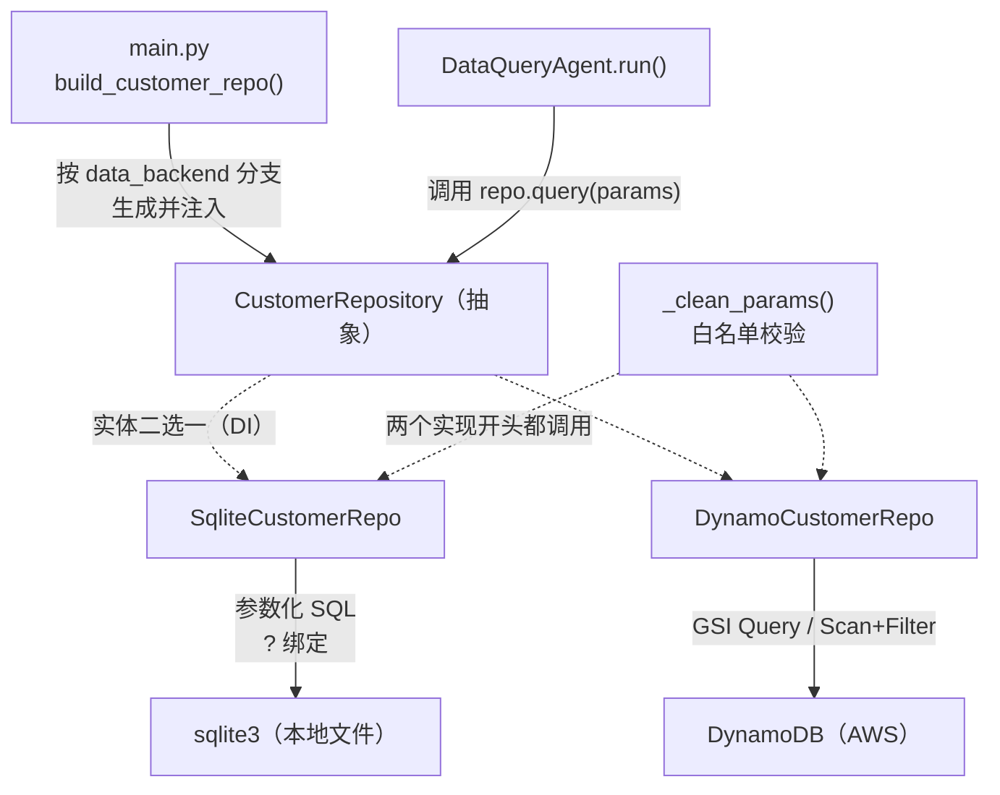
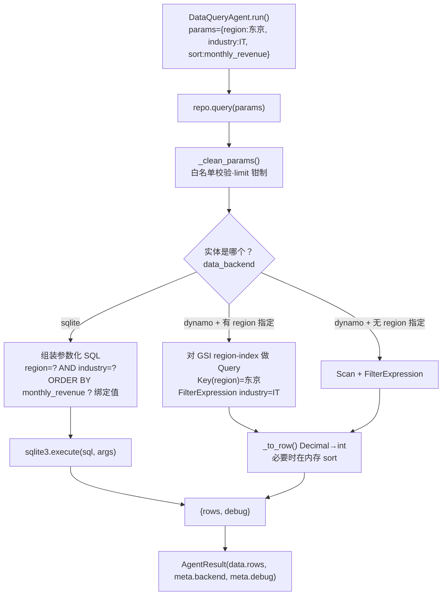

# 基本设计书（代码解说版）
## `backend/app/data/customer_repo.py` — 客户数据获取仓库层

> 本书面向初学者，用图和表解说「这个文件 · 以什么为输入 · 输出什么 · 被谁调用 · 内部如何运作 · 与哪些部件相互调用」。专业术语在 §7 术语表附中文注释。

---

## 0. 文档信息

| 项目 | 内容 |
|---|---|
| 对象文件 | `backend/app/data/customer_repo.py` |
| 作用（一句话） | 把客户 DB 的**检索抽象化**的层。隐藏「用哪个 DB 来查」，使 `SQLite`(本地) ↔ `DynamoDB`(生产) 可以**不改 agent 一行代码**地替换。同时用**白名单校验**封堵注入攻击 |
| 所属层 | 数据层（`app/data`） |
| 公开类 | `CustomerRepository`（抽象）/ `SqliteCustomerRepo` / `DynamoCustomerRepo` |
| 公开函数 | `_clean_params`（模块内辅助函数 · 供各类共用） |
| 公开常量 | `ALLOWED_REGIONS` / `ALLOWED_INDUSTRIES` / `ALLOWED_STATUS` / `SORTABLE` |
| 依赖（import）目标 | `sqlite3` / `abc`(ABC,abstractmethod) / 延迟 import：`boto3`、`boto3.dynamodb.conditions`(Key,Attr) |
| 直接调用方 | `app/agents/dataquery_agent.py`（`self.repo.query()`）／ `app/main.py`（用 `build_customer_repo()` 生成）／ `tests/test_smoke.py`（生成 `SqliteCustomerRepo`） |

---

## 1. 概述（这个部件做什么）

`CustomerRepository`（仓库＝数据访问层）只为 `DataQueryAgent` 承担「**用校验过的参数检索客户、返回行(rows)**」这一件事。具体做两件事：

1. **DB 替换的抽象化** — 用同一个 `query(params)` 方法名，**同时**提供 `SQLite` 实现和 `DynamoDB` 实现。agent 只管调用 `repo.query(...)`，不需要知道背后是什么（＝与 Provider 抽象同一思想）。
2. **安全校验（白名单）** — 用 `_clean_params()` 把「许可值以外」的内容丢弃后再组装查询。绝不把 LLM 抽取的值原样混进查询。

> 💡 **设计意图**：`DataQueryAgent` 的本质是「自然语言 → 校验过的参数 → 安全检索」。**「用哪个 DB 来检索」并非本质**。把这部分切到 Repository，于是本地用 `SqliteCustomerRepo`（一个文件 · 免费）、生产用 `DynamoCustomerRepo`，可以**不改 agent 一行**地替换（见 §7 仓库抽象）。

> 🔐 **最重要的安全设计（SQL 与 Dynamo 都不变）**：只让 LLM 抽「许可项的**值**」，**查询骨架由这一侧(Repository)组装**。用 `_clean_params` 做白名单校验 → 阻止值的混入 → 注入不可能。SQL 用 `?` 绑定（参数化查询），Dynamo 用 `KeyCondition`/`FilterExpression`。

---

## 2. 系统内的位置（调用关系图）

`CustomerRepository`「被上层(agent/main)调用」「调用下层(sqlite3/DynamoDB)」的关系：

- **IN（进来侧）**：`DataQueryAgent.run()` 调用 `await self.repo.query(params)`。生成由 `main.py` 的 `build_customer_repo()` 看 `settings.data_backend` 分支。
- **OUT（出去侧）**：`SqliteCustomerRepo` 向 `sqlite3`、`DynamoCustomerRepo` 经 `boto3` 向 `DynamoDB` 发起查询。两者开头都调用 `_clean_params()`。

---

## 3. 公开接口一览

| 名称 | 类别 | IN（主要输入） | OUT（返回值） | 大致用途 |
|---|---|---|---|---|
| `_clean_params` | 同步函数 | `params: dict` | `dict`（已归一化） | 丢弃白名单外的值，只留安全值 |
| `CustomerRepository.query` | 异步(抽象) | `params: dict` | `dict` | 子类必须实现的契约（接口） |
| `SqliteCustomerRepo.__init__` | 同步 | `db_path` | （生成） | 保存 DB 文件路径 |
| `SqliteCustomerRepo.query` | 异步 | `params: dict` | `{"rows":[...], "debug":...}` | 用参数化 SQL 检索 |
| `DynamoCustomerRepo.__init__` | 同步 | `table_name, region, gsi_name` | （生成） | 保存 boto3 Table 与 GSI 名 |
| `DynamoCustomerRepo.query` | 异步 | `params: dict` | `{"rows":[...], "debug":...}` | 把同步处理甩到别的线程的入口 |
| `DynamoCustomerRepo._query_sync` | 同步(内部) | `params: dict` | `{"rows":[...], "debug":...}` | GSI Query / Scan+Filter 的本体 |
| `DynamoCustomerRepo._to_row` | 同步(静态) | `item: dict` | `dict` | Decimal→int 等 JSON 化整形 |

---

## 4. 方法详细设计

每个方法按「作用 / IN / OUT / 调用处（被谁调用）/ 调用谁（依赖）/ 处理逻辑 / 注意点」拆解。

### 4.1 `_clean_params`（白名单校验, 行32〜45）⭐

- **作用**：把收到的 `params` 里**不在许可列表中的值丢弃成 `None`**。是不让危险值、不存在的列、无效状态混进查询的关口。SQL/Dynamo 两个实现开头都必调的公共盾牌。
- **输入(IN)**

| 参数 | 类型 | 含义 |
|---|---|---|
| `params` | `dict` | LLM＋规则抽取出的检索条件（可能含 region/industry/status/sort/order/limit） |

- **输出(OUT)**：`dict` = `{"region", "industry", "status", "sort", "order", "limit"}`（无效值为 `None`，limit 钳制到 1〜100）
- **调用处（被谁调用，文件:行号）**：
  - `SqliteCustomerRepo.query` 内 `customer_repo.py:67`
  - `DynamoCustomerRepo._query_sync` 内 `customer_repo.py:123`
- **调用谁（依赖）**：仅标准库（`int()` 转换等）。无外部 I/O ＝纯函数。
- **处理逻辑（分步）**：
  1. `region` **仅当**包含在 `ALLOWED_REGIONS` 中时才采用，否则置 `None`
  2. `industry`、`status` 同理，分别用各自的白名单比对
  3. `sort` 只许 `SORTABLE`（`monthly_revenue` / `last_contact`）
  4. `order` 把字符串转小写，非 `"asc"` 的一律视为 `"desc"`（默认降序）
  5. `limit` 用 `int()` 转换（失败时取 20）→ `max(1, min(limit, 100))` 做范围限制
- **注意点**：**`sort` 列名绝不取自用户值**是关键。SQL 无法用 `?` 绑定列名，因此把 `sort` 固定为白名单，防止 `ORDER BY` 处的字符串嵌入（注入）。`limit` 的钳制用于防止过量获取（DoS 式负载）。

---

### 4.2 `CustomerRepository.query`（抽象方法, 行51〜54）

- **作用**：声明子类必须实现的**契约（接口）**。强制「用校验过的参数检索并返回 `{"rows":[...], "debug":"<执行内容>"}`」这个形态。本身无实现体，抛 `NotImplementedError`。
- **输入(IN)**：`params: dict` ／ **输出(OUT)**：`dict`（因是 `abstractmethod` 不能直接调用）
- **调用处（被谁调用，文件:行号）**：不被直接调用（抽象）。实体是 `SqliteCustomerRepo` / `DynamoCustomerRepo`。agent 侧以 `CustomerRepository` 类型接收（`dataquery_agent.py:41` 的参数类型）。
- **注意点**：`@abstractmethod` 使**未实现的子类无法实例化**。类变量 `name="base"` 在实现侧被覆盖为 `"sqlite"` / `"dynamo"`，会出现在 `AgentResult.meta["backend"]`（用于观测「用哪个 DB 查的」，`dataquery_agent.py:108`）。

---

### 4.3 `SqliteCustomerRepo.query`（SQLite 检索, 行66〜93）⭐

- **作用**：本地开发用。从 `_clean_params` 归一化后的条件组装**参数化 SQL**，用 `sqlite3` 检索并返回行。
- **输入(IN)**：`params: dict` ／ **输出(OUT)**：`{"rows": list[dict], "debug": str}` ／ **异步(async)**
- **调用处（被谁调用，文件:行号）**：`DataQueryAgent.run()` 内 `dataquery_agent.py:92`（`await self.repo.query(params)`）。生成在 `main.py:65`（`build_customer_repo()`）与 `test_smoke.py:31`。
- **调用谁（依赖）**：`_clean_params(params)` / `sqlite3.connect()` / `conn.execute(sql, args)`
- **处理逻辑（分步）**：
  1. 用 `_clean_params()` 得到安全的 `p`
  2. 只把 `region/industry/status` 非 None 的项往 `where` 里堆 `"列 = ?"`，并把值堆进 `args`（**值必用 `?` 绑定**＝不嵌入 SQL 正文）
  3. 基础 SQL `SELECT ... FROM customers`，若有 `where` 则拼接 `WHERE ... AND ...`
  4. 仅当有 `sort` 时拼 `ORDER BY {列} {ASC|DESC}`（列名来自白名单，可安全地字符串展开）
  5. 加 `LIMIT ?`，把 `limit` 堆进 `args`
  6. `sqlite3.connect` → 用 `row_factory = sqlite3.Row` 使可**按列名访问**，把 `fetchall()` 转成 `dict`。`finally` 中必定 `close()`
  7. 返回 `{"rows": rows, "debug": "SQL: ... | args=..."}`
- **注意点**：值用 `?`、列名·排序用白名单固定，是**两套安全策略**。`debug` 里带上执行的 SQL 与 args，可经 `AgentResult.meta` 观测。连接按每次查询开闭（demo 规模，无连接池也足够）。

---

### 4.4 `DynamoCustomerRepo.__init__`（生产 DB 初始化, 行109〜113）

- **作用**：生产 AWS 用仓库的生成。用 `boto3` 保存 DynamoDB 的 Table 对象，并记住 GSI 名。
- **输入(IN)**

| 参数 | 类型 | 含义 |
|---|---|---|
| `table_name` | `str` | 客户表名（来自 CDK Outputs） |
| `region` | `str` | AWS 区域（东京 `ap-northeast-1` 等） |
| `gsi_name` | `str`=`"region-index"` | 使用的 GSI（PK=region, SK=monthly_revenue） |

- **输出(OUT)**：无（实例生成）
- **调用处（被谁调用，文件:行号）**：`main.py:64`（`build_customer_repo()` 仅当 `settings.data_backend == "dynamo"` 时生成）
- **调用谁（依赖）**：`boto3.resource("dynamodb", ...).Table(table_name)`
- **注意点**：把 `import boto3` 放在**方法内做延迟 import**。理由是本地 echo 构成下希望不装、不调 boto3 也能跑（`main.py` 在 `sqlite` 分支不生成此类）。

---

### 4.5 `DynamoCustomerRepo.query` / `_query_sync`（DynamoDB 检索, 行115〜155）⭐

- **作用**：DynamoDB 没有 SQL 那种自由的 `WHERE`/`ORDER BY`，所以用**访问模式设计**来吸收。`query()` 是异步入口（把同步处理甩到别的线程），`_query_sync()` 是本体。
- **输入(IN)**：`params: dict` ／ **输出(OUT)**：`{"rows": list[dict], "debug": str}` ／ **异步(async)**
- **调用处（被谁调用，文件:行号）**：`DataQueryAgent.run()` 内 `dataquery_agent.py:92`（与 `SqliteCustomerRepo` **调用方式完全相同**）。`_query_sync` 由 `query()` 内 `customer_repo.py:118` 经 `asyncio.to_thread` 调用。
- **调用谁（依赖）**：`_clean_params()` / `Attr`,`Key`(conditions) / `self._table.query()` 或 `self._table.scan()` / `_to_row()`
- **处理逻辑（分步）**：
  1. `query()`：用 `asyncio.to_thread(self._query_sync, params)` 把**阻塞的 boto3 调用甩到别的线程**（不卡事件循环）
  2. `_query_sync()`：用 `_clean_params()` 得到 `p`
  3. 若有 `industry`/`status`，用 `Attr(col).eq(值)` 以 `&` 结合做出 **FilterExpression**
  4. **有 region 指定** → 用 `KeyConditionExpression=Key("region").eq(...)` 对 **GSI(region-index) 做 Query**。用 `ScanIndexForward = (order=="asc")` 控制 SK(月营收)顺序（desc=营收高到低）。若有 filt 则并用 `FilterExpression`
  5. **无 region 指定** → 用 `scan()` ＋（若有）`FilterExpression`（10 条左右的 demo 足够）
  6. 用 `_to_row()` 整形每个 Item。若有 `sort` 指定则**在内存里** `rows.sort()`（Scan 未排序）
  7. 用 `rows[:limit]` 做件数限制，附上 `debug` 字符串后返回
- **注意点**：
  - **GSI 设计是关键**：因为把 SK 设成了 `monthly_revenue`，按 region 做 Query 时**营收排序「免费」生效**（排序不需额外开销）。这是「NoSQL 从访问模式设计」的实演。
  - **Query vs Scan**：有 region 用 Query（走索引高效），无 region 用 Scan（全表走查＝仅限小规模）。生产大规模要扩展成再加一个 GSI 的设计。
  - `FilterExpression` 是**读取之后再筛**（消耗的容量是筛之前的量），需注意。
  - 异步化用 `asyncio.to_thread`：boto3 是同步 SDK，无法直接 `await`。甩到别的线程跑以保持并发性。

---

### 4.6 `DynamoCustomerRepo._to_row`（类型整形, 行157〜167, 静态方法）

- **作用**：把 DynamoDB 的 Item（数值以 `Decimal` 返回）改成可 JSON 化的朴素 `dict`。
- **输入(IN)**：`item: dict`（DynamoDB Item） ／ **输出(OUT)**：`dict`（name/region/industry/monthly_revenue/status/last_contact）
- **调用处（被谁调用，文件:行号）**：`_query_sync` 内 `customer_repo.py:150`
- **调用谁（依赖）**：仅标准的 `int()` 转换
- **注意点**：把 `monthly_revenue` 转成 `int(Decimal)`。因为**保持 `Decimal` 会在 FastAPI 的 JSON 化中卡住/类型不匹配**。SQLite 版本一开始就是 int 故不需要＝此整形是 Dynamo 版独有的宿命。

---

## 5. 数据流（「东京的 IT 客户按营收排序」的一条流程）

`DataQueryAgent` 抽取的参数，在 Repository 中如何被安全检索（SQLite 版与 Dynamo 版的分支）：

---

## 6. 相互引用表

把「从哪来、到哪去」汇成一表。可作为代码追踪的地图使用。

| 本文件的名称 | 调用处（被谁调用） | 调用谁（依赖） |
|---|---|---|
| `_clean_params` | `SqliteCustomerRepo.query`(`customer_repo.py:67`), `DynamoCustomerRepo._query_sync`(`:123`) | — （纯函数） |
| `CustomerRepository.query` | （抽象·不被直接调用／作为类型 `dataquery_agent.py:41`） | — |
| `SqliteCustomerRepo`(生成) | `main.py:65`(`build_customer_repo`), `test_smoke.py:31` | `sqlite3` |
| `SqliteCustomerRepo.query` | `DataQueryAgent.run`(`dataquery_agent.py:92`) | `_clean_params`, `sqlite3.connect/execute` |
| `DynamoCustomerRepo`(生成) | `main.py:64`(`build_customer_repo`) | `boto3.resource(...).Table()` |
| `DynamoCustomerRepo.query` | `DataQueryAgent.run`(`dataquery_agent.py:92`) | `asyncio.to_thread`→`_query_sync` |
| `DynamoCustomerRepo._query_sync` | `query`(`customer_repo.py:118`) | `_clean_params`, `Key/Attr`, `table.query/scan`, `_to_row` |
| `DynamoCustomerRepo._to_row` | `_query_sync`(`customer_repo.py:150`) | `int()` |
| `ALLOWED_*` / `SORTABLE`（常量） | `_clean_params`, `dataquery_agent.py:55`(提示候选展示·`ALLOWED_REGIONS`/`ALLOWED_INDUSTRIES`) | — |

> 相关文件：`agents/dataquery_agent.py`（唯一使用者／NL→params 抽取）／`main.py`（用 `build_customer_repo` 生成·注入）／`data/seed.py`（SQLite 的源数据）／`scripts/seed_dynamo.py`（把同样的数据投入 DynamoDB）／`tests/test_smoke.py`（用 SQLite 版验证）

---

## 7. 术语表

| 术语（日/英） | 中文注释 |
|---|---|
| リポジトリ抽象 / Repository pattern | **仓库模式／数据访问层抽象**。数据的「存取方式」从业务逻辑里分离出来，用同一接口包住不同的存储（SQLite/DynamoDB），换库不改业务代码 |
| SQLite | **轻量级嵌入式数据库**。整库就是一个文件，无需服务进程，本地开发/测试最省事，免费 |
| DynamoDB | **AWS 全托管 NoSQL 数据库**。键值/文档型，按需计费，水平扩展强；没有 SQL 那种自由的 JOIN/WHERE/ORDER BY |
| GSI（グローバルセカンダリインデックス） | **全局二级索引**。给 DynamoDB 表加的「另一套主键」，让你能按非主键属性高效 Query。本例 `region-index`：PK=region、SK=monthly_revenue |
| Query vs Scan | **Query=按键检索（走索引，高效、只读相关项）**；**Scan=全表扫描（逐项读完再过滤，规模大就贵/慢）**。本例 region 有值走 Query，无值退回 Scan |
| FilterExpression | **过滤表达式**。在 Query/Scan「读取之后」再筛掉不要的项 → 注意：消耗的读容量是「过滤前」的量，不省钱只省返回 |
| KeyConditionExpression | **键条件表达式**。Query 必须指定，作用在分区键/排序键上（走索引）；本例 `Key("region").eq(值)` |
| Decimal | **十进制定点数类型**。DynamoDB 不接受 Python float（精度问题），数值要用 `Decimal` 存；读回来也是 Decimal，需 `int()`/`float()` 转换才能 JSON 化 |
| パラメータ化クエリ / parameterized query | **参数化查询（占位符绑定）**。SQL 里值用 `?` 占位、值单独传入，绝不把用户输入拼进 SQL 字符串 → 防 SQL 注入 |
| ホワイトリスト検証 / whitelist validation | **白名单校验**。只允许「事先列举的合法值」，其余一律丢弃（置 None）。本例 `ALLOWED_REGIONS` 等 |
| インジェクション / injection | **注入攻击**。把恶意内容拼进查询/命令使其偏离原意（如 SQL 注入、`DROP TABLE`）。本层用参数绑定＋白名单双重封堵 |
| アクセスパターン設計 / access-pattern design | **访问模式驱动设计**。NoSQL 不是先建表再想怎么查，而是「先想清楚要怎么查」反推主键/索引（本例为「按地区查、按月营收排序」而设 GSI 的 SK） |
| ScanIndexForward | **排序方向开关**。Query 时 `True`=按 SK 升序、`False`=降序。本例据 `order` 决定月营收升/降序 |
| 遅延import / lazy import | **延迟导入**。把 `import boto3` 写在方法内，只有真用 Dynamo 时才加载，本地 echo 构成不依赖 boto3 |
| 依存性注入 / DI | **依赖注入**。Repository 由 `main.py` 在外部创建好再「注入」给 agent，agent 不自己 new，便于换实现/测试 |
| Provider 抽象 | **提供方抽象**。与本仓库同思想：用接口包住 LLM/Embedding/DB 的具体实现，运行时按配置选实体 |
| `asyncio.to_thread` | **把同步阻塞调用丢到线程池**。boto3 是同步 SDK，直接 `await` 不行；丢线程里跑以免卡住事件循环 |

---

> **把本模板套到其他文件时**：§0〜§7 的框架原样使用，把 §4 的「作用/IN/OUT/调用处/调用谁/逻辑/注意点」逐一套到每个方法上填写即可。
