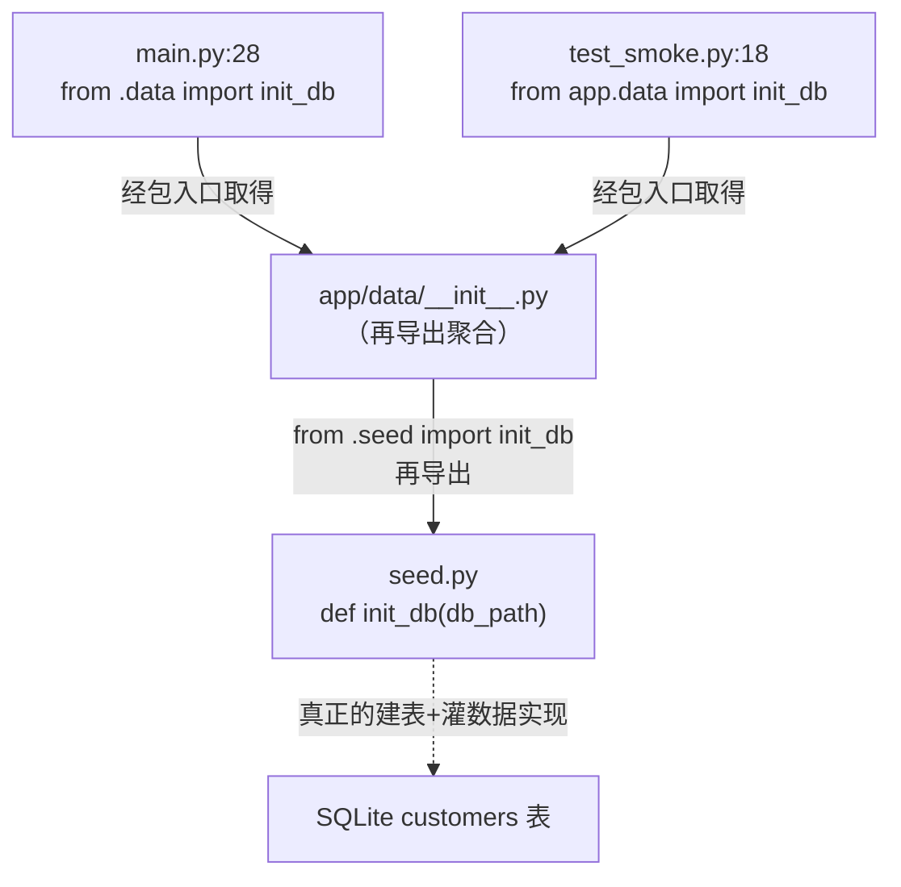
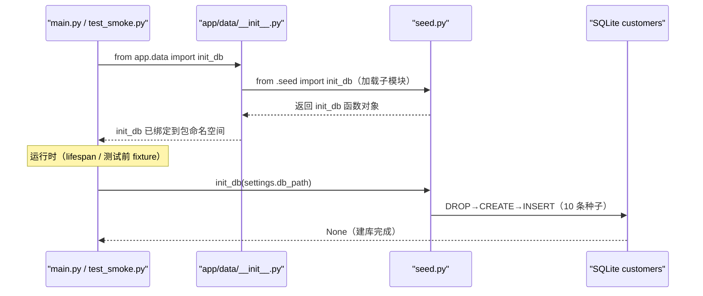

# 基本设计书（代码解说版）
## `backend/app/data/__init__.py` — 数据层包的再导出聚合入口

> 本书面向初学者，用图和表解说「这个文件 · 以什么为输入 · 输出什么 · 被谁调用 · 内部如何运作 · 与哪些部件相互调用」。专业术语在 §7 术语表附中文注释。

---

## 0. 文档信息

| 项目 | 内容 |
|---|---|
| 对象文件 | `backend/app/data/__init__.py` |
| 作用（一句话） | 把数据层（`app/data`）这个**包(package)** 的对外入口聚合起来：从子模块 `seed.py` 把 `init_db` **再导出(re-export)**，让外部用 `from .data import init_db` 这一行就能取到，**不必关心它具体在哪个文件** |
| 所属层 | 数据层（`app/data`） |
| 公开符号 | `init_db`（再导出自 `seed.py`）；`__all__ = ["init_db"]` |
| 依赖（import）目标 | `.seed`（同包子模块，`from .seed import init_db`） |
| 直接调用方 | `app/main.py:28`（`from .data import init_db`）／ `tests/test_smoke.py:18`（`from app.data import init_db`） |

---

## 1. 概述（这个部件做什么）

`__init__.py` 是 Python 把一个目录认作**包(package)** 的标志文件。本文件极薄，只做一件事：

- **再导出(re-export)** — 用 `from .seed import init_db` 把子模块 `seed.py` 里的 `init_db` 提升到包的顶层命名空间，再用 `__all__ = ["init_db"]` 声明「本包对外公开的就是 `init_db`」。

效果：外部不写 `from app.data.seed import init_db`（暴露内部文件结构），而是写 `from app.data import init_db`（只认包名）。**内部把 `init_db` 挪到别的文件，也只需改这一行 `__init__.py`，调用方一律不动**——这就是再导出聚合带来的「门面(facade)」收益。

> 💡 **设计意图**：`app/data` 包里其实还有 `customer_repo.py` / `kb_repo.py` / `seed.py` 等多个文件，但对外只有「建库灌种子」的 `init_db` 需要被全局直接调用（仓库类是由 `main.py` 的 `build_*_repo()` 在内部生成的，不经此入口）。因此 `__init__.py` 只精选再导出 `init_db` 一个符号，保持对外 API 面最小。

---

## 2. 系统内的位置（调用关系图）

`__init__.py` 站在「外部调用方」与「真正实现 `seed.py`」之间，做一层转发：

- **IN（进来侧）**：`main.py` 与 `test_smoke.py` 都通过包名 `app.data` 来 import `init_db`，并不直接点名 `seed.py`。
- **OUT（出去侧）**：本文件把请求转发给同包子模块 `.seed`，真正干活（建表＋灌 10 条种子）的是 `seed.py` 的 `init_db()`。

---

## 3. 公开接口一览

本文件不定义任何新函数/类，只做符号的再导出。

| 名称 | 类别 | IN（主要输入） | OUT（返回值） | 大致用途 |
|---|---|---|---|---|
| `init_db` | 再导出的同步函数（实体在 `seed.py`） | `db_path: str \| Path` | `None` | 建 SQLite `customers` 表＋投入 10 条种子（实现见 `seed.py`） |
| `__all__` | 模块级列表常量 | （静态） | `["init_db"]` | 声明本包 `from app.data import *` 时对外公开的名字 |

---

## 4. 方法详细设计

本文件没有方法定义，只有「再导出语句」与「`__all__` 声明」两个要素。按统一模板拆解如下。

### 4.1 `from .seed import init_db`（再导出语句, 行1）⭐

- **作用**：把同包子模块 `seed.py` 的 `init_db` 函数对象绑定到 `app/data` 包的顶层命名空间，使外部可经包名直接取到。本文件**不复制实现，只转发引用**。
- **输入(IN)**：无（import 语句，模块加载时执行一次）
- **输出(OUT)**：无（副作用：包命名空间多出 `init_db` 这个名字）
- **调用处（被谁调用，文件:行号）**：包被首次 import 时由 Python 解释器自动执行。其下游使用方为：
  - `app/main.py:28`（`from .data import init_db`）→ 在 `main.py:106` 的 `lifespan` 内调用 `init_db(settings.db_path)`
  - `tests/test_smoke.py:18`（`from app.data import init_db`）→ 在 `test_smoke.py:27` 调用 `init_db(settings.db_path)`
- **调用谁（依赖）**：`.seed` 子模块（`seed.py`）。import 此包会连带加载 `seed.py`（其依赖 `sqlite3` / `pathlib.Path`）。
- **处理逻辑（分步）**：
  1. Python 加载 `app/data` 包时执行 `__init__.py`
  2. 遇到 `from .seed import init_db` → 加载同包 `seed.py` 子模块
  3. 把 `seed.py` 中的 `init_db` 名字绑定进本包命名空间
  4. 此后 `app.data.init_db` 与 `app.data.seed.init_db` 指向**同一个函数对象**
- **注意点**：`.seed` 的前导点 `.` 表示**相对导入（同包内）**，避免与第三方同名包冲突。本文件只精选 `init_db`，并未把 `customer_repo` / `kb_repo` 里的仓库类也再导出——那些类由 `main.py` 的 `build_*_repo()` 直接从各自模块 import 生成，不走此入口（保持对外 API 面最小）。

---

### 4.2 `__all__ = ["init_db"]`（公开符号声明, 行3）

- **作用**：声明本包的「公开 API 清单」。当外部写 `from app.data import *` 时，**只有 `__all__` 列出的名字会被导出**；同时也是给读者/IDE 的「这个包对外就提供这些」的明示。
- **输入(IN)**：无（静态列表常量） ／ **输出(OUT)**：`list[str]` = `["init_db"]`
- **调用处（被谁调用，文件:行号）**：不被显式调用。由 Python 在执行 `from app.data import *` 时读取；现有两处调用方（`main.py:28` / `test_smoke.py:18`）用的是**具名导入** `from .data import init_db`，不受 `__all__` 直接影响，但 `__all__` 仍是该包公开契约的权威声明。
- **调用谁（依赖）**：无。
- **注意点**：具名导入（`from .data import init_db`）即便不在 `__all__` 中也能成功，所以 `__all__` 主要约束的是通配导入 `import *` 与文档语义。把它与再导出语句保持一致（都只有 `init_db`），可避免「公开了却没再导出」或「再导出了却没声明」的不一致。

---

## 5. 数据流（import 解析 → 调用 init_db）

外部一行 `from app.data import init_db` 是如何被解析、并最终指向 `seed.py` 真实实现的：

---

## 6. 相互引用表

把「从哪来、到哪去」汇成一表。可作为代码追踪的地图使用。

| 本文件的要素 | 调用处（被谁调用） | 调用谁（依赖） |
|---|---|---|
| `from .seed import init_db`（再导出） | `main.py:28`(`from .data import init_db`), `test_smoke.py:18`(`from app.data import init_db`) | `.seed`（`seed.py` 的 `init_db`） |
| `__all__`（公开符号声明） | Python 在 `from app.data import *` 时读取（现两处调用方用具名导入） | — （静态常量） |

> 相关文件：`data/seed.py`（`init_db` 的真实实现／建表＋灌种子）／`main.py`（`lifespan` 启动时调 `init_db`）／`tests/test_smoke.py`（测试前调 `init_db`）。注：`data/customer_repo.py`、`data/kb_repo.py` 同在本包内，但其仓库类不经本入口再导出（由 `main.py` 的 `build_*_repo()` 直接从各模块 import 生成）。

---

## 7. 术语表

| 术语（日/英） | 中文注释 |
|---|---|
| パッケージ / package | **包**。含 `__init__.py` 的目录被 Python 当作一个可 import 的命名空间，可包含多个子模块（本例 `app/data` 下有 `seed.py`/`customer_repo.py`/`kb_repo.py`） |
| `__init__.py` | **包初始化文件**。目录有了它就成为「包」；import 该包时自动执行，常用来做再导出聚合、初始化逻辑 |
| 再エクスポート / re-export | **再导出**。在 `__init__.py` 里从子模块 import 某符号，使外部能从包顶层直接取到，无需点名内部文件 |
| ファサード / facade | **门面模式**。用一个简洁的对外入口包住内部复杂结构；外部只依赖门面，内部改动不波及调用方 |
| `__all__` | **公开符号清单**。模块/包用它声明 `from x import *` 时导出的名字，也是「对外公开 API」的明示 |
| 相対インポート / relative import | **相对导入**。用前导点 `.` 表示「从当前包内」import（本例 `from .seed import ...`），避免与外部同名包冲突 |
| 具名インポート / explicit import | **具名导入**。明确写出要导入的名字（`from app.data import init_db`），与通配导入 `import *` 相对；不受 `__all__` 限制 |
| 命名空間 / namespace | **命名空间**。名字到对象的映射表。再导出即把子模块里的名字也绑进包的命名空间，使二者指向同一对象 |
| single source of truth | **单一数据源／单一真相源**。实现只在 `seed.py` 一处，`__init__.py` 仅转发引用，不复制实现，避免双份维护 |

---

> **把本模板套到其他文件时**：§0〜§7 的框架原样使用，把 §4 的「作用/IN/OUT/调用处/调用谁/逻辑/注意点」逐一套到每个要素上填写即可。
