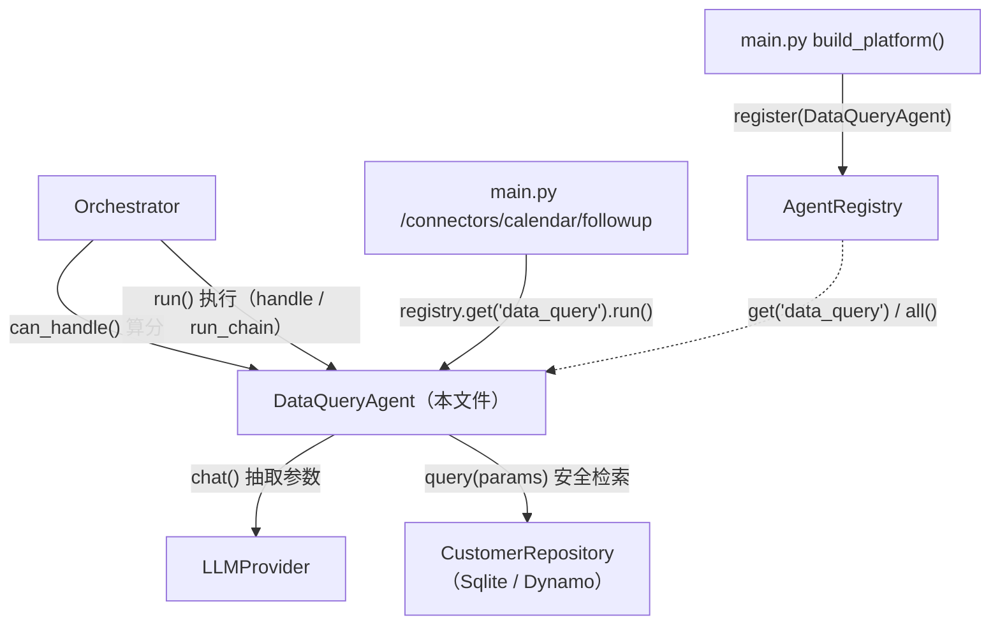
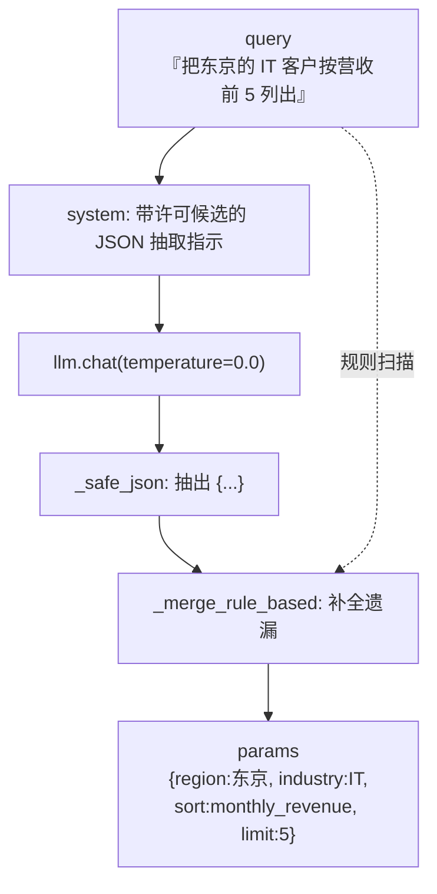
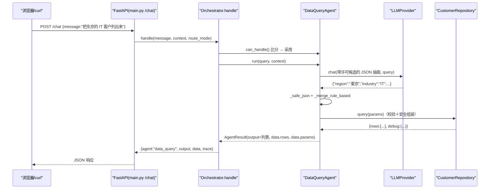

# 基本设计书（代码解说版）
## `backend/app/agents/dataquery_agent.py` — 客户数据检索智能体（NL2SQL 安全版）

> 本书面向初学者，用图和表解说「这个文件：以什么为输入、输出什么、被谁调用、内部如何运作、与哪些部件相互调用」。专业术语在 §7 术语表附中文注释。

---

## 0. 文档信息

| 项目 | 内容 |
|---|---|
| 对象文件 | `backend/app/agents/dataquery_agent.py` |
| 作用（一句话） | **自然语言 → 已校验参数 → 安全的 DB 检索**。从「把东京的 IT 客户列出来」这类文本抽取检索条件(JSON)，交给 `CustomerRepository` 返回客户一览。**绝不让 LLM 写裸 SQL** |
| 层级 | 智能体层（`app/agents`） |
| 公开类 | `DataQueryAgent`（实现 `BaseAgent`） |
| 依赖（import）方 | `core.base_agent.AgentResult,BaseAgent` / `data.customer_repo.ALLOWED_INDUSTRIES,ALLOWED_REGIONS,CustomerRepository` / `providers.base.LLMProvider` |
| 直接调用方 | `Orchestrator`（`route_by_rule`/`route_by_llm` 调 `can_handle()`，`_run_agent()`/`run_chain()` 调 `run()`）／ `app/main.py`（`register` ＋ `/connectors/...` 直接 `run()`）／ `tests/test_smoke.py` |

---

## 1. 概述（这个部件做什么）

`DataQueryAgent`（数据检索智能体）把用户的日语转成**安全的 DB 检索**。要做的事分三段：

1. **抽取（structured extraction / 结构化抽取）** — 让 LLM「只从自然句里抽出检索参数(JSON)」，把地区、行业、状态、排序、件数结构化。
2. **检索（query / 检索）** — 把抽出的参数交给 `CustomerRepository.query()`。**查询骨架与校验由 Repository 一侧**安全组装。
3. **整形（format / 整形）** — 把结果 rows 整成人可读的列表，同时把原始 rows 放进 `data`，以便**传给链的下游（Summary）**。

> 💡 **最重要的设计意图：为什么不让 LLM 写裸 SQL/裸查询**
> 一旦请它「写 SELECT 语句」，就会有 **SQL 注入**、`DROP TABLE`、用不存在的列名报错等风险。
> → 让 LLM 只抽「**许可项目的值(JSON)**」，查询骨架由 Repository 用**白名单＋参数化查询**安全组装。这就是 **structured extraction** 模式（RAG/NL2SQL 安全策略的定番）。

> 💡 **健壮性**：即使 LLM 抽取失败或缺漏，也用朴素的**规则抽取**补全（`_merge_rule_based`）。在没有 LLM 的环境（echo 构成的测试）里也能工作，是两手准备。

---

## 2. 系统内的位置（调用关系图）

`DataQueryAgent` 与「上层(Orchestrator/main)调它」「它调下层(llm/repo)」的关系：



- **IN（被调用一侧）**：`Orchestrator` 路由时调 `can_handle()`，执行时调 `run()`（单体・链式均有）。`/connectors/calendar/followup` 经 registry 直接调 `run()`。
- **OUT（向外调用一侧）**：调用 `llm`（抽参数）和 `repo`（校验＋安全检索）。

---

## 3. 公开接口一览

| 方法 | 种别 | IN（主要输入） | OUT（返回值） | 用途速览 |
|---|---|---|---|---|
| `__init__` | 同步 | llm, repo | （生成实例） | 接收依赖并保存 |
| `can_handle` | 同步 | query, context | `float`（置信度） | 按关键词命中返回路由得分 |
| `run` | 异步 | query, context | `AgentResult` | **主处理**：抽取→检索→整形 |
| `_extract_params` | 异步(内部) | query | `dict`（检索参数） | LLM 抽取＋规则补全 |
| `_safe_json` | 同步(内部, 静态) | raw（LLM 输出） | `dict` | 从响应里安全取出 `{...}` |
| `_merge_rule_based` | 同步(内部) | query, params | `dict` | 用规则补 LLM 的遗漏 |

---

## 4. 方法详细设计

各方法按「作用 / IN / OUT / 调用处 / 调用谁 / 处理逻辑 / 注意点」拆解。

### 4.1 `__init__`（构造函数, 行41〜43）

- **作用**：仅接收依赖（LLM, CustomerRepository）并保存。把 DB 依赖隔离进 `self.repo`。
- **输入(IN)**

| 参数 | 类型 | 含义 |
|---|---|---|
| `llm` | `LLMProvider` | 用于抽取参数的 LLM |
| `repo` | `CustomerRepository` | 客户 DB 的检索入口（Sqlite/Dynamo 由注入选择） |

- **输出(OUT)**：无（生成实例）
- **调用处（被谁调用）**：`app/main.py:87`（`build_platform()` 内）、`tests/test_smoke.py:31`
- **处理逻辑（分步编号）**：赋给 `self.llm`・`self.repo`。**把 DB 依赖隔离在此**，使本智能体无论 Sqlite 还是 Dynamo 都无需改动（替换只在 main 的组装处）。

---

### 4.2 `can_handle`（路由得分, 行45〜47）

- **作用**：以 0.1〜0.95 的分数返回「问题是否适合客户数据检索」。
- **输入(IN)**：`query: str`, `context: dict`（后者未用，仅为签名统一）
- **输出(OUT)**：`float` — 有命中则 `min(0.95, 0.2 + 0.2×命中数)`，无则 `0.1`
- **调用处（被谁调用）**：`Orchestrator.route_by_rule()` `orchestrator.py:54`（列举全部 agent 调用）
- **调用谁（依赖）**：无（扫描 `self._KEYWORDS`）
- **处理逻辑（分步编号）**：
  1. 数 `_KEYWORDS`（「顧客」「一覧」「売上」「ランキング」「出して」「抽出」等）的命中数 `hits`
  2. `hits>0` → `min(0.95, 0.2 + 0.2×hits)`，`hits==0` → `0.1`
- **注意点**：每命中 +0.2，比 Knowledge(+0.15) 斜率更陡。检索类词一出现就强烈举手的设计。

---

### 4.3 `run`（主处理：抽取 → 检索 → 整形, 行90〜109）⭐

- **作用**：把自然句变成检索参数，由 Repository 安全检索，整形结果后返回。
- **输入(IN)**：`query: str`（检索请求）, `context: dict` ／ **异步(async)**
- **输出(OUT)**：`AgentResult`

```json
{
  "agent": "data_query",
  "output": "命中 2 件：\n- ○○商事（东京/IT, 月营收 1,200,000 日元, active）\n- ...",
  "data": { "rows": [ {...} ], "params": { "region":"東京", "industry":"IT", ... } },
  "meta": { "backend": "sqlite", "debug": { ... } }
}
```

- **调用处（被谁调用）**：
  - `Orchestrator._run_agent()` `orchestrator.py:102`（经 `handle()`＝`/chat`）
  - `Orchestrator.run_chain()` `orchestrator.py:157`（链的 step1）
  - `app/main.py:196`（`/connectors/calendar/followup` 直接 `registry.get("data_query").run()`）
- **调用谁（依赖）**：`self._extract_params()` / `self.repo.query()`
- **处理逻辑（分步编号）**：
  1. `_extract_params(query)` 得到检索参数 `params`（LLM 抽取＋规则补全）
  2. `repo.query(params)` 检索。**校验＋安全查询组装由 Repository 负责**（这里只接收结果）
  3. 取出 `rows`
  4. 0 件则「未找到」，有则整形为 `名称（地区/行业, 月营收, status）` 的列表
  5. 把**整形文本＋原始 rows＋params**（供链下游使用）＋ meta（backend 名・debug）放入 `AgentResult` 返回
- **注意点**：把 `data.rows` **原样**放上，是为了在 `run_chain` 中传给 Summary（即链的状态共享素材）。

---

### 4.4 `_extract_params`（NL→参数抽取, 行49〜60）

- **作用**：让 LLM 以 JSON 抽出检索条件，再用规则补全成最终参数。
- **输入(IN)**：`query: str` ／ **输出(OUT)**：`dict`（region/industry/status/sort/order/limit）／ **异步**
- **调用处（被谁调用）**：`run()` `dataquery_agent.py:91`
- **调用谁（依赖）**：`self.llm.chat(..., temperature=0.0)` / `self._safe_json()` / `self._merge_rule_based()`
- **处理逻辑（分步编号）**：
  1. 组「**只输出这份 JSON**」的 system 提示。把 `ALLOWED_REGIONS`/`ALLOWED_INDUSTRIES` 作为候选值提示（不符合的项目明确写 null）
  2. `llm.chat(system, query, temperature=0.0)` 抽取（temperature=0 ＝ 不抖动）
  3. `_safe_json(raw)` 取出 `{...}`
  4. `_merge_rule_based(query, params)` 用规则补全遗漏后返回
- **注意点**：把**许可值列表传进提示**，让 LLM 难以编出乱来的地区/行业（后段 Repository 还会再校验）。



---

### 4.5 内部辅助

#### `_safe_json`（静态方法, 行62〜68）
- **作用**：从 LLM 响应文本里切出第一个 `{` 到最后一个 `}` 做 JSON 解析。坏了就返回空 dict。
- **输入(IN)**：`raw: str` ／ **输出(OUT)**：`dict`
- **调用处（被谁调用）**：`_extract_params()`（`dataquery_agent.py:59`）
- **注意点**：即使 LLM 在前后加了说明文也不崩的防御式解析。异常被吞掉并返回 `{}`。

#### `_merge_rule_based`（规则补全, 行70〜88）
- **作用**：用朴素字符串匹配补 LLM 漏掉的条件。**没有 LLM 的环境也能工作的保险**。
- **输入(IN)**：`query: str`, `params: dict` ／ **输出(OUT)**：`dict`（补全后）
- **调用处（被谁调用）**：`_extract_params()`（`dataquery_agent.py:60`）
- **处理逻辑（分步编号）**：
  1. `region`/`industry` 为空时，从 `ALLOWED_REGIONS`/`ALLOWED_INDUSTRIES` 中采用 query 里含有的词
  2. `status` 为空时，按「解約→churned」「見込→prospect」「アクティブ/稼働→active」推定
  3. 未指定 `sort` 且有「売上/ランキング/トップ」则置 `monthly_revenue`
  4. 用正则捕「トップ/上位/top N」反映为 `limit=N`
- **注意点**：只采**白名单(ALLOWED_*)内**的词，所以即使经规则补全也不会混入危险值。

---

## 5. 数据流（一条检索请求的流程）

从 `POST /chat` 进来一条检索类请求到返回为止：



---

## 6. 相互引用表

| 本文件的方法 | 调用处（被谁调用） | 调用谁（依赖） |
|---|---|---|
| `__init__` | `main.py:87`, `test_smoke.py:31` | — |
| `can_handle` | `Orchestrator.route_by_rule`(`orchestrator.py:54`) | `self._KEYWORDS`（仅扫描） |
| `run` | `Orchestrator._run_agent`(`orchestrator.py:102`), `run_chain`(`orchestrator.py:157`), `main.py:196`(`/connectors/...`) | `_extract_params()`, `repo.query()` |
| `_extract_params` | `run`(`dataquery_agent.py:91`) | `llm.chat()`, `_safe_json()`, `_merge_rule_based()` |
| `_safe_json` | `_extract_params`(`dataquery_agent.py:59`) | `json.loads` |
| `_merge_rule_based` | `_extract_params`(`dataquery_agent.py:60`) | `re.search`, `ALLOWED_REGIONS`/`ALLOWED_INDUSTRIES` |

> 相关文件：`core/base_agent.py`（契约）／`data/customer_repo.py`（`CustomerRepository`＋`ALLOWED_*`：校验与查询组装的本体）／`providers/base.py`（`LLMProvider`）／`core/orchestrator.py`・`main.py`（调用方）

---

## 7. 术语表

| 术语（日/英） | 中文注释 |
|---|---|
| NL2SQL / 自然言語→クエリ | **自然语言转查询**。把人话变成数据库查询。本实现不让 LLM 直接写 SQL，而是抽参数后由仓储安全拼装 |
| structured extraction / 構造化抽出 | **结构化抽取**。让 LLM 只输出受约束的 JSON 字段（而非自由文本/SQL），把 LLM 的输出范围牢牢框死 |
| ホワイトリスト / whitelist | **白名单**。`ALLOWED_REGIONS`/`ALLOWED_INDUSTRIES` 等许可值集合；只接受名单内的值，名单外一律拒绝 |
| パラメータ化クエリ / parameterized query | **参数化查询**。SQL 骨架固定、值用占位符绑定，从根本上防止 SQL 注入（由 `CustomerRepository` 负责） |
| SQLインジェクション / SQL injection | **SQL 注入**。把恶意片段混入查询以越权读写/破坏数据。让 LLM 写生 SQL 会引入此风险，故本设计规避 |
| リポジトリ抽象 / repository | **仓储抽象**。把「用哪个 DB、怎么查」隔离到 `CustomerRepository`，本 agent 对 Sqlite/Dynamo 无改修 |
| フォールバック / fallback | **降级/兜底**。LLM 抽取失败时用 `_merge_rule_based` 规则补全，保证无 LLM 也能工作 |
| 構造化データ / structured data | **结构化数据**。`AgentResult.data.rows`（list[dict]）等机器可读形态，供链式调用的下游使用 |
| 状態共有 / state sharing | **状态共享**。把 `rows` 放进 `data`，`run_chain` 借 `context["upstream"]` 传给 Summary |
| 自信度 / confidence score | **置信度**。`can_handle()` 返回的 0〜1 分数，供路由层在多 agent 竞争时择优 |
| temperature=0.0 | **温度 0**。让 LLM 输出尽量确定、可复现；抽取参数时不希望随机性 |
| 抽出パラメータ / extracted params | **抽取出的参数**。region/industry/status/sort/order/limit 等受控字段，是安全查询的输入 |
