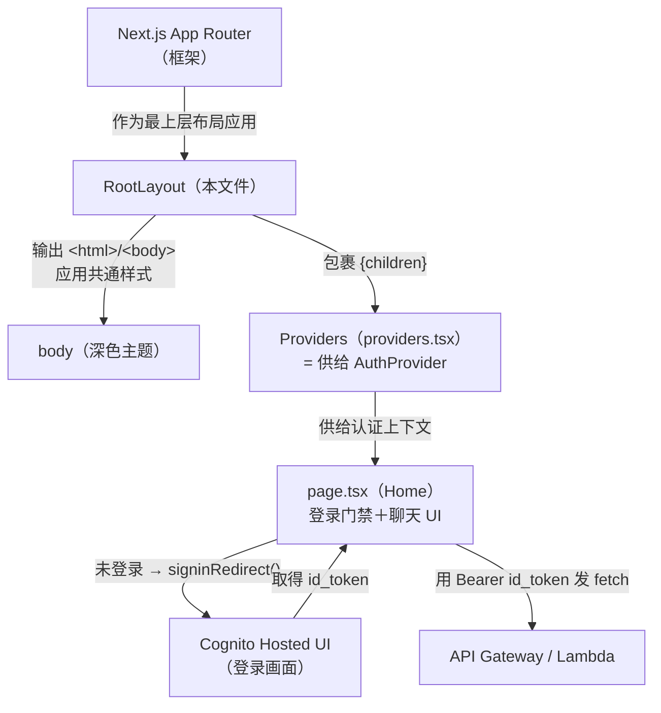
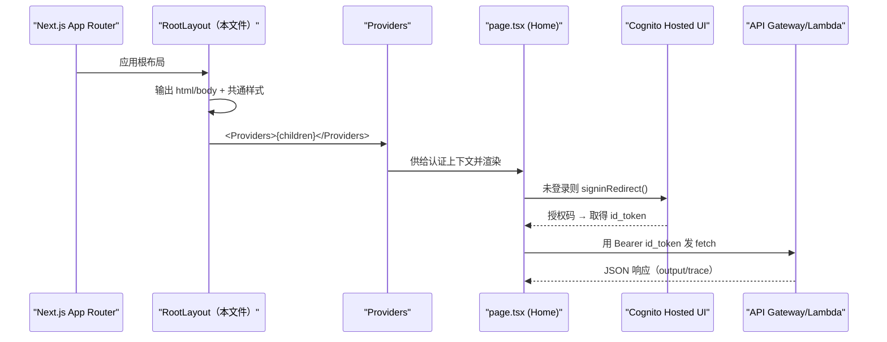

# 基本设计书（代码解说版）
## `frontend/app/layout.tsx` — 根布局层

> 本书面向初学者，用图和表解说「这个文件以什么为输入、输出什么、被谁调用、内部如何运作、与哪些组件相互调用」。专业术语在 §7 术语表中附中文注释。

---

## 0. 文档信息

| 项目 | 内容 |
|---|---|
| 对象文件 | `frontend/app/layout.tsx` |
| 作用（一句话） | Next.js App Router 的**根布局（Root Layout）**。定义 `<html>`/`<body>` 外壳与全屏共通样式，并用 `Providers`（认证上下文）包裹所有页面 |
| 所在层 | 前端·根布局层（`app/`） |
| 公开要素 | `metadata`（页面元信息）、`RootLayout`（default export 函数） |
| 依赖（import）项 | `next.Metadata`（类型）／`./providers.Providers`（认证上下文供给组件） |
| 直接调用方 | Next.js 框架本体（App Router 自动应用于最上层） |
| 组件类型 | **Server Component**（无 `"use client"`＝在服务端渲染） |

---

## 1. 概述

`layout.tsx` 是 Next.js App Router 中 **`app/` 目录下的必备文件**，在一处定义所有页面共通的「最外层 HTML 骨架」。它只做三件事：

1. **定义 HTML 外壳** — 输出 `<html lang="ja">` 与 `<body>`。语言固定为日语。
2. **应用共通样式** — 用内联样式给 `<body>` 套上深色主题（背景 `#0f172a`、文字 `#e2e8f0`）和字体。不用 CSS 框架，全部 inline 完成（规避 Tailwind CDN 引起的预览卡死问题）。
3. **注入共通上下文** — 用 `<Providers>` 包裹 `{children}`（各页面），构建**把认证上下文供给全屏**的基础。

> 💡 **设计意图**：这个文件**自身不持有任何认证逻辑**。认证实体委托给 `providers.tsx`，这里只负责「给每个页面套上 `Providers`」这一结构。所以即使认证方式变了，layout 也无需改动（＝关注点分离）。
>
> 💡 **重要**：因为这个文件 export 了 `metadata`，所以它必须保持为 **Server Component**（`metadata` export 在 Client Component 中无法使用）。这正是它不加 `"use client"` 的原因。

---

## 2. 系统内的位置（画面流转＋数据流）

`layout.tsx` 是「被框架调用」「向下调用 `Providers`→各页面」的最上层框架。在整体认证流程（登录→Cognito Hosted UI→id_token→API）中的位置如下：

- **IN（输入侧）**：Next.js 框架在渲染 `app/` 下所有页面时，**自动**把这个 `RootLayout` 作为最上层应用。应用代码中没有显式调用它的地方。
- **OUT（输出侧）**：输出 `<html>`/`<body>`，其中绘制 `Providers`，再在其中绘制 `{children}`（实际页面）。

---

## 3. 组件·函数一览

| 要素 | 类型 | IN（主要输入） | OUT（返回值/效果） | 用途概要 |
|---|---|---|---|---|
| `metadata` | 常量 export | （静态对象） | `Metadata` | 把 `<title>`/`<meta description>` 传给框架 |
| `RootLayout` | 函数（default export） | `{ children }` | `JSX`（html/body） | 所有页面共通的外壳＋Providers 包裹 |

---

## 4. 组件/函数详细设计

### 4.1 `metadata`（页面元信息, 行4～7）

- **作用**：定义浏览器标签名（`<title>`）和 SEO 用说明文（`<meta name="description">`）。Next.js 自动将其插入 `<head>`。
- **props·state·参数（IN）**：无（静态对象常量）

| 字段 | 类型 | 值 | 含义 |
|---|---|---|---|
| `title` | `string` | `"AIエージェント統合プラットフォーム"` | 浏览器标签／标题 |
| `description` | `string` | `"複数AIエージェントのオーケストレーション (mini)"` | 页面说明（元信息） |

- **渲染或返回**：`Metadata` 类型的对象（不直接绘制 DOM。由框架解释后生成 `<head>`）
- **调用处（被谁使用）**：Next.js 框架按 `app/` 的元数据约定自动收集。
- **调用谁**：无。
- **处理逻辑（分步编号）**：仅声明（静态）。
- **注意点**：`metadata` 的 export **仅限 Server Component**。给这个文件加 `"use client"` 会导致构建报错。

---

### 4.2 `RootLayout`（根布局本体, 行9～24）⭐

- **作用**：输出所有页面共通的 HTML 外壳（`<html>`/`<body>`），套上共通样式，并用 `<Providers>` 包裹 `{children}` 后返回。即 App Router 的「根布局」。
- **props·state·参数（IN）**

| props 名 | 类型 | 含义 |
|---|---|---|
| `children` | `React.ReactNode` | 绘制在这个布局内部的内容（＝实际页面。最初是 `page.tsx` 的 `Home`） |

- **state**：无（纯函数组件，不持有状态）
- **渲染或返回**：返回以下 JSX 树
  - `<html lang="ja">` … 语言固定为日语
  - `<body style={{...}}>` … `fontFamily: system-ui` / `margin: 0` / 背景 `#0f172a` / 文字色 `#e2e8f0`（深色主题）
  - `<Providers>{children}</Providers>` … 用认证上下文包裹所有页面
- **调用处（被谁使用）**：Next.js App Router **在框架内部自动**作为最上层布局调用。应用代码中没有直接调用它的地方。
- **调用谁**：`Providers`（从 `./providers` import）。`Providers` 内部运行 `AuthProvider`（react-oidc-context）。
- **处理逻辑（分步编号）**：
  1. 从 props 接收 `children`
  2. 返回 `<html lang="ja">`，并在其中放置 `<body>`
  3. 给 `<body>` 用 inline style 应用共通主题
  4. 把 `<body>` 的内容设为 `<Providers>{children}</Providers>`，使所有页面都能获得认证上下文
- **注意点**：
  - **采用 inline style** 是为了规避使用 Tailwind 的 Play CDN（`cdn.tailwindcss.com`）时预览卡死的问题（与 page.tsx 内注释同一方针）。
  - 它持有样式等，但不持有认证逻辑。触碰 `window`/`localStorage` 的处理被隔离到 `Providers`（Client Component）一侧 → 这个文件可以**保持 Server Component** 安全运行。

---

## 5. 认证+API 调用流程（时序图）

`layout.tsx` 本身只是「最初一次性搭好 HTML 外壳」，但这个外壳是整个认证流程的基础。下面以 `layout` 为起点，展示从应用启动到 API 调用的过程：

---

## 6. 相互引用表

| 本文件的要素 | 调用处（调用方） | 调用谁（依赖） |
|---|---|---|
| `metadata` | Next.js 框架（按元数据约定自动收集） | — |
| `RootLayout` | Next.js App Router（作为最上层布局自动应用） | `Providers`（`./providers`） |

> 相关文件：`providers.tsx`（供给 `AuthProvider`＝这个 layout 包裹的对象）／`page.tsx`（作为 `children` 被绘制的实际页面）／`lib/oidc.ts`（`Providers` 读取的 OIDC 配置）

---

## 7. 术语表

| 术语（日/英） | 中文注释 |
|---|---|
| Next.js App Router | Next.js 新一代路由方式（`app/` 目录约定）。`layout.tsx`/`page.tsx` 等文件名即路由结构 |
| ルートレイアウト / Root Layout | **根布局**。`app/layout.tsx`，包裹所有页面的最外层 HTML 骨架，必须包含 `<html>`/`<body>` |
| Server Component | **服务端组件**。默认在服务器渲染、不带 `"use client"`。可 export `metadata`，但不能用浏览器 API |
| Client Component | **客户端组件**。文件顶部带 `"use client"`，可用 `useState`/`window`/`localStorage` 等浏览器能力 |
| `"use client"` | Next.js 指令，标记该文件为客户端组件。本文件**故意不加**以保持 Server Component |
| SSR（サーバーサイドレンダリング） | **服务端渲染**。页面 HTML 在服务器先生成。此时无 `window`/`localStorage`，触碰会报错 |
| ハイドレーション / hydration | **水合**。服务器输出的静态 HTML 在浏览器端被 React「激活」绑定事件，变成可交互页面 |
| メタデータ / metadata | **元数据**。`<title>`/`<meta>` 等页面信息，App Router 通过 export `metadata` 提供 |
| インラインスタイル / inline style | **内联样式**。直接写在 `style={{...}}` 上的样式，不依赖外部 CSS/CDN |
| 認証コンテキスト / auth context | **认证上下文**。通过 React Context 把「是否登录、token」共享给所有子组件（由 `Providers` 提供） |
| `children` | React 约定的特殊 props，代表「被这个组件包裹的内容」。此处即各页面 |

---

> **将此模板套用到其他文件时**：§0～§7 的框架原样保留，把 §4 的「作用/props·state·参数/渲染或返回/调用处/调用谁/处理逻辑/注意点」逐项套到各要素上填写即可。
