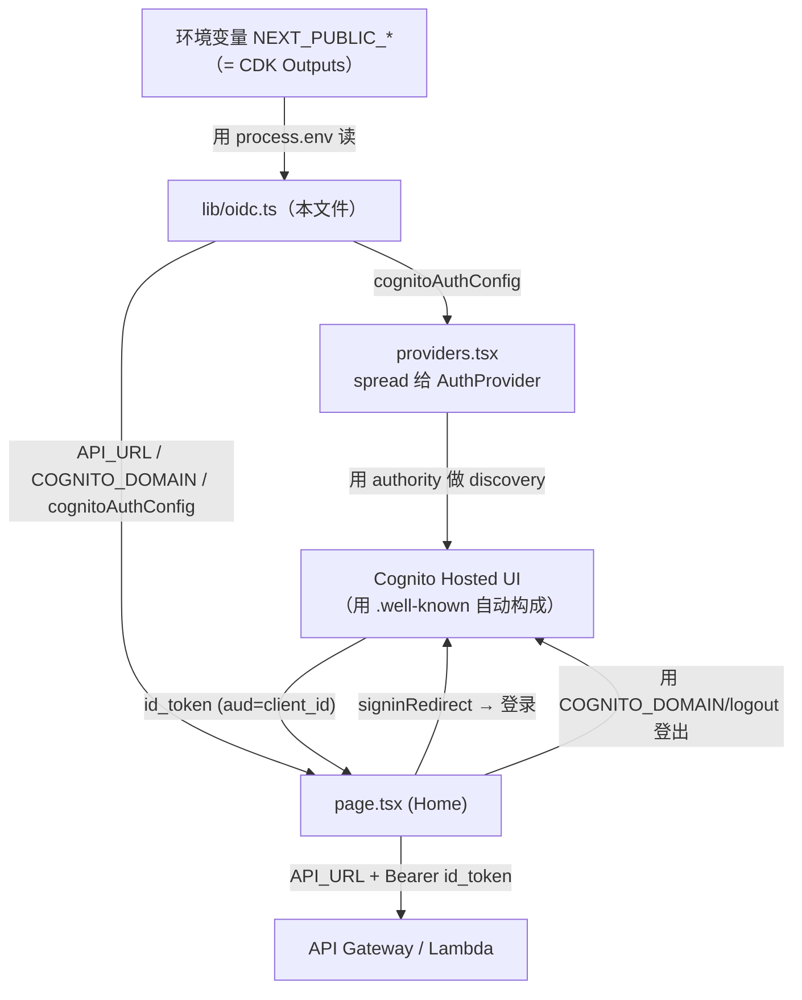
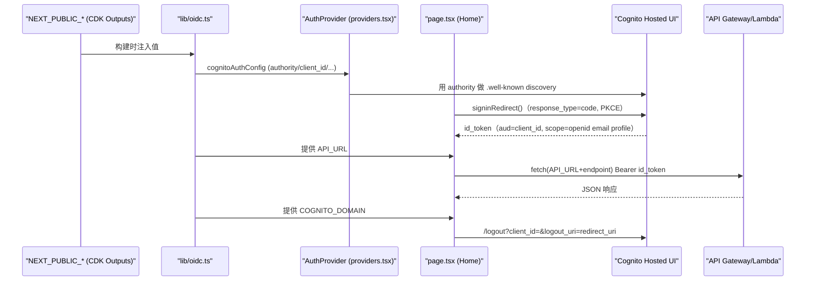

# 基本设计书（代码解说版）
## `frontend/lib/oidc.ts` — Cognito OIDC 配置＋API_URL

> 本书面向初学者，用图和表解说「这个文件以什么为输入、输出什么、被谁调用、内部如何运作、与哪些组件相互调用」。专业术语在 §7 术语表中附中文注释。

---

## 0. 文档信息

| 项目 | 内容 |
|---|---|
| 对象文件 | `frontend/lib/oidc.ts` |
| 作用（一句话） | 前端**配置的唯一来源**。把以 Cognito 作为 OIDC Provider 的配置（`cognitoAuthConfig`）、API 基础 URL（`API_URL`）、登出用域名（`COGNITO_DOMAIN`）从环境变量拼装并 export |
| 所在层 | 前端·配置/库层（`lib/`） |
| 公开要素 | `cognitoAuthConfig`（OIDC 配置对象）／`API_URL`（string）／`COGNITO_DOMAIN`（string） |
| 依赖（import）项 | 无（只读 `process.env.NEXT_PUBLIC_*`） |
| 直接调用方 | `providers.tsx`（`cognitoAuthConfig`）／`page.tsx`（`API_URL`,`COGNITO_DOMAIN`,`cognitoAuthConfig`） |
| 组件类型 | 纯配置模块（非组件） |

---

## 1. 概述

`oidc.ts` 是完全不持有 UI 的「配置存放处」。它只做两件事：

1. **拼装 OIDC 配置** — 往 `cognitoAuthConfig` 里塞 `authority`/`client_id`/`redirect_uri`/`response_type`/`scope`。给 `authority` 传入 Cognito 的 issuer（用户池 URL）后，`react-oidc-context` 会**经由 discovery（`.well-known`）自动取得 Hosted UI 的各端点**（前端不自建登录画面）。
2. **公开连接目标 URL** — export API 基础 URL（`API_URL`）与登出用 Hosted UI 域名（`COGNITO_DOMAIN`）。

所有值都从 **`NEXT_PUBLIC_*` 环境变量**（Vercel 的 Environment Variables，本地为 `.env.local`）注入。内容是**贴 CDK 的 Outputs** 的运维方式。

> 💡 **设计意图**：把 authority/client_id/URL **集中到一个文件**，配置变更（换池子·迁移 API）只需在这一处搞定。`providers.tsx`/`page.tsx` 只是读这些常量。
>
> 💡 **`response_type: "code"`** ＝ Authorization Code + PKCE（面向 SPA 的安全方式）。`scope: "openid email profile"` 让 id_token 包含 email/profile。

---

## 2. 系统内的位置（画面流转＋数据流）

`oidc.ts` 是「接收环境变量」「把配置分发给 `providers`/`page`」的最下游配置源。在认证流程（登录→Cognito Hosted UI→id_token→API）中的位置：

- **IN（输入侧）**：构建/运行时的 `NEXT_PUBLIC_*` 环境变量（贴入了 CDK Outputs 的值）。
- **OUT（输出侧）**：export `cognitoAuthConfig`／`API_URL`／`COGNITO_DOMAIN`。`providers.tsx`·`page.tsx` 读取它们。

---

## 3. 组件·函数一览

| 要素 | 类型 | IN（主要输入） | OUT（类型/值） | 用途概要 |
|---|---|---|---|---|
| `cognitoAuthConfig` | 常量 export | `NEXT_PUBLIC_COGNITO_AUTHORITY`/`_CLIENT_ID`/`_REDIRECT_URI` | OIDC 配置对象 | 传给 `AuthProvider` 的 Cognito 配置 |
| `API_URL` | 常量 export | `NEXT_PUBLIC_API_URL` | `string` | 后端 API 的基础 URL |
| `COGNITO_DOMAIN` | 常量 export | `NEXT_PUBLIC_COGNITO_DOMAIN` | `string` | Hosted UI 的登出用域名 |

---

## 4. 组件/函数详细设计

### 4.1 `cognitoAuthConfig`（OIDC 配置, 行10～16）⭐

- **作用**：传给 `react-oidc-context` 的 `AuthProvider` 的一整套 Cognito 连接配置。
- **构成字段（IN：来自环境变量）**

| 字段 | 类型 | 值的出处 | 含义 |
|---|---|---|---|
| `authority` | `string` | `NEXT_PUBLIC_COGNITO_AUTHORITY` | Cognito 的 issuer（用户池 URL）。从此处经 `.well-known` 自动构成 Hosted UI |
| `client_id` | `string` | `NEXT_PUBLIC_COGNITO_CLIENT_ID` | app client ID。即 id_token 的 `aud` 值 |
| `redirect_uri` | `string` | `NEXT_PUBLIC_REDIRECT_URI` | 登录后的回跳 URL（须在 Cognito 侧登记） |
| `response_type` | `string`（固定） | `"code"` | 选择 Authorization Code + PKCE |
| `scope` | `string`（固定） | `"openid email profile"` | 请求的权限。把 email/profile 放进 id_token |

- **返回值**：朴素的配置对象（既非 class 也非函数）
- **调用处（被谁使用）**：
  - `providers.tsx`：`<AuthProvider {...cognitoAuthConfig} ...>`（用 spread 传入全部字段）
  - `page.tsx`：`logout()` 中引用 `cognitoAuthConfig.redirect_uri`·`cognitoAuthConfig.client_id`（拼 `/logout` URL）
- **调用谁**：`process.env.NEXT_PUBLIC_*`（只读）
- **处理逻辑（分步编号）**：读环境变量，用 `as string` 加类型后代入各字段而已（静态构建）。
- **注意点**：
  - 只要给 `authority` 传 issuer，Hosted UI 的各端点（authorize/token/jwks）就会**经 discovery 自动取得**。不必逐个写 URL。
  - `as string` 是类型断言。即使环境变量未设置（`undefined`），类型上也按 `string` 处理，所以**env 漏贴无法靠类型防住** → 表现为运行时登录失败才发觉。

---

### 4.2 `API_URL`（API 基础 URL, 行18）

- **作用**：`page.tsx` 的 `fetch` 调用的后端基础 URL。
- **IN**：`NEXT_PUBLIC_API_URL`
- **返回值**：`string`
- **调用处**：`page.tsx` 的 `send()`（`fetch(\`${API_URL}${endpoint}\`)`）
- **注意点**：预期是不带末尾斜杠的 API GW 路由 URL。拼上 `endpoint`（`/chat` 等）后使用。

---

### 4.3 `COGNITO_DOMAIN`（登出用域名, 行21）

- **作用**：Hosted UI 的域名。`page.tsx` 的 `logout()` 用它拼 `https://${COGNITO_DOMAIN}/logout?...`。
- **IN**：`NEXT_PUBLIC_COGNITO_DOMAIN`（例：`aiagent-xxxx.auth.ap-northeast-1.amazoncognito.com`）
- **返回值**：`string`
- **调用处**：`page.tsx` 的 `logout()`
- **注意点**：与 `authority`（issuer）**是两码事**。issuer 用于 token 校验/discovery，`COGNITO_DOMAIN` 用于 Hosted UI（登录/登出画面）的域名。

---

### 4.4 环境变量 → CDK Outputs 对应表 ⭐

`NEXT_PUBLIC_*` 各值对应 CDK 部署时 **Outputs** 中的哪一个（与 `README.md` C 节·`.env.local.example` 一致）：

| 环境变量（`NEXT_PUBLIC_*`） | 本文件中的引用 | 对应的 CDK Outputs | 示例（`.env.local.example`） |
|---|---|---|---|
| `NEXT_PUBLIC_API_URL` | `API_URL` | `ApiUrl` | `https://xxxxxx.execute-api.ap-northeast-1.amazonaws.com` |
| `NEXT_PUBLIC_COGNITO_AUTHORITY` | `cognitoAuthConfig.authority` | `CognitoIssuer` | `https://cognito-idp.ap-northeast-1.amazonaws.com/ap-northeast-1_xxxxxxxxx` |
| `NEXT_PUBLIC_COGNITO_CLIENT_ID` | `cognitoAuthConfig.client_id` | `AppClientId` | `xxxxxxxxxxxxxxxxxxxxxxxxxx` |
| `NEXT_PUBLIC_COGNITO_DOMAIN` | `COGNITO_DOMAIN` | `HostedUiDomain` | `aiagent-603319838936.auth.ap-northeast-1.amazoncognito.com` |
| `NEXT_PUBLIC_REDIRECT_URI` | `cognitoAuthConfig.redirect_uri` | （手动）本地/生产切换 | 本地 `http://localhost:3000/` ／ 生产 `https://<app>.vercel.app/` |

> 运维备注：把 `cdk deploy` 的 Outputs（`ApiUrl`/`UserPoolId`/`AppClientId`/`CognitoIssuer`/`HostedUiDomain`）贴到 Vercel 的 Environment Variables。只有 `REDIRECT_URI` 需按环境（本地/Vercel 生产）手动切换（因 CORS/回调存在先有鸡还是先有蛋的问题，遵循 README C 节的部署顺序）。

---

## 5. 认证+API 调用流程（时序图）

`oidc.ts` 的配置值在流程各处如何被使用：

---

## 6. 相互引用表

| 本文件的 export | 调用处（调用方） | 调用谁（依赖） |
|---|---|---|
| `cognitoAuthConfig` | `providers.tsx`（spread 给 `AuthProvider`）／`page.tsx`（`logout` 中用 `redirect_uri`/`client_id`） | `process.env.NEXT_PUBLIC_COGNITO_AUTHORITY`/`_CLIENT_ID`/`_REDIRECT_URI` |
| `API_URL` | `page.tsx`（`send` 的 `fetch`） | `process.env.NEXT_PUBLIC_API_URL` |
| `COGNITO_DOMAIN` | `page.tsx`（`logout` 的 `/logout` URL） | `process.env.NEXT_PUBLIC_COGNITO_DOMAIN` |

> 相关文件：`providers.tsx`（把 `cognitoAuthConfig` 传给 `AuthProvider`）／`page.tsx`（三个 export 全部使用）／`.env.local.example`（值的模板）／`README.md` C 节（env→CDK Outputs 对应）／`infra/`（CDK＝Outputs 的发行源）

---

## 7. 术语表

| 术语（日/英） | 中文注释 |
|---|---|
| OIDC（OpenID Connect） | 基于 OAuth2 的**身份认证**协议。Cognito 作为 OIDC Provider 颁发 id_token |
| react-oidc-context | React 的 OIDC 封装库。读 `cognitoAuthConfig` 提供 `<AuthProvider>`/`useAuth()` |
| authority / issuer | **签发者地址**（用户池 URL）。给它就能通过 discovery 自动找到各端点 |
| discovery / `.well-known` | OIDC **自动发现**。访问 `<authority>/.well-known/openid-configuration` 拿到 authorize/token/jwks 等端点 |
| Hosted UI | Cognito **托管登录/登出页面**。登录界面由 Cognito 提供，前端不自建 |
| `response_type: "code"` | 选择**授权码模式**（Authorization Code），先拿一次性 code 再换 token |
| Authorization Code Grant | **授权码模式**。比直接返回 token 安全，配合 PKCE 用于 SPA |
| PKCE | 授权码模式增强，防 code 被劫持滥用，SPA 必备（react-oidc-context 默认启用） |
| scope（openid email profile） | **请求的权限范围**。`openid` 必须；`email`/`profile` 把邮箱、资料放进 id_token |
| client_id（app client） | Cognito 应用客户端 ID。id_token 的 `aud` 即此值，后端据此校验 |
| id_token | **身份令牌**，`aud=client_id`。本应用用它作 Bearer 调 API |
| access_token | **访问令牌**。Cognito 中 `aud`/校验方式与 id_token 不同，本应用不用它作 Bearer |
| JWKS（JSON Web Key Set） | 公钥集合，端点由 discovery 给出。后端用它验证 JWT 签名 |
| redirect_uri | 登录成功后的**回调地址**，须在 Cognito 侧登记。本地/线上不同，由 env 切换 |
| `NEXT_PUBLIC_*` | Next.js 约定：以此前缀的环境变量会**注入到浏览器端**（普通 env 仅服务端可见） |
| CDK Outputs | AWS CDK 部署后**输出的值**（ApiUrl/CognitoIssuer 等），贴进 Vercel env 即配置完成 |
| 型アサーション / `as string` | **类型断言**。强制把 `string \| undefined` 当作 `string`，不做运行时校验 |

---

> **将此模板套用到其他文件时**：§0～§7 的框架原样保留，把 §4 的各常量套上「作用/IN/返回值/调用处/调用谁/注意点」填写即可。
