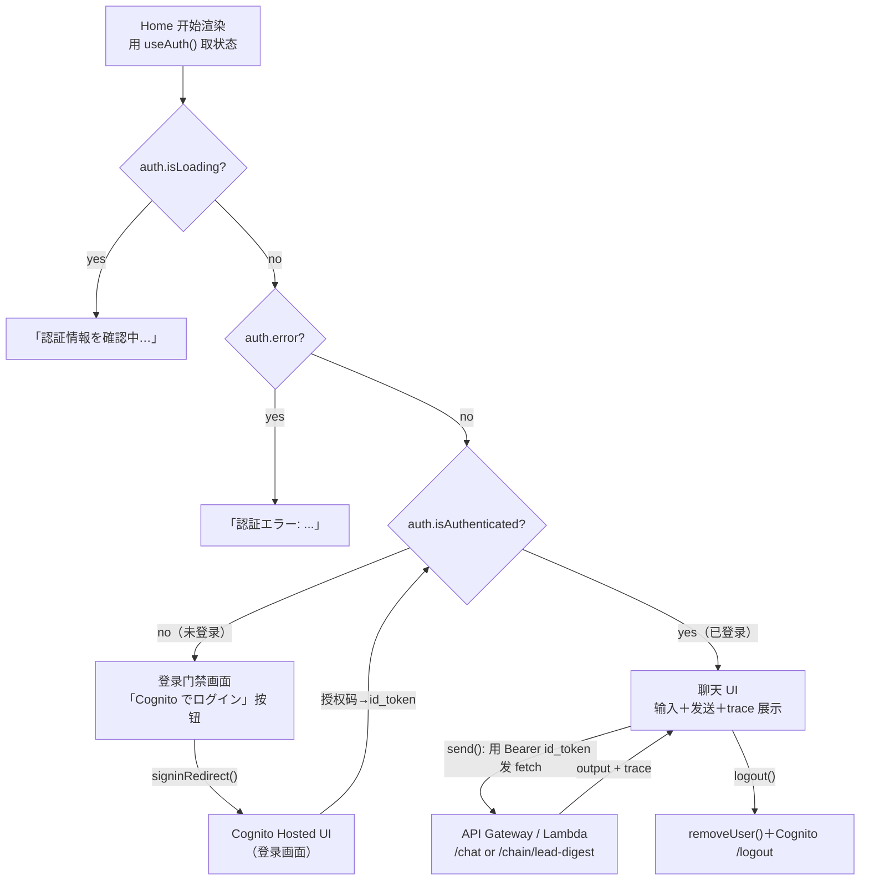
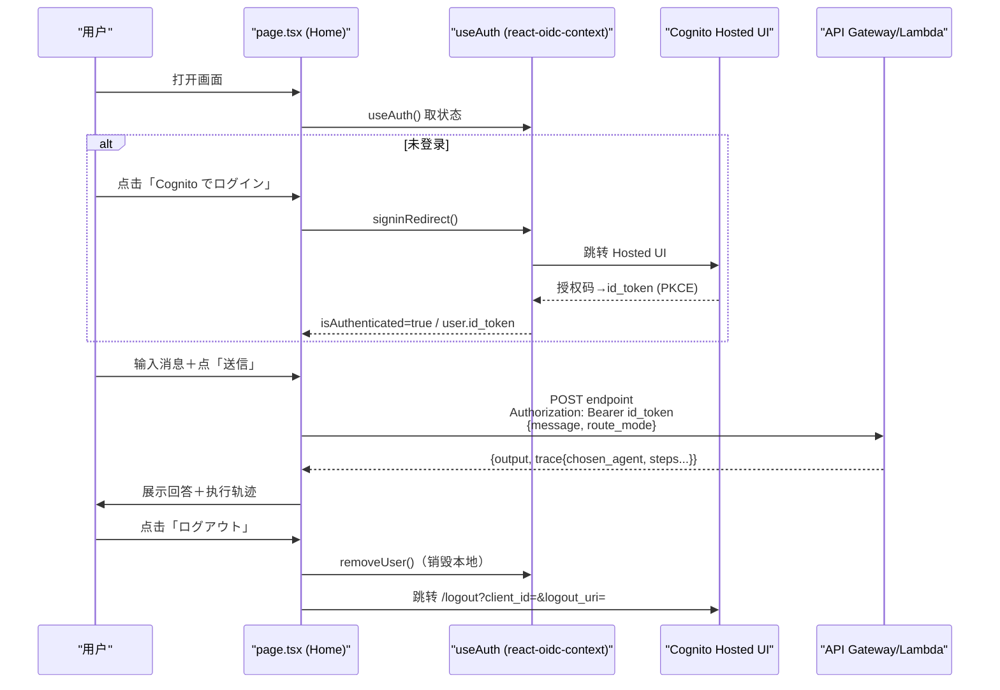

# 基本设计书（代码解说版）
## `frontend/app/page.tsx` — 首页（登录门禁＋聊天 UI）

> 本书面向初学者，用图和表解说「这个文件以什么为输入、输出什么、被谁调用、内部如何运作、与哪些组件相互调用」。专业术语在 §7 术语表中附中文注释。

---

## 0. 文档信息

| 项目 | 内容 |
|---|---|
| 对象文件 | `frontend/app/page.tsx` |
| 作用（一句话） | 应用唯一的画面。一屏内承担**登录门禁**（未登录则跳转 Cognito）与登录后的**聊天 UI**（发送消息·展示回答·展示执行轨迹·登出） |
| 所在层 | 前端·页面层（`app/` 的根路由 `/`） |
| 公开要素 | `Home`（default export 函数组件）。辅助有 `Center`（内部组件）及各 inline style 常量 |
| 依赖（import）项 | `react.useState`／`react-oidc-context.useAuth`／`@/lib/oidc.{API_URL, COGNITO_DOMAIN, cognitoAuthConfig}` |
| 直接调用方 | Next.js App Router（作为 `/` 路由的页面自动渲染。实际是按 `Providers`→`Home` 的顺序包裹） |
| 组件类型 | **Client Component**（带 `"use client"`） |

---

## 1. 概述

`page.tsx` 是这个应用的**全部 UI**。画面根据 `useAuth()` 返回的登录状态分三段分支，登录后调用后端 API 并展示结果：

1. **登录门禁** — `auth.isLoading`（确认中）→「認証情報を確認中…」、`auth.error`→错误文、`!auth.isAuthenticated`（未登录）→「Cognito でログイン」按钮（按下后用 `signinRedirect()` 跳转 Hosted UI）。
2. **聊天输入 UI** — 登录后显示文本输入＋「路由方式(rule/llm)」「端点(/chat 或 /chain/lead-digest)」选择＋发送按钮。
3. **发送与结果展示** — 用 `send()` 把 `id_token` 加到 `Bearer` 上调用 API `fetch`，绘制 `output`（回答）和 `trace`（执行轨迹：所选 agent·各步骤处理耗时·成败）。`logout()` 销毁本地会话＋Cognito 登出。

> 💡 **设计意图**：这个页面**不持有业务逻辑**。「哪个 agent·如何处理」全由后端（Orchestrator）决定，这里只做 *把输入发出去、把结果和 trace 展示出来的一扇薄窗*。
>
> 💡 **核心一行**：`Authorization: \`Bearer ${idToken}\``。**发的是 id_token 而非 access_token**（理由见 §4.3 注意点）。

---

## 2. 系统内的位置（画面流转＋数据流）

`page.tsx`（`Home`）是依据「登录状态」这一唯一真相切换画面的状态机。在登录→Cognito Hosted UI→id_token→API 流程中的画面流转：

- **IN（输入侧）**：`Providers` 供给的认证上下文（经由 `useAuth()`）。用户的文本输入·选择操作。
- **OUT（输出侧）**：未登录时用 `auth.signinRedirect()` 跳转 Cognito。登录后用 `fetch(API_URL+endpoint)` 调后端。登出时跳转 Cognito 的 `/logout`。

---

## 3. 组件·函数一览

| 要素 | 类型 | IN（主要输入） | OUT（返回值/效果） | 用途概要 |
|---|---|---|---|---|
| `Home` | 函数组件（default export） | 无（用 `useAuth()` 取状态） | `JSX`（3 分支画面） | 整个画面。登录门禁＋聊天 UI |
| `send` | 异步函数（内部） | `message`,`routeMode`,`endpoint`,`idToken`（state/变量） | 副作用（更新 `answer`/`trace`/`error`） | 调 API 取结果和 trace |
| `logout` | 同步函数（内部） | `cognitoAuthConfig`,`COGNITO_DOMAIN` | 副作用（画面跳转） | 销毁本地会话＋Cognito 登出 |
| `Center` | 函数组件（内部） | `{ children }` | `JSX`（居中框） | 加载/错误/登录门禁的共通框 |
| `Trace`（类型） | 类型别名 | — | — | API 的 `trace` 的形状（route_mode/chosen_agent/total_ms/steps） |

---

## 4. 组件/函数详细设计

### 4.1 `Home`（画面本体, 行14～144）⭐

- **作用**：依据 `useAuth()` 的登录状态把画面分三段分支，登录后绘制聊天 UI。一手承担应用的全部 UI。
- **props·state·参数（IN）**：无（不取 props。状态来自 `useAuth()` 与内部 state）
- **state（用 `useState` 保持的状态）**

| state 名 | 类型 | 初始值 | 含义 |
|---|---|---|---|
| `message` | `string` | `"東京のIT顧客を出して"` | 输入文本（发给 API 的正文） |
| `routeMode` | `"rule" \| "llm"` | `"rule"` | 路由方式（规则打分／LLM 意图分类） |
| `endpoint` | `"/chat" \| "/chain/lead-digest"` | `"/chat"` | 调的 API（单一 agent／链式） |
| `loading` | `boolean` | `false` | 发送中标志（禁用按钮·显示「実行中…」） |
| `answer` | `string` | `""` | API 的 `output`（回答文本） |
| `trace` | `Trace \| null` | `null` | 执行轨迹（所选 agent·各步骤处理耗时） |
| `error` | `string` | `""` | 错误消息 |

- **其他引用**：`auth = useAuth()`（react-oidc-context 的认证状态）、`idToken = auth.user?.id_token`（登录后取出）
- **渲染或返回**（自上而下评估的分支）：
  1. `auth.isLoading` → `
認証情報を確認中…
`
  2. `auth.error` → `
認証エラー: {auth.error.message}
`
  3. `!auth.isAuthenticated` → 登录门禁（标题＋「Cognito でログイン」按钮 `onClick={() => auth.signinRedirect()}`）
  4. 已登录 → 头部（邮箱＋登出）＋输入卡片（textarea / routeMode·endpoint 的 select / 发送按钮）＋（若有）错误／回答／轨迹
- **调用处（被谁使用）**：Next.js App Router 作为 `/` 的页面渲染。实体上按 `layout.tsx`→`Providers`→`Home` 的嵌套被调用。
- **调用谁**：`useAuth()`（取状态·`signinRedirect`·`removeUser`）／`send`／`logout`／`Center`／`fetch`（在 `send` 内）。
- **处理逻辑（分步编号）**：
  1. 用 `useAuth()` 取得认证状态，用 `useState` 准备各 UI state
  2. **守卫分支**：按 `isLoading`→`error`→`!isAuthenticated` 的顺序提前 return（未登录则以 Cognito 登录引导收尾）
  3. 已登录则取出 `idToken = auth.user?.id_token`
  4. 绘制输入表单，发送时调 `send()`，登出时调 `logout()`
  5. 若有 `answer`·`trace` 则绘制结果卡片和轨迹列表（逐步骤按 `status` 着色·`elapsed_ms`·`error`·`detail`）
- **注意点**：
  - 分支用**提前 return**实现「只要没登录就绝不绘制聊天 UI」＝彻底执行登录门禁。
  - `idToken` 取自 `auth.user?.id_token`（可选链）。万一 user 为空也不会崩溃。

---

### 4.2 `send`（API 调用, 行44～67）⭐

- **作用**：对当前选中的 `endpoint`，把 `id_token` 加到 `Bearer` 上 POST `message`/`route_mode`，并把 `output` 和 `trace` 反映到 state。
- **props·state·参数（IN）**：无显式参数。通过闭包引用 `message`·`routeMode`·`endpoint`·`idToken`·`API_URL`。
- **渲染或返回**：无（`async`，靠副作用更新 state）
- **调用处（被谁使用）**：发送按钮的 `onClick={send}`（`Home` 内, 行113）。
- **调用谁**：
  - `fetch(\`${API_URL}${endpoint}\`, {...})`（后端 API）
  - `setLoading`/`setError`/`setAnswer`/`setTrace`（更新 state）
  - `res.json()`／`res.text()`（解析响应）
- **处理逻辑（分步编号）**：
  1. 设 `setLoading(true)`，并初始化 `error`/`answer`/`trace`（清掉上次结果）
  2. 用 `fetch` 发 `POST`：
     - headers：`Content-Type: application/json` ＋ `Authorization: Bearer ${idToken}`
     - body：`JSON.stringify({ message, route_mode: routeMode })`
  3. 若 `!res.ok` 则抛出 `API <status>: <正文>` 的 Error
  4. 成功时从 `res.json()` 取 `data.output` 设入 `answer`，`data.trace` 设入 `trace`（无则空/`null`）
  5. 用 `catch` 把错误消息存入 `error`
  6. 用 `finally` 必定 `setLoading(false)`（成功·失败都解除加载）
- **注意点**：
  - **`Authorization: Bearer ${idToken}`** ＝ **用 id_token 而非 access_token**。后端的 JWT 校验要求 `aud`（受众）为 **app client_id**。在 Cognito 中 `id_token` 的 `aud` 是 client_id，而 `access_token` 没有 `aud`（改用 `client_id`/`scope`），校验条件不同，所以本实现发送 **`aud=client_id` 一致的 id_token**。
  - 用 `try/catch/finally` 兜住网络失败，UI 不会卡死（必定解除加载）。

---

### 4.3 `logout`（登出, 行69～75）

- **作用**：销毁 `react-oidc-context` 的本地会话，接着跳转 Cognito Hosted UI 的 `/logout`，把**服务端会话也一并切断**。
- **props·state·参数（IN）**：无（引用 `cognitoAuthConfig`·`COGNITO_DOMAIN`）
- **渲染或返回**：无（画面跳转的副作用）
- **调用处（被谁使用）**：头部的登出按钮 `onClick={logout}`（`Home` 内, 行83）。
- **调用谁**：`auth.removeUser()`／`encodeURIComponent`／`window.location.href`（跳转 Cognito `/logout`）
- **处理逻辑（分步编号）**：
  1. 用 `auth.removeUser()` 清掉本地（浏览器端）的认证会话
  2. 用 `encodeURIComponent` 对 `redirect_uri` 编码
  3. 用 `window.location.href` 跳转 `https://${COGNITO_DOMAIN}/logout?client_id=...&logout_uri=...`
- **注意点**：**只清本地、Cognito 侧会话仍在**的话，再次登录会直接放行。所以一路踏到 Hosted UI 的 `/logout` 把两侧都确实切断。`logout_uri` 必须已在 Cognito 侧登记为允许（与 CDK 的允许 URL 设置对应）。

---

### 4.4 `Center` / `Trace` 类型 / inline style 常量

#### `Center`（居中框组件, 行188～205）
- **作用**：把加载·错误·登录门禁在画面正中纵向排列展示的共通框。
- **props（IN）**：`children: React.ReactNode`
- **返回值**：`minHeight:100vh` 的弹性居中 `
`。
- **调用处**：`Home` 的三处提前 return（行25/26/31）。

#### `Trace`（类型别名, 行7～12）
- **作用**：用类型固定 API 返回的 `trace` 形状（`route_mode`/`chosen_agent`/`total_ms`/`steps[]`）。`steps` 含 `step`/`status`/`elapsed_ms`/`detail`/`error`。
- **用处**：`useState<Trace | null>` 的类型、轨迹绘制时的补全与类型安全。

#### inline style 常量（`card`/`label`/`pre`/`textarea`/`select`/`btnPrimary`/`btnGhost`, 行147～186）
- **作用**：用 `React.CSSProperties` 常量定义深色主题 UI 各部件外观。
- **注意点**：如注释所述**不用 Tailwind CDN**（规避预览卡死）。全部用 inline 完成。

---

## 5. 认证+API 调用流程（时序图）

从登录到发送·展示轨迹·登出，以 `page.tsx` 为中心的过程：

---

## 6. 相互引用表

| 本文件的要素 | 调用处（调用方） | 调用谁（依赖） |
|---|---|---|
| `Home` | App Router（`/`，实体为 `layout`→`Providers`→`Home`） | `useAuth()`, `send`, `logout`, `Center`, `fetch` |
| `send` | 发送按钮 `onClick`（`Home`:113） | `fetch(API_URL+endpoint)`, `setLoading/Error/Answer/Trace` |
| `logout` | 登出按钮 `onClick`（`Home`:83） | `auth.removeUser()`, `window.location.href`（Cognito `/logout`） |
| `Center` | `Home` 的提前 return（`:25,26,31`） | — |
| `Trace`（类型） | `useState<Trace\|null>`, 轨迹绘制 | — |

> 相关文件：`lib/oidc.ts`（`API_URL`/`COGNITO_DOMAIN`/`cognitoAuthConfig` 的定义源）／`providers.tsx`（`useAuth()` 的供给源 `AuthProvider`）／`layout.tsx`（包裹本页面的外壳）／后端 `orchestrator.py`（返回 `output`/`trace` 的本体）

---

## 7. 术语表

| 术语（日/英） | 中文注释 |
|---|---|
| `"use client"` | Next.js 指令，标记客户端组件。本文件用 `useState`/`fetch`/`window`，**必须**加 |
| Client Component | **客户端组件**。浏览器运行，可用 state、事件、`window`、`fetch` |
| ログインゲート / login gate | **登录门禁**。未登录时只显示登录入口，绝不渲染受保护的聊天 UI（早期 return 实现） |
| `useAuth()` | react-oidc-context 的 Hook，返回 `isLoading`/`error`/`isAuthenticated`/`user`/`signinRedirect`/`removeUser` |
| `signinRedirect()` | 触发**跳转到 Cognito Hosted UI** 登录页（授权码模式起点） |
| Cognito Hosted UI | AWS Cognito **托管登录页**。登录界面由 Cognito 提供，前端不自建 |
| Authorization Code Grant | **授权码模式**。先拿一次性 `code`，再换 token，比直接给 token 安全 |
| PKCE | 授权码模式增强，SPA 防授权码被劫持滥用的必备机制 |
| id_token | OIDC **身份令牌**，`aud=client_id`。本应用用它作 `Bearer` 调 API（后端按 client_id 校验 aud） |
| access_token | OAuth2 **访问令牌**，Cognito 中其 `aud` 与 id_token 不同（用 `client_id`/`scope`）。本应用**不用它**作 Bearer |
| Bearer | HTTP `Authorization: Bearer <token>` 的承载式令牌方案，把 token 放在请求头 |
| JWKS | **JSON Web Key Set**，公钥集合。后端用它验证 JWT 签名（前端不直接接触，但属同一认证链） |
| ルーティング / route_mode | **路由方式**。`rule`(规则打分) 或 `llm`(意图分类)，决定后端选哪个 agent |
| トレース / trace | **执行轨迹**。后端返回的 `chosen_agent`/各步骤 `elapsed_ms`/`status`，前端可视化展示 |
| エンドポイント / endpoint | API 路径。`/chat`(单 agent) 或 `/chain/lead-digest`(DataQuery→Summary 链式) |
| オプショナルチェーン / `?.` | **可选链**。`auth.user?.id_token`，user 为空时返回 `undefined` 而不报错 |
| `fetch` | 浏览器原生 HTTP 请求 API，用于把消息 POST 给后端 |

---

> **将此模板套用到其他文件时**：§0～§7 的框架原样保留，把 §4 的「作用/props·state/渲染或返回/调用处/调用谁/处理逻辑/注意点」逐项套到各要素上填写即可。
