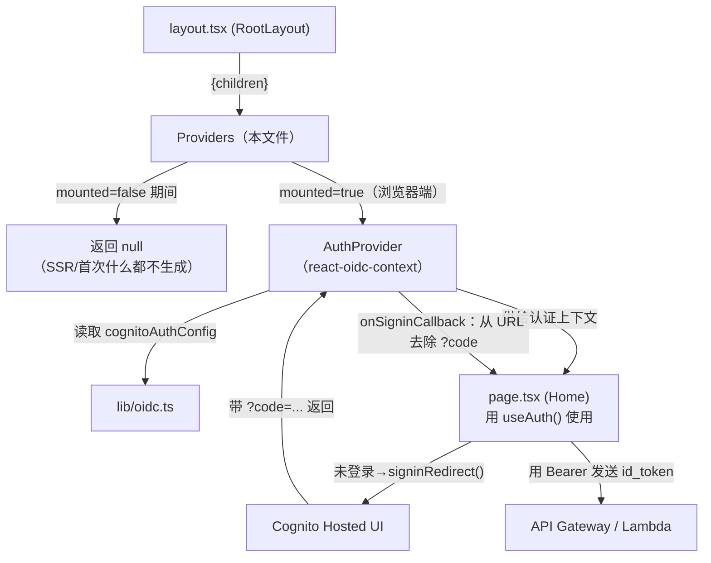
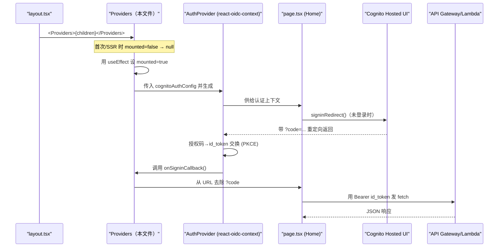

# 基本设计书（代码解说版）
## `frontend/app/providers.tsx` — 认证上下文供给层

> 本书面向初学者，用图和表解说「这个文件以什么为输入、输出什么、被谁调用、内部如何运作、与哪些组件相互调用」。专业术语在 §7 术语表中附中文注释。

---

## 0. 文档信息

| 项目 | 内容 |
|---|---|
| 对象文件 | `frontend/app/providers.tsx` |
| 作用（一句话） | 用 `react-oidc-context` 的 `AuthProvider` 包裹全屏，**供给认证上下文（登录状态·token）**。它是「只在挂载后才生成」以避免 SSR 崩溃的守门人 |
| 所在层 | 前端·认证上下文层（`app/`） |
| 公开要素 | `Providers`（named export 函数组件） |
| 依赖（import）项 | `react.useEffect,useState`／`react-oidc-context.AuthProvider`／`@/lib/oidc.cognitoAuthConfig` |
| 直接调用方 | `app/layout.tsx`（在 `RootLayout` 内 `<Providers>{children}</Providers>`） |
| 组件类型 | **Client Component**（带 `"use client"`） |

---

## 1. 概述

`providers.tsx` 是让登录状态和 token 能被所有页面使用的「认证供给口」。具体只做两件事：

1. **供给 AuthProvider** — 给 `react-oidc-context` 的 `<AuthProvider>` 传入 Cognito 配置（`cognitoAuthConfig`），并包裹 `{children}`（所有页面）。这样各页面就能用 `useAuth()` 取得认证状态。
2. **SSR 安全化（mounted 守卫）** — `oidc-client-ts` 内部会触碰 `localStorage`/`window`。在 SSR/预渲染时生成 `AuthProvider` 会因「`window is not defined`」而崩溃。于是**只在挂载后（＝浏览器端）才**生成 `AuthProvider`。

> 💡 **设计意图**：认证的「配置值」（authority/client_id 等）集中在 `lib/oidc.ts`，这里只负责「**何时·在哪里**立起 AuthProvider」这一 *时机与位置*。把配置与时机的职责分离开。
>
> 💡 **`onSigninCallback`**：把登录后附在 URL 上的 `?code=...&state=...`（授权码）用 `history.replaceState` 抹掉，让地址栏变干净。

---

## 2. 系统内的位置（画面流转＋数据流）

`Providers` 是「被 layout 调用」「向下供给 AuthProvider→各页面」的中间层。在整体认证流程（登录→Cognito Hosted UI→id_token→API）中的位置：

- **IN（输入侧）**：`layout.tsx` 的 `RootLayout` 以 `<Providers>{children}</Providers>` 形式调用。
- **OUT（输出侧）**：挂载后立起 `<AuthProvider>`，并在其中绘制 `{children}`（各页面）。挂载前返回 `null`（＝什么都不绘制）。

---

## 3. 组件·函数一览

| 要素 | 类型 | IN（主要输入） | OUT（返回值/效果） | 用途概要 |
|---|---|---|---|---|
| `Providers` | 函数组件 | `{ children }` | `JSX`（`AuthProvider` or `null`） | 把认证上下文供给全屏 |
| `useState(mounted)` | Hook | 初始值 `false` | `[mounted, setMounted]` | 「是否已落地到浏览器」的标志 |
| `useEffect(()=>setMounted(true))` | Hook | 依赖数组 `[]` | （副作用） | 挂载后把 `mounted` 设为 `true` |
| `onSigninCallback` | 回调 | （登录返回时被调用） | 去除 URL 上的 `?code` | 让地址栏变干净 |

---

## 4. 组件/函数详细设计

### 4.1 `Providers`（认证上下文供给组件, 行15～30）⭐

- **作用**：给 `react-oidc-context` 的 `AuthProvider` 传入 Cognito 配置并包裹所有页面，让各页面能用 `useAuth()` 取得认证状态。**但在 SSR 时不生成，仅挂载后才生成**。
- **props·state·参数（IN）**

| props 名 | 类型 | 含义 |
|---|---|---|
| `children` | `React.ReactNode` | 用认证上下文包裹的对象（＝各页面，经由 layout 传入） |

- **state**

| state 名 | 类型 | 初始值 | 含义 |
|---|---|---|---|
| `mounted` | `boolean` | `false` | 组件是否已在浏览器上挂载。`false` 期间不创建 `AuthProvider` |

- **渲染或返回**：
  - `mounted === false`（SSR／首次渲染）→ 返回 `null`（什么都不绘制）
  - `mounted === true`（在浏览器挂载后）→ `<AuthProvider {...cognitoAuthConfig} onSigninCallback={...}>{children}</AuthProvider>`
- **调用处（被谁使用）**：`app/layout.tsx` 的 `RootLayout`（`<Providers>{children}</Providers>`）。
- **调用谁**：
  - `useState`／`useEffect`（React Hooks）
  - `AuthProvider`（`react-oidc-context`）
  - `cognitoAuthConfig`（`@/lib/oidc`）… 通过 spread 传入 authority/client_id/redirect_uri/response_type/scope
  - `window.history.replaceState` / `document.title` / `window.location.pathname`（`onSigninCallback` 内）
- **处理逻辑（分步编号）**：
  1. 用 `useState(false)` 准备 `mounted`
  2. 用 `useEffect(() => setMounted(true), [])`，**在挂载完成后仅一次**把 `mounted` 设为 `true`（依赖数组 `[]` = 仅首次）
  3. `if (!mounted) return null;` ＝ SSR·首次渲染时还不创建 `AuthProvider`（**mounted 守卫**）
  4. 挂载后生成 `<AuthProvider>`，把 `cognitoAuthConfig` 用 spread 灌入，并包裹 `{children}`
  5. 给 `onSigninCallback` 传入「从 URL 抹掉 `?code=...`」的处理
- **注意点**：
  - **mounted 守卫是核心**。`oidc-client-ts`（`AuthProvider` 的内核）在生成时会读取 `localStorage`/`window`，所以在 SSR 时直接创建会因 `window is not defined` 崩溃。把生成延迟到挂载后＝确保身处浏览器的状态，即可规避。
  - `mounted=false` 期间返回 `null`，因此**服务器输出与浏览器首屏输出一致**，也避免了水合不一致（hydration mismatch）。
  - 这个文件直接触碰 `window`，因此**必为 Client Component**（必须加 `"use client"`）。

---

### 4.2 `onSigninCallback`（登录返回时的后处理, 行23～25）

- **作用**：从 Cognito Hosted UI 登录成功返回后，立即抹掉 URL 上的授权码（`?code=...&state=...`），把地址栏整理为首页 URL。
- **props·state·参数（IN）**：无（`AuthProvider` 在登录处理完成时自动调用的回调）
- **渲染或返回**：无（仅副作用）
- **调用处（被谁使用）**：`AuthProvider`（`react-oidc-context`）在处理完授权码后从内部调用。
- **调用谁**：`window.history.replaceState({}, document.title, window.location.pathname)`
- **处理逻辑（分步编号）**：
  1. 取得当前路径（`window.location.pathname`，不带查询串）
  2. 用 `history.replaceState` **替换**历史记录（不 push，所以不会污染后退按钮）
  3. 结果是地址栏上的 `?code=...` 被抹掉
- **注意点**：关键在于用 `replaceState` 而非 `pushState`（不在历史里留多余条目）。

---

## 5. 认证+API 调用流程（时序图）

包含 `Providers`「何时立起 AuthProvider」「登录返回时做什么」在内，从登录到 API 调用的全过程：

---

## 6. 相互引用表

| 本文件的要素 | 调用处（调用方） | 调用谁（依赖） |
|---|---|---|
| `Providers` | `layout.tsx` 的 `RootLayout` | `useState`, `useEffect`, `AuthProvider`, `cognitoAuthConfig`（`@/lib/oidc`） |
| `onSigninCallback` | `AuthProvider`（登录返回时从内部调用） | `window.history.replaceState`, `document.title`, `window.location.pathname` |

> 相关文件：`layout.tsx`（调用这个 `Providers` 的父级）／`lib/oidc.ts`（`cognitoAuthConfig` 的定义源）／`page.tsx`（用 `useAuth()` 接收这个 `AuthProvider` 的供给的子级）

---

## 7. 术语表

| 术语（日/英） | 中文注释 |
|---|---|
| `"use client"` | Next.js 指令，标记此文件为客户端组件。因要用 `window`/`useState`，本文件**必须**加 |
| Client Component | **客户端组件**。在浏览器运行，可用 `useState`/`useEffect`/`window`/`localStorage` |
| SSR（サーバーサイドレンダリング） | **服务端渲染**。HTML 先在服务器生成，此时**没有** `window`/`localStorage` |
| mounted ガード / mounted guard | **挂载守卫**。先返回 `null`，等组件在浏览器挂载后（`mounted=true`）再生成依赖浏览器 API 的部分 |
| ハイドレーション / hydration | **水合**。服务器 HTML 在浏览器被 React 激活。服务端与首屏输出不一致会报 hydration mismatch |
| OIDC（OpenID Connect） | 基于 OAuth2 的**身份认证**协议。Cognito 作为 OIDC Provider 颁发 id_token |
| react-oidc-context | React 的 OIDC 封装库，提供 `<AuthProvider>` 与 `useAuth()`，内部用 `oidc-client-ts` |
| `AuthProvider` | react-oidc-context 提供的上下文组件，把登录状态/token 共享给所有子组件 |
| `useAuth()` | react-oidc-context 的 Hook，子组件用它读取 `isAuthenticated`/`user`/`signinRedirect` 等 |
| Authorization Code Grant | **授权码模式**。先拿一次性 `code`，再用它换 token（比直接给 token 安全） |
| PKCE | **授权码模式的增强**（Proof Key for Code Exchange），防止授权码被截获滥用，SPA 必备 |
| 認可コード / authorization code | 登录成功后 URL 上的一次性 `?code=...`，用来换 id_token。换完应从地址栏清除 |
| `replaceState` | `history.replaceState`，**替换**当前历史记录（不新增），用于清掉 URL 上的 `?code` |
| Cognito Hosted UI | AWS Cognito **托管登录页面**。登录 UI 由 Cognito 提供，前端不自建 |
| id_token | OIDC 颁发的**身份令牌**（含用户身份信息）。本应用用它作 Bearer 调 API（aud=client_id） |

---

> **将此模板套用到其他文件时**：§0～§7 的框架原样保留，把 §4 的「作用/props·state/渲染或返回/调用处/调用谁/处理逻辑/注意点」逐项套到各要素上填写即可。
