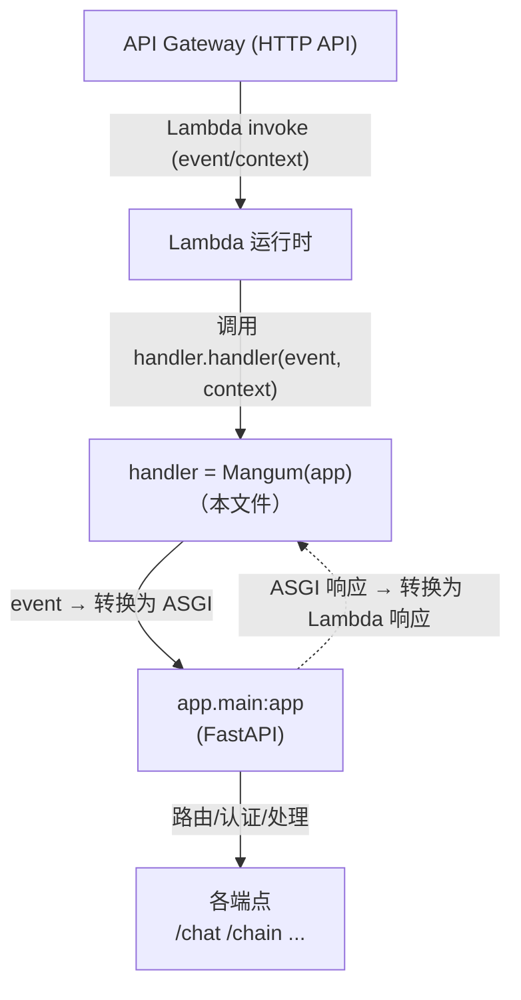
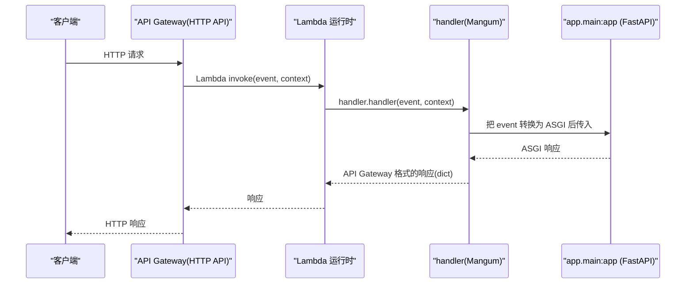

# 基本设计书（代码解说版）
## `backend/handler.py` — AWS Lambda 入口点（Mangum）

> 本书面向初学者，用图和表说明「这个文件以什么为输入、输出什么、被谁调用、内部如何运作、和哪些部件相互调用」。专业术语在 §7 术语表给出中文注释。

---

## 0. 文档信息

| 项目 | 内容 |
|---|---|
| 目标文件 | `backend/handler.py` |
| 作用（一句话） | **Lambda 的入口适配器**。用 `Mangum` 包裹既有的 FastAPI 应用(`app.main:app`)，把 API Gateway 的 event 转换为 ASGI，从而运行同一份 FastAPI 代码 |
| 所在层 | 部署边界（运行环境适配器） |
| 公开对象 | `handler`（`Mangum(app)` ＝ Lambda 调用的函数） |
| 依赖（import）对象 | `mangum.Mangum` / `app.main.app` |
| 直接调用方 | AWS Lambda 运行时（CDK 的 handler 设置 `handler.handler`） |

---

## 1. 概述（这个部件做什么）

`handler.py` 只有**三行的本质**。它只做 1 件事：

1. **把 FastAPI 翻译给 Lambda 用** — 用 `Mangum(app)`，让与本地 `uvicorn` 相同的 `app.main:app` **原样**在 Lambda 上运行。

> 💡 **设计意图**：「本地用 uvicorn、生产用 Lambda，**运行同一份 FastAPI 代码**」。用 `Mangum` 这层薄适配器吸收运行环境的差异（HTTP 服务器 vs 无服务器），把应用本体(`main.py`)保持为环境无关。应用逻辑一概不写在这里。

---

## 2. 系统内的位置（调用关系图）

`handler.py` 是夹在「AWS 入口」与「FastAPI 本体」之间的**最薄适配器**：

- **IN（输入侧）**：API Gateway → Lambda 运行时以 `(event, context)` 调用 `handler`。
- **OUT（输出侧）**：`Mangum` 把 `app`(FastAPI) 当作 ASGI 驱动，并把结果转回 Lambda/API Gateway 格式。

---

## 3. 速查表（公开对象一览）

| 名称 | 类别 | 内容 | 用途 |
|---|---|---|---|
| `handler` | 模块变量 | `Mangum(app)` | Lambda 调用的 handler 函数。CDK 设置 `handler.handler` 所指向的对象 |

> 「`handler.handler`」的含义：**文件名 `handler`(.py) 中的变量 `handler`**。在 CDK 的 Lambda 定义中指定这个字符串。

---

## 4. 方法详细设计

### 4.1 `handler`（Lambda handler, 行17）★

- **作用**：用 `Mangum` 包裹 FastAPI 应用 `app`，做成 Lambda 能直接调用的函数对象。
- **输入(IN)（Lambda 执行时传入）**

| 参数（Lambda 约定） | 类型 | 含义 |
|---|---|---|
| `event` | `dict` | 来自 API Gateway(HTTP API) 的 HTTP 请求信息（方法/路径/头/body 等） |
| `context` | `LambdaContext` | 执行上下文（剩余时间·request id 等。由 Mangum 处理） |

- **输出(OUT)**：API Gateway 格式的响应 `dict`（`statusCode` / `headers` / `body` 等）。由 `Mangum` 从 ASGI 响应自动生成。
- **调用处**：AWS Lambda 运行时（在 CDK 的 Lambda `handler` 属性设置 `handler.handler`）。HTTP 客户端的调用经由 API Gateway 抵达这里。
- **调用谁**：`app.main.app`（FastAPI）。`Mangum` 把 `event` 转换为 ASGI 的 scope/receive/send 传给 `app`，再把响应转回 Lambda 格式。
- **处理逻辑（分步）**：
  1. 用 `from app.main import app` 引入**已组装好的 FastAPI 应用**（含 `lifespan`/端点定义）
  2. 用 `handler = Mangum(app)` 做成 Lambda handler
  3. （运行时）Lambda 调用 `handler(event, context)` → Mangum 做 ASGI 转换 → FastAPI 处理 → 返回响应
- **注意点**：
  - **不增加逻辑**才是正解。认证·路由·CORS 已集中在 `main.py`/`security` 侧。
  - import 时会加载 `app.main`，但 `lifespan`(DB初始化/组装)是**在 ASGI 的启动事件中**执行（Mangum 会处理 lifespan）。
  - 生产中 CORS 假定由 API Gateway 侧添加（参见 `main.py`）。给 Lambda 传 `CORS_ALLOW_ORIGINS=""`。

---

## 5. 数据流（API Gateway → Lambda → FastAPI）

请求经由 Lambda 抵达 FastAPI 的过程：

---

## 6. 相互引用表（调用处与依赖一览）

| 本文件的定义 | 调用处 | 调用谁（依赖） |
|---|---|---|
| `handler`(=`Mangum(app)`) | AWS Lambda 运行时（CDK 设置 `handler.handler`）。HTTP 客户端→经由 API Gateway | `mangum.Mangum`、`app.main.app`(FastAPI) |

> 关联文件：`app/main.py`（被包裹的 FastAPI 本体）／（基础设施侧）CDK 的 Lambda 定义（指向 `handler.handler`）

---

## 7. 术语表

| 术语（日/英） | 中文注释 |
|---|---|
| AWS Lambda | **无服务器函数**。只在有请求时启动并计费的运行环境，无需管理服务器 |
| エントリポイント / entry point | **入口点**。运行环境最先调用的函数。Lambda 调用 `handler` |
| Mangum | 把 FastAPI 等 **ASGI 应用在 Lambda 上运行的适配器**。把 API Gateway 的 event 桥接到 ASGI |
| ASGI | **异步 Web 服务器规范**。FastAPI 所讲的语言。uvicorn(本地)/Mangum(Lambda) 用它驱动 app |
| API Gateway (HTTP API) | AWS 的 **API 入口服务**。接收 HTTP 并调用 Lambda。CORS/认证也可在这里添加 |
| event / context | 传给 Lambda 的 **请求信息** 与 **执行上下文**（剩余时间·id 等） |
| `handler.handler` | CDK 的 Lambda 设置值。指向 **`handler.py` 中的变量 `handler`**（文件名.变量名） |
| アダプタ / adapter | **适配器**。在不同约定之间做转换的薄层。这里连接 Lambda↔FastAPI |
| uvicorn | 本地开发中运行 FastAPI 的 **ASGI 服务器**。与生产的 Mangum 成对 |
| サーバレス / serverless | **无服务器**。不持有常驻服务器，仅在请求时启动的运行模型 |

---

> **将本模板套用到其他文件时**：§0〜§7 的框架照用，§4 的「作用/IN/OUT/调用处/调用谁/逻辑/注意点」逐个套到各定义上填写。
