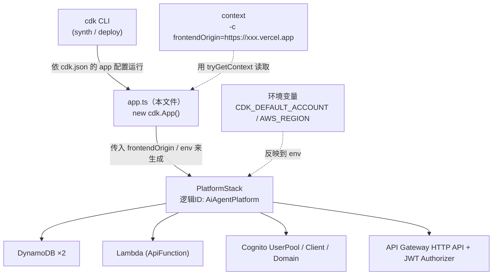
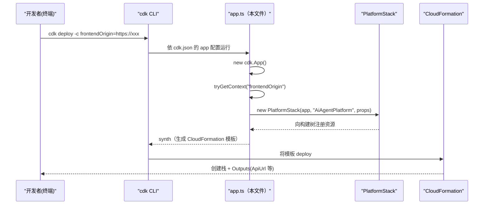

# 基本设计书（代码解说版）
## `infra/bin/app.ts` — CDK 应用的入口点

> 本书面向初学者，用图和表解说「这个文件以什么为输入、输出什么、从哪里被调用、内部如何运作、生成哪些资源」。专业术语在 §7 术语表附中文注释。

---

## 0. 文档信息

| 项目 | 内容 |
|---|---|
| 对象文件 | `infra/bin/app.ts` |
| 作用（一句话） | CDK 应用的**入口**。从 context 读取 `frontendOrigin`，只实例化一个 `PlatformStack`，并决定其部署目标（account/region） |
| 层 | IaC（基础设施定义）／CDK 应用层 |
| 类别 | CDK App 入口脚本（`bin/`） |
| 生成的 Stack | `PlatformStack`（逻辑 ID `"AiAgentPlatform"`） |
| 依赖（import）方 | `aws-cdk-lib`（`cdk.App`）／`../lib/platform-stack`（`PlatformStack`）／`source-map-support/register` |
| 直接的调用方 | `cdk` CLI（执行 `cdk synth` / `cdk deploy` 时，依据 `cdk.json` 的 `app` 配置运行本文件） |

---

## 1. 概述（这个部件做什么）

`app.ts` 是 CDK 应用的**最顶层入口**。它只做 3 件事，完全不持有资源的内容（内容全在 `PlatformStack` 一侧）。

1. **生成 App 对象** — `new cdk.App()`。创建 CDK 构建树的根（root）。
2. **读取 context** — 用 `app.node.tryGetContext("frontendOrigin")` 读取部署时传入的前端生产来源（Vercel 的 URL）。未指定时以 `http://localhost:3000` 作为默认值。
3. **生成 Stack** — 生成 1 个 `PlatformStack`，并传入 `frontendOrigin`、部署目标（`account`/`region`）、说明文字。

> 💡 **设计意图**：入口保持为只决定「**在哪里、用什么名字、用哪些参数**放置栈」的薄层。资源定义集中在 `lib/platform-stack.ts`，分离职责。这是 CDK 的惯例（`bin/` 负责接线，`lib/` 是本体）。

---

## 2. 系统内的位置（栈构成图）

`app.ts` 由 CLI 启动，生成 `PlatformStack`，其下挂载全部 AWS 资源的关系：



- **IN（进来的一侧）**：`cdk` CLI 依据 `cdk.json` 的 `app` 配置（`npx ts-node bin/app.ts` 等）运行本文件。`-c frontendOrigin=...` 的 context 和环境变量是输入。
- **OUT（出去的一侧）**：生成 1 个 `PlatformStack`。栈的实体（CloudFormation 模板）由 `cdk synth` 合成。

---

## 3. 定义资源一览（速查表）

本文件只定义「App 和 Stack 各 1 个」。

| 要素 | 类别 | 值·表达式 | 用途 |
|---|---|---|---|
| `app` | `cdk.App` | `new cdk.App()` | CDK 构建树的根 |
| `frontendOrigin` | `string` | `tryGetContext("frontendOrigin") ?? "http://localhost:3000"` | 用于 CORS / Cognito 回调 URL 的生产来源 |
| `PlatformStack` | Stack 实例 | 逻辑 ID `"AiAgentPlatform"` | 内含全部 AWS 资源的单一栈 |
| `env.account` | 部署目标设置 | `process.env.CDK_DEFAULT_ACCOUNT` | 部署目标 AWS 账号 |
| `env.region` | 部署目标设置 | `AWS_REGION ?? CDK_DEFAULT_REGION ?? "ap-northeast-1"` | 部署目标区域（默认东京） |
| `description` | 栈说明 | `"AIエージェント統合プラットフォーム (mini) — ..."` | CloudFormation 上的说明文字 |

---

## 4. 资源定义详细

### 4.1 `import` 群（行1〜4）

- **作用**：加载运行所需的模块。
- **详细**

| import | 目的 |
|---|---|
| `"source-map-support/register"` | 让 TypeScript 的堆栈跟踪能按 `.ts` 的行号显示（调试辅助。是副作用 import，所以不取名） |
| `* as cdk from "aws-cdk-lib"` | CDK 本体。用到 `cdk.App` |
| `{ PlatformStack } from "../lib/platform-stack"` | 本体栈类。资源定义全在其中 |

- **注意点**：`#!/usr/bin/env node`（行1 的 shebang）是让构建后的 JS 能直接执行的声明。ts-node 运行时不受影响。

---

### 4.2 `app`（生成 CDK App, 行6）

- **作用**：创建 CDK 构建树的根。所有 Construct 都置于这个 `app` 之下。
- **代码**：`const app = new cdk.App();`
- **IN**：无（隐式读取 `cdk.json` / `--context` / 环境变量）
- **OUT**：`cdk.App` 实例
- **注意点**：App 每个应用只有 1 个。这里也可挂载多个 Stack，但本项目是单栈构成。

---

### 4.3 `frontendOrigin`（读取 context, 行10〜11）

- **作用**：决定前端（Vercel）的生产来源。是用于 CORS 许可和 Cognito 回调/登出 URL 的重要参数。
- **代码**

```ts
const frontendOrigin =
  app.node.tryGetContext("frontendOrigin") || "http://localhost:3000";
```

- **IN（输入）**：CLI 的 `-c frontendOrigin=https://xxx.vercel.app`（context）
- **OUT（输出）**：`string`。未指定时为 `http://localhost:3000`（首次部署用的临时值）
- **处理逻辑**：
  1. 用 `tryGetContext("frontendOrigin")` 取 context（没有则 `undefined`）
  2. 用 `||`，若为 `undefined`/空字符串则以 `http://localhost:3000` 作为默认
- **注意点（运维流程）**：Vercel 的 URL **首次未知**。因此先以 localhost 原样 deploy，待 Vercel 部署后再用
  `cdk deploy -c frontendOrigin=https://xxx.vercel.app` **重新部署**以反映生产来源（注释行8〜9 的意图）。该值在 `PlatformStack` 内展开到 CORS 的 `allowOrigins` 与 Cognito 的 `callbackUrls`/`logoutUrls`。

---

### 4.4 生成 `PlatformStack`（行13〜20）⭐

- **作用**：生成内含全部资源的单一栈，并赋予部署目标与说明。
- **代码**

```ts
new PlatformStack(app, "AiAgentPlatform", {
  frontendOrigin,
  env: {
    account: process.env.CDK_DEFAULT_ACCOUNT,
    region: process.env.AWS_REGION || process.env.CDK_DEFAULT_REGION || "ap-northeast-1",
  },
  description: "AIエージェント統合プラットフォーム (mini) — Lambda+DynamoDB+Bedrock+Cognito",
});
```

- **IN（构造函数参数）**

| 参数 | 类型 | 含义 |
|---|---|---|
| `app` | `cdk.App` | 父作用域（本栈的放置处＝App 直下） |
| `"AiAgentPlatform"` | `string` | 栈的逻辑 ID（CloudFormation 栈名的来源） |
| `props.frontendOrigin` | `string` | 上面决定的前端生产来源 |
| `props.env.account` | `string \| undefined` | 部署目标账号（来自环境变量） |
| `props.env.region` | `string` | 部署目标区域 |
| `props.description` | `string` | 栈的说明文字 |

- **OUT**：`PlatformStack` 实例（不使用返回值，生成本身作为副作用注册进构建树）
- **处理逻辑（region 的决定顺序）**：
  1. 有 `process.env.AWS_REGION` 则用它（CLAUDE.md 方针：部署时 `export AWS_REGION=ap-northeast-1`）
  2. 没有则用 `CDK_DEFAULT_REGION`（profile 的默认区域）
  3. 再没有则用 `"ap-northeast-1"`（硬编码默认为东京）
- **注意点**：
  - `account` 只参照 `CDK_DEFAULT_ACCOUNT`（即使 `undefined`，CDK 也会从运行 profile 解析）。
  - region 默认为 **东京 `ap-northeast-1`**。因为 Bedrock 的 Claude haiku 推理配置档以东京为前提，这里若错位，就会与 `PlatformStack` 内的 inference-profile ARN（`jp.` 前缀）不一致。

---

## 5. 部署流程（本文件如何被执行）

从敲下 `cdk deploy` 到 AWS 上立起资源，`app.ts` 在何处运作：



> 前提（据 README 部署节）：Lambda 的 `code` 取入事先构建好的 `backend/build/`（由 `scripts/build_lambda.sh` 生成，无需 Docker）。`cdk deploy` 之前需先完成该构建。

---

## 6. 相互引用表（调用方·被调用方一览）

| 本文件的要素 | 调用方（调用处） | 被调用方（依赖） |
|---|---|---|
| 整个文件 | `cdk` CLI（`cdk.json` 的 `app`） | `cdk.App`, `PlatformStack` |
| `app` | — | `aws-cdk-lib` 的 `cdk.App` |
| `frontendOrigin` | 传给 `PlatformStack` 的构造函数参数 | `app.node.tryGetContext` |
| 生成 `PlatformStack` | — | `../lib/platform-stack` 的 `PlatformStack`（→ §`platform_stack.md`） |

> 关联文件：`lib/platform-stack.ts`（本体·全资源定义）／`cdk.json`（入口配置）／`backend/build/`（部署到 Lambda 的产物）／`backend/app/config.py`（传入 Lambda 的 env 的代码侧开关）。

---

## 7. 术语表

| 术语（日/英） | 中文注释 |
|---|---|
| IaC（Infrastructure as Code） | **基础设施即代码**。用代码声明基础设施构成，使其可再现。CDK 是其实现之一 |
| CDK（Cloud Development Kit） | AWS 的 IaC 工具。用 TypeScript 等代码定义 AWS 资源，并转换为 CloudFormation |
| App（cdk.App） | CDK 的**应用根节点**。所有 Construct/Stack 都挂载于此的构建树的根 |
| Stack（栈） | CloudFormation 的**栈**。作为一个整体被创建/更新/删除的 AWS 资源单位 |
| Construct（构建块） | CDK 的**构建块**。表示资源或部件的基本单位。App > Stack > Construct 层层嵌套 |
| context（上下文） | 部署时从外部传入的**上下文参数**。用 `-c key=value` 或 `cdk.json` 指定，用 `tryGetContext` 读取 |
| synth（合成） | 把 CDK 代码**转换为 CloudFormation 模板**的处理（`cdk synth`） |
| Outputs（输出） | 栈创建后输出的值（ApiUrl 等）。前端的 env 或 seed 脚本会用到 |
| frontendOrigin | 前端（Vercel）的**生产来源(origin)**。用于 CORS 许可和 Cognito 回调 URL |
| Origin（来源） | `scheme://host:port` 的组合。同源判定和浏览器 CORS 的基准 |
| source-map-support | 让运行时错误的堆栈跟踪按**原始 .ts 行号**显示的辅助库 |

---

> **将此模板套用到其他文件时**：§0〜§7 的框架原样使用，把 §4 的「作用/IN/OUT/调用方/被调用方/逻辑/注意点」套到各要素上逐一填写。本文件的本体是 `lib/platform-stack.ts`（→ `platform_stack.md`）。
