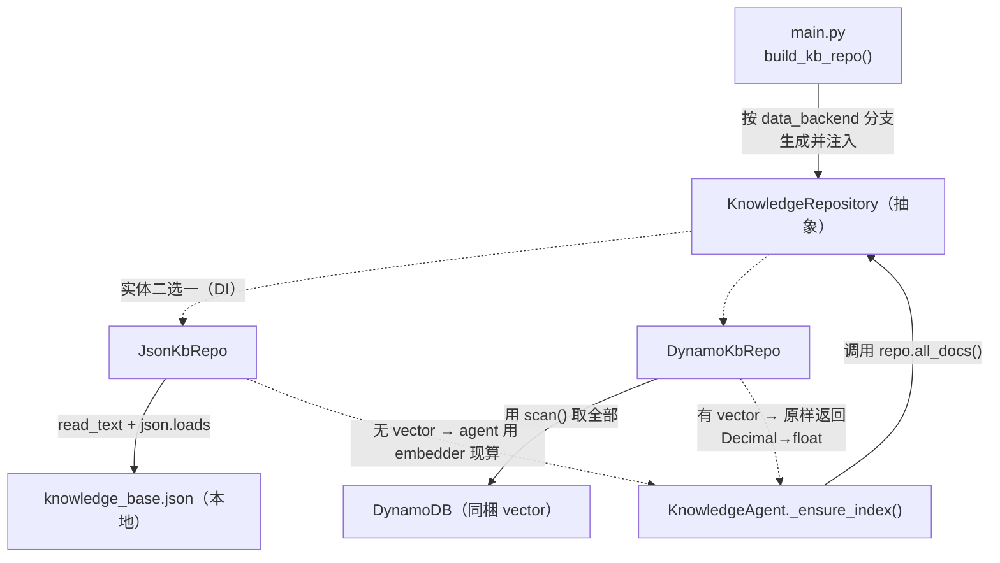
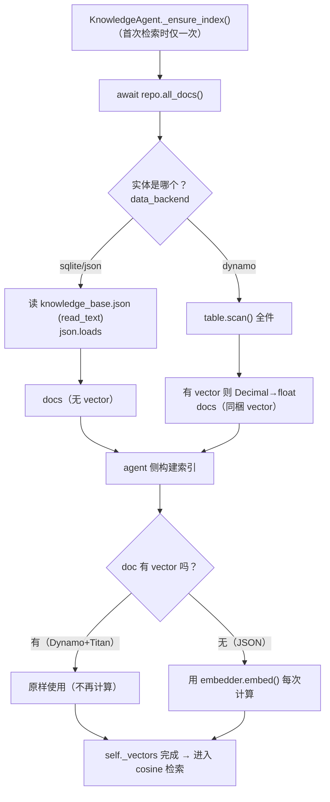

# 基本设计书（代码解说版）
## `backend/app/data/kb_repo.py` — FAQ 知识获取仓库层

> 本书面向初学者，用图和表解说「这个文件 · 以什么为输入 · 输出什么 · 被谁调用 · 内部如何运作 · 与哪些部件相互调用」。专业术语在 §7 术语表附中文注释。

---

## 0. 文档信息

| 项目 | 内容 |
|---|---|
| 对象文件 | `backend/app/data/kb_repo.py` |
| 作用（一句话） | 把 FAQ 知识文档的**获取抽象化**的层。使 `JSON文件`(本地) ↔ `DynamoDB`(生产) 可不改 `KnowledgeAgent` 地替换。生产版**同梱已保存的向量(vector)**返回，省去检索时的再向量化 |
| 所属层 | 数据层（`app/data`） |
| 公开类 | `KnowledgeRepository`（抽象）/ `JsonKbRepo` / `DynamoKbRepo` |
| 依赖（import）目标 | `json` / `pathlib.Path` / `abc`(ABC,abstractmethod) / 延迟 import：`boto3`、`asyncio` |
| 直接调用方 | `app/agents/knowledge_agent.py`（`self.repo.all_docs()`）／ `app/main.py`（用 `build_kb_repo()` 生成）／ `tests/test_smoke.py`（生成 `JsonKbRepo`） |

---

## 1. 概述（这个部件做什么）

`KnowledgeRepository`（仓库＝知识仓库/数据访问层）只为 `KnowledgeAgent`（简易 RAG）承担「**返回全部 FAQ 文档**」这一件事。具体做两件事：

1. **文档来源的抽象化** — 用同一个 `all_docs()` 方法名，**同时**提供 `JSON` 实现和 `DynamoDB` 实现。agent 只管「接收文档集合、做向量检索并回答」，不需要知道文档从哪来。
2. **向量同梱的差异吸收** — 生产(Dynamo)版返回 seed 时用 Titan 算好的 `vector`。本地(JSON)版没有 `vector`，所以由 agent 侧用 embedder 每次现算。

> 💡 **设计意图**：`KnowledgeAgent` 的本质是「文档集合 → 向量检索 → grounded 回答」。**文档来自 JSON 还是 Dynamo 并非本质**，于是分离到 Repository。agent 用「doc 有 `vector` 就用、没有就算」来**两边兼容**（`knowledge_agent.py:57`）。

> ⚡ **向量处理的差异（成本优化）**：
> - **JSON(本地)**：没有 `vector` → agent 用 embedder（HashingEmbedding 等）**每次现算**
> - **Dynamo(生产)**：seed 时用 Titan 算好的 `vector` **一起保存** → 不在每次检索时把全部文档重新向量化（**节省 Bedrock 调用**）

---

## 2. 系统内的位置（调用关系图）

`KnowledgeRepository`「被上层(agent/main)调用」「调用下层(文件/DynamoDB)」的关系：

- **IN（进来侧）**：`KnowledgeAgent._ensure_index()` 在首次检索时只调用一次 `await self.repo.all_docs()`。生成由 `main.py` 的 `build_kb_repo()` 看 `settings.data_backend` 分支。
- **OUT（出去侧）**：`JsonKbRepo` 读文件，`DynamoKbRepo` 经 `boto3` 对 `DynamoDB` 做 Scan。

---

## 3. 公开接口一览

| 名称 | 类别 | IN（主要输入） | OUT（返回值） | 大致用途 |
|---|---|---|---|---|
| `KnowledgeRepository.all_docs` | 异步(抽象) | （无） | `list[dict]` | 子类必须实现的契约（接口） |
| `JsonKbRepo.__init__` | 同步 | `kb_path` | （生成） | 保存 JSON 文件路径 |
| `JsonKbRepo.all_docs` | 异步 | （无） | `list[dict]` | 读 JSON 返回文档列表 |
| `DynamoKbRepo.__init__` | 同步 | `table_name, region` | （生成） | 保存 boto3 Table |
| `DynamoKbRepo.all_docs` | 异步 | （无） | `list[dict]` | 把同步 Scan 甩到别的线程的入口 |
| `DynamoKbRepo._scan_sync` | 同步(内部) | （无） | `list[dict]` | Scan＋vector 的 Decimal→float 整形 |

---

## 4. 方法详细设计

每个方法按「作用 / IN / OUT / 调用处（被谁调用）/ 调用谁（依赖）/ 处理逻辑 / 注意点」拆解。

### 4.1 `KnowledgeRepository.all_docs`（抽象方法, 行24〜27）

- **作用**：声明子类必须实现的**契约（接口）**。强制「返回全部 FAQ 文档。每个 dict 含 `id`/`title`/`text`（可选 `vector`）」这个形态。本身无实现体，抛 `NotImplementedError`。
- **输入(IN)**：无 ／ **输出(OUT)**：`list[dict]`（因是 `abstractmethod` 不能直接调用）
- **调用处（被谁调用，文件:行号）**：不被直接调用（抽象）。实体是 `JsonKbRepo` / `DynamoKbRepo`。agent 侧以 `KnowledgeRepository` 类型接收（`knowledge_agent.py:42` 的参数类型）。
- **注意点**：`@abstractmethod` 使**未实现的子类无法实例化**。与 `customer_repo` 的 `query(params)` 不同，`all_docs()` 是**无参数返回全部**的契约（因为 FAQ 小规模、设计上把全部载入内存做向量检索）。

---

### 4.2 `JsonKbRepo.all_docs`（JSON 文档获取, 行36〜37）

- **作用**：本地开发用。读 `knowledge_base.json`，转成文档列表（`list[dict]`）返回。
- **输入(IN)**：无 ／ **输出(OUT)**：`list[dict]`（每个 dict 含 `id`/`title`/`text`，**没有 `vector`**） ／ **异步(async)**
- **调用处（被谁调用，文件:行号）**：`KnowledgeAgent._ensure_index()` 内 `knowledge_agent.py:54`（`await self.repo.all_docs()`）。生成在 `main.py:71`（`build_kb_repo()`）与 `test_smoke.py:30`。
- **调用谁（依赖）**：`self.kb_path.read_text(encoding="utf-8")` / `json.loads()`
- **处理逻辑（分步）**：
  1. 用 UTF-8 读文件
  2. 用 `json.loads()` 转成列表返回（一行完成）
- **注意点**：因为没有 `vector`，由 agent 在 `_ensure_index()` 中**每次向量化**（走 `knowledge_agent.py:57` 的 `or await self.embedder.embed(...)` 分支）。虽是 `async` 但实际是文件同步读（demo 规模无妨。严格说有改成 `to_thread` 的余地）。

---

### 4.3 `DynamoKbRepo.__init__`（生产 DB 初始化, 行43〜46）

- **作用**：生产 AWS 用仓库的生成。用 `boto3` 保存 DynamoDB 的 Table 对象。
- **输入(IN)**

| 参数 | 类型 | 含义 |
|---|---|---|
| `table_name` | `str` | 知识表名（来自 CDK Outputs） |
| `region` | `str` | AWS 区域（东京 `ap-northeast-1` 等） |

- **输出(OUT)**：无（实例生成）
- **调用处（被谁调用，文件:行号）**：`main.py:70`（`build_kb_repo()` 仅当 `settings.data_backend == "dynamo"` 时生成）
- **调用谁（依赖）**：`boto3.resource("dynamodb", ...).Table(table_name)`
- **注意点**：把 `import boto3` 放在**方法内做延迟 import**。本地 echo / JSON 构成下希望不装、不调 boto3 也能跑。与 `customer_repo` 不同不需要 GSI（FAQ 全件 Scan 即可的小规模）。

---

### 4.4 `DynamoKbRepo.all_docs` / `_scan_sync`（DynamoDB 文档获取, 行48〜62）⭐

- **作用**：生产用。对 DynamoDB 做全表 Scan 返回全部 FAQ 文档。**有已保存的 `vector` 就一起返回**（Titan 向量同梱）。`all_docs()` 是异步入口，`_scan_sync()` 是本体。
- **输入(IN)**：无 ／ **输出(OUT)**：`list[dict]`（每个 dict 含 `id`/`title`/`text`，有时**带 `vector`**） ／ **异步(async)**
- **调用处（被谁调用，文件:行号）**：`KnowledgeAgent._ensure_index()` 内 `knowledge_agent.py:54`（与 `JsonKbRepo` **调用方式完全相同**）。`_scan_sync` 由 `all_docs()` 内 `kb_repo.py:51` 经 `asyncio.to_thread` 调用。
- **调用谁（依赖）**：`asyncio.to_thread(self._scan_sync)` / `self._table.scan()`
- **处理逻辑（分步）**：
  1. `all_docs()`：用 `asyncio.to_thread(self._scan_sync)` 把**阻塞的 Scan 甩到别的线程**（不卡事件循环）
  2. `_scan_sync()`：用 `self._table.scan().get("Items", [])` 取全部
  3. 从每个 Item 取出 `id`/`title`/`text` 做出 `doc`
  4. **若 `"vector" in it`** 则用 `[float(x) for x in it["vector"]]` 把 **Decimal 列表转成 float**，存进 `doc["vector"]`
  5. 返回 `docs` 列表
- **注意点**：
  - **vector 同梱是关键**：有它的文档，agent 侧**无需再向量化**直接用（`knowledge_agent.py:57` 优先取 `d.get("vector")`）→ 削减 Bedrock 调用。
  - **必须 Decimal→float 转换**：DynamoDB 数值以 `Decimal` 返回，传给 cosine 相似度计算（`knowledge_agent.py:27` 的 `_cosine`）前需 `float` 化。
  - **Scan 取全件**：以 FAQ 小规模为前提。文档变多则需要 Query/分页设计（现状是取舍）。
  - `id` 是 `it["id"]`（必需键），`title`/`text` 用 `.get(..., "")`（允许缺失）。

---

## 5. 数据流（KnowledgeAgent 首次检索时的文档加载）

`KnowledgeAgent._ensure_index()` 载入文档的流程（JSON 版与 Dynamo 版的分支，尤其 vector 有无）：

---

## 6. 相互引用表

把「从哪来、到哪去」汇成一表。可作为代码追踪的地图使用。

| 本文件的名称 | 调用处（被谁调用） | 调用谁（依赖） |
|---|---|---|
| `KnowledgeRepository.all_docs` | （抽象·不被直接调用／作为类型 `knowledge_agent.py:42`） | — |
| `JsonKbRepo`(生成) | `main.py:71`(`build_kb_repo`), `test_smoke.py:30` | `pathlib.Path` |
| `JsonKbRepo.all_docs` | `KnowledgeAgent._ensure_index`(`knowledge_agent.py:54`) | `Path.read_text`, `json.loads` |
| `DynamoKbRepo`(生成) | `main.py:70`(`build_kb_repo`) | `boto3.resource(...).Table()` |
| `DynamoKbRepo.all_docs` | `KnowledgeAgent._ensure_index`(`knowledge_agent.py:54`) | `asyncio.to_thread`→`_scan_sync` |
| `DynamoKbRepo._scan_sync` | `all_docs`(`kb_repo.py:51`) | `table.scan()`, `float()` |

> 相关文件：`agents/knowledge_agent.py`（唯一使用者／RAG · vector 优先逻辑）／`main.py`（用 `build_kb_repo` 生成·注入）／`data/knowledge_base.json`（JSON 版的源数据）／`scripts/seed_dynamo.py`（用 Titan 算 vector 并投入 Dynamo）／`tests/test_smoke.py`（用 JSON 版验证）

---

## 7. 术语表

| 术语（日/英） | 中文注释 |
|---|---|
| リポジトリ抽象 / Repository pattern | **仓库模式／数据访问层抽象**。把「文档从哪来」从业务逻辑里分离，用同一接口 `all_docs()` 包住 JSON / DynamoDB，换源不改 agent 代码 |
| RAG / 検索拡張生成 | **检索增强生成**。先检索相关文档，再把文档当上下文喂给 LLM 生成「有依据(grounded)」的答案，减少幻觉 |
| ベクトル / vector・embedding | **向量／嵌入**。把文本映射成一串数字，语义相近的文本向量也相近，用于相似度检索 |
| 埋め込み / embedding | **嵌入计算**。生成向量的过程（本例 Titan 或自建 HashingEmbedding） |
| Titan（Amazon Titan Embeddings） | **AWS 的文本嵌入模型**（经 Bedrock 调用）。生产在 seed 时用它算好向量存进 DynamoDB |
| vector 同梱 / precomputed vector | **预存向量**。把算好的向量随文档一起存库，检索时直接用，省去每次重新调用 Bedrock 嵌入（省钱省时） |
| feature hashing（無し版＝HashingEmbedding） | **特征哈希嵌入**。本地无需联网/无成本的简易向量化（把词哈希到固定维度），质量不如 Titan 但够 demo；JSON 版文档无预存向量时用它 |
| DynamoDB | **AWS 全托管 NoSQL 数据库**。本例知识表用全表 Scan 取全部 FAQ（规模小，够用） |
| Scan | **全表扫描**。逐项读完整张表。FAQ 文档少时简单够用；量大需改 Query/分页 |
| Decimal | **十进制定点数**。DynamoDB 数值（含向量元素）以 Decimal 返回，喂给余弦计算前必须 `float()` 转换 |
| 余弦類似度 / cosine similarity | **余弦相似度**。用两向量夹角判断语义接近程度（agent 的 `_cosine` 实现），检索排序的依据 |
| 遅延インデックス / lazy index | **延迟建索引**。首次查询时才把全部文档向量化并缓存（`_ensure_index` 的 `_indexed` 标志），避免启动即全量计算 |
| 遅延import / lazy import | **延迟导入**。把 `import boto3` 写在方法内，只有真用 Dynamo 时才加载，本地 JSON 构成不依赖 boto3 |
| 依存性注入 / DI | **依赖注入**。Repository 由 `main.py` 外部创建好再注入给 agent，便于换实现/测试 |
| Provider 抽象 | **提供方抽象**。与本仓库同思想：用接口包住 Embedding/LLM 的具体实现，运行时按配置选实体 |
| `asyncio.to_thread` | **把同步阻塞调用丢到线程池**。boto3 Scan 是同步的，丢线程里跑以免卡住异步事件循环 |

---

> **把本模板套到其他文件时**：§0〜§7 的框架原样使用，把 §4 的「作用/IN/OUT/调用处/调用谁/逻辑/注意点」逐一套到每个方法上填写即可。
