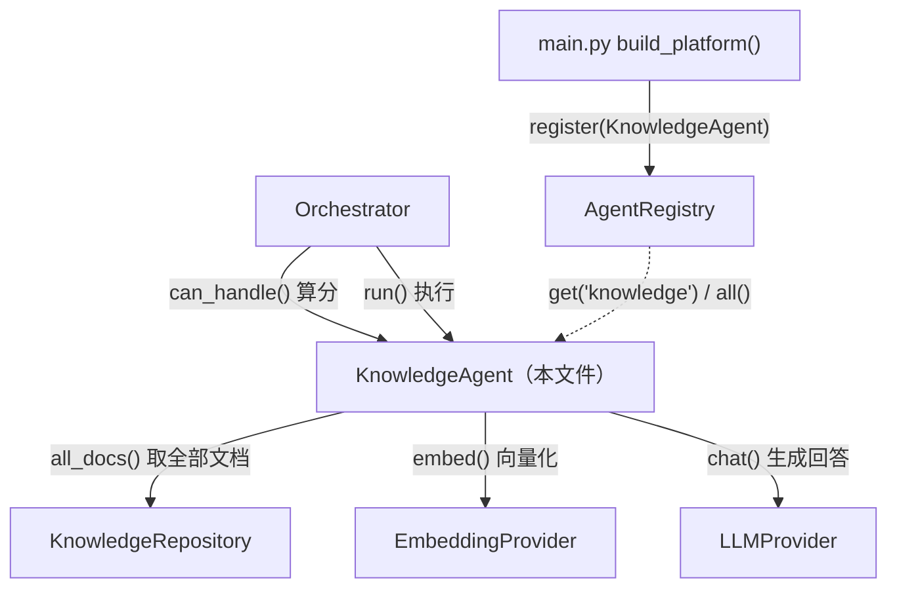
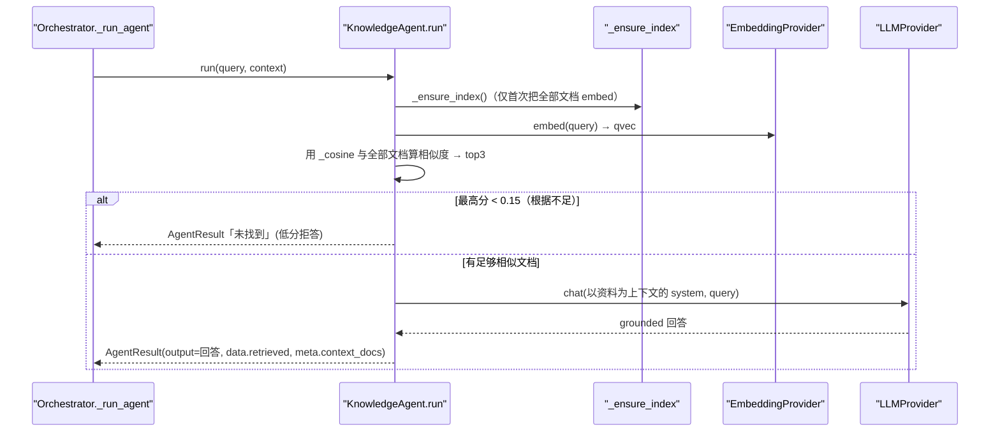
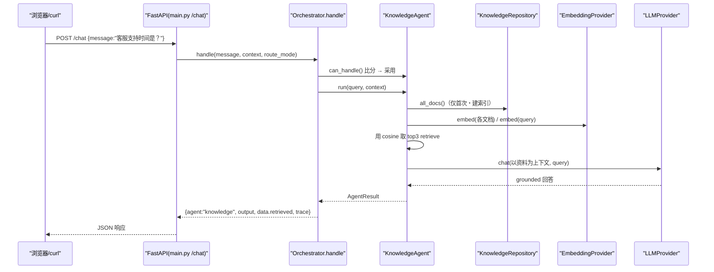

# 基本设计书（代码解说版）
## `backend/app/agents/knowledge_agent.py` — 知识检索智能体（简易 RAG）

> 本书面向初学者，用图和表解说「这个文件：以什么为输入、输出什么、被谁调用、内部如何运作、与哪些部件相互调用」。专业术语在 §7 术语表附中文注释。

---

## 0. 文档信息

| 项目 | 内容 |
|---|---|
| 对象文件 | `backend/app/agents/knowledge_agent.py` |
| 作用（一句话） | **简易 RAG** 智能体。把 FAQ／社内资料向量化后检索(retrieve)，以命中的文档为根据让 LLM 生成回答(generate)。若根据不足则**如实回答「不知道」**（防幻觉） |
| 层级 | 智能体层（`app/agents`） |
| 公开类 | `KnowledgeAgent`（实现 `BaseAgent`） |
| 依赖（import）方 | `core.base_agent.AgentResult,BaseAgent` / `data.kb_repo.KnowledgeRepository` / `providers.base.EmbeddingProvider,LLMProvider` |
| 直接调用方 | `Orchestrator`（`route_by_rule`/`route_by_llm` 调用 `can_handle()`，`_run_agent()` 调用 `run()`）／ `app/main.py`（`build_platform()` 里 `register`）／ `tests/test_smoke.py` |

---

## 1. 概述（这个部件做什么）

`KnowledgeAgent`（知识智能体）用 1 个类实现了 **RAG 的最小形态**。要做的事分三段：

1. **建索引（index / 索引化）** — 启动后首次检索时，把 FAQ 文档全部向量化并保存在内存（延迟、仅一次）。
2. **检索（retrieve / 取回）** — 把问题文本向量化，用 cosine 相似度与全部文档比较，取出前 3 件。
3. **生成（generate / 生成）** — 把取出的文档作为「上下文(context)」交给 LLM，生成 **grounded**（以资料为根据的）回答。

> 💡 **设计意图**：这个类既不自己持有「文档从哪取」，也不持有「向量化的内部实现」。文档丢给 `KnowledgeRepository`，向量化丢给 `EmbeddingProvider`（依赖注入）。所以无论是 JSON 文件＋自写哈希，还是 DynamoDB＋Titan，**这个文件一行都不用改**就能运行（即检索器与生成器都可独立替换）。

> 💡 **安全设计**：若相似度最高分低于阈值 `0.15`，则不调用 LLM，直接回答「知识库中未找到」（即**低分拒答**）。不让模型对不懂的内容编故事，这是 RAG 的经典守卫。

---

## 2. 系统内的位置（调用关系图）

`KnowledgeAgent` 与「上层(Orchestrator)调它」「它调下层(repo/embedder/llm)」的关系：



- **IN（被调用一侧）**：`Orchestrator` 在路由时调 `can_handle()`，执行时调 `run()`。注册由 `main.py` 通过 `registry.register()` 完成。
- **OUT（向外调用一侧）**：`KnowledgeAgent` 调用 `repo`（取文档）、`embedder`（向量化）、`llm`（生成回答）来干活。

---

## 3. 公开接口一览

| 方法 | 种别 | IN（主要输入） | OUT（返回值） | 用途速览 |
|---|---|---|---|---|
| `__init__` | 同步 | llm, embedder, repo | （生成实例） | 接收依赖，准备空索引 |
| `can_handle` | 同步 | query, context | `float`（置信度） | 按关键词命中返回路由得分 |
| `run` | 异步 | query, context | `AgentResult` | **主处理**：retrieve→（低分拒答 or）generate |
| `_ensure_index` | 异步(内部) | （无） | `None` | 仅首次把全部文档向量化建索引 |
| `_cosine`（模块函数） | 同步 | a, b（向量） | `float` | 计算 cosine 相似度 |

---

## 4. 方法详细设计

各方法按「作用 / IN / OUT / 调用处 / 调用谁 / 处理逻辑 / 注意点」拆解。

### 4.1 `__init__`（构造函数, 行42〜48）

- **作用**：接收依赖（LLM, Embedder, KnowledgeRepository）并保存到实例变量。只初始化用于索引的空列表和「未建索引」标志。
- **输入(IN)**

| 参数 | 类型 | 含义 |
|---|---|---|
| `llm` | `LLMProvider` | 用于生成回答的 LLM |
| `embedder` | `EmbeddingProvider` | 用于把问题／文档向量化 |
| `repo` | `KnowledgeRepository` | 文档集合的来源（JSON 或 Dynamo 均可） |

- **输出(OUT)**：无（生成实例）。初始化 `self._docs=[]` / `self._vectors=[]` / `self._indexed=False`。
- **调用处（被谁调用）**：`app/main.py:86`（`build_platform()` 内）、`tests/test_smoke.py:30`
- **处理逻辑（分步编号）**：将参数赋给 `self.xxx`，此时尚不建索引（即**延迟初始化**的准备）。
- **注意点**：不在构造函数里做 DB 连接或向量计算。让启动更轻，不用就不算。

---

### 4.2 `can_handle`（路由得分, 行61〜66）

- **作用**：以 0.0〜0.9 的分数返回「问题是否适合知识检索」。供 `Orchestrator` 的规则路由做判断材料。
- **输入(IN)**

| 参数 | 类型 | 含义 |
|---|---|---|
| `query` | `str` | 用户输入文本 |
| `context` | `dict` | 共享状态（本方法未用，仅为签名统一） |

- **输出(OUT)**：`float` — 有关键词命中则 `0.3 + 0.15×命中数`（上限0.9），无则 `0.2`
- **调用处（被谁调用）**：
  - `Orchestrator.route_by_rule()` `orchestrator.py:54`（列举全部 agent 调用 `can_handle()`）
  - 间接经 `handle()`（route_mode=rule）／`route_by_llm()`（兜底时）到达
- **调用谁（依赖）**：无（仅扫描 `self._KEYWORDS`）
- **处理逻辑（分步编号）**：
  1. 把 `query` 转小写
  2. 数 `_KEYWORDS`（「とは」「料金」「サポート」「セキュリティ」等）的命中数 `hits`
  3. `hits>0` 返回 `min(0.9, 0.3 + 0.15×hits)`；即使 `hits==0` 也返回 **0.2 的底值**
- **注意点**：命中为 0 仍返回 0.2，是作为**默认智能体(default="knowledge")的保险**，让它在「别人都不举手」时能被兜住。

---

### 4.3 `run`（主处理：retrieve → generate, 行68〜103）⭐

- **作用**：RAG 本体。把问题向量化取相似文档 top-k，根据不足则拒答，足够则带上下文让 LLM 回答。
- **输入(IN)**：`query: str`（问题）, `context: dict`（共享状态）／ **异步(async)**
- **输出(OUT)**：`AgentResult`

```json
{
  "agent": "knowledge",
  "output": "（LLM 以资料为据生成的回答 / 或「未找到」）",
  "data": { "retrieved": [ {"id":"...","title":"...","score":0.83}, ... ] },
  "meta": { "context_docs": ["doc1","doc2"] }  // 低分拒答时为 {"reason":"low similarity"}
}
```

- **调用处（被谁调用）**：
  - `Orchestrator._run_agent()` `orchestrator.py:102`（经 `handle()`＝`/chat` 本体）
  - 间接经 `app/main.py:169`（`/chat`）→ `handle()` → `_run_agent()` → `run()`
- **调用谁（依赖）**：`self._ensure_index()` / `self.embedder.embed()` / `_cosine()` / `self.llm.chat()`
- **处理逻辑（分步编号）**：
  1. `_ensure_index()`：若无索引则建（仅首次）
  2. **retrieve**：用 `embedder.embed(query)` 生成问题向量 `qvec`，与全部文档向量用 `_cosine` 算相似度，降序排序取前 3 件 `top`
  3. 整理 `retrieved`（id/title/score 列表，供调试・UI 展示）
  4. **低分拒答**：若 `top` 为空，或最高分 `< 0.15`，则不调 LLM，直接返回「未找到」
  5. **generate**：把 top 文档以 `[title] text` 形式拼接成上下文块，嵌入「**只**以这份社内资料为据作答／不要臆测没有的内容」的 system 提示
  6. 用 `llm.chat(system, query)` 生成回答，把 `retrieved` 和 `context_docs`（根据文档 ID）一并放入 `AgentResult` 返回



- **注意点**：
  - 放进上下文的**只有** top3。上下文过多会带来噪声和成本上升。
  - system 提示约束「资料里没有的就说『未记载』」，在生成阶段也压制幻觉（**双重守卫**：低分拒答＋提示约束）。

---

### 4.4 内部辅助

#### `_ensure_index`（延迟索引, 行50〜59）
- **作用**：首次检索时仅做一次，用 `repo.all_docs()` 取全部文档，逐篇向量化堆入 `self._vectors`。
- **输入(IN)**：无 ／ **输出(OUT)**：`None`（填充 `self._docs`/`self._vectors`，并把 `self._indexed=True`）
- **调用处（被谁调用）**：`run()` `knowledge_agent.py:69`
- **调用谁（依赖）**：`self.repo.all_docs()` / `self.embedder.embed()`
- **处理逻辑（分步编号）**：若 `_indexed` 为真则立即 return。每篇文档**若已存有 `vector` 就直接用**（针对 Dynamo+Titan，省去重算），否则用 `embed("title text")` 计算（针对 JSON+哈希）。
- **注意点**：两种都支持（已存 or 现算），让生产（Dynamo 内置 vector）与开发（JSON）跑同一份代码。

#### `_cosine`（模块函数, 行27〜31）
- **作用**：返回两个向量的 cosine 相似度（−1〜1，越像越接近 1）。
- **输入(IN)**：`a: list[float]`, `b: list[float]` ／ **输出(OUT)**：`float`
- **调用处（被谁调用）**：`run()`（计算 top-k 处）
- **处理逻辑（分步编号）**：内积 ÷（各范数之积）。范数为 0 时除以 `1.0`，避免除零。

---

## 5. 数据流（一条问题走完整 RAG 的流程）

从 `POST /chat` 进来一条知识类问题到返回为止：



---

## 6. 相互引用表

| 本文件的方法 | 调用处（被谁调用） | 调用谁（依赖） |
|---|---|---|
| `__init__` | `main.py:86`, `test_smoke.py:30` | — |
| `can_handle` | `Orchestrator.route_by_rule`(`orchestrator.py:54`) | `self._KEYWORDS`（仅扫描） |
| `run` | `Orchestrator._run_agent`(`orchestrator.py:102`) ← `handle`(`main.py:169` `/chat`) | `_ensure_index()`, `embedder.embed()`, `_cosine()`, `llm.chat()` |
| `_ensure_index` | `run`(`knowledge_agent.py:69`) | `repo.all_docs()`, `embedder.embed()` |
| `_cosine` | `run`（top-k 计算） | — |

> 相关文件：`core/base_agent.py`（`BaseAgent`/`AgentResult` 契约）／`data/kb_repo.py`（`KnowledgeRepository`：JSON/Dynamo 实现）／`providers/base.py`（`EmbeddingProvider`/`LLMProvider` 契约）／`core/orchestrator.py`（调用方）／`core/registry.py`（注册簿）

---

## 7. 术语表

| 术语（日/英） | 中文注释 |
|---|---|
| RAG（検索拡張生成） / Retrieval-Augmented Generation | **检索增强生成**。先从知识库检索相关文档，再把文档作为上下文喂给 LLM 生成回答。减少幻觉、可引用来源 |
| 簡易ベクトル検索 / simple vector search | **简易向量检索**。把文本转成向量，用相似度（这里是 cosine）找最相近的文档。本实现是内存里的朴素实现，非专业向量库 |
| 埋め込み / embedding | **嵌入向量**。把文本映射成定长数值向量，使「语义相近 = 向量相近」 |
| retrieve-generate | **检索-生成**两段式：retrieve（取回相关文档）→ generate（基于文档生成回答），即 RAG 的核心流程 |
| grounded（接地した回答） | **有据可依的回答**。答案严格建立在检索到的资料上，而非模型凭空发挥 |
| 低分拒否 / low-score refusal | **低分拒答**。最高相似度低于阈值时，不调用 LLM，直接如实回答「找不到」，避免编造 |
| 幻覚 / hallucination | **幻觉**。LLM 生成看似合理但实为捏造的内容；RAG + 低分拒答用来抑制它 |
| cosine類似度 / cosine similarity | **余弦相似度**。两向量夹角的余弦值（−1〜1），越接近 1 越相似，与向量长度无关 |
| 遅延インデックス / lazy index | **延迟索引**。不在启动时建索引，而在「首次真正检索」时建一次，省去未使用时的开销 |
| in-memory インデックス | **内存索引**。文档向量保存在进程内存里，检索时直接遍历，适合小数据量的演示 |
| リポジトリ抽象 / repository | **仓储抽象**。把「文档存哪、怎么取」隔离到 `KnowledgeRepository`，本 agent 不关心是 JSON 还是 DynamoDB |
| 依存性注入 / DI | **依赖注入**。LLM/Embedder/Repo 都从外部传入而非自己 new，便于替换与测试 |
| トップk / top-k | **取前 k 个**。按相似度降序取最相关的 k 篇（这里 k=3）作为生成依据 |
| 自信度 / confidence score | **置信度**。`can_handle()` 返回的 0〜1 分数，供路由层在多 agent 竞争时择优 |
