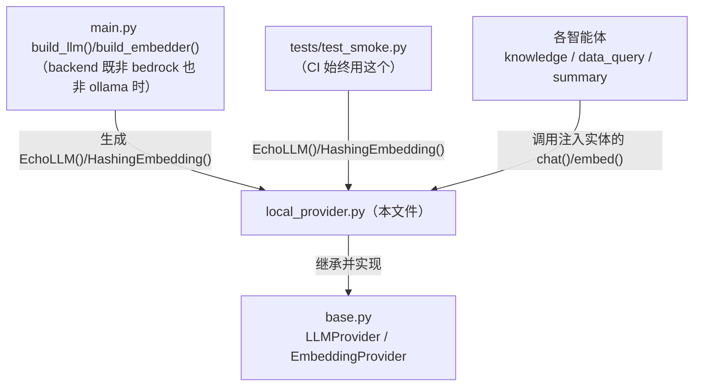
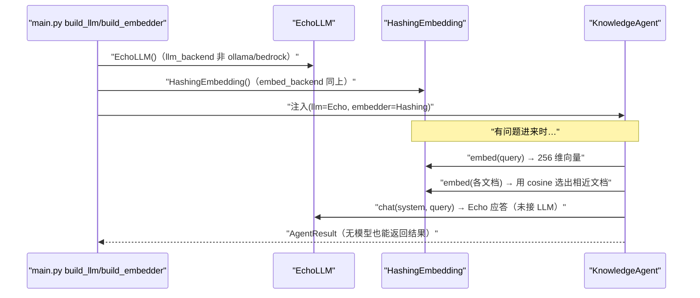

# 基本设计书（代码解说版）
## `backend/app/providers/local_provider.py` — 零依赖的本地实现（没有模型也能跑）

> 本书面向初学者，用图和表解说「这个文件以什么为输入、输出什么、从哪里被调用、内部如何运作、与哪些部件相互调用」。专业术语在 §7 术语表中附中文注释。

---

## 0. 文档信息

| 项目 | 内容 |
|---|---|
| 对象文件 | `backend/app/providers/local_provider.py` |
| 作用（一句话） | **即使没有 LLM/嵌入模型也能跑通全部 API** 的降级实现。提供 `EchoLLM`(基于规则的应答) 与 `HashingEmbedding`(纯 Python 向量化) |
| 所属层 | Provider 层（`app/providers`） |
| 公开类 | `EchoLLM`(LLMProvider 实现) / `HashingEmbedding`(EmbeddingProvider 实现) |
| 依赖（import）对象 | `hashlib` / `math` / `re`（仅标准库＝**无需外部模型与网络**）／ `.base.EmbeddingProvider,LLMProvider` |
| 直接调用方 | `main.py:51,59`（`build_llm`/`build_embedder` 的降级分支）、`tests/test_smoke.py:21,29,38,40` |

---

## 1. 概述（这个部件做什么）

`local_provider.py` 是**为了防止「没有 LLM 就一行都跑不了」状态的保险**：

1. **`EchoLLM`** — `LLMProvider` 的实现。启发式地查看 `system` 提示词内容，判定「像摘要/像意图分类/像参数抽取/普通问答」，返回**抽取式的「貌似合理」的应答**。不调用真实 LLM。
2. **`HashingEmbedding`** — `EmbeddingProvider` 的实现。把字符 n-gram **哈希到定长维度的桶里(feature hashing)**。不理解语义，但具备「词越重叠的句子越相近」的性质，足以演示简易向量检索。

> 💡 **设计意图**：无论是学习设计还是 CI，都需要「不启动 Ollama 也能跑通全部 API」。由于实现了和 `base.py` 相同的接口，生产环境只需按 config **替换成 `OllamaProvider`/`BedrockProvider`**，智能体侧的代码完全不变（＝在这里就能体会到 Provider 抽象的好处）。

---

## 2. 系统内的位置（调用关系图）

`local_provider.py` 处于「被上层(main.py/测试)选中」「实现契约(base.py)」的关系中：

- **IN（生成方）**：`main.py` 的降级分支，或 `test_smoke.py` **new** 出 `EchoLLM()`/`HashingEmbedding()`。
- **OUT（实现方）**：继承 `base.py` 的抽象，填充 `chat()`/`embed()` 的方法体。
- **消费**：智能体在类型上只认 `LLMProvider`/`EmbeddingProvider`，运行时跑的是这个实体的方法（多态）。

---

## 3. 公开接口一览（方法速查表）

| 类.方法 | 种类 | IN（主要输入） | OUT（返回值） | 大致用途 |
|---|---|---|---|---|
| `EchoLLM.chat` | 异步 | system, user, temperature | `str` | 按 system 内容分支返回抽取式应答 |
| `EchoLLM._extractive_summary` | 同步(静态·内部) | text, max_sentences | `str` | 取较长句子的朴素抽取式摘要 |
| `HashingEmbedding.__init__` | 同步 | dim=256 | （生成） | 保存向量维度 |
| `HashingEmbedding.embed` | 异步 | text | `list[float]` | feature hashing + L2 归一化 |
| `HashingEmbedding._tokenize` | 同步(静态·内部) | text | `list[str]` | 切分英数词 + 日语 bi-gram |

---

## 4. 方法详细设计

将每个方法拆解为「作用 / IN / OUT / 调用处（被谁调用） / 调用谁 / 处理逻辑 / 注意点」。

### 4.1 `EchoLLM.chat`（无模型时的简易应答, 行32〜45）⭐

- **作用**：`LLMProvider.chat` 的实现。**启发式判定 `system` 提示词的种类**，返回贴合任务的抽取式·定型应答。不调用真实 LLM。
- **输入(IN)**

| 输入(IN) | 类型 | 含义 |
|---|---|---|
| `system` | `str` | 系统提示词（据此推测任务种类） |
| `user` | `str` | 用户输入（摘要对象正文、问题等） |
| `temperature` | `float`=`0.2` | 契约上接收但**实际忽略**（应答是确定性的） |

- **输出(OUT)**：`str`（应答文本）／ **异步(async)**
- **调用处（被谁调用）**：（作为实例）由 `main.py:51`(`build_llm` 的降级分支)、`test_smoke.py:29,38,40` 生成 → 实际的 `.chat()` 调用在 `dataquery_agent.py:58`·`summary_agent.py:45`·`knowledge_agent.py:97`·`orchestrator.py`(意图分类)
- **调用谁（依赖）**：`self._extractive_summary(user)`（仅摘要分支）
- **处理逻辑（分步）**：
  1. 把 `system.lower()` 取为 `s`（英文关键字转小写，日文按原文判定）
  2. **摘要判定**：`system` 含「要約」或 `s` 含 `summar` → 返回 `_extractive_summary(user)`
  3. **意图分类判定**：`s` 含 `json` 且(`intent`/`agent`/日文「分類」) → 返回固定 JSON `{"agent": "knowledge", "reason": "EchoLLM fallback (no model)"}`（**路由器必定落到 knowledge**）
  4. **参数抽取判定**：含「パラメータ」或 `parameter` → 返回空 JSON `"{}"`（抽取为空＝相当于全量）
  5. **普通问答**：取 `user` 首行最多 200 字符，前置 `（LLM未接続のためEcho応答）` 后返回
- **注意点**：判定只是朴素的字符串包含。它不做真正理解，但**目标是「全部 API 不崩溃地跑通」**，足够了。接收 temperature 是为了**让契约（签名）与真实实现一致**，对行为无影响。

---

### 4.2 `EchoLLM._extractive_summary`（朴素抽取式摘要, 行47〜57, 静态方法）

- **作用**：切分句子，**把较长的句子视为信息量更大，保留排名前 N 的句子**，是极朴素的抽取式摘要。
- **输入(IN)**：`text: str`（摘要对象）、`max_sentences: int`=`3`（保留句数）
- **输出(OUT)**：`str`（以 `・` 开头的列表式摘要）
- **调用处（被谁调用）**：`EchoLLM.chat`（`local_provider.py:36` 的摘要分支）
- **调用谁（依赖）**：`re.split`（句子切分）、标准库 `sorted`
- **处理逻辑（分步）**：
  1. 在标点·换行（`。．.!?！？\n`）的**后方**切分句子（lookbehind 正则）
  2. 仅保留去空白后非空的句子。若为空则返回 `"(要約対象が空です)"`
  3. **按字符数降序**排列，取前 `max_sentences` 句作为「采用集合 `ranked`」
  4. 还原成原出现顺序（为可读性），把前 `max_sentences` 句用 `・` 连接
- **注意点**：「长＝重要」是很粗暴的启发式，并非真正的语义摘要。在真实 LLM 下，只要在 `system` 里传「请摘要」就能得到真正的摘要（接口相同）。

---

### 4.3 `HashingEmbedding.__init__`（构造函数, 行67〜68）

- **作用**：仅保存向量的**维度数 `dim`**。
- **输入(IN)**：`dim: int`=`256`（生成向量的长度）
- **输出(OUT)**：无（实例生成）
- **调用处（被谁调用）**：`main.py:59`(`build_embedder` 的降级分支)、`test_smoke.py:29`
- **处理逻辑**：仅 `self.dim = dim`。

---

### 4.4 `HashingEmbedding.embed`（用 feature hashing 向量化, 行70〜80）⭐

- **作用**：`EmbeddingProvider.embed` 的实现。把文本确定性地转成**定长（默认 256）维向量**。无需外部模型与网络。
- **输入(IN)**：`text: str`（要向量化的文章）
- **输出(OUT)**：`list[float]`（长度 `self.dim`，**已 L2 归一化**）／ **异步(async)**
- **调用处（被谁调用）**：（作为实例）由 `main.py:59`·`test_smoke.py:29` 生成 → 实际调用在 `knowledge_agent.py:57`(文档侧)·`knowledge_agent.py:72`(查询侧)
- **调用谁（依赖）**：`self._tokenize(text)`、`hashlib.md5`、`math.sqrt`
- **处理逻辑（分步）**：
  1. 准备一个全 `0.0`、长度为 `dim` 的向量
  2. 用 `_tokenize()` 得到 token 序列
  3. 对每个 token 用 `md5` 哈希 → 由该整数值决定 **(a) 放入的桶位置 `idx = h % dim`、(b) 符号 `sign`（用哈希的另一位算 ±1）**，并 `vec[idx] += sign`
  4. **L2 归一化**：用范数（`sqrt(Σv²)`，为 0 时取 1）除全部元素 → 便于做 cosine 比较
- **注意点**：不理解语义但「同词越多的句子向量越接近」。`idx = h % dim` 会因**哈希冲突**让不同词进同一桶（feature hashing 的固有问题），但对演示可接受。**维度数（256）与生产 Titan(1024) 不同**，所以索引与查询要用**同一 embedder** 生成。

---

### 4.5 `HashingEmbedding._tokenize`（分词, 行82〜89, 静态方法）

- **作用**：把文本切成「英数字单词 + 日文单字 + 日文 2 字 bi-gram」的词汇。用于粗略处理多语言。
- **输入(IN)**：`text: str`
- **输出(OUT)**：`list[str]`（token 序列）
- **调用处（被谁调用）**：`HashingEmbedding.embed`（`local_provider.py:72`）
- **调用谁（依赖）**：`re.findall`、`zip`
- **处理逻辑（分步）**：
  1. 转小写
  2. 用 `[a-z0-9]+` 抽取英数字单词（`words`）
  3. 逐字抽取平假名/片假名/汉字（`cjk`）
  4. 把相邻 2 字连接做成 **bi-gram**（`zip(cjk, cjk[1:])`）
  5. 返回 `words + cjk + bigrams`
- **注意点**：日语没有分词空格，故用 bi-gram 制造「一定程度的词线索」这一简便策略，不使用形态素分析。

---

## 5. 数据流（无模型时 /chat 如何跑通）

当 `main.py` 判定「既非 bedrock 也非 ollama」时，会选中本实现使 API 成立：

---

## 6. 相互引用表

| 本文件的方法 | 调用处（被谁调用） | 调用谁（依赖） |
|---|---|---|
| `EchoLLM.chat` | 生成: `main.py:51`, `test_smoke.py:29,38,40` ／ 实调: `dataquery_agent.py:58`, `summary_agent.py:45`, `knowledge_agent.py:97`, `orchestrator.py`(意图分类) | `self._extractive_summary` |
| `EchoLLM._extractive_summary` | `EchoLLM.chat`(`local_provider.py:36`) | `re.split`, `sorted` |
| `HashingEmbedding.__init__` | `main.py:59`, `test_smoke.py:29` | — |
| `HashingEmbedding.embed` | 实调: `knowledge_agent.py:57,72` | `self._tokenize`, `hashlib.md5`, `math.sqrt` |
| `HashingEmbedding._tokenize` | `HashingEmbedding.embed`(`local_provider.py:72`) | `re.findall`, `zip` |

> 相关文件：`base.py`（实现的契约）／`ollama_provider.py`·`bedrock_provider.py`（生产环境的替换目标）／`main.py`（`build_llm`/`build_embedder` 的选择）／`knowledge_agent.py`（embed 的主要消费方）

---

## 7. 术语表

| 术语（日/英） | 中文注释 |
|---|---|
| フォールバック実装 / fallback | **降级实现**。在没有首选（真实 LLM）时启用的保险替代实现 |
| モック / mock | **模拟实现**。代替真品使用的、轻量且确定性的假实现。适合 CI/学习 |
| ヒューリスティック / heuristic | **启发式**。不严谨但「大致命中」的经验法则。这里用字符串包含来判定 |
| 抽出的要約 / extractive summary | **抽取式摘要**。从原文「挑选」重要句子保留的摘要，不做生成 |
| 埋め込み / embedding | **嵌入/向量化**。把文本转成定长数值向量 |
| feature hashing（ハッシュトリック） | **特征哈希**。不把词登记进字典，直接用哈希值决定向量的桶位置。省内存但有冲突 |
| n-gram / bi-gram | **n 元语法 / 二元语法**。把连续 n 字（2 字）作为一个单位，代替日语的分词空格 |
| ハッシュ衝突 / hash collision | **哈希冲突**。不同的词进了同一个桶，feature hashing 中无法避免 |
| L2正規化 / L2 normalization | **L2 归一化**。把向量长度统一为 1，便于比较 cosine 相似度 |
| cosine類似度 / cosine similarity | **余弦相似度**。两向量方向的接近度，词越重叠越大 |
| 決定的 / deterministic | **确定性**。同样输入必出同样输出，使测试稳定 |
| 静的メソッド / staticmethod | **静态方法**。不使用 `self` 的辅助函数，属于类但不依赖状态 |
| キーワード専用引数 / keyword-only | `*` 之后的参数。只能用 `f(x, key=val)` 形式传 |
| 非同期 / async・await | **异步**。在等待 I/O 时可推进其他任务的机制（这里为契约一致而用 async） |

---

> **若要把本模板套用到其他文件**：§0〜§7 的框架照搬，§4 的「作用/IN/OUT/调用处/调用谁/逻辑/注意点」逐个方法填入即可。
