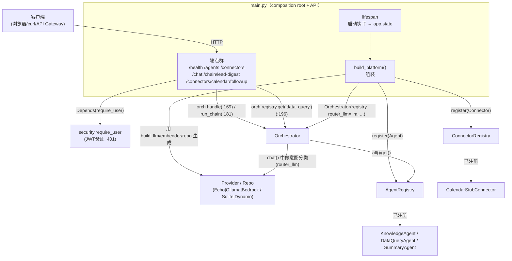
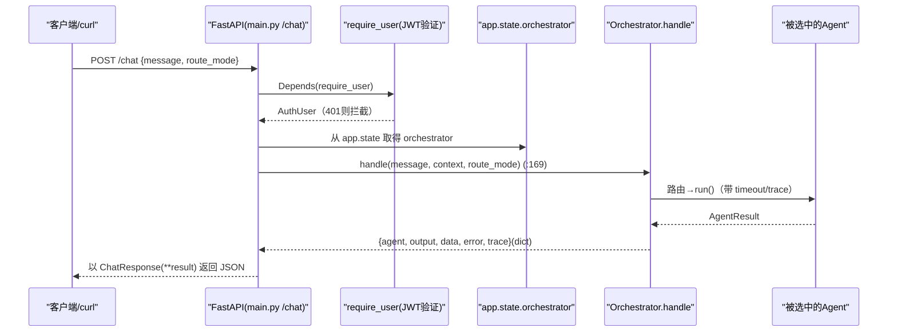

# 基本设计书（代码解说版）
## `backend/app/main.py` — 平台本体（FastAPI ＋ Composition Root）

> 本书面向初学者，用图和表说明「这个文件以什么为输入、输出什么、被谁调用、内部如何运作、和哪些部件相互调用」。专业术语在 §7 术语表给出中文注释。

---

## 0. 文档信息

| 项目 | 内容 |
|---|---|
| 目标文件 | `backend/app/main.py` |
| 作用（一句话） | **在一处组装全部部件的指挥室**（composition root）。按 config 生成 Provider/Repo，把 Agent/Connector 注册进 Registry，注入到 Orchestrator，并定义 HTTP 端点 |
| 所在层 | 应用最上层（API 层 ＋ 组装层） |
| 公开对象 | `app`(FastAPI) / `build_llm` / `build_embedder` / `build_customer_repo` / `build_kb_repo` / `build_platform` / `lifespan` ／ 各端点 |
| 依赖（import）对象 | `agents.*` / `config.settings` / `connectors.*` / `core.{AgentRegistry,Orchestrator}` / `data.*` / `providers.*` / `schemas.*` / `security.{AuthUser,require_user}` / `fastapi` |
| 直接调用方 | `handler.py`（`from app.main import app` → Lambda）、`uvicorn app.main:app`（本地） |

---

## 1. 概述（这个部件做什么）

`main.py` 兼任**「组装依赖的地方(composition root)」**和**「HTTP 的窗口(API)」**。大致做 4 件事：

1. **选择并生成 Provider/Repo** — `build_llm` / `build_embedder` / `build_customer_repo` / `build_kb_repo` 查看 `config` 的 `*_backend`，返回**真货(AWS) 或 模拟(本地)**。
2. **组装** — `build_platform()` 把 3 个 Agent 注册进 `AgentRegistry`，把 Connector 注册进 `ConnectorRegistry`，并注入到 `Orchestrator`。
3. **启动钩子** — `lifespan` 在应用启动时执行 SQLite 初始化＋组装，并把结果放到 `app.state`。
4. **端点定义** — 提供 `/health` `/agents` `/connectors` `/chat` `/chain/lead-digest` `/connectors/calendar/followup`。受保护对象用 `Depends(require_user)` 强制要求 JWT。

> 💡 **设计意图**：**不让「具体类的 `new`(生成)」散落到本文件以外**。把依赖方向统一为「上层(main)→下层(agent/provider)」，这样 Ollama↔Echo 的替换或新增 Agent，**只需改这一个文件**（OCP / DI 的好处）。

---

## 2. 系统内的位置（调用关系图）★

`main.py` 如何连接「上(HTTP)」与「下(部件群)」，从 API 端点→Orchestrator→registry/agents 的全貌：

- **IN（输入侧）**：HTTP 请求。受保护端点先通过 `require_user`(JWT) 才进入本体。
- **OUT（输出侧）**：驱动 `Orchestrator` 的 `handle`/`run_chain`、`registry`/`connectors`、Provider/Repo 来生成响应。

---

## 3. 速查表

### 3.1 端点一览

| 方法 & 路径 | 认证 | 输入 | 输出(response_model) | 用途 | 调用的 Orchestrator 方法 |
|---|---|---|---|---|---|
| `GET /health` | 不需要 | — | dict | 运行确认＋显示当前 backend 构成 | （无） |
| `GET /agents` | 不需要 | — | dict | 已注册代理一览 | （直接读 registry） |
| `GET /connectors` | 不需要 | — | dict | 已注册连接器一览 | （直接读 connectors） |
| `POST /chat` | ✅JWT | `ChatRequest` | `ChatResponse` | **主入口**：分流→单一执行 | `orch.handle(:169)` |
| `POST /chain/lead-digest` | ✅JWT | `ChatRequest` | `ChainResponse` | 链式：顾客抽取→摘要 | `orch.run_chain(:181)` |
| `POST /connectors/calendar/followup` | ✅JWT | `ChatRequest` | dict | 外部服务调用演示 | `orch.registry.get("data_query").run(:196)` |

### 3.2 组装函数（build_*）一览

| 函数 | 查看的配置 | 返回物（按 backend 区分） |
|---|---|---|
| `build_llm` | `settings.llm_backend` | `bedrock`→`BedrockProvider` / `ollama`→`OllamaProvider` / 默认→`EchoLLM` |
| `build_embedder` | `settings.embed_backend` | `bedrock`→`BedrockEmbedding` / `ollama`→`OllamaEmbeddingProvider` / 默认→`HashingEmbedding` |
| `build_customer_repo` | `settings.data_backend` | `dynamo`→`DynamoCustomerRepo` / 默认→`SqliteCustomerRepo` |
| `build_kb_repo` | `settings.data_backend` | `dynamo`→`DynamoKbRepo` / 默认→`JsonKbRepo` |
| `build_platform` | （调用上述各项） | `(Orchestrator, AgentRegistry, ConnectorRegistry)` |

### 3.3 CORS 配置（环境变量开关）

| 环境变量 | 默认值 | 行为 |
|---|---|---|
| `CORS_ALLOW_ORIGINS` | `http://localhost:3000` | 逗号分隔的允许 origin。**空字符串则不加 CORS 中间件**（生产=由 API Gateway 侧添加） |

---

## 4. 方法详细设计

将每个定义按「作用 / 输入(IN) / 输出(OUT) / 调用处 / 调用谁 / 处理逻辑 / 注意点」拆解。

### 4.1 `build_llm`（行46〜51）

- **作用**：查看 `settings.llm_backend`，生成并返回 1 个 LLM 实体。
- **输入(IN)**：无（引用 `settings`） ／ **输出(OUT)**：`LLMProvider`（`BedrockProvider` / `OllamaProvider` / `EchoLLM` 之一）
- **调用处**：`main.py:78`（`build_platform()` 内）
- **调用谁**：`BedrockProvider(...)` / `OllamaProvider(...)` / `EchoLLM()`
- **处理逻辑**：
  1. `llm_backend == "bedrock"` → `BedrockProvider(bedrock_model_id, aws_region)`
  2. `== "ollama"` → `OllamaProvider(ollama_base_url, ollama_model, step_timeout)`
  3. 都不是则 `EchoLLM()`（不需要模型的回退）
- **注意点**：由于默认是 `EchoLLM`，**即使什么环境变量都不设置**（没有 API key），应用也能启动·运行。

### 4.2 `build_embedder`（行54〜59）

- **作用**：查看 `settings.embed_backend`，生成嵌入（向量化）的实体。
- **输出(OUT)**：`BedrockEmbedding` / `OllamaEmbeddingProvider` / `HashingEmbedding`
- **调用处**：`main.py:79`（`build_platform()` 内）
- **处理逻辑**：`bedrock`→`BedrockEmbedding(bedrock_embed_model, aws_region)` / `ollama`→`OllamaEmbeddingProvider(ollama_base_url, ollama_embed_model)` / 默认→`HashingEmbedding()`。
- **注意点**：默认的 `HashingEmbedding` 是不需要模型的确定性向量化。可让本地开发·测试做到零外部依赖。

### 4.3 `build_customer_repo`（行62〜65）

- **作用**：查看 `settings.data_backend`，选择顾客数据的保存位置。
- **输出(OUT)**：`DynamoCustomerRepo` / `SqliteCustomerRepo`
- **调用处**：`main.py:80`（`build_platform()` 内）
- **处理逻辑**：`dynamo`→`DynamoCustomerRepo(customers_table, aws_region)` / 默认→`SqliteCustomerRepo(db_path)`。

### 4.4 `build_kb_repo`（行68〜71）

- **作用**：查看 `settings.data_backend`，选择知识（knowledge）的保存位置。
- **输出(OUT)**：`DynamoKbRepo` / `JsonKbRepo`
- **调用处**：`main.py:81`（`build_platform()` 内）
- **处理逻辑**：`dynamo`→`DynamoKbRepo(knowledge_table, aws_region)` / 默认→`JsonKbRepo(kb_path)`。
- **注意点**：`build_customer_repo` 与 `build_kb_repo` 查看**同一个 `data_backend` 开关**。即「数据层整体切换 local/生产」的设计。

---

### 4.5 `build_platform`（组装的核心, 行77〜99）★

- **作用**：创建 Provider/Repo，把 3 个 Agent 与 Connector 注册进 Registry，生成 Orchestrator 并**一并返回**。用一个函数构建应用的依赖图。
- **输入(IN)**：无 ／ **输出(OUT)**：`tuple[Orchestrator, AgentRegistry, ConnectorRegistry]`
- **调用处**：`main.py:107`（`lifespan` 内，启动时调用 1 次）
- **调用谁**：`build_llm/embedder/customer_repo/kb_repo`、`AgentRegistry()`、`registry.register(...)`、`ConnectorRegistry()`、`connectors.register(...)`、`Orchestrator(...)`
- **处理逻辑（分步）**：
  1. 用 build_* 生成 `llm` / `embedder` / `customer_repo` / `kb_repo`
  2. 创建 `AgentRegistry()`，注册 `KnowledgeAgent(llm, embedder, kb_repo)` / `DataQueryAgent(llm, customer_repo)` / `SummaryAgent(llm)`
  3. 创建 `ConnectorRegistry()`，注册 `CalendarStubConnector()`
  4. 生成 `Orchestrator(registry, router_llm=llm, default_agent="knowledge", step_timeout=settings.step_timeout)`
  5. 返回 `(orchestrator, registry, connectors)`
- **注意点**：
  - **想增加新 Agent 时「只需在这里加 1 行 `register(...)`」**。orchestrator 和 API 都无需改动＝OCP 的好处（参见代码内注释 `★`）。
  - 用 `router_llm=llm`，给意图分类用 LLM 和 Agent 用 LLM 传入**同一个实例**（设计上也可分别注入）。

---

### 4.6 `lifespan`（启动/结束钩子, 行102〜109）

- **作用**：FastAPI 启动时进行「DB 初始化」和「组装」，并把结果保存到 `app.state`。用 `@asynccontextmanager`，`yield` 之前＝启动，之后＝结束。
- **输入(IN)**：`app: FastAPI` ／ **输出(OUT)**：（异步上下文管理器）
- **调用处**：FastAPI 本体（在行116 `app = FastAPI(..., lifespan=lifespan)` 登记，启动时自动执行）
- **调用谁**：`init_db(settings.db_path)`（仅 sqlite 时）、`build_platform()`
- **处理逻辑（分步）**：
  1. 若 `settings.data_backend == "sqlite"` 则用 `init_db(db_path)` 创建 SQLite＋灌入种子（生产=dynamo 假定已跑过 seed 脚本，跳过）
  2. 把 `build_platform()` 的返回值存入 `app.state.orchestrator / registry / connectors`
  3. `yield`（此处应用进入运行）
  4. 结束时的清理处（目前没有）
- **注意点**：组装**每个进程只做 1 次**。各请求只从 `app.state` 取出既有实例（不每次创建＝高速·状态共享）。

---

### 4.7 `app`(FastAPI 实例) 与 CORS（行112〜130）

- **作用**：生成 FastAPI 应用本体（设置 title/description/version/lifespan）。接着**有条件地**添加 CORS 中间件。
- **处理逻辑**：
  1. `app = FastAPI(..., lifespan=lifespan)`
  2. 把 `CORS_ALLOW_ORIGINS`（默认 `http://localhost:3000`）按逗号分隔读取，去掉空值
  3. **若仍有 origin 残留**则添加 `CORSMiddleware`（允许方法 GET/POST/OPTIONS，允许头 Authorization/Content-Type）
- **注意点**：生产(API Gateway)中**由网关侧添加 CORS**，因此给 Lambda 传 `CORS_ALLOW_ORIGINS=""` 以在此处禁用。这能防止重复添加 `Access-Control-Allow-Origin` 导致浏览器报错。

---

### 4.8 `GET /health`（行136〜144）

- **作用**：运行确认。返回当前以哪个 backend 运行（llm/embed/data/auth）。
- **输入(IN)**：无（不需要认证） ／ **输出(OUT)**：`{"status":"ok", "llm_backend":..., "embed_backend":..., "data_backend":..., "auth_backend":...}`
- **调用处**：健康检查（负载均衡器/监控/手动 curl）
- **注意点**：无需认证即可调用的唯一「返回内容」类端点。便于部署后确认构成。

### 4.9 `GET /agents`（行147〜151）

- **作用**：已注册代理的目录（确认插件可见）。
- **输出(OUT)**：`{"agents":[{"name":..., "description":...}, ...]}`
- **调用谁**：`app.state.registry.all()`（各 agent 的 `name`/`description`）
- **注意点**：`build_platform` 中 register 的 Agent 会**原样**排列。可用于确认新增 Agent 是否自动反映到 UI/API。

### 4.10 `GET /connectors`（行154〜157）

- **作用**：已注册连接器一览。
- **输出(OUT)**：`{"connectors":[{"name":..., "actions":...}, ...]}`
- **调用谁**：`app.state.connectors.all()`

---

### 4.11 `POST /chat`（主入口, 行160〜170）★

- **作用**：编排的主入口。用 `route_mode` 切换 rule/llm 来执行单个代理。**必须 JWT**。
- **输入(IN)（请求）**

| 项目 | 类型 | 含义 |
|---|---|---|
| body | `ChatRequest` | `message`(必填), `route_mode`(rule/llm) |
| `user` | `AuthUser`=`Depends(require_user)` | 已校验用户（401 则拦截） |

- **输出(OUT)**：`ChatResponse`（`agent` / `output` / `data` / `error` / `trace`）
- **调用处**：HTTP 客户端（`POST /chat`）。经由 `require_user` 认证。
- **调用谁**：`require_user`（DI）→ `orch.handle(req.message, context, route_mode=req.route_mode)`（**main.py:169**）→ `ChatResponse(**result)`
- **处理逻辑（分步）**：
  1. 用 `Depends(require_user)` 做 JWT 验证（仅 `DEV_NO_AUTH=1` 时跳过）
  2. 取得 `app.state.orchestrator`
  3. 组装 `context = {"user": {sub, scopes}, "connectors": app.state.connectors}`（agent/chain 可引用的共享状态）
  4. 调用 `await orch.handle(...)`（**:169**）
  5. 把返回 dict 用 `ChatResponse(**result)` 装填后返回
- **注意点**：在 `context` 中放入认证用户和连接器，使下游 Agent 能引用「是谁的请求」「外部服务」。

---

### 4.12 `POST /chain/lead-digest`（链式, 行173〜182）★

- **作用**：链式演示。DataQuery 抽取顾客 → Summary 做成面向营业的 digest。演示多代理协作＋状态共享(`context["upstream"]`)。
- **输入(IN)**：body=`ChatRequest`、`user`=`Depends(require_user)` ／ **输出(OUT)**：`ChainResponse`（`agents` / `output` / `data{rows,summary}` / `trace`）
- **调用处**：HTTP 客户端（`POST /chain/lead-digest`）
- **调用谁**：`require_user` → `orch.run_chain(req.message, context)`（**main.py:181**）→ `ChainResponse(**result)`
- **处理逻辑（分步）**：
  1. JWT 验证
  2. 组装 `context`（与 `/chat` 相同）
  3. `await orch.run_chain(...)`（**:181**）— 内部把 data_query→summary 串联
  4. 用 `ChainResponse(**result)` 返回
- **注意点**：上游→下游的传递由 `Orchestrator` 侧经由 `context["upstream"]` 完成（本端点只是入口）。

---

### 4.13 `POST /connectors/calendar/followup`（外部服务调用演示, 行185〜214）

- **作用**：演示「代理/平台调用外部服务」的结构。用 DataQuery 取得待跟进对象，把各公司的跟进预定登记到日历(stub)。
- **输入(IN)**：body=`ChatRequest`、`user`=`Depends(require_user)` ／ **输出(OUT)**：`dict`（`matched` / `created_events` / `query_params`）
- **调用处**：HTTP 客户端（`POST /connectors/calendar/followup`）
- **调用谁**：
  - `orch.registry.get("data_query").run(req.message, context)`（**main.py:196**，不经过 Orchestrator，直接从 Registry 取得 Agent 并执行）
  - `conns.get("calendar")` → `calendar.invoke("create_event", {...})`（外部服务调用，最多 5 件）
- **处理逻辑（分步）**：
  1. JWT 验证，组装 `context`
  2. 让 `DataQueryAgent` 抽取目标顾客并得到 `rows`（**:196**）
  3. 对 `rows[:5]` 的各公司用 `calendar.invoke("create_event", {title/date/attendees/note})` 创建预定
  4. 把创建的事件汇集到 `created`，返回 `{matched, created_events, query_params}`
- **注意点**：与其他端点用 `orch.handle/run_chain` 不同，这里是**从 Registry 直接 `get("data_query").run()`**。也是「不经过 Orchestrator、直接使用单个 Agent」模式的演示。

---

## 5. 数据流（一条 `POST /chat` 的流程）

以 `main.py` 为中心，已启动的应用收到 `POST /chat` 直到返回为止：

---

## 6. 相互引用表（调用处与依赖一览）

| 本文件的定义 | 调用处 | 调用谁（依赖） |
|---|---|---|
| `build_llm` | `main.py:78`(`build_platform`) | `BedrockProvider`/`OllamaProvider`/`EchoLLM`、`settings` |
| `build_embedder` | `main.py:79` | `BedrockEmbedding`/`OllamaEmbeddingProvider`/`HashingEmbedding` |
| `build_customer_repo` | `main.py:80` | `DynamoCustomerRepo`/`SqliteCustomerRepo` |
| `build_kb_repo` | `main.py:81` | `DynamoKbRepo`/`JsonKbRepo` |
| `build_platform` | `main.py:107`(`lifespan`) | build_*、`AgentRegistry`/`Orchestrator`/各Agent/`ConnectorRegistry`/`CalendarStubConnector` |
| `lifespan` | FastAPI(`main.py:116` 登记, 启动时自动) | `init_db`、`build_platform` |
| `app`(FastAPI) | `handler.py:15`(`from app.main import app`)、`uvicorn app.main:app` | `FastAPI`、`CORSMiddleware` |
| `GET /health` | HTTP 客户端/监控 | `settings`(各 backend) |
| `GET /agents` | HTTP 客户端 | `app.state.registry.all()` |
| `GET /connectors` | HTTP 客户端 | `app.state.connectors.all()` |
| `POST /chat` | HTTP 客户端 | `require_user`、`orch.handle()`(:169)、`ChatResponse` |
| `POST /chain/lead-digest` | HTTP 客户端 | `require_user`、`orch.run_chain()`(:181)、`ChainResponse` |
| `POST /connectors/calendar/followup` | HTTP 客户端 | `require_user`、`orch.registry.get("data_query").run()`(:196)、`calendar.invoke()` |

> 关联文件：`config.py`（配置）／`schemas.py`（输入输出类型）／`core/orchestrator.py`(`handle`/`run_chain`)／`core/registry.py`／`agents/*`／`providers/*`／`data/*`／`connectors/*`／`security/auth.py`(`require_user`)／`handler.py`（Lambda 入口）

---

## 7. 术语表

| 术语（日/英） | 中文注释 |
|---|---|
| FastAPI | Python 的**高速 Web 框架**。从类型提示自动生成校验与文档 |
| composition root | **组合根**。在**一处集中生成·接线**应用全部依赖(部件)的地方。这里是 `main.py`/`build_platform` |
| 依存性注入 / DI | **依赖注入**。部件不自行 `new` 依赖对象，而是从外部传入，便于替换 |
| Depends | FastAPI 的**依赖注入机制**。用 `Depends(require_user)` 给各端点一行注入认证 |
| lifespan | FastAPI 的**启动/结束钩子**。`yield` 之前是启动处理，之后是结束处理 |
| `@asynccontextmanager` | 用 `yield` 分隔来创建**异步上下文管理器**的装饰器，用于实现 lifespan |
| `app.state` | 绑定到应用的**共享存放处**。启动时把组装好的 orchestrator 等放入，各请求复用 |
| ASGI | **异步 Web 服务器规范**。uvicorn(本地) / Mangum(Lambda) 把 FastAPI(app) 当作 ASGI 驱动 |
| CORS | **跨域资源共享**。浏览器的跨 origin 限制。用 `CORSMiddleware` 设置允许 origin |
| ミドルウェア / middleware | 在所有请求**前后插入公共处理**的层。用于添加 CORS 等 |
| 環境変数スイッチ / backend switch | **后端开关**。用 `*_BACKEND` 字符串切换真货(AWS)/模拟(本地) |
| OCP（開放閉鎖原則） | **开放封闭原则**。对扩展开放、对修改封闭。只需 register 一行新 Agent，本体不变 |
| レジストリ / registry | **登记簿**。注册 Agent/Connector，并以名字取出的间接层 |
| フォールバック / fallback | **降级/退避**。首选不存在/失败时切换到可靠手段（默认 `EchoLLM`/`SqliteCustomerRepo`） |
| Provider | 把 LLM/嵌入等**外部能力的实现**做成可替换的部件（Echo/Ollama/Bedrock） |
| Repository / Repo | **数据访问层**。隐藏保存位置(SQLite/Dynamo/JSON)差异的数据访问部件 |
| JWT / Bearer トークン | **JSON Web Token**。用 `Authorization: Bearer <token>` 证明本人身份，由 `require_user` 验证 |

---

> **将本模板套用到其他文件时**：§0〜§7 的框架照用，§4 的「作用/IN/OUT/调用处/调用谁/逻辑/注意点」逐个套到各定义上填写。
