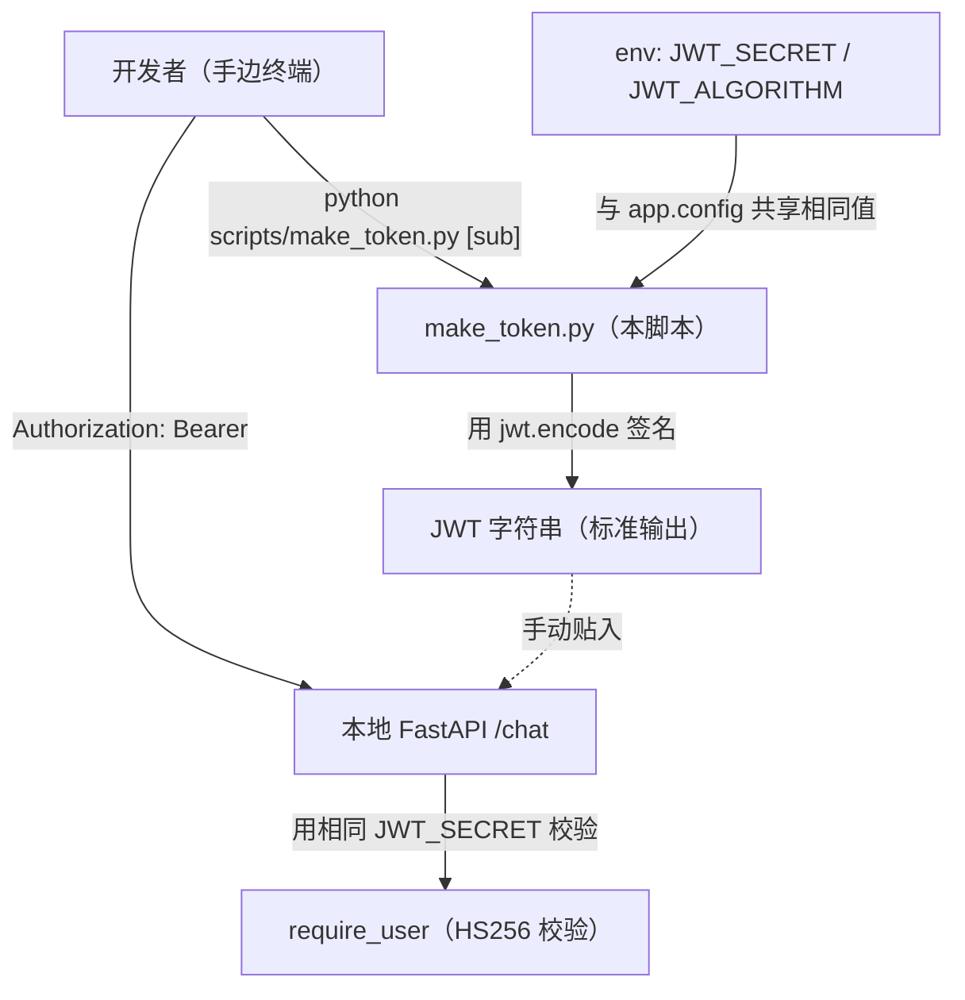
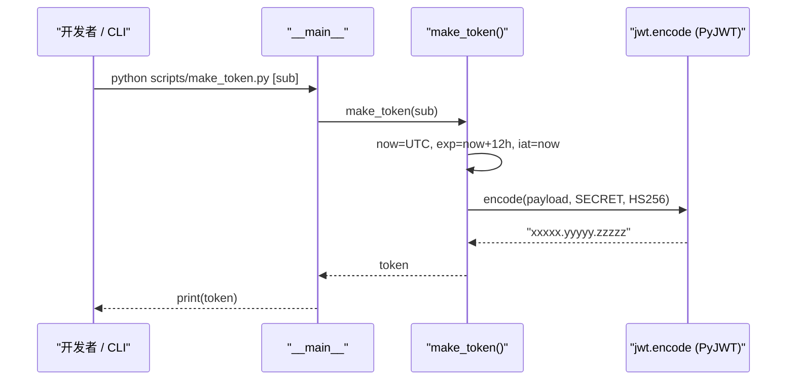

# 基本设计书（代码解说版）
## `scripts/make_token.py` — 本地测试用 JWT 发行脚本

> 本书面向初学者，用图和表讲解「这个脚本以什么为输入、输出什么、何时由谁执行、内部如何运作、与哪些库相互调用」。专业术语在 §7 术语表中附中文注释。

---

## 0. 文档信息

| 项目 | 内容 |
|---|---|
| 对象文件 | `scripts/make_token.py` |
| 作用（一句话） | 一个小工具：为在本地打 `/chat`，发行 1 本 **HS256 签名的测试用 JWT** 并打印到标准输出 |
| 类别 | 运维脚本（Python） |
| 执行环境 | 手边终端。无需 AWS。需要 `PyJWT` |
| 执行时机 | **本地验证时**（想在 README 步骤 A 系带认证打 `/chat` 时）。生产由 Cognito 发行，所以**生产不使用** |
| 主要依赖 | `PyJWT`(`jwt.encode`) / `datetime` |
| 输出 | 标准输出 1 行 JWT 字符串（贴到 `Authorization: Bearer <token>` 使用） |

---

## 1. 概述（这个脚本做什么）

`make_token.py` 是一个只负责**在手边签出 1 本「虽是伪造但格式是真品」的 JWT** 的脚本。要做的是：

1. **组装 claim** — 填入 `sub`（用户标识符）/`scope`（权限）/`iat`（发行时刻）/`exp`（失效时刻）。
2. **HS256 签名** — 用 `JWT_SECRET`（共享密钥）签名，做成令牌字符串并打印。

> 💡 **设计意图**：生产中由 **Cognito** 以公钥方式(RS256) 发行 JWT，但本地开发时每次都登录 Cognito 很麻烦。于是用环境变量把 **与 `app.config` 相同的 `JWT_SECRET` / 算法**对齐，**在手边伪造对称密钥(HS256) 的令牌**来试 `/chat`。后端的校验逻辑只看「能否用同一密钥校验通过」，所以这样就能通过。

---

## 2. 系统内的位置（执行时机流程）

把「何时、由谁执行、对什么起作用」画成图：



- **IN（输入侧）**：开发者执行 `python scripts/make_token.py`。可选地把 `sub` 作为第 1 参数传入。
- **OUT（作用侧）**：**既不碰 AWS 也不碰 DB**。只把 JWT 输出到标准输出。开发者把输出的令牌手动贴到 `curl` 的 `Authorization` 头，带认证打本地 `/chat`。

---

## 3. 输入(参数/环境变量)·输出 一览

### 3.1 输入（参数·环境变量）

| 类别 | 名称 | 默认值 | 含义 |
|---|---|---|---|
| 参数 | `sys.argv[1]`（`sub`） | `"sales-user-001"` | 令牌的**用户标识符**。可省略。例：`python scripts/make_token.py alice-001` |
| 环境变量 | `JWT_SECRET` | `"dev-secret-change-me"` | **HS256 的共享密钥**。需与后端的 `app.config` 取**相同值** |
| 环境变量 | `JWT_ALGORITHM` | `"HS256"` | 签名算法。本地用对称密钥的 `HS256` |

> 函数 `make_token(sub, scopes, hours)` 也有 `scopes`（默认 `"chat agents"`）与 `hours`（默认 `12`），但从 CLI 只能传 `sub`（其余用代码内默认）。

### 3.2 输出（产物·副作用）

| 类别 | 内容 |
|---|---|
| 标准输出 | 1 行 JWT 字符串（`xxxxx.yyyyy.zzzzz` 形式） |
| 副作用 | **无**（既无文件生成·网络，也不碰 AWS）。纯粹的计算 |
| 退出码 | 恒为 `0`（即使没有密钥也能用默认值发行＝不易失败） |

---

## 4. 处理步骤详细

把各部分按「作用 / IN / OUT / 执行时机 / 依赖 / 处理逻辑 / 注意点」拆解。

### 4.0 模块初始化（行9〜19）

- **作用**：从 env 读取签名用的密钥与算法。
- **输入(IN)**：环境变量 `JWT_SECRET` / `JWT_ALGORITHM`
- **输出(OUT)**：常量 `SECRET` / `ALG`
- **依赖**：`os.getenv`
- **处理逻辑（分步）**：
  1. `SECRET = os.getenv("JWT_SECRET", "dev-secret-change-me")`：未设置则用开发用默认密钥。
  2. `ALG = os.getenv("JWT_ALGORITHM", "HS256")`。
- **注意点**：默认的 `dev-secret-change-me` 是**已被公开的开发专用密钥**。绝不用于生产（注释里的 "change-me" 就是这个警告）。与后端的值**哪怕差 1 个字符都会校验失败**。

---

### 4.1 `make_token`（令牌生成本体, 行22〜30）⭐

- **作用**：组装 claim 并用 HS256 签名，返回 JWT 字符串。
- **输入(IN)**

| 参数 | 类型 | 默认 | 含义 |
|---|---|---|---|
| `sub` | `str` | `"sales-user-001"` | 用户标识符（subject claim） |
| `scopes` | `str` | `"chat agents"` | 空格分隔的权限 scope |
| `hours` | `int` | `12` | 有效时长（小时）。用于 `exp` 的计算 |

- **输出(OUT)**：`str`（已签名的 JWT）
- **执行时机**：从 `__main__` 块被调用。也可被测试代码 import。
- **依赖**：`datetime`（`now` / `timezone.utc` / `timedelta`）、`jwt.encode`
- **处理逻辑（分步）**：
  1. `now = dt.datetime.now(dt.timezone.utc)`：取**UTC 的当前时刻**（为避免时区偏差，必用 UTC）。
  2. 组装 payload（claim）：
     - `sub`：用户标识符
     - `scope`：权限 scope
     - `iat`：**发行时刻**（issued at）＝`now`
     - `exp`：**失效时刻**（expiration）＝`now + timedelta(hours=hours)`
  3. 用 `jwt.encode(payload, SECRET, algorithm=ALG)` **签名并编码**，返回令牌字符串。
- **注意点**：因为放了 `iat`/`exp`，**12 小时后自动失效**。失效后 `/chat` 会返回 401 → 再次执行本脚本重新取得。不放 `exp` 的 JWT 很危险（无限期令牌），所以即便测试用也要放。

---

### 4.2 入口点（`__main__`, 行33〜35）

- **作用**：拾取 CLI 参数 `sub`，打印 1 本令牌。
- **输入(IN)**：`sys.argv`
- **输出(OUT)**：标准输出 JWT
- **依赖**：`make_token`
- **处理逻辑（分步）**：
  1. `sub = sys.argv[1] if len(sys.argv) > 1 else "sales-user-001"`：有参数就用它，没有就用默认 `sub`。
  2. `print(make_token(sub))`：发行并打印。
- **注意点**：从 CLI 只能传 `sub`。想改 `scopes`/`hours` 的话，import 后直接调 `make_token(...)`，或编辑代码内默认值。



---

## 5. 执行示例（命令）

```bash
# 用默认的 sub（sales-user-001）发行
python scripts/make_token.py

# 指定 sub 发行
python scripts/make_token.py alice-001

# 让密钥与后端对齐时（取与 app.config 相同的值）
export JWT_SECRET=dev-secret-change-me
export JWT_ALGORITHM=HS256
python scripts/make_token.py

# 用发行的令牌打 /chat（本地）
TOKEN=$(python scripts/make_token.py)
printf '{"message":"東京のIT顧客を出して","route_mode":"rule"}' > q.json
curl -s -X POST http://localhost:8077/chat \
  -H "Authorization: Bearer $TOKEN" \
  -H "Content-Type: application/json" \
  --data-binary @q.json
```

> 输出是以 `eyJhbGciOi...` 开头、由点分隔的 3 块（头.载荷.签名）的 1 行字符串。

---

## 6. 相互引用表

| 区分 | 对象 | 关系 |
|---|---|---|
| 执行方（人/步骤） | 本地验证时由开发者手动执行 | 为带认证试 `/chat` |
| 配置一致方 | `backend` 的 `app.config`（`JWT_SECRET`/`JWT_ALGORITHM`） | 不**取相同值**则校验失败 |
| 调用库 | `PyJWT`（`jwt.encode`）/ `datetime` | 签名·时刻计算 |
| 令牌的消费者 | 本地 FastAPI 的认证依赖（相当于 `require_user`） | 用相同密钥校验 `Bearer` 令牌 |
| 生产的替代 | **Cognito**（用 RS256 发行） | 生产不使用本脚本。经前端取得真品 JWT |
| 相关文档 | `seed_dynamo.md` / `build_lambda.md` | 部署〜动作确认，一脉相承 |

---

## 7. 术语表

| 术语（日/英） | 中文注释 |
|---|---|
| JWT（JSON Web Token） | **JSON 网络令牌**。用点连接 `头.载荷.签名` 3 部分的带签名令牌。用于认证 |
| JWT 発行 / issue a JWT | 填入 claim 并签名，做成令牌字符串。本脚本的工作 |
| HS256 | **对称密钥**签名算法（HMAC-SHA256）。**发行与校验用同一密钥**。面向本地开发 |
| RS256 | **非对称密钥**签名（RSA-SHA256）。私钥签名·公钥校验。Cognito 等生产环境使用 |
| クレーム / claim | 进入令牌的**主张（字段）**。如 `sub`/`scope`/`iat`/`exp` |
| `sub`（subject） | 令牌的**主体＝用户标识符**。表示这是谁的令牌 |
| `scope` | 被授予的**权限范围**。空格分隔，如 `"chat agents"` |
| `iat`（issued at） | **签发时间**。发行令牌的时刻（UNIX 秒）。本脚本放 `now`(UTC) |
| `exp`（expiration） | **过期时间**。超过它的令牌无效。本脚本放 `now + 12h`。失效后需重新发行 |
| 秘密鍵 / secret | HS256 签名·校验用的**共享口令**。发行侧(本脚本)与校验侧(后端)必须一致 |
| `jwt.encode` | PyJWT 的函数。由载荷＋密钥＋算法做出**已签名令牌字符串** |
| Bearer 令牌 | 用 HTTP 的 `Authorization: Bearer <token>` 头发送的方式。调用 `/chat` 时使用 |
| Cognito | AWS 的用户认证服务。**生产的 JWT 发行方**。本地用本脚本代替 |
| UTC | **协调世界时**。为避免时区相关偏差，`iat`/`exp` 用 UTC 计算 |

---

> **若把本模板套用到其他文件**：§0〜§7 的框架照用，§4 的「作用/IN/OUT/执行时机/依赖/处理逻辑/注意点」逐个函数填进去即可。
