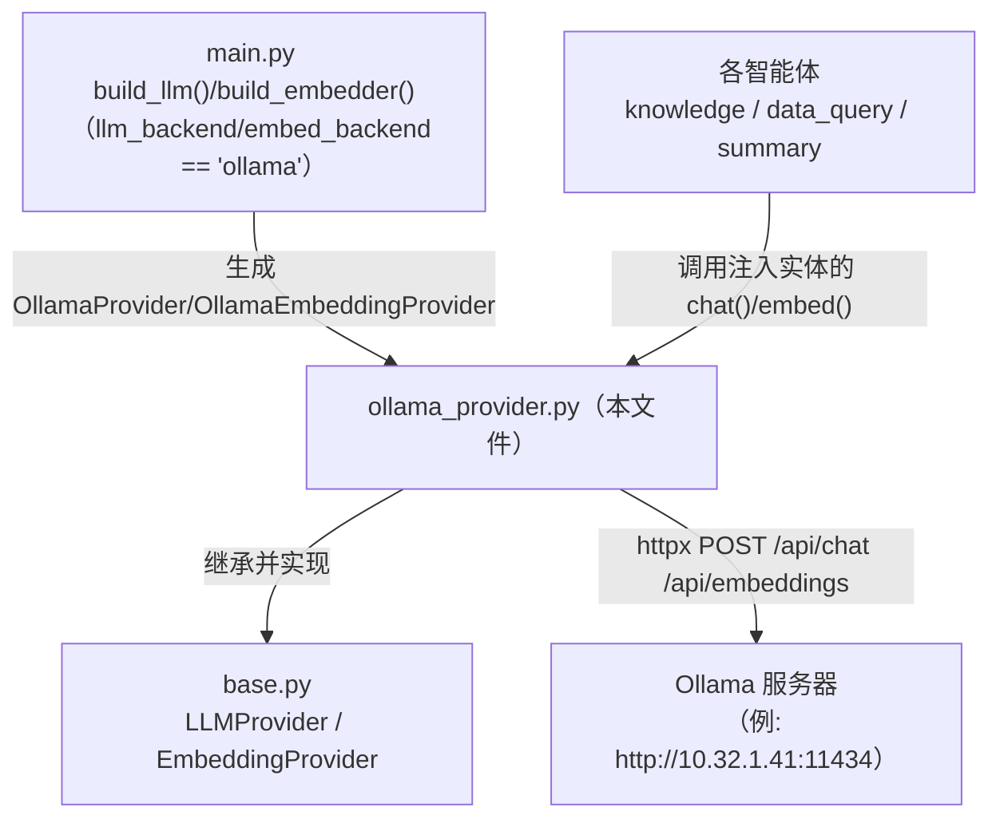
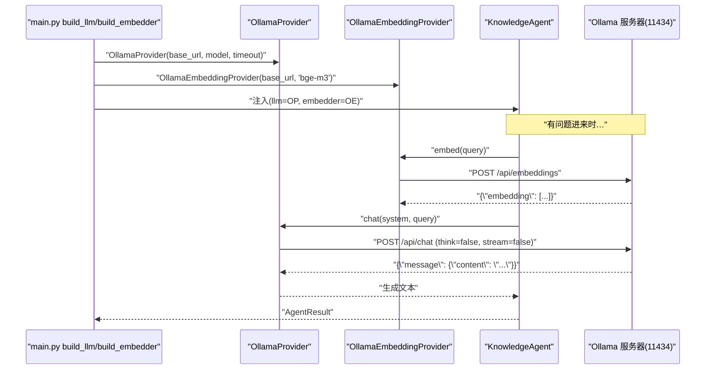

# 基本设计书（代码解说版）
## `backend/app/providers/ollama_provider.py` — Ollama 实现（本地免费 LLM）

> 本书面向初学者，用图和表解说「这个文件以什么为输入、输出什么、从哪里被调用、内部如何运作、与哪些部件相互调用」。专业术语在 §7 术语表中附中文注释。

---

## 0. 文档信息

| 项目 | 内容 |
|---|---|
| 对象文件 | `backend/app/providers/ollama_provider.py` |
| 作用（一句话） | 用 **Ollama 的原生 API** 实现 `LLMProvider`/`EmbeddingProvider`。使用本机 Ubuntu / sons02 等本地免费 LLM 的具体实现 |
| 所属层 | Provider 层（`app/providers`） |
| 公开类 | `OllamaProvider`(LLMProvider 实现) / `OllamaEmbeddingProvider`(EmbeddingProvider 实现) |
| 依赖（import）对象 | `httpx`（异步 HTTP 客户端）／ `.base.EmbeddingProvider,LLMProvider` |
| 直接调用方 | `main.py:50,58`（`build_llm`/`build_embedder` 的 `backend == "ollama"` 分支） |

---

## 1. 概述（这个部件做什么）

`ollama_provider.py` 是**把本地运行的免费 LLM（Ollama），按平台契约来调用**的实现：

1. **`OllamaProvider`** — `LLMProvider` 的实现。用 `httpx` 调 Ollama 的 **原生 `/api/chat`** 来生成文本。
2. **`OllamaEmbeddingProvider`** — `EmbeddingProvider` 的实现。用 `/api/embeddings`（bge-m3 等）做向量化。

> 💡 **设计意图（两个要点）**：
> 1. 给 `/api/chat` 传 `"think": false` 来**抑制思维链(reasoning)**。qwen3 系不管的话会吐 `<think>...</think>`。OpenAI 兼容的 `/v1` 端点关不掉，所以**用原生 API** 是关键。
> 2. **务必设置超时**。LLM 偶尔会卡死，为避免连累整个平台，用 `httpx.AsyncClient(timeout=...)` 防御。

由于和 `base.py` 是相同接口，生产环境换成 Bedrock 时智能体无需改动。

---

## 2. 系统内的位置（调用关系图）

`ollama_provider.py` 处于「被上层(main.py)选中」「实现契约(base.py)」「调用外部(Ollama 服务器)」的关系中：

- **IN（生成方）**：`main.py` 的 `ollama` 分支传入 `base_url`/`model`/`timeout` 生成。
- **OUT（实现方）**：继承 `base.py` 的抽象，填充 `chat()`/`embed()`。
- **外部依赖**：用 `httpx` 调 **Ollama 服务器的 HTTP API**（产生网络 I/O）。

---

## 3. 公开接口一览（方法速查表）

| 类.方法 | 种类 | IN（主要输入） | OUT（返回值） | 大致用途 |
|---|---|---|---|---|
| `OllamaProvider.__init__` | 同步 | base_url, model, timeout=60 | （生成） | 保存连接地址·模型·超时 |
| `OllamaProvider.chat` | 异步 | system, user, temperature | `str` | 用 `/api/chat`（think=false）生成文本 |
| `OllamaEmbeddingProvider.__init__` | 同步 | base_url, model="bge-m3", timeout=30 | （生成） | 保存连接地址·嵌入模型 |
| `OllamaEmbeddingProvider.embed` | 异步 | text | `list[float]` | 用 `/api/embeddings` 向量化 |

---

## 4. 方法详细设计

将每个方法拆解为「作用 / IN / OUT / 调用处（被谁调用） / 调用谁 / 处理逻辑 / 注意点」。

### 4.1 `OllamaProvider.__init__`（构造函数, 行20〜23）

- **作用**：接收并保存 Ollama 的连接地址·模型名·超时，仅此而已。
- **输入(IN)**

| 输入(IN) | 类型 | 含义 |
|---|---|---|
| `base_url` | `str` | Ollama 的基础 URL（例 `http://10.32.1.41:11434`） |
| `model` | `str` | 使用的模型名（例 `qwen3:8b`） |
| `timeout` | `float`=`60.0` | 单次 HTTP 调用的最大等待秒数 |

- **输出(OUT)**：无（实例生成）
- **调用处（被谁调用）**：`main.py:50`（`build_llm` 的 `llm_backend == "ollama"` 分支）
- **处理逻辑**：`base_url.rstrip("/")`（去掉末尾斜杠让 URL 拼接安全）、保存 `self.model`/`self.timeout`。

---

### 4.2 `OllamaProvider.chat`（文本生成, 行25〜40）⭐

- **作用**：`LLMProvider.chat` 的实现。请求 Ollama 的 **原生 `/api/chat`**，返回生成文本。
- **输入(IN)**

| 输入(IN) | 类型 | 含义 |
|---|---|---|
| `system` | `str` | 系统提示词 |
| `user` | `str` | 用户输入 |
| `temperature` | `float`=`0.2`（关键字专用） | 生成随机度，传给 `options.temperature` |

- **输出(OUT)**：`str`（生成文本，已去除首尾空白）／ **异步(async)**
- **调用处（被谁调用）**：（作为实例在 `main.py:50` 生成）→ 实际调用在 `knowledge_agent.py:97`、`dataquery_agent.py:58`、`summary_agent.py:45`、`orchestrator.py`(意图分类路由)
- **调用谁（依赖）**：`httpx.AsyncClient(...).post(f"{base_url}/api/chat", ...)`、`resp.raise_for_status()`、`resp.json()`
- **处理逻辑（分步）**：
  1. 拼 `payload`：`model` / `messages`(system+user) / `stream:false`（一次性接收）/ **`think:false`**（关思维链）/ `options.temperature`
  2. 用 `async with` 打开 `httpx.AsyncClient(timeout=self.timeout)`，对 `/api/chat` 发 POST
  3. `raise_for_status()`，若 HTTP 出错则抛异常（不吞掉 4xx/5xx）
  4. 取响应 JSON 的 `message.content`，`.strip()` 后返回（若无 `message` 则退避为空串）
- **注意点**：
  - **`think:false` 只在原生 `/api/chat` 上生效**，OpenAI 兼容的 `/v1` 上无效。
  - `stream:false` 一次性取全文（不处理流式的简化设计）。
  - 超时取自构造函数的 `self.timeout`，是防卡死的生命线。

---

### 4.3 `OllamaEmbeddingProvider.__init__`（构造函数, 行46〜49）

- **作用**：保存嵌入用的连接地址·模型名·超时。
- **输入(IN)**：`base_url: str`、`model: str`=`"bge-m3"`（多语言 1024 维·日语强）、`timeout: float`=`30.0`
- **输出(OUT)**：无（实例生成）
- **调用处（被谁调用）**：`main.py:58`（`build_embedder` 的 `embed_backend == "ollama"` 分支）
- **处理逻辑**：`base_url.rstrip("/")`、保存 `self.model`/`self.timeout`。

---

### 4.4 `OllamaEmbeddingProvider.embed`（向量化, 行51〜58）

- **作用**：`EmbeddingProvider.embed` 的实现。用 Ollama 的 `/api/embeddings` 把文本向量化。
- **输入(IN)**：`text: str`
- **输出(OUT)**：`list[float]`（模型返回的维度的向量。bge-m3 为 1024 维）／ **异步(async)**
- **调用处（被谁调用）**：（在 `main.py:58` 生成）→ 实际调用在 `knowledge_agent.py:57`(文档侧)、`knowledge_agent.py:72`(查询侧)
- **调用谁（依赖）**：`httpx.AsyncClient(...).post(f"{base_url}/api/embeddings", ...)`、`resp.raise_for_status()`、`resp.json()`
- **处理逻辑（分步）**：
  1. 打开 `async with httpx.AsyncClient(timeout=self.timeout)`
  2. 对 `/api/embeddings` POST `{"model": ..., "prompt": text}`
  3. 用 `raise_for_status()` 检测错误
  4. 直接返回 `resp.json()["embedding"]`
- **注意点**：返回值的维度**依赖模型**（bge-m3=1024）。与 `HashingEmbedding`(256) 不兼容，所以**索引与查询要用同一 embedder** 生成（统一维度的责任在注入方）。

---

## 5. 数据流（ollama backend 下 /chat 如何运作）

---

## 6. 相互引用表

| 本文件的方法 | 调用处（被谁调用） | 调用谁（依赖） |
|---|---|---|
| `OllamaProvider.__init__` | `main.py:50` | — |
| `OllamaProvider.chat` | 实调: `knowledge_agent.py:97`, `dataquery_agent.py:58`, `summary_agent.py:45`, `orchestrator.py`(意图分类) | `httpx.AsyncClient.post(/api/chat)`, `raise_for_status`, `resp.json` |
| `OllamaEmbeddingProvider.__init__` | `main.py:58` | — |
| `OllamaEmbeddingProvider.embed` | 实调: `knowledge_agent.py:57,72` | `httpx.AsyncClient.post(/api/embeddings)`, `raise_for_status`, `resp.json` |

> 相关文件：`base.py`（实现的契约）／`local_provider.py`（无模型时的降级）／`bedrock_provider.py`（生产 AWS 的替换目标）／`main.py`（`build_llm`/`build_embedder` 的选择）

---

## 7. 术语表

| 术语（日/英） | 中文注释 |
|---|---|
| Ollama | 在本地运行 LLM 的免费运行时。提供 `/api/chat` `/api/embeddings` 等 HTTP API |
| ネイティブAPI / native API | Ollama 自有的 `/api/*` 端点，与 OpenAI 兼容的 `/v1` 区分 |
| OpenAI互換 / OpenAI-compatible `/v1` | 与 OpenAI 形状相同的 API。兼容性高但 `think:false` 等私有选项无效 |
| 思考連鎖 / reasoning・`<think>` | **思维链**。模型在回答前先把思考写出来的行为。用 `think:false` 抑制以让输出简洁 |
| `httpx` / 非同期HTTPクライアント | **异步 HTTP 客户端**。支持 `async` 的 HTTP 库，等待 I/O 时可推进其他处理 |
| `AsyncClient` | `httpx` 的异步客户端。用 `async with` 开闭并管理连接 |
| `raise_for_status` | 把 HTTP 的 4xx/5xx 转成异常，不吞错而传给上层 |
| ストリーミング / streaming（`stream`） | 逐步接收生成的方式。这里设为 `false`＝一次性取全文 |
| タイムアウト / timeout | 到一定时间就中止处理。防止 LLM 卡死连累整个平台 |
| 埋め込み / embedding | **嵌入/向量化**。把文本转成定长向量 |
| bge-m3 | 多语言嵌入模型（1024 维）。日语强，适合 RAG 检索 |
| 次元数 / dimension | 向量的长度。bge-m3=1024、HashingEmbedding=256，因实现而异 |
| 非同期 / async・await | **异步**。在等待 I/O 时可推进其他任务的机制。处理多请求所必需 |
| キーワード専用引数 / keyword-only | `*` 之后的参数。只能用 `f(x, key=val)` 形式传 |

---

> **若要把本模板套用到其他文件**：§0〜§7 的框架照搬，§4 的「作用/IN/OUT/调用处/调用谁/逻辑/注意点」逐个方法填入即可。
