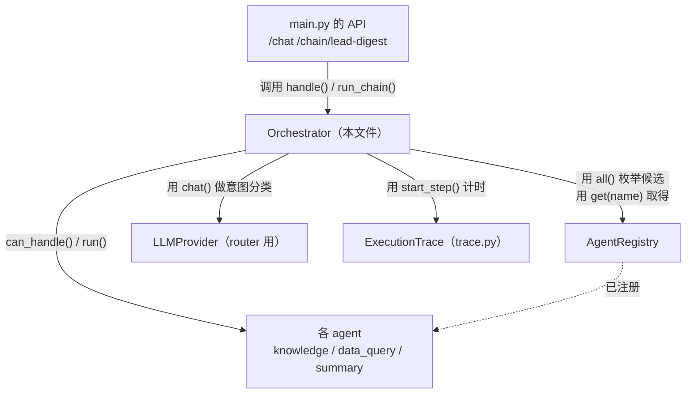
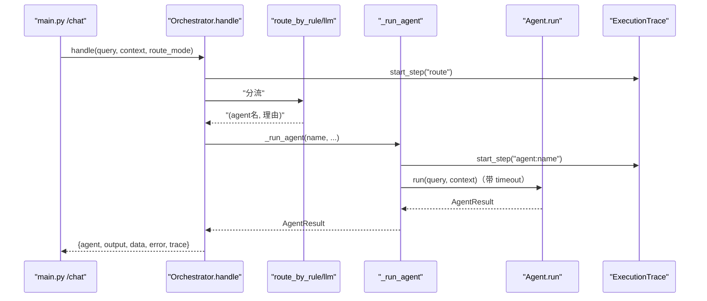
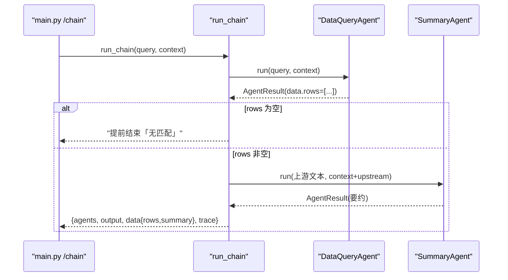
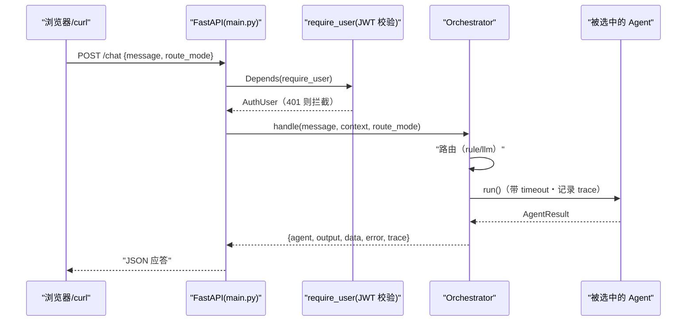

# 基本设计书（代码解说版）
## `backend/app/core/orchestrator.py` — 编排层

> 本书面向初学者，用图和表解说「这个文件以什么为输入、输出什么、被谁调用、内部如何运转、与哪些部件相互调用」。专业术语在 §7 术语表附中文注释。

---

## 0. 文档信息

| 项目 | 内容 |
|---|---|
| 对象文件 | `backend/app/core/orchestrator.py` |
| 作用（一句话） | 平台的**司令塔**。决定「由哪个 agent 处理」（路由）、执行它、把多个 agent 串联（chain）起来，并记录处理状况（trace） |
| 所属层 | 核心层（`app/core`） |
| 公开类 | `Orchestrator` |
| 依赖（import）对象 | `registry.AgentRegistry` / `base_agent.AgentResult` / `trace.ExecutionTrace,StepStatus` / `providers.base.LLMProvider` |
| 直接调用方 | `app/main.py`（`/chat`・`/chain/lead-digest`・`/connectors/...` 各 API） |

---

## 1. 概述

`Orchestrator`（编排器/指挥器）**自己不做任何业务**。它只做下面 3 件事：

1. **路由（routing / 路由）** — 看用户输入，决定「交给 Knowledge / DataQuery / Summary 中的哪一个」。决定方式有 2 种（规则式 / LLM 意图分类）。
2. **执行＋串联** — 执行单个 agent 的 `handle()`，把多个 agent 串成一串的 `run_chain()`。
3. **追踪（observability / 观测）** — 记录每一步的成败、处理耗时、错误后返回。

> 💡 **设计意图**：这个类**不 import** 具体的 agent（如 KnowledgeAgent 等），只通过 `registry` 触碰。所以即使增减 agent，这个文件也**一行都不用改**（＝OCP，见 §7）。

---

## 2. 系统内的位置（调用关系图）

`Orchestrator`「被上层（API）调用」「调用下层（registry/agent/llm/trace）」的关系：



- **IN（进来的一侧）**：`main.py` 的各端点调用 `orch.handle(...)` / `orch.run_chain(...)`。
- **OUT（出去的一侧）**：`Orchestrator` 调用 `registry`・`agent`・`LLMProvider`・`trace` 来干活。

---

## 3. 公开接口一览

| 方法 | 类型 | IN（主要输入） | OUT（返回值） | 大致用途 |
|---|---|---|---|---|
| `__init__` | 同步 | registry, router_llm, default_agent, step_timeout | （生成实例） | 接收依赖并保存 |
| `route_by_rule` | 同步 | query, context | `(agent名, 理由)` | 按关键词得分分流 |
| `route_by_llm` | 异步 | query, context | `(agent名, 理由)` | 让 LLM 做意图分类后分流 |
| `handle` | 异步 | query, context, route_mode | `dict`（后述） | **主入口**：分流→执行 |
| `run_chain` | 异步 | query, context | `dict`（后述） | 串联：DataQuery→Summary |
| `_run_agent` | 异步（内部） | name, query, context, trace | `AgentResult` | 安全执行 1 个 agent |
| `_parse_agent_choice` | 同步（内部） | raw（LLM 输出） | `agent名 str` | 从 LLM 应答中抽取 JSON |

---

## 4. 方法详细设计

每个方法拆为「作用 / 输入(IN) / 输出(OUT) / 调用处 / 调用谁 / 处理逻辑 / 注意点」。

### 4.1 `__init__`（构造函数, 行31〜45附近）

- **作用**：接收依赖（registry、router 用 LLM、默认 agent 名、超时秒数），保存到实例变量，仅此而已。
- **输入(IN)**

| 参数 | 类型 | 含义 |
|---|---|---|
| `registry` | `AgentRegistry` | agent 的注册簿。只通过它触碰 agent |
| `router_llm` | `LLMProvider` | 意图分类用的 LLM（可与 agent 本体分开注入） |
| `default_agent` | `str`=`"knowledge"` | 没人举手时的兜底分流目标 |
| `step_timeout` | `float`=`60.0` | 单步最大等待秒数（防止失控） |

- **输出(OUT)**：无（生成实例）
- **调用处**：`app/main.py:93`（`build_platform()` 内）、`tests/test_smoke.py:33`
- **调用谁**：无
- **处理逻辑**：仅把参数赋给 `self.xxx`。＝接收**依赖注入(DI)** 的入口。
- **注意点**：纯保存依赖，不创建任何对象，便于替换/测试。

---

### 4.2 `route_by_rule`（规则式路由, 行47〜63）

- **作用**：比较各 agent 的 `can_handle()` 得分，选分数最高的 agent。不用 LLM 的高速、免费、确定性分流。
- **输入(IN)**

| 参数 | 类型 | 含义 |
|---|---|---|
| `query` | `str` | 用户输入文本 |
| `context` | `dict` | 共享状态（此处未使用，仅为统一签名） |

- **输出(OUT)**：`tuple[str, str]` = `(被选中的 agent名, 理由字符串)`
  - 例：`("data_query", "rule best=data_query(0.60) all=[...]")`
- **调用处**：
  - `handle()` 内 `orchestrator.py:118`（route_mode=rule 时）
  - `route_by_llm()` 内 `orchestrator.py:82`（**LLM 失败时的兜底**）
  - `tests/test_smoke.py:45, 51`
- **调用谁**：`self.registry.all()` → 各 `agent.can_handle(query, context)`
- **处理逻辑（分步）**：
  1. 用 `registry.all()` 枚举全部 agent，逐个调用 `can_handle()` 生成 `(name, score)` 列表
  2. 按 score 降序排序
  3. 最高分 `≤ 0.0` → 没人能处理 → 返回 `default_agent`（兜底）
  4. 否则 → 返回最高分的 agent 名
- **注意点**：`can_handle` 返回 `float`（而非 bool），因此「多个 agent 举手时能分出优劣」。这是冲突消解的关键。

---

### 4.3 `route_by_llm`（LLM 意图分类路由, 行65〜84）

- **作用**：把各 agent 的 `name`/`description` 作为选项交给 LLM，让它用 JSON 选出最合适的 1 个。对换种说法、含糊输入更鲁棒。
- **输入(IN)**：`query: str`, `context: dict`
- **输出(OUT)**：`tuple[str, str]` = `(agent名, 理由)` ／ **异步(async)**
- **调用处**：`handle()` 内 `orchestrator.py:116`（route_mode=llm 时）
- **调用谁**：
  - `self.registry.all()`（生成 description 的目录）
  - `self.router_llm.chat(system, query)`（调用 LLM）
  - `self._parse_agent_choice(raw)`（解析应答）
  - `self.route_by_rule(...)`（**返回了奇怪的名字时退回规则式**）
- **处理逻辑（分步）**：
  1. 把各 agent 的 `name: description` 换行连接成目录
  2. 组出「必须只返回 `{"agent": "...", "reason": "..."}`」的 system 提示词
  3. 用 `router_llm.chat()` 让其分类（temperature=0.0 ＝ 不抖动）
  4. 用 `_parse_agent_choice()` 取出 agent 名
  5. 若该名字未注册，则兜底到 `route_by_rule()`（鲁棒性）
- **注意点**：LLM 虽聪明但不稳定。**一定用规则式接住**，做成两段式保险。

---

### 4.4 `handle`（主入口：分流→执行, 行109〜137）⭐

- **作用**：`/chat` 的主体。路由后执行 1 个 agent，返回结果＋追踪。
- **输入(IN)**

| 参数 | 类型 | 含义 |
|---|---|---|
| `query` | `str` | 用户输入 |
| `context` | `dict` | 认证用户、连接器等共享状态 |
| `route_mode` | `str`=`"rule"` | `"rule"` 或 `"llm"`（仅关键字参数） |

- **输出(OUT)**：`dict`

```json
{
  "agent": "data_query",
  "output": "命中 1 件：...",
  "data": { "rows": [...], "params": {...} },
  "error": null,
  "trace": { "route_mode": "rule", "chosen_agent": "data_query",
             "total_ms": 2.2, "steps": [ ... ] }
}
```

- **调用处**：`app/main.py:169`（`chat()` 端点）、`tests/test_smoke.py:58, 82, 90`
- **调用谁**：`ExecutionTrace()` / `trace.start_step()` / `route_by_llm()` 或 `route_by_rule()` / `_run_agent()`
- **处理逻辑（分步）**：
  1. 开始计时（`time.perf_counter()`），创建 `ExecutionTrace`
  2. **路由**：看 `route_mode` 调用 `route_by_llm` 或 `route_by_rule`，把选中的 agent 名记入 `trace.chosen_agent`
  3. **执行**：用 `_run_agent()` 执行。即使抛异常也用 `try/except` 接住，整形进 `error`，并**保证 trace 一定返回**（死守可观测性）
  4. 把总处理耗时记入 `trace.total_ms`
  5. 汇总成 `dict` 返回



- **注意点**：超时与异常处理**统一在 handle/_run_agent 这一侧**照看，不让各 agent 去写（＝横切关注点的集中）。

---

### 4.5 `run_chain`（串联：DataQuery→Summary, 行142〜184）⭐

- **作用**：把多个 agent 串成一串。演示「在数据库抽取客户 → 把该列表做要约」。多 agent 整合的核心。
- **输入(IN)**：`query: str`, `context: dict`
- **输出(OUT)**：`dict`（`agents` 是按执行顺序的数组，`data` 里含 `rows` 和 `summary`，带 `trace`）
- **调用处**：`app/main.py:181`（`chain_lead_digest()`）、`tests/test_smoke.py:70`
- **调用谁**：`registry.get("data_query").run()` → `registry.get("summary").run()`、`trace.start_step()`
- **处理逻辑（分步）**：
  1. step1：执行 `data_query`，得到结构化数据 `dq.data["rows"]`
  2. **0 件则提前结束**（不调用下游 Summary ＝ 避免无谓的 LLM 调用）
  3. step2：用 `context["upstream"] = dq.data`**把上游结果传给下游**（＝agent 间状态共享），执行 `summary`
  4. 把 `rows` 和 `summary` 一起返回



- **注意点**：状态传递**经由 `context` 字典**。agent 不直接触碰彼此的类 → 串联组合可自由改换。

---

### 4.6 内部辅助方法

#### `_run_agent`（行98〜104）
- **作用**：按名字取出 agent，**带超时**执行 `run()`，并在追踪里刻一步。
- **输入(IN)**：`name, query, context, trace` ／ **输出(OUT)**：`AgentResult`
- **调用处**：`handle()` `orchestrator.py:125`
- **调用谁**：`registry.get(name)` / `asyncio.wait_for(agent.run(...), timeout=step_timeout)` / `trace.start_step()`
- **处理逻辑（分步）**：①取 agent；②`async with` 计时块内 `asyncio.wait_for` 执行 `run()`；③把输出摘要写入该步 `detail`。
- **注意点**：超时由 `asyncio.wait_for` 实现，超时异常会被 `_StepTimer` 标为 `TIMEOUT` 并向上抛。

#### `_parse_agent_choice`（行86〜93, 静态方法）
- **作用**：从 LLM 的应答文本中切出 `{...}`，取 `agent` 字段。若损坏则返回空字符串。
- **输入(IN)**：`raw: str`（LLM 原始输出） ／ **输出(OUT)**：`str`（agent名 或 `""`）
- **调用处**：`route_by_llm()`（解析应答处）
- **调用谁**：`json.loads`
- **处理逻辑（分步）**：①定位首个 `{` 与末个 `}` 切片；②`json.loads` 解析；③取 `agent` 键，解析失败则返回 `""`。
- **注意点**：用 try/except 包住解析，LLM 输出不规整时不会让上层崩溃。

---

## 5. 数据流

`POST /chat` 进来到返回为止，以 `Orchestrator` 为中心如何流动：



---

## 6. 相互引用表

把「从哪来、到哪去」汇成一表，作为代码追踪的地图使用。

| 本文件的方法 | 调用处 | 调用谁（依赖） |
|---|---|---|
| `__init__` | `main.py:93`, `test_smoke.py:33` | — |
| `route_by_rule` | `handle`(`orchestrator.py:118`), `route_by_llm`(`:82`), `test_smoke.py:45,51` | `registry.all()`, `agent.can_handle()` |
| `route_by_llm` | `handle`(`orchestrator.py:116`) | `registry.all()`, `router_llm.chat()`, `_parse_agent_choice()`, `route_by_rule()` |
| `handle` | `main.py:169`(`/chat`), `test_smoke.py:58,82,90` | `ExecutionTrace`, `route_by_*`, `_run_agent` |
| `run_chain` | `main.py:181`(`/chain/lead-digest`), `test_smoke.py:70` | `registry.get().run()`(data_query, summary), `trace` |
| `_run_agent` | `handle`(`orchestrator.py:125`) | `registry.get()`, `asyncio.wait_for`, `agent.run()`, `trace` |
| `_parse_agent_choice` | `route_by_llm` | `json.loads` |

> 关联文件：`registry.py`（注册簿）／`base_agent.py`（`AgentResult` 的形状）／`trace.py`（计时）／`agents/*`（实处理）／`main.py`（调用方）

---

## 7. 术语表

| 术语（日/英） | 中文注释 |
|---|---|
| オーケストレーション / orchestration | **编排**。在上层统筹多个部件（agent）的执行顺序与协作 |
| ルーティング / routing | **路由**。决定「把输入交给哪个处理担当」 |
| エージェント / agent | 完成某一件事的处理单元（这里是 Knowledge/DataQuery/Summary） |
| レジストリ / registry | **注册簿**。把部件登记起来、用名字取出的间接层 |
| OCP（開放閉鎖原則） | **开放封闭原则**。对扩展开放、对修改封闭。加新 agent 不改本体 |
| フォールバック / fallback | **降级/退避**。主选失败时切换到更可靠的手段 |
| 横断的関心事 / cross-cutting concern | **横切关注点**。超时、日志等所有处理都共同需要的事项，在上层集中照看 |
| タイムアウト / timeout | **超时**。到一定时间就中断处理。用 `asyncio.wait_for` 实现 |
| 非同期 / async・await | **异步**。I/O 等待时可切去处理别的，是支撑高并发的前提 |
| トレース / observability | **可观测性**。记录每步成败、耗时，使运行后可追溯 |
| 意図分類 / intent classification | **意图分类**。让 LLM 判定「这条输入属于哪一类」 |
| 構造化データ / structured data | **结构化数据**。`AgentResult.data` 这种机器可处理的形态（dict/list） |
| 依存性注入 / DI | **依赖注入**。部件不自己创建依赖，而是从外部传入，便于替换 |
| 状態共有 / state sharing | **状态共享**。agent 间传递中间结果。本实现经由 `context` 字典 |

---

> **把此模板套到其他文件时**：§0〜§7 框架照用，把 §4 的「作用/IN/OUT/调用处/调用谁/逻辑/注意点」逐个套到每个方法上填写即可。
