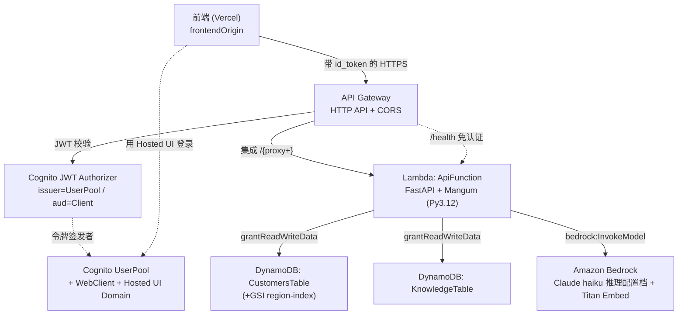
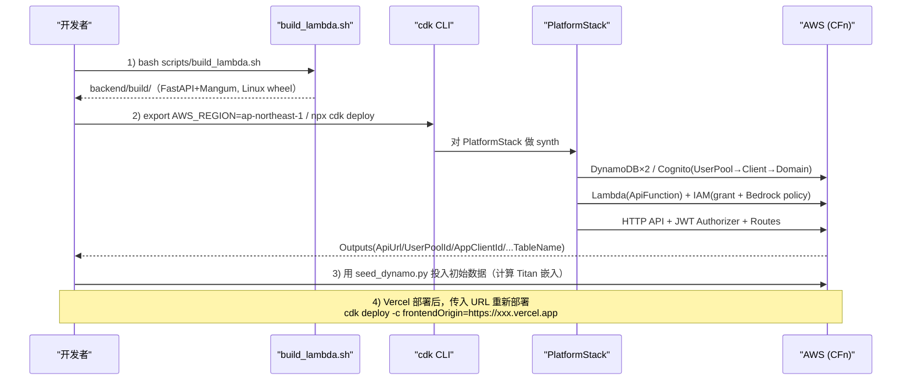

# 基本设计书（代码解说版）
## `infra/lib/platform-stack.ts` — 平台全套的 CDK 栈定义

> 本书面向初学者，用图和表解说「这个栈用什么设置、如何相连，定义了哪些 AWS 资源」。专业术语在 §7 术语表附中文注释。**本项目的基础设施本体（最重要文件）。**

---

## 0. 文档信息

| 项目 | 内容 |
|---|---|
| 对象文件 | `infra/lib/platform-stack.ts` |
| 作用（一句话） | 把 AI 智能体统合平台的**全部 AWS 资源用 1 个栈定义**。DynamoDB×2 / Cognito / Lambda / IAM 最小权限 / API Gateway HTTP API + JWT Authorizer + CORS |
| 层 | IaC（基础设施定义）／CDK Stack 层（`lib/`） |
| 公开类 | `PlatformStack`（继承 `cdk.Stack`）／`PlatformStackProps`（props 接口） |
| 依赖（import）方 | `aws-cdk-lib`（`cdk`）／`aws-cdk-lib/aws-dynamodb`·`aws-lambda`·`aws-iam`·`aws-cognito`／`aws-cdk-lib/aws-apigatewayv2`(+integrations,+authorizers)／`constructs` |
| 直接的调用方 | `infra/bin/app.ts`（`new PlatformStack(app, "AiAgentPlatform", {...})`） |
| 设计方针 | TS 面向初学者保持**简单**（CLAUDE.md）／IAM 走**最小权限**／全资源统一打标签／练习用 `RemovalPolicy.DESTROY` |

---

## 1. 概述（这个栈创建什么）

`PlatformStack` 把让既有 FastAPI 后端以 **AWS 无服务器构成**运行所需的资源，汇总到 1 个栈中声明。内容大致分 4 个区块：

1. **DynamoDB ×2** — 客户表 `CustomersTable`（+ GSI `region-index`）与知识表 `KnowledgeTable`。
2. **Cognito** — UserPool（认证台账）/ WebClient（SPA 用公开客户端）/ Hosted UI 域名。
3. **Lambda** — `ApiFunction`。取入事先构建好的 `backend/build/`（FastAPI + Mangum）。赋予生产构成的 env 与 IAM 最小权限（DynamoDB 2 表 + Bedrock haiku/Titan）。
4. **API Gateway HTTP API** — Lambda 集成 + Cognito JWT Authorizer + CORS。`/health` 免认证，其余(`/{proxy+}`)必须认证。

最后用 `CfnOutput` 输出前端 env 或 seed 脚本要用的值（ApiUrl / UserPoolId / AppClientId / 各表名 等）。

> 💡 **设计意图**：用 env 变量给 Lambda 传「用哪个 backend」的开关（`LLM_BACKEND=bedrock` 等），由代码(`backend/app/config.py` → `main.py` 的 `build_*()`)选择真正的 AWS 实现。**基础设施侧只是拨动开关**，用同一份代码在本地(echo/sqlite/hs256)与生产(bedrock/dynamo/cognito)间切换（参见 §4.5 的对应表）。

---

## 2. 系统内的位置（栈构成图）

`PlatformStack` 定义的资源，以及请求的流向：

- **IN（进来的一侧）**：`bin/app.ts` 生成本栈。来自前端的请求由 API Gateway 接收。
- **OUT（出去的一侧）**：Lambda 调用 DynamoDB / Bedrock。认证由 Cognito 担当。用 `CfnOutput` 把各类 ID/URL 输出到外部。

---

## 3. 定义资源一览（逻辑ID·类别·用途）

| 逻辑ID（construct id） | 类别（CFn 资源） | 用途 |
|---|---|---|
| `CustomersTable` | `AWS::DynamoDB::Table` | 客户主数据。PK=`id`。为按地域检索＋销售额排序用 GSI |
| `region-index`（GSI） | DynamoDB GSI | PK=`region`, SK=`monthly_revenue`。按地域·销售额顺序访问 |
| `KnowledgeTable` | `AWS::DynamoDB::Table` | FAQ 知识。PK=`id`。保存 `text` 与 seed 时计算的 `vector` |
| `UserPool` | `AWS::Cognito::UserPool` | 用户认证台账。email 登录，可自助注册 |
| `WebClient` | `AWS::Cognito::UserPoolClient` | SPA(Vercel) 用公开客户端。Auth Code + PKCE |
| `HostedUiDomain` | `AWS::Cognito::UserPoolDomain` | 托管 UI 域名（`aiagent-<account>`） |
| `ApiFunction` | `AWS::Lambda::Function` | FastAPI 本体（Mangum 包裹）。Python 3.12 |
| （IAM inline policy） | `AWS::IAM::Policy` | 给 `ApiFunction` 角色的 Bedrock InvokeModel 许可 |
| `LambdaIntegration` | HTTP API Integration | API Gateway → Lambda 的代理集成 |
| `CognitoAuthorizer` | `AWS::ApiGatewayV2::Authorizer` | 校验 id_token 的 JWT Authorizer |
| `HttpApi` | `AWS::ApiGatewayV2::Api` | HTTP API 本体（含 CORS 预检设置） |
| `/health` 路由 | HTTP API Route | 免认证的连通性确认用 |
| `/{proxy+}` 路由 | HTTP API Route | 上述以外全部。必须 Cognito 认证 |
| `ApiUrl` 等 8 件 | `AWS::CloudFormation::Output` | 前端 env / seed 引用的输出值 |

---

## 4. 资源定义详细

把各资源按「作用 / 主要设置 / 输入输出 / 关联 / 注意点」分解。

### 4.0 栈的骨架（行28〜41）

- **`PlatformStackProps`（行28〜31）**：扩展 `cdk.StackProps`，额外加 1 个 `frontendOrigin: string`（前端生产来源）。用于 CORS 和 Cognito 回调。
- **构造函数开头（行34〜41）**：
  - 从 `cdk.Stack.of(this)` 取 `region` / `account`（用于拼装 ARN 和 Outputs）。
  - 用 `cdk.Tags.of(this).add("project", "ai-agent-platform")` 给**全资源统一打标签**（便于善后＝CLAUDE.md 方针）。

---

### 4.1 DynamoDB — `CustomersTable`（行47〜56）

- **作用**：客户主数据。`DataQueryAgent` 按地域·业种·销售额检索的对象。
- **主要设置（属性表）**

| 属性 | 值 | 含义 |
|---|---|---|
| `partitionKey` | `{ name: "id", type: STRING }` | 分区键（主键） |
| `billingMode` | `PAY_PER_REQUEST` | 按需计费。无需容量预配（CLAUDE.md 默认） |
| `removalPolicy` | `DESTROY` | 练习用。`cdk destroy` 时连表一起删除 |
| GSI `region-index` | PK=`region`(S), SK=`monthly_revenue`(N) | 用于按地域过滤，并按销售额排序/范围检索 |

- **输入输出（引用的值·传给别人的值）**：把 `tableName`（自动编号）传给 Lambda 的 env `CUSTOMERS_TABLE` 和 `CfnOutput CustomersTableName`。
- **关联**：用 `customersTable.grantReadWriteData(fn)`（§4.4）给 Lambda 授予读写权限。
- **注意点**：`PAY_PER_REQUEST` 最适合不可预测/低流量的练习。GSI 是后续要用的，因此 `DataQueryAgent` 侧的查询（DynamoCustomerRepo）须与 `region-index` 的名字一致。`DESTROY` **在生产应改为 `RETAIN`**（防止数据丢失）。

---

### 4.2 DynamoDB — `KnowledgeTable`（行59〜63）

- **作用**：FAQ/知识库。`KnowledgeAgent` 做相似检索的对象。保存 `text`（正文）与 `vector`（嵌入向量，seed 时用 Titan 计算）。
- **主要设置（属性表）**

| 属性 | 值 | 含义 |
|---|---|---|
| `partitionKey` | `{ name: "id", type: STRING }` | 主键 |
| `billingMode` | `PAY_PER_REQUEST` | 按需计费 |
| `removalPolicy` | `DESTROY` | 练习用删除 |

- **输入输出**：把 `tableName` 传给 Lambda env `KNOWLEDGE_TABLE` 和 `CfnOutput KnowledgeTableName`。
- **关联**：`knowledgeTable.grantReadWriteData(fn)`（§4.4）。
- **注意点**：向量是事先计算并按列保存的简易 RAG（DynamoDB 不原生支持向量检索）。前提是 seed 脚本(`scripts/seed_dynamo.py`)计算 Titan 嵌入后投入。不需要 GSI，所以没加。

---

### 4.3 Cognito（行68〜95）

用 3 个资源构成「令牌签发侧＝认证担当」。

#### 4.3.1 `UserPool`（行68〜74）

- **作用**：用户认证台账。掌管注册/登录/令牌签发。
- **主要设置（属性表）**

| 属性 | 值 | 含义 |
|---|---|---|
| `selfSignUpEnabled` | `true` | 允许自助注册（练习用） |
| `signInAliases` | `{ email: true }` | 用 email 登录 |
| `autoVerify` | `{ email: true }` | 把 email 列为自动验证对象 |
| `passwordPolicy` | minLength 8 / digits / lowercase 必填 | 密码强度 |
| `removalPolicy` | `DESTROY` | 练习用删除 |

- **输入输出**：把 `userPoolId` 传给 Lambda env `COGNITO_USER_POOL_ID`、Authorizer 的 issuer、Outputs。
- **注意点**：因为是 `DESTROY`，所以连用户一起消失（面向练习）。生产推荐 `RETAIN`。

#### 4.3.2 `WebClient`（`userPool.addClient`, 行77〜90）

- **作用**：SPA(Vercel) 用的公开客户端。因为运行在浏览器，所以**无密钥**，使用 Authorization Code + PKCE 流程。
- **主要设置（属性表）**

| 属性 | 值 | 含义 |
|---|---|---|
| `generateSecret` | `false` | 公开客户端（SPA 无法安全持有密钥） |
| `oAuth.flows` | `authorizationCodeGrant: true` | 授权码流程（+ PKCE） |
| `oAuth.scopes` | `OPENID, EMAIL, PROFILE` | 获取的作用域 |
| `callbackUrls` | `${frontendOrigin}/`, `http://localhost:3000/` | 登录后的回跳地址 |
| `logoutUrls` | 同上 | 登出后的回跳地址 |
| `supportedIdentityProviders` | `COGNITO` | 仅 Cognito 自有用户 |

- **输入输出**：把 `userPoolClientId` 传给 Lambda env `COGNITO_APP_CLIENT_ID`、Authorizer 的 `jwtAudience`、Outputs `AppClientId`。
- **关联**：把 `frontendOrigin`（props）展开到 callback/logout。因此 Vercel 的 URL 一变就需要**重新部署**（§5，`-c frontendOrigin=...`）。
- **注意点**：`callbackUrls` 中同时放入 localhost 和生产，使本地开发和生产两边都能登录。采用 PKCE，使 SPA 也能安全地交换授权码。

#### 4.3.3 `HostedUiDomain`（`userPool.addDomain`, 行93〜95）

- **作用**：Cognito 托管 UI（登录画面）的域名。以 `https://aiagent-<account>.auth.<region>.amazoncognito.com` 提供登录画面。
- **主要设置**：`cognitoDomain: { domainPrefix: "aiagent-" + account }`
- **输入输出**：向 `CfnOutput HostedUiDomain` 输出 `<domainName>.auth.<region>.amazoncognito.com`。
- **注意点（⚠️ CLAUDE.md 的坑）**：**域名前缀中不能包含字符串 `cognito`**（被 Cognito 侧保留而拒绝）。本代码用 `aiagent-` 前缀规避。加入 account 号也确保了前缀的**全局唯一性**。

---

### 4.4 Lambda — `ApiFunction`（行100〜142）⭐

- **作用**：平台本体。取入用 Mangum 包裹既有 FastAPI 的 `backend/build/`，从 API Gateway 接收全部请求。
- **主要设置（属性表）**

| 属性 | 值 | 含义 |
|---|---|---|
| `runtime` | `PYTHON_3_12` | 运行环境 |
| `handler` | `"handler.handler"` | `build/handler.py` 的 `handler`（Mangum 适配器） |
| `code` | `Code.fromAsset(backend/build)` | 事先构建好的目录（无需 Docker） |
| `timeout` | `30 秒` | 与 API GW HTTP API 的上限对齐 |
| `memorySize` | `512 MB` | 内存（= 也影响 CPU 分配） |
| `environment` | 见下表 | 传入 backend 开关与连接目标 |

- **环境变量（用 env 传给 Lambda 的值 → 代码侧的生效处）**：在 §4.5 的对应表详述。要点是用 `LLM_BACKEND=bedrock` 等**选择真正的 AWS 实现**，用 `*_TABLE`/`COGNITO_*` 告知连接目标，用 `CORS_ALLOW_ORIGINS=""` **禁用 FastAPI 侧 CORS**（CORS 由 API GW 统一附加＝避免双重附加）。

- **输入输出（引用的值）**：把 `customersTable.tableName` / `knowledgeTable.tableName` / `region` / `userPool.userPoolId` / `userPoolClient.userPoolClientId` 注入 env。
- **关联（grant / 权限）**：
  - `customersTable.grantReadWriteData(fn)`（行126）— 客户表的读写
  - `knowledgeTable.grantReadWriteData(fn)`（行127）— 知识表的读写
  - **Bedrock InvokeModel 策略**（行130〜142, `fn.addToRolePolicy`）：

| 许可 | 资源 ARN | 作用 |
|---|---|---|
| `bedrock:InvokeModel` | `arn:aws:bedrock:*::foundation-model/anthropic.claude-haiku-4-5-20251001-v1:0` | Claude haiku 的**基础模型**（因推理配置档会路由到各地域，故 region 为 `*`） |
| 〃 | `arn:aws:bedrock:<region>:<account>:inference-profile/jp.anthropic.claude-haiku-4-5-20251001-v1:0` | **地域推理配置档**本体（东京 `jp.` 前缀） |
| 〃 | `arn:aws:bedrock:<region>::foundation-model/amazon.titan-embed-text-v2:0` | **Titan 嵌入**（普通的 foundation-model） |

- **注意点（⚠️ 重要）**：
  - **东京的 Bedrock Claude 必须 INFERENCE_PROFILE**。直接调 model-id 会 `ValidationException`。因此 env `BEDROCK_MODEL_ID` 也是 `jp.anthropic...` 的推理配置档 ID。
  - **IAM 同时需要 foundation-model ARN 和 inference-profile ARN**。调 Claude 是「经由推理配置档调用基础模型」，缺一就会 `AccessDeniedException`。
  - Titan 嵌入不需要推理配置档，所以只需 foundation-model ARN。
  - 因为是 `Code.fromAsset(backend/build)`，所以**`cdk deploy` 前需用 `bash scripts/build_lambda.sh` 构建**（README 部署节）。最小权限：DynamoDB 仅限当事 2 表，Bedrock 仅限 haiku + Titan。

---

### 4.5 env 变量 ↔ 代码侧开关的对应（`config.py` / `main.py`）

传给 Lambda `environment` 的各值，在 `backend/app/config.py`（`Settings`）和 `main.py` 的 `build_*()` 中如何生效：

| env 变量（infra） | 值 | `config.py` 的项目 | 在 `main.py` 的生效处 |
|---|---|---|---|
| `LLM_BACKEND` | `bedrock` | `settings.llm_backend` | `build_llm()` → 选 `BedrockProvider(bedrock_model_id, aws_region)` |
| `EMBED_BACKEND` | `bedrock` | `settings.embed_backend` | `build_embedder()` → `BedrockEmbedding(bedrock_embed_model, aws_region)` |
| `DATA_BACKEND` | `dynamo` | `settings.data_backend` | `build_customer_repo()`/`build_kb_repo()` → 选 `Dynamo*Repo` |
| `AUTH_BACKEND` | `cognito` | `settings.auth_backend` | `security.require_user` 用 Cognito JWKS 校验 id_token |
| `BEDROCK_MODEL_ID` | `jp.anthropic.claude-haiku-4-5-...` | `settings.bedrock_model_id` | `BedrockProvider` 调用的模型 |
| `BEDROCK_EMBED_MODEL` | `amazon.titan-embed-text-v2:0` | `settings.bedrock_embed_model` | `BedrockEmbedding` 的嵌入模型 |
| `CUSTOMERS_TABLE` | `customersTable.tableName` | `settings.customers_table` | `DynamoCustomerRepo` 的对象表名 |
| `KNOWLEDGE_TABLE` | `knowledgeTable.tableName` | `settings.knowledge_table` | `DynamoKbRepo` 的对象表名 |
| `COGNITO_REGION` | `region` | `settings.cognito_region` | 拼装 `cognito_issuer` / `cognito_jwks_url` |
| `COGNITO_USER_POOL_ID` | `userPool.userPoolId` | `settings.cognito_user_pool_id` | issuer 校验·获取 JWKS |
| `COGNITO_APP_CLIENT_ID` | `userPoolClient.userPoolClientId` | `settings.cognito_app_client_id` | id_token 的 audience 校验 |
| `CORS_ALLOW_ORIGINS` | `""`（空） | （`main.py` 直接 `os.getenv`） | **因为空所以不加 FastAPI 的 CORSMiddleware**（避免与 API GW 双重附加） |

> 默认（env 未设置时, `config.py`）是本地免费构成：`echo` / `hashing` / `sqlite` / `hs256`。infra 用**生产值覆盖**它，让代码选择 AWS 实现。

---

### 4.6 API Gateway HTTP API（行147〜178）⭐

#### 4.6.1 `LambdaIntegration`（行147）

- **作用**：API Gateway → Lambda 的代理集成。把请求整体交给 Lambda。
- **设置**：`new HttpLambdaIntegration("LambdaIntegration", fn)`

#### 4.6.2 `CognitoAuthorizer`（HttpJwtAuthorizer, 行150〜154）

- **作用**：**校验 Cognito 的 id_token** 的 JWT Authorizer。issuer 与 audience 不匹配就拒绝。
- **主要设置（属性表）**

| 参数 | 值 | 含义 |
|---|---|---|
| issuer（第2参数） | `https://cognito-idp.<region>.amazonaws.com/<userPoolId>` | 令牌签发者（= JWKS 获取处） |
| `jwtAudience` | `[userPoolClient.userPoolClientId]` | 接受的 audience（仅发给该客户端的） |

- **输入输出**：引用 `userPool.userPoolId`（issuer）与 `userPoolClient.userPoolClientId`（audience）。
- **注意点**：HTTP API **用 `aud` 校验 id_token**（access_token 不带 `aud`，故以 id_token 为前提）。使用与 `CfnOutput CognitoIssuer` 相同的 issuer 字符串。须与 Cognito 的 `cognito_issuer`（config.py）保持一致。

#### 4.6.3 `HttpApi`（行156〜163）

- **作用**：HTTP API 本体。在网关上统一处理 CORS 预检。
- **主要设置（CORS 预检）**

| 属性 | 值 | 含义 |
|---|---|---|
| `allowOrigins` | `[frontendOrigin, "http://localhost:3000"]` | 许可来源（生产 + 本地） |
| `allowMethods` | `GET, POST, OPTIONS` | 许可方法 |
| `allowHeaders` | `authorization, content-type` | 许可头 |

- **注意点（⚠️ 避免 CORS 双重附加）**：CORS 在此（API GW）**统一附加**。因此 Lambda(FastAPI) 侧用 env `CORS_ALLOW_ORIGINS=""` 禁用（§4.5）。两边都加 `Access-Control-Allow-Origin` 会让浏览器报错。**预检 OPTIONS 不经过 Authorizer**，所以认证前也能成立 CORS。

#### 4.6.4 路由定义（行166〜178）

| 路由 | 方法 | Authorizer | 作用 |
|---|---|---|---|
| `/health` | `GET` | 无 | 免认证的连通性确认（更具体的路由优先） |
| `/{proxy+}` | `GET, POST` | `CognitoAuthorizer` | 上述以外全部。**必须 Cognito 认证** |

- **注意点**：HTTP API **优先匹配更具体的路径**，所以 `/health` 比 `/{proxy+}` 先匹配并免认证通过。其余都得通过 JWT 校验才能到达 Lambda。`main.py` 侧也对 `/health` 以外用 `Depends(require_user)` 双重防护。

---

### 4.7 Outputs（`CfnOutput`, 行183〜194）

- **作用**：栈创建后输出值，使前端的 env 或 seed 脚本能使用。

| 逻辑ID | 值 | 用途 |
|---|---|---|
| `ApiUrl` | `httpApi.apiEndpoint` | 前端调用的 API 基础 URL |
| `UserPoolId` | `userPool.userPoolId` | 前端 Cognito 配置 |
| `AppClientId` | `userPoolClient.userPoolClientId` | 前端 Cognito 配置 |
| `CognitoIssuer` | `https://cognito-idp.<region>.amazonaws.com/<poolId>` | issuer（校验用） |
| `HostedUiDomain` | `<domain>.auth.<region>.amazoncognito.com` | 登录画面 URL |
| `CustomersTableName` | `customersTable.tableName` | seed 脚本的投入目标 |
| `KnowledgeTableName` | `knowledgeTable.tableName` | seed 脚本的投入目标 |
| `Region` | `region` | 引用用 |

---

## 5. 部署流程（这个栈的组装顺序）

执行 `cdk deploy` 时，资源按依赖顺序创建。运维步骤（README 部署节）并记于下：

- **前提**：东京已 **bootstrap**（CLAUDE.md: 复用 `CDKToolkit` 栈）／`default` profile ／装有 Node。
- **先有鸡还是先有蛋的问题（CORS/回调）**：首次以 localhost 原样 deploy → Vercel URL 确定后用 `-c frontendOrigin=...` **重新部署**，把生产来源反映到 CORS 和 Cognito 回调（§4.3.2 / §4.6.3）。

---

## 6. 相互引用表（资源间的 grant / 引用一览）

把「哪个资源·从哪里取值·给谁授权/给谁值」汇成 1 表：

| 本文件的资源 | 引用的值（IN） | 传出的值·授予的权限（OUT） |
|---|---|---|
| `CustomersTable` | — | env `CUSTOMERS_TABLE` / Output / `grantReadWriteData(fn)` |
| `KnowledgeTable` | — | env `KNOWLEDGE_TABLE` / Output / `grantReadWriteData(fn)` |
| `UserPool` | — | env `COGNITO_USER_POOL_ID` / Authorizer issuer / Output |
| `WebClient` | `props.frontendOrigin` | env `COGNITO_APP_CLIENT_ID` / Authorizer `jwtAudience` / Output |
| `HostedUiDomain` | `account` | Output `HostedUiDomain` |
| `ApiFunction` | 各表名·`region`·UserPool/Client ID | DynamoDB 读写权限·Bedrock InvokeModel 权限·API GW 集成目标 |
| `CognitoAuthorizer` | `userPool.userPoolId`, `userPoolClient.userPoolClientId` | 附加到 `/{proxy+}` 路由 |
| `HttpApi` | `props.frontendOrigin` | `ApiUrl` Output / 路由定义的父级 |
| Outputs | 上述各 ID/URL | 前端 env / seed 脚本 |

> 关联文件：`infra/bin/app.ts`（本栈的生成方·`frontendOrigin` 的供给方 → `infra_app.md`）／`backend/app/config.py`（env 的代码侧开关）／`backend/app/main.py`（用 `build_*()` 选择真正的实现）／`scripts/build_lambda.sh`（生成 `backend/build/`）／`scripts/seed_dynamo.py`（DynamoDB 投入）。

---

## 7. 术语表

| 术语（日/英） | 中文注释 |
|---|---|
| IaC（Infrastructure as Code） | **基础设施即代码**。用代码声明并再现基础设施构成的手法 |
| CDK（Cloud Development Kit） | 用代码(TS等)定义 AWS 资源并转换为 CloudFormation 的 IaC 工具 |
| Stack（栈） | **栈**。CloudFormation 的整体创建/更新/删除单位。本项目是 1 个栈 |
| Construct（构建块） | CDK 的**构建块**。表示资源的基本单位。用逻辑 ID 识别 |
| HTTP API | API Gateway v2 的轻量·低成本 API 种类（比 REST API 更简洁·便宜） |
| JWT Authorizer | **JWT 授权器**。校验收到令牌(JWT)的 issuer/audience/签名以放行/拒绝的机制 |
| JWT（JSON Web Token） | 带签名的令牌。Cognito 的 id_token 即是。含 `aud`=audience |
| issuer / audience | **签发者 / 受众**。令牌的发行方(iss)与目标(aud)。Authorizer 校验这两者 |
| CORS | **跨域资源共享**。允许来自其他来源的浏览器调用 API 的机制 |
| 预检 / preflight | CORS 的事前确认 `OPTIONS` 请求。本实现中不经过 Authorizer 即成立 CORS |
| GSI（Global Secondary Index） | DynamoDB 的**全局二级索引**。用主键以外的属性检索/排序的索引 |
| PAY_PER_REQUEST | DynamoDB 的**按需计费**。不事先预留容量，按请求量计费。适合低/不定流量 |
| RemovalPolicy | 资源删除时的行为。`DESTROY`=一起删（练习用）／`RETAIN`=保留（适合生产数据） |
| 最小权限 / least privilege | **最小权限**。只把 IAM 许可收紧到必要的资源/操作的原则 |
| grant（grantReadWriteData 等） | CDK 的权限授予辅助方法。自动生成并附加目标资源所需的 IAM 策略 |
| inference-profile（推理配置档） | **推理配置档**。Bedrock 中把推理路由到多个地域的标识符。东京 Claude 必须（`jp.` 前缀） |
| foundation-model ARN | **基础模型 ARN**。Bedrock 的原始模型标识符。Claude 在 IAM 中**同时**需要它和推理配置档的 ARN |
| fromAsset | `Code.fromAsset(dir)`。把本地目录**原样**取入为 Lambda 的发布物（事先构建好·无需 Docker） |
| Mangum | 把 ASGI(FastAPI) 应用桥接到 Lambda 事件的适配器。`handler.handler` 即是 |
| PKCE | 防止授权码被截取的扩展。用于 SPA(无密钥客户端)的授权码流程 |
| Hosted UI | Cognito 提供的**托管型登录画面**。`<prefix>.auth.<region>.amazoncognito.com` |
| CfnOutput | CloudFormation 的**输出值**。栈创建后把 ApiUrl 等输出到外部，供前端/脚本引用 |

---

> **将此模板套用到其他文件时**：§0〜§7 的框架原样使用，把 §4 的「作用/主要设置/输入输出/关联/注意点」套到各资源上逐一填写。本栈的生成方是 `bin/app.ts`（→ `infra_app.md`），env 的代码侧生效处是 `backend/app/config.py` 与 `main.py`。
