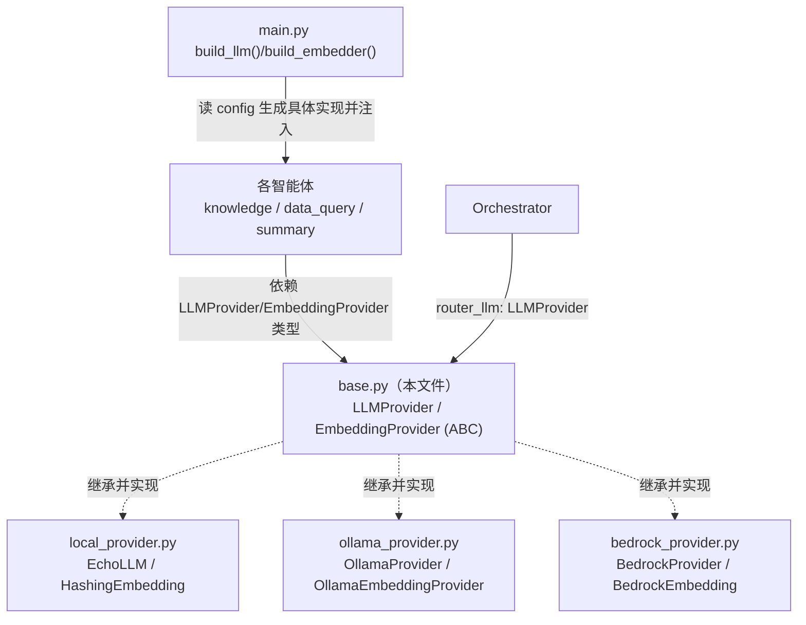
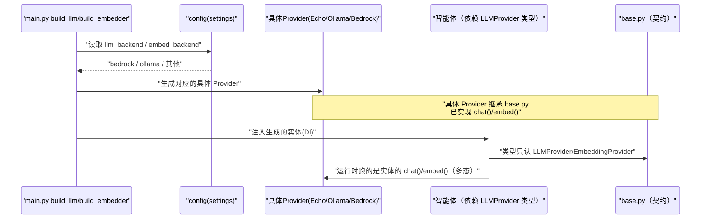

# 基本设计书（代码解说版）
## `backend/app/providers/base.py` — LLM / Embedding Provider 抽象层

> 本书面向初学者，用图和表解说「这个文件以什么为输入、输出什么、从哪里被调用、内部如何运作、与哪些部件相互调用」。专业术语在 §7 术语表中附中文注释。

---

## 0. 文档信息

| 项目 | 内容 |
|---|---|
| 对象文件 | `backend/app/providers/base.py` |
| 作用（一句话） | 定义 LLM/嵌入的**最小契约（抽象类）**，让 Ollama/Bedrock/模拟实现可以互换。智能体只依赖这个抽象（依赖倒置 / DIP） |
| 所属层 | Provider 层（`app/providers`） |
| 公开类 | `LLMProvider`(ABC) / `EmbeddingProvider`(ABC) |
| 依赖（import）对象 | `abc.ABC` / `abc.abstractmethod`（仅标准库。**完全不依赖任何具体实现**正是其关键） |
| 直接调用方 | `local_provider.py` / `ollama_provider.py` / `bedrock_provider.py`（**继承并实现**）、各 `agents/*`（**作为类型注解依赖**）、`orchestrator.py`（`router_llm: LLMProvider`） |

---

## 1. 概述（这个部件做什么）

`base.py` **不执行任何一行实际逻辑**。它只做一件事：「声明契约（接口）」：

1. **`LLMProvider`** — 「传入 `system` 提示词 + `user` 输入，就会返回生成文本(`str`)」的约定。
2. **`EmbeddingProvider`** — 「传入文本，就会返回定长向量(`list[float]`)」的约定。

两者都继承 `abc.ABC`，并给方法加了 `@abstractmethod`。即**这两个类无法直接实例化**，必须有人继承并填充实现。

> 💡 **设计意图**：为的是不在智能体里**直写 `httpx.post("http://localhost:11434/api/chat", ...)` 这种具体的 LLM 调用**。即使具体实现(Ollama/Bedrock)变了，智能体也只接触 `LLMProvider` 类型，所以**一行都不用改**（即 DIP，见 §7）。生产用 OllamaProvider/BedrockProvider，CI 用 EchoLLM——这种选择**由注入方（main.py）来决定**。

---

## 2. 系统内的位置（调用关系图）

`base.py` 的抽象处于「向下被具体实现实现」「向上被智能体/编排器作为类型引用」的关系中：

- **IN（引用方）**：各智能体、`Orchestrator` 把 `LLMProvider`/`EmbeddingProvider` 作为**类型注解** import（不知道实体）。
- **OUT（实现方）**：`local`/`ollama`/`bedrock` 各 Provider **继承这个抽象并填充实现**。
- **粘合剂**：`main.py` 的 `build_llm()`/`build_embedder()` 读 config 选出一个具体实现，**注入(DI)**给智能体。

---

## 3. 公开接口一览（方法速查表）

| 类.方法 | 种类 | IN（主要输入） | OUT（返回值） | 大致用途 |
|---|---|---|---|---|
| `LLMProvider.chat` | 异步·抽象 | system, user, temperature | `str` | 文本生成的契约（实现由子类填充） |
| `EmbeddingProvider.embed` | 异步·抽象 | text | `list[float]` | 向量化的契约（实现由子类填充） |

> 两者都是 `@abstractmethod`，即**只定签名（类型），方法体让其抛 NotImplementedError**。

---

## 4. 方法详细设计

将每个方法拆解为「作用 / IN / OUT / 调用处（被谁调用） / 调用谁 / 处理逻辑 / 注意点」。**本文件是抽象，没有「实际处理」，因此解说契约的含义。**

### 4.1 `LLMProvider`（文本生成的最小契约, 行22〜35）

- **作用**：定义「输入文章就返回文章」这一 LLM 调用的**最小约定**。通过 `abc.ABC` 继承＋`@abstractmethod`，**这个类本身无法实例化**（强制实现）。
- **抽象方法 `chat`**

| 输入(IN) | 类型 | 含义 |
|---|---|---|
| `system` | `str` | 系统提示词（角色、输出格式的指示） |
| `user` | `str` | 用户输入（实际的问题、正文） |
| `temperature` | `float`=`0.2`（位于关键字专用参数 `*` 之后） | 生成的随机度。越接近 0 越确定 |

- **输出(OUT)**：`str`（生成文本）／ **异步(async)**
- **调用处（被谁调用）**：
  - **继承并实现方**：`local_provider.py:26`(`EchoLLM`)、`ollama_provider.py:19`(`OllamaProvider`)、`bedrock_provider.py:29`(`BedrockProvider`)
  - **作为类型依赖方**：`orchestrator.py:24,34`(`router_llm: LLMProvider`)、`knowledge_agent.py:24,42`、`dataquery_agent.py:31,41`、`summary_agent.py:17,26`
  - **实际调用 `.chat()` 的位置**：`knowledge_agent.py:97`、`dataquery_agent.py:58`、`summary_agent.py:45`
- **调用谁（依赖）**：无（方法体是 `raise NotImplementedError`。若没有实现就调用会在此处崩溃＝即时发现漏实现）
- **处理逻辑（分步）**：
  1. 只声明签名（参数类型、返回类型）
  2. 方法体为 `raise NotImplementedError`，即「子类必须覆写」的标记
- **注意点**：`*` 之后的 `temperature` 是**关键字专用参数**。禁止 `chat(sys, usr, 0.0)` 这种位置传参，强制 `chat(sys, usr, temperature=0.0)`，以保证可读性、防止传错。

---

### 4.2 `EmbeddingProvider`（向量化的最小契约, 行38〜44）

- **作用**：定义「输入文本就返回定长向量」这一嵌入（向量化）的最小约定。用于 `KnowledgeAgent` 的简易向量检索。
- **抽象方法 `embed`**

| 输入(IN) | 类型 | 含义 |
|---|---|---|
| `text` | `str` | 要向量化的文章 |

- **输出(OUT)**：`list[float]`（定长向量）／ **异步(async)**
- **调用处（被谁调用）**：
  - **继承并实现方**：`local_provider.py:60`(`HashingEmbedding`)、`ollama_provider.py:43`(`OllamaEmbeddingProvider`)、`bedrock_provider.py:50`(`BedrockEmbedding`)
  - **作为类型依赖方**：`knowledge_agent.py:24,42`(`embedder: EmbeddingProvider`)
  - **实际调用 `.embed()` 的位置**：`knowledge_agent.py:57`(文档向量化)、`knowledge_agent.py:72`(查询向量化)
- **调用谁（依赖）**：无（方法体是 `raise NotImplementedError`）
- **处理逻辑（分步）**：
  1. 只声明 `text -> list[float]` 的签名
  2. 方法体为 `raise NotImplementedError`
- **注意点**：返回值的**维度数（长度）并未写在契约里**。Hashing 是 256 维，Titan 是 1024 维，因实现而异。因此**检索侧必须用同一个 embedder 同时向量化索引和查询**（统一维度的责任在注入方）。

---

## 5. 数据流（抽象如何被使用）

`base.py` 不执行，所以这里展示的不是「请求的流程」，而是**类型依赖与实体注入的流程**：

---

## 6. 相互引用表

把「哪个抽象、在哪里被实现、在哪里被类型引用」汇成一表。

| 本文件的定义 | 实现方（继承） | 类型引用／实际调用方 |
|---|---|---|
| `LLMProvider.chat` | `EchoLLM`(`local_provider.py:26`), `OllamaProvider`(`ollama_provider.py:19`), `BedrockProvider`(`bedrock_provider.py:29`) | 类型: `orchestrator.py:24,34`, `knowledge_agent.py:24,42`, `dataquery_agent.py:31,41`, `summary_agent.py:17,26` ／ 实调: `knowledge_agent.py:97`, `dataquery_agent.py:58`, `summary_agent.py:45` |
| `EmbeddingProvider.embed` | `HashingEmbedding`(`local_provider.py:60`), `OllamaEmbeddingProvider`(`ollama_provider.py:43`), `BedrockEmbedding`(`bedrock_provider.py:50`) | 类型: `knowledge_agent.py:24,42` ／ 实调: `knowledge_agent.py:57,72` |

> 相关文件：`local_provider.py`（模拟实现）／`ollama_provider.py`·`bedrock_provider.py`（真实实现）／`main.py`（在 `build_llm`/`build_embedder` 选择并注入）／`agents/*`（消费方）

---

## 7. 术语表

| 术语（日/英） | 中文注释 |
|---|---|
| 抽象クラス / abstract class | **抽象类**。无法直接 new、专为被继承的模板。定义共通的「类型」 |
| ABC（Abstract Base Class） | Python 的 `abc.ABC`。以继承为前提的基类。**抽象基类** |
| 抽象メソッド / `@abstractmethod` | **抽象方法**。只声明签名不带方法体，强制子类实现 |
| 契約 / interface・contract | **契约/接口**。只约定「这种输入对应这种输出」，不管内部实现 |
| Provider 抽象 | **提供者抽象**。把 LLM/嵌入的调用入口抽象化，使实现可替换的层 |
| 依存性逆転 / DIP（Dependency Inversion Principle） | **依赖倒置原则**。上层（智能体）依赖抽象而非具体实现。上层不知实现，故可自由替换 |
| 依存性注入 / DI（Dependency Injection） | **依赖注入**。部件不自己创建依赖，而由外部（main.py）传入 |
| ポリモーフィズム / polymorphism | **多态**。同样的 `chat()` 调用，会因注入的实体不同而跑不同处理 |
| 埋め込み / embedding | **嵌入/向量化**。把文本转成定长数值向量，用向量距离衡量语义相近度 |
| 非同期 / async・await | **异步**。在等待 I/O 时可推进其他任务的机制。处理多请求所必需 |
| キーワード専用引数 / keyword-only | `*` 之后的参数。只能用 `f(x, key=val)` 形式传，防止位置传错 |
| 生成テキスト / generated text | LLM 返回的自然语言字符串（`str`） |
| NotImplementedError | 表示「未实现」的异常。忘了覆写抽象方法就调用会触发，可即时发现漏实现 |

---

> **若要把本模板套用到其他文件**：§0〜§7 的框架照搬，§4 的「作用/IN/OUT/调用处/调用谁/逻辑/注意点」逐个方法填入即可。
