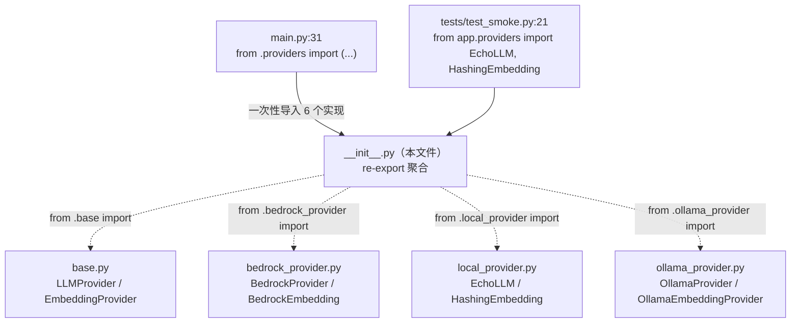
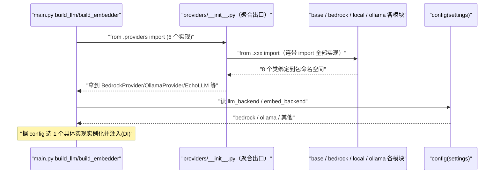

# 基本设计书（代码解说版）
## `backend/app/providers/__init__.py` — Provider 包的统一出口（re-export 聚合）

> 本书面向初学者，用图和表解说「这个文件以什么为输入、输出什么、从哪里被调用、内部如何运作、与哪些部件相互调用」。专业术语在 §7 术语表中附中文注释。

---

## 0. 文档信息

| 项目 | 内容 |
|---|---|
| 对象文件 | `backend/app/providers/__init__.py` |
| 作用（一句话） | **把 `providers` 子包内各模块的类聚合到包顶层**，让外部能用 `from app.providers import XXX` 一处导入全部 Provider（统一出口/门面） |
| 所属层 | Provider 层（`app/providers`）的包入口 |
| 公开符号 | `LLMProvider` / `EmbeddingProvider`（来自 base）、`BedrockProvider` / `BedrockEmbedding`、`OllamaProvider` / `OllamaEmbeddingProvider`、`EchoLLM` / `HashingEmbedding` |
| 依赖（import）对象 | 同包内 `.base` / `.bedrock_provider` / `.local_provider` / `.ollama_provider` |
| 直接调用方 | `main.py:31`（`from .providers import ...` 一次性导入 6 个具体实现）、`tests/test_smoke.py:21`（`from app.providers import EchoLLM, HashingEmbedding`） |

---

## 1. 概述（这个部件做什么）

`__init__.py` **不定义任何类，也不执行业务逻辑**。它只做一件事：**re-export（重导出）**。

- 把分散在 4 个模块里的类（契约 + 3 套具体实现）`import` 进来，再用 `__all__` 列为包的公开 API。
- 这样消费方（`main.py`）不必逐个写 `from .providers.bedrock_provider import BedrockProvider`、`from .providers.ollama_provider import OllamaProvider`……而是**一行 `from .providers import (...)` 全部拿到**。

> 💡 **设计意图**：这是一个**门面(facade)/聚合出口**。① 让调用方少关心内部文件结构（具体实现放在哪个 `.py` 里是包的内部细节）；② 即使将来把某个 Provider 拆/合到别的模块，只要这里的出口名不变，`main.py` 就无需改动。配合 §0 提到的 Provider 抽象，进一步降低耦合。

---

## 2. 系统内的位置（调用关系图）

`__init__.py` 处于「向下汇集各模块的类」「向上给 main.py/测试 提供统一导入口」的关系中：

- **IN（消费方）**：`main.py` 的 `build_llm()`/`build_embedder()`（`main.py:46〜59`）需要这 6 个具体实现来按 config 选择并实例化；`test_smoke.py` 只需要其中的 `EchoLLM`/`HashingEmbedding`。
- **OUT（汇集方）**：从同包 4 个模块 import 全部公开类，列入 `__all__`。
- 注：各智能体/编排器**不经此出口**，而是直接 `from ..providers.base import LLMProvider`（只依赖契约，见 `knowledge_agent.py:24` 等）——所以这个聚合出口主要服务于「选择并装配实现」的 `main.py`。

---

## 3. 定义详细

本文件无函数/类定义，只有 import 语句和 `__all__` 列表。下表说明「重导出了什么、源自哪里」。

| 重导出的符号 | 种类 | 来源模块（行号） | 用途简述 |
|---|---|---|---|
| `LLMProvider` | 抽象类(ABC) | `.base`（`__init__.py:1`） | LLM 调用的契约 |
| `EmbeddingProvider` | 抽象类(ABC) | `.base`（`__init__.py:1`） | 嵌入(向量化)的契约 |
| `BedrockProvider` | LLMProvider 实现 | `.bedrock_provider`（`__init__.py:2`） | 生产用 AWS Bedrock LLM |
| `BedrockEmbedding` | EmbeddingProvider 实现 | `.bedrock_provider`（`__init__.py:2`） | 生产用 Titan 嵌入 |
| `EchoLLM` | LLMProvider 实现 | `.local_provider`（`__init__.py:3`） | 无模型时的降级 LLM |
| `HashingEmbedding` | EmbeddingProvider 实现 | `.local_provider`（`__init__.py:3`） | 无模型时的降级嵌入 |
| `OllamaEmbeddingProvider` | EmbeddingProvider 实现 | `.ollama_provider`（`__init__.py:4`） | 本地免费 Ollama 嵌入 |
| `OllamaProvider` | LLMProvider 实现 | `.ollama_provider`（`__init__.py:4`） | 本地免费 Ollama LLM |

> `__all__`（`__init__.py:6〜15`）：显式列出上述 8 个名字，约定「`from app.providers import *` 时导出哪些」，同时作为包对外公开 API 的清单。

---

## 4. 定义详细（导入与 `__all__` 的处理）

本文件不含可调用的方法，这里把「执行 import 时发生了什么」按步骤说明。

### 4.1 顶层 re-export（行1〜4）

- **作用**：在导入 `app.providers` 包的瞬间，连带导入同包 4 个模块的 8 个类，并绑定到包命名空间。
- **输入(IN)**：无（模块级语句，import 时执行一次）
- **输出(OUT)**：包命名空间多出 `LLMProvider`/`EmbeddingProvider`/`BedrockProvider`/`BedrockEmbedding`/`EchoLLM`/`HashingEmbedding`/`OllamaEmbeddingProvider`/`OllamaProvider` 这 8 个名字
- **调用处（被谁调用）**：Python 在首次 `import app.providers`（即 `main.py:31`、`test_smoke.py:21`）时自动执行
- **调用谁（依赖）**：`.base`、`.bedrock_provider`、`.local_provider`、`.ollama_provider`
- **处理逻辑（分步）**：
  1. `from .base import EmbeddingProvider, LLMProvider`（契约）
  2. `from .bedrock_provider import BedrockEmbedding, BedrockProvider`
  3. `from .local_provider import EchoLLM, HashingEmbedding`
  4. `from .ollama_provider import OllamaEmbeddingProvider, OllamaProvider`
- **注意点**：因为这里**会连带 import 全部三套实现**，所以导入 `app.providers` 时也会触发各实现模块顶层的 `import`（如 `bedrock_provider` 的 `boto3`、`ollama_provider` 的 `httpx`）。这些第三方库需已安装；若仅想用 `EchoLLM`，依然会一并加载 boto3/httpx（属包入口的固有成本）。

### 4.2 `__all__` 列表（行6〜15）

- **作用**：声明包的公开 API 清单，控制 `from app.providers import *` 的导出范围。
- **处理逻辑**：把 §3 表中的 8 个名字按字符串列出。
- **注意点**：`__all__` 只影响 `import *` 行为；像 `main.py` 那样**显式列名导入**不受其约束，但仍以此清单作为「该包对外暴露什么」的事实标准。

---

## 5. 数据流（导入与装配的流程）

`__init__.py` 不处理运行时请求，这里展示**「import 触发汇集 → main.py 按 config 装配」**的流程：

---

## 6. 相互引用表

| 本文件的内容 | 调用处（被谁导入） | 调用谁（依赖的源模块） |
|---|---|---|
| 顶层 re-export（行1〜4） | `main.py:31`（导入 6 个实现）、`test_smoke.py:21`（导入 `EchoLLM`,`HashingEmbedding`） | `.base`, `.bedrock_provider`, `.local_provider`, `.ollama_provider` |
| `__all__`（行6〜15） | `from app.providers import *`（约束导出范围） | — |

> 相关文件：`base.py`（契约源）／`bedrock_provider.py`·`ollama_provider.py`·`local_provider.py`（实现源）／`main.py`（`build_llm`/`build_embedder` 在 `main.py:46〜59` 据此装配）／`agents/*`·`orchestrator.py`（**绕过本出口**，直接依赖 `.providers.base`）

---

## 7. 术语表

| 术语（日/英） | 中文注释 |
|---|---|
| `__init__.py` | 标记目录为 Python **包**的文件，包被 import 时执行其顶层代码 |
| re-export / 再エクスポート | **重导出**。在包入口把子模块的符号 import 进来再暴露出去，对外提供统一入口 |
| 集約出口 / facade（門面） | **门面/聚合出口**。把内部多个模块隐藏在一个统一入口之后，降低调用方对内部结构的依赖 |
| `__all__` | 包/模块的公开 API 清单。控制 `from x import *` 的导出范围 |
| 名前空間 / namespace | **命名空间**。名字绑定的作用域。import 后符号挂到包命名空间上 |
| ワイルドカードインポート / `import *` | **通配符导入**。一次导入模块全部公开名字，导出范围由 `__all__` 决定 |
| 依存性注入 / DI（Dependency Injection） | **依赖注入**。`main.py` 据 config 选实现并传给智能体，本出口负责把实现「凑齐」供其选择 |
| Provider 抽象 | **提供者抽象**。LLM/嵌入的调用契约，具体实现可互换（见 `base.py` 文档） |

---

> **若要把本模板套用到其他文件**：§0〜§7 的框架照搬。本文件无方法，故 §3/§4 用「定义详细」记录重导出的符号与 import 行为。
