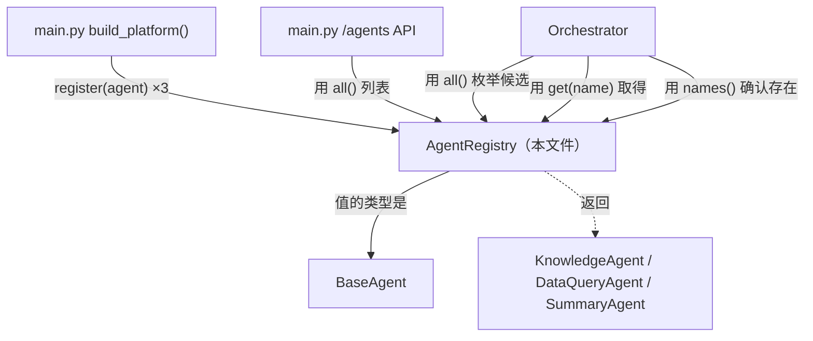
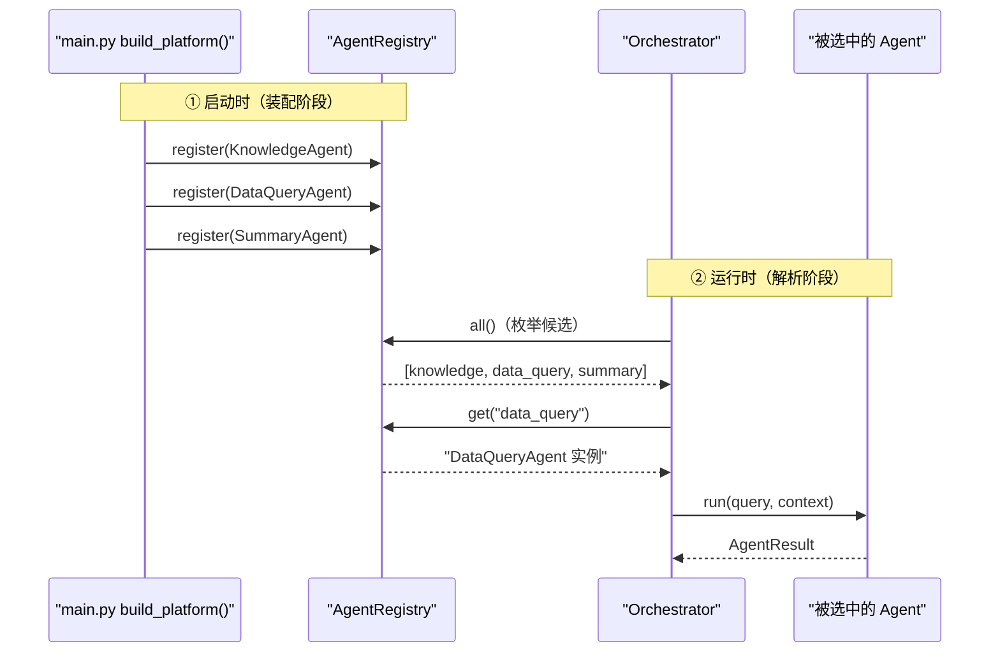

# 基本设计书（代码解说版）
## `backend/app/core/registry.py` — agent 注册簿（插件注册表）

> 本书面向初学者，用图和表解说「这个文件以什么为输入、输出什么、被谁调用、内部如何运转、与哪些部件相互调用」。专业术语在 §7 术语表附中文注释。

---

## 0. 文档信息

| 项目 | 内容 |
|---|---|
| 对象文件 | `backend/app/core/registry.py` |
| 作用（一句话） | **按名字登记・取出 agent 的间接层（注册簿）**。让平台本体不必直接 import 各个 agent |
| 所属层 | 核心层（`app/core`） |
| 公开类 | `AgentRegistry` |
| 依赖（import）对象 | `base_agent.BaseAgent`（仅作类型） |
| 直接调用方 | `app/main.py`（在 `build_platform()` 组装・注册）／ `core/orchestrator.py`（运行时用 `all()`/`get()`/`names()`）／ `tests/test_smoke.py` |

---

## 1. 概述

`AgentRegistry`（注册表＝注册簿）是个**只包了「名字 → agent 实例」字典**的小类。但作用很重要：它是让平台「不认识具体 agent」的间接层（indirection）：

1. **启动时（装配）** — `app/main.py` 的 `build_platform()` 用 `register()` 把各 agent 集中登记到一处。
2. **运行时** — `orchestrator` 只经由 `all()` / `get(name)` 触碰 agent，不 import 具体类。

> 💡 **设计意图**：这是「服务定位器（Service Locator）／插件注册表」模式。带来 3 个好处：
> ① 加新 agent ＝ 写好类 + register 一行 → **编排层・API 层零改动**（OCP）。
> ② **特性开关（feature toggle）** ＝ 某 agent 不稳定时，把 register 注释掉即可下线，本体照常运行。
> ③ **可测试性** ＝ 注册 mock agent 即可隔离测试编排逻辑。

---

## 2. 系统内的位置（调用关系图）

`AgentRegistry` 是「由 main 组装、被 orchestrator 询问」的中间枢纽：

- **IN（调过来的一侧）**：`main.py`（注册・列表）、`orchestrator.py`（枚举候选・取得・确认存在）。
- **OUT（出去的一侧）**：仅把 `BaseAgent` 当类型引用。内部状态只有 `dict[str, BaseAgent]`。

---

## 3. 公开接口一览

| 方法 | 类型 | IN（主要输入） | OUT（返回值） | 大致用途 |
|---|---|---|---|---|
| `__init__` | 同步 | （无） | （生成实例） | 准备空 `dict` |
| `register` | 同步 | agent | `None` | 按名字注册。重复即报错 |
| `get` | 同步 | name | `BaseAgent` | 按名字取得。不存在即报错 |
| `all` | 同步 | （无） | `list[BaseAgent]` | 全 agent（枚举候选・列表 API） |
| `names` | 同步 | （无） | `list[str]` | 已注册名字一览 |

---

## 4. 方法详细设计

每个方法拆为「作用 / 输入(IN) / 输出(OUT) / 调用处 / 调用谁 / 处理逻辑 / 注意点」。

### 4.1 `__init__`（构造函数, 行27〜29）

- **作用**：把内部字典 `self._agents: dict[str, BaseAgent]` 初始化为空，仅此而已。
- **输入(IN)**：无
- **输出(OUT)**：无（生成实例）
- **调用处**：`app/main.py:83`（`build_platform()`）、`tests/test_smoke.py:28,37`
- **调用谁**：无
- **处理逻辑**：`self._agents = {}`。用 `dict` 同时保证 **name 的唯一性** 与 **O(1) 取得**。
- **注意点**：`_agents` 是带前导下划线的**非公开属性**。外部必须经由 `register`/`get`/`all`/`names` 触碰（封装）。

---

### 4.2 `register`（注册, 行31〜35）⭐

- **作用**：把 agent 以 `name` 为键注册。**name 重复属设计失误，故即报错**（不静默覆盖）。
- **输入(IN)**

| 参数 | 类型 | 含义 |
|---|---|---|
| `agent` | `BaseAgent` | 要注册的 agent 实例。以 `agent.name` 作键 |

- **输出(OUT)**：`None`
- **调用处**：
  - `app/main.py:86`（`KnowledgeAgent`）, `:87`（`DataQueryAgent`）, `:88`（`SummaryAgent`）
  - `tests/test_smoke.py:30,31,32`（测试用组装）, `:38,40`（重复报错的验证）
- **调用谁**：无（仅 dict 操作）
- **处理逻辑（分步）**：
  1. 检查 `agent.name` 是否已在 `self._agents` 中。
  2. 若存在则 `raise ValueError(...)`（重复检测）。
  3. 否则 `self._agents[agent.name] = agent` 完成注册。
- **注意点**：不做「静默覆盖（last-write-wins）」的理由 ＝ 两个 agent 自报同一 `name` 属**装配失误**，启动时**大声失败**更安全（fail-fast）。`tests/test_smoke.py:36` 的 `test_registry_rejects_duplicate` 保证了此行为。

---

### 4.3 `get`（取得, 行37〜41）⭐

- **作用**：按 `name` 取出 agent。不存在则**显式抛 `KeyError`**（不让隐式 `None` 把后段拖死）。
- **输入(IN)**

| 参数 | 类型 | 含义 |
|---|---|---|
| `name` | `str` | 想取得的 agent 标识符（例 `"data_query"`） |

- **输出(OUT)**：`BaseAgent`
- **调用处**：
  - `core/orchestrator.py:99`（`_run_agent()` 内 `self.registry.get(name)`）
  - `core/orchestrator.py:157`（`run_chain` step1：`get("data_query").run(...)`）
  - `core/orchestrator.py:177`（`run_chain` step2：`get("summary").run(...)`）
  - `app/main.py:196`（`/chain/lead-digest` 中 `orch.registry.get("data_query").run(...)`）
- **调用谁**：无（仅 dict 参照）
- **处理逻辑（分步）**：
  1. 若 `name` 不在 `self._agents` 中，则 `raise KeyError(f"未注册的 agent: {name!r} / 已注册={list(self._agents)}")`。
  2. 在则 `return self._agents[name]`。
- **注意点**：错误信息中**附上已注册一览**是体贴设计。打错字（例 `"dataquery"` vs `"data_query"`）能立刻发现。裸 `dict[name]` 也会抛 `KeyError`，但这里额外附上「都注册了什么」以提升可诊断性。

---

### 4.4 `all`（全枚举, 行43〜45）

- **作用**：以列表返回全部已注册 agent。用于路由的**候选枚举**和 `/agents` 列表 API。
- **输入(IN)**：无
- **输出(OUT)**：`list[BaseAgent]`
- **调用处**：
  - `core/orchestrator.py:54`（`route_by_rule()`：对各 agent 的 `can_handle()` 打分）
  - `core/orchestrator.py:72`（`route_by_llm()`：生成 `name: description` 目录）
  - `app/main.py:151`（`/agents` 端点返回一览）
- **调用谁**：无
- **处理逻辑**：`return list(self._agents.values())`。**每次返回新列表**（不直接交出内部 dict ＝ 外部破坏不了）。
- **注意点**：返回顺序＝dict 的插入顺序＝**register 的顺序**（Python 3.7+ 的 dict 保持插入顺序）。路由分数打平时，此顺序可能成为隐式的 tie-break，需留意。

---

### 4.5 `names`（名字一览, 行47〜48）

- **作用**：返回已注册 agent 名的一览。用于存在性检查（校验）。
- **输入(IN)**：无
- **输出(OUT)**：`list[str]`
- **调用处**：`core/orchestrator.py:80`（`route_by_llm()` 中用 `if name not in self.registry.names()` 确认「LLM 返回的 agent 名是否真实存在」）
- **调用谁**：无
- **处理逻辑**：`return list(self._agents.keys())`。
- **注意点**：`route_by_llm` 在此挡掉「LLM 幻觉出的不存在 agent 名」并兜底到规则式（鲁棒性的要点）。

---

## 5. 数据流

以 `AgentRegistry` 为中心的「启动时装入 → 运行时按名取出」流程：

- 要点：装配（决定谁在场）与执行（决定交给谁）**以 registry 为界分离**。所以 agent 的增减只在局部发生。

---

## 6. 相互引用表

| 本文件的方法 | 调用处 | 调用谁（依赖） |
|---|---|---|
| `__init__` | `main.py:83`, `test_smoke.py:28,37` | — |
| `register` | `main.py:86,87,88`, `test_smoke.py:30,31,32,38,40` | — |
| `get` | `orchestrator.py:99,157,177`, `main.py:196` | — |
| `all` | `orchestrator.py:54,72`, `main.py:151` | — |
| `names` | `orchestrator.py:80`（`route_by_llm` 的存在确认） | — |

> 关联文件：`base_agent.py`（保管的值类型 `BaseAgent`）／`orchestrator.py`（运行时的主要使用者）／`main.py`（组装・注册・列表 API）／`connectors/base.py`（同思想的外部服务版注册表 `ConnectorRegistry`）

---

## 7. 术语表

| 术语（日/英） | 中文注释 |
|---|---|
| レジストリ / registry | **注册簿/注册表**。把组件登记起来、用名字取出的间接层 |
| 間接層 / indirection | **间接层**。调用方不直接持有具体对象，而是经过一层「按名取物」，从而解耦 |
| 服务定位器 / Service Locator | **服务定位器模式**。集中登记依赖、运行时按 key 取出（本类即此模式的手写版） |
| 装配 / wiring（依赖装配） | **装配/组装**。在启动处一次性把各组件创建并注册好（`build_platform()`） |
| OCP（開放閉鎖原則） | **开放封闭原则**。加新 agent 只在装配处加一行 register，编排层与 API 零改动 |
| 特性開关 / feature toggle | **特性开关**。注释掉某 agent 的 register 即可下线它，平台照常运行 |
| fail-fast（早期失敗） | **快速失败**。重复 name、取不存在的 name 都立刻报错，而非默默上写/返回 None |
| カプセル化 / encapsulation | **封装**。内部 `_agents` 字典不外露，只通过公开方法访问 |
| 挿入順 / insertion order | **插入顺序**。Python 3.7+ 的 dict 保持登记顺序，`all()` 返回顺序即注册顺序 |
| O(1) 取得 / O(1) lookup | **常数时间查取**。用 dict 以 name 为 key，取用复杂度与数量无关 |
| 候補列挙 / candidate enumeration | **候选枚举**。路由时 `all()` 列出全部 agent 逐个打分挑最高 |
| モック / mock（テスト） | **桩对象/模拟对象**。测试时注册假 agent，隔离验证编排逻辑 |

---

> **把此模板套到其他文件时**：§0〜§7 框架照用，把 §4 的「作用/IN/OUT/调用处/调用谁/逻辑/注意点」逐个套到每个方法上填写即可。
