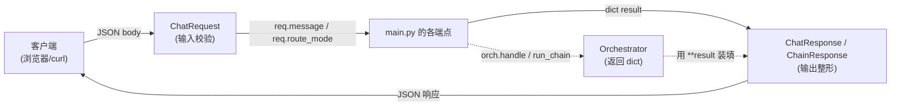
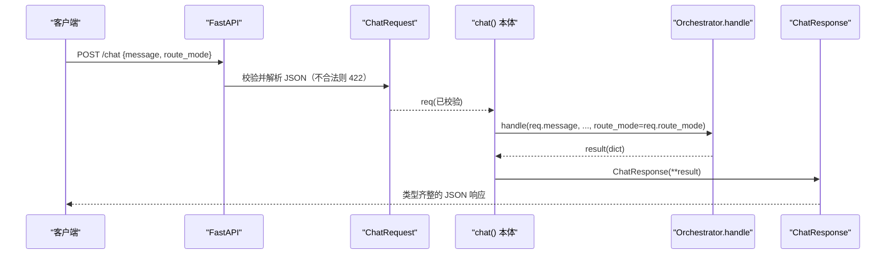

# 基本设计书（代码解说版）
## `backend/app/schemas.py` — API 输入输出 Schema（pydantic）

> 本书面向初学者，用图和表说明「这个文件以什么为输入、输出什么、被谁调用、内部如何运作、和哪些部件相互调用」。专业术语在 §7 术语表给出中文注释。

---

## 0. 文档信息

| 项目 | 内容 |
|---|---|
| 目标文件 | `backend/app/schemas.py` |
| 作用（一句话） | 用 pydantic 模型定义 API 的**输入(请求)·输出(响应)的形状**，把「校验·转换·自动文档化」交给 FastAPI |
| 所在层 | 边界（API 层与内部处理之间的**契约**） |
| 公开类 | `ChatRequest` / `ChatResponse` / `ChainResponse` |
| 依赖（import）对象 | `pydantic.BaseModel,Field` / `typing.Any,Literal` |
| 直接调用方 | `app/main.py`（`/chat`·`/chain/lead-digest` 的参数类型与 `response_model`） |

---

## 1. 概述（这个部件做什么）

`schemas.py` 把**「在内外边界处交换的格式(契约)」**集中定义到一处。它做 3 件事：

1. **输入校验** — 用 `ChatRequest` 让 **FastAPI 自动检查**「`message` 是必填字符串」「`route_mode` 只能是 `rule`/`llm` 之一」。违规则以 422 拦下。
2. **输出类型保证** — 把 `ChatResponse` / `ChainResponse` 指定为 `response_model`，返回值会被**整理成这个形状**返回（多余的键会被丢弃）。
3. **自动文档** — FastAPI 从 pydantic 模型生成 OpenAPI(Swagger UI)，`description` 会直接成为说明文。

> 💡 **设计意图**：内部的 `Orchestrator` 返回朴素 `dict`（灵活）。在**边界处把它装进 pydantic**（`ChatResponse(**result)`）。由此形成「内部用 dict 轻便、对外用类型严格」的职责分工。把 Schema 集中到一个文件，前端/后端的 API 契约**看这里即可知道**。

---

## 2. 系统内的位置（调用关系图）

`schemas.py` 位于 API 层（`main.py`）与内部处理（`Orchestrator`）**正中间的契约**位置：

- **IN（输入侧）**：客户端的 JSON → 被**解析并校验**为 `ChatRequest` 后传给端点。
- **OUT（输出侧）**：`Orchestrator` 的 dict → 被装填进 `ChatResponse`/`ChainResponse` 后返回客户端。

---

## 3. Schema 速查表（模型一览）

| 类 | 类别 | 使用场所 | 主要字段 |
|---|---|---|---|
| `ChatRequest` | 输入 | `/chat`·`/chain/lead-digest`·`/connectors/calendar/followup` 的 body | `message`(必填), `route_mode`(rule/llm) |
| `ChatResponse` | 输出 | `/chat` 的 `response_model` | `agent`, `output`, `data`, `error`, `trace` |
| `ChainResponse` | 输出 | `/chain/lead-digest` 的 `response_model` | `agents`(数组), `output`, `data`, `trace` |

---

## 4. 类（Schema）详细设计

将每个模型按「作用 / 字段表(IN·OUT) / 调用处 / 处理逻辑 / 注意点」拆解。

### 4.1 `ChatRequest`（输入 Schema, 行9〜13）

- **作用**：表示 `/chat` 系列端点的**请求体**。FastAPI 把 JSON 转换为此类型，不合法则自动返回 422。
- **输入(IN)（字段）**

| 字段 | 类型 | 必填 | 默认值 | 约束·说明 |
|---|---|---|---|---|
| `message` | `str` | ✅必填 | — | 用户输入（`Field(..., description="ユーザー入力")` 中的 `...` 表示必填） |
| `route_mode` | `Literal["rule","llm"]` | 可选 | `"rule"` | 路由策略。`rule`=基于规则 / `llm`=意图分类。**这 2 个值以外报错** |

- **输出(OUT)**：（请求类型，无返回值。作为校验后的实例进入端点参数）
- **调用处**：
  - `main.py:161`（`chat(req: ChatRequest, ...)`）
  - `main.py:174`（`chain_lead_digest(req: ChatRequest, ...)`）
  - `main.py:186`（`calendar_followup(req: ChatRequest, ...)`）
- **处理逻辑（FastAPI 在背后做的事）**：
  1. 解析 HTTP body 的 JSON
  2. `message` 缺失/非字符串 → 422
  3. `route_mode` 非 `"rule"`/`"llm"` → 422（由 `Literal` 的枚举约束）
  4. 合法则生成 `ChatRequest` 实例并传给端点
- **注意点**：`route_mode` 的 `Literal` 是**入口处的防御**。`Orchestrator.handle` 侧对未知值也会回退到规则，但在这里先拦下能让错误更易懂。

---

### 4.2 `ChatResponse`（输出 Schema, 行16〜21）

- **作用**：`/chat` 的**响应形状**。把 `Orchestrator.handle()` 返回的 dict 装填进此类型后返回。
- **输出(OUT)（字段）**

| 字段 | 类型 | 默认值 | 说明 |
|---|---|---|---|
| `agent` | `str` | （必填） | 实际处理的代理名（例 `data_query`） |
| `output` | `str` | （必填） | 面向人的响应文本 |
| `data` | `dict[str, Any]` | `{}` | 结构化数据（`rows` / `params` 等） |
| `error` | `str \| None` | `None` | 错误文（正常时为 `None`） |
| `trace` | `dict[str, Any]` | `{}` | 观测信息（路由结果·各步骤·处理时间） |

- **调用处**：`main.py:160`（`response_model=ChatResponse`）、`main.py:170`（`ChatResponse(**result)`）
- **处理逻辑**：端点用 `ChatResponse(**result)` 展开 dict 生成。由于指定了 `response_model`，会**剔除多余键·缺失则报校验错**，从而保证类型。
- **注意点**：`data`/`trace` 的内容用 `dict[str, Any]` **宽松**接收（内部结构因代理而异）。如果严格化，每加一个代理就得改 Schema，破坏 OCP。

---

### 4.3 `ChainResponse`（链式输出 Schema, 行24〜28）

- **作用**：`/chain/lead-digest`（多代理协作）的**响应形状**。与 `ChatResponse` 的区别在于持有 `agents`(复数)而非 `agent`(单数)。
- **输出(OUT)（字段）**

| 字段 | 类型 | 默认值 | 说明 |
|---|---|---|---|
| `agents` | `list[str]` | （必填） | 按执行顺序的代理名数组（例 `["data_query","summary"]`） |
| `output` | `str` | （必填） | 最终的响应文本（摘要 digest） |
| `data` | `dict[str, Any]` | `{}` | `rows`（抽取的顾客）与 `summary`（摘要） |
| `trace` | `dict[str, Any]` | `{}` | 各步骤的观测信息 |

- **调用处**：`main.py:173`（`response_model=ChainResponse`）、`main.py:182`（`ChainResponse(**result)`）
- **处理逻辑**：把 `Orchestrator.run_chain()` 返回的 dict 用 `ChainResponse(**result)` 装填。
- **注意点**：与 `ChatResponse` 的差异是**没有** `error` 字段。因为链式处理内部把提前结束（0 件时）也当作正常响应处理。

---

## 5. 数据流（一次 HTTP 往返中 Schema 的作用）

`POST /chat` 从入口到出口，Schema 如何工作：

---

## 6. 相互引用表（调用处与依赖一览）

| 本文件的类 | 调用处 | 关联（生成装填源 dict 的一方） |
|---|---|---|
| `ChatRequest` | `main.py:161,174,186`（各端点参数） | 客户端 JSON |
| `ChatResponse` | `main.py:160`(`response_model`), `main.py:170`(`**result`) | `Orchestrator.handle()` 的返回 dict |
| `ChainResponse` | `main.py:173`(`response_model`), `main.py:182`(`**result`) | `Orchestrator.run_chain()` 的返回 dict |

> 关联文件：`main.py`（唯一的使用者）／`core/orchestrator.py`（`handle`/`run_chain` 生成装填源 dict）

---

## 7. 术语表

| 术语（日/英） | 中文注释 |
|---|---|
| pydantic | Python 的**数据校验·转换**库。从类型提示自动做校验 |
| BaseModel | pydantic 的**基类**。继承它写属性，即成为带校验的数据模型 |
| Field | 指定字段的**元信息**(必填/默认/说明)。`Field(...)` 的 `...` 表示「必填」 |
| Literal | **枚举约束**。`Literal["rule","llm"]` 表示「只允许这 2 个值」的类型 |
| `dict[str, Any]` | 字符串键·任意类型值的字典。**不固定内部结构、宽松接收**时使用 |
| スキーマ / schema | **数据契约**。输入输出数据的形状·类型·约束的定义 |
| `response_model` | FastAPI 的指定项。把返回值**整形为该模型类型**，剔除多余键、保证类型 |
| バリデーション / validation | **校验**。自动检查输入是否符合既定形状·约束（不合法则 422） |
| OpenAPI / Swagger UI | 从 Schema 自动生成的**API 规格书/试用界面**。pydantic 模型会原样反映 |
| `**result`（字典展开） | 把 dict 展开为 `键=值` 形式传给构造函数的写法。用 `ChatResponse(**result)` 装填 |
| 422 (Unprocessable Entity) | 输入校验失败时 FastAPI 返回的 HTTP 状态码 |

---

> **将本模板套用到其他文件时**：§0〜§7 的框架照用，§4 的「作用/IN/OUT/调用处/调用谁/逻辑/注意点」逐个套到各类上填写。
