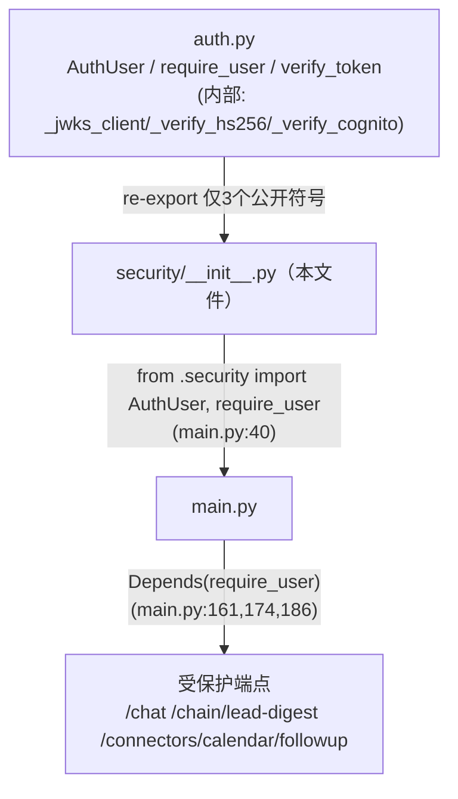
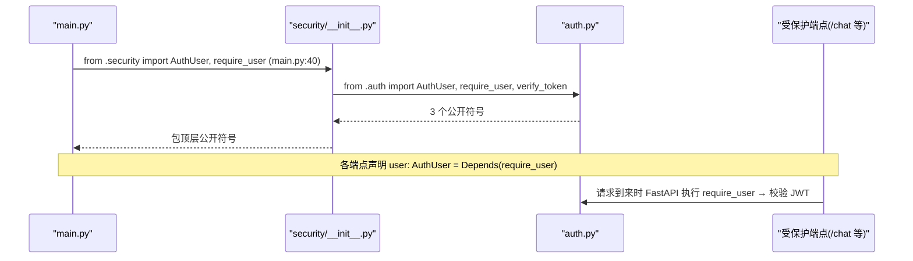

# 基本设计书（代码解说版）
## `backend/app/security/__init__.py` — 安全层的公开符号聚合（re-export）

> 本书面向初学者，用图与表说明「这个文件以什么为输入、输出什么、被谁调用、内部如何运作、与哪些部件相互调用」。专业术语在 §7 术语表附中文注释。

---

## 0. 文档信息

| 项目 | 内容 |
|---|---|
| 目标文件 | `backend/app/security/__init__.py` |
| 作用（一句话） | 把安全层的 JWT 校验相关公开符号**集中再导出(re-export)**，让外部用 `from app.security import X` 一处取到，隐藏 `auth.py` 等内部文件结构 |
| 所在层 | 安全层（`app/security`）的包入口 |
| 公开符号 | `AuthUser` / `require_user` / `verify_token`（均来自 `auth.py`） |
| 依赖（import）对象 | `.auth`（`AuthUser, require_user, verify_token`） |
| 直接调用方 | `app/main.py:40`（`from .security import AuthUser, require_user`），其中 `require_user` 被各端点用 `Depends(require_user)` 引用 |

---

## 1. 概述（这个部件做什么）

本文件**不含任何逻辑**，只做 2 件事：

1. **聚合 re-export** — 用 `from .auth import AuthUser, require_user, verify_token` 把校验本体所在的 `auth.py` 的 3 个公开符号抬到包顶层。调用方写 `from app.security import require_user` 即可，无需知道它在 `auth.py`。
2. **声明公开面 `__all__`** — 用 `__all__` 明示安全层对外公开的名字，作为公开 API 的契约。

> 💡 **设计意图（包入口的价值）**：`auth.py` 内部还有 `_jwks_client`/`_verify_hs256`/`_verify_cognito` 等以下划线开头的内部函数，不应让外部直接碰。通过 `__init__.py` 这层**门面(facade)**，只对外暴露 `AuthUser`/`require_user`/`verify_token` 三者，内部实现（HS256↔Cognito 切换、JWKS 缓存等）可随意重构而不影响调用方。`main.py` 各端点只认 `from app.security import require_user`，把认证这一横切关注点干净地注入。

---

## 2. 系统内的位置（调用关系图）

`__init__.py` 是「下层 `auth.py`」与「上层 `main.py`」之间的聚合门面：

- **IN（进来一侧）**：从 `.auth` 导入 3 个公开符号。
- **OUT（出去一侧）**：把它们作为包顶层符号公开。`main.py:40` 取得 `AuthUser`/`require_user`，并在各端点用 `Depends(require_user)` 启用认证。

---

## 3. 公开接口一览

本文件只是符号聚合，自身没有可调用的函数/方法，公开的是「再导出的名字」。

| 公开符号 | 来源模块 | 类别 | 大致用途 |
|---|---|---|---|
| `AuthUser` | `.auth` | dataclass | 校验后的最小用户信息。详见 `auth.md` |
| `require_user` | `.auth` | Depends 依赖项 | 各端点保护入口（`Depends(require_user)`）。详见 `auth.md` |
| `verify_token` | `.auth` | 函数 | JWT 校验本体。详见 `auth.md` |
| `__all__` | 本文件 | 列表 | 公开面声明＝`["AuthUser", "require_user", "verify_token"]` |

---

## 4. 方法详细设计

本文件无方法/函数定义，仅由 import 语句与 `__all__` 赋值构成。以下按同一框架解说这些「语句」。

### 4.1 re-export 语句（行1）

- **作用**：把 `auth.py` 的 3 个公开符号抬到 `app.security` 包顶层，供外部一处导入。
- **输入(IN)**

| 项目 | 内容 |
|---|---|
| `from .auth import AuthUser, require_user, verify_token` | 从同包 `auth.py` 导入 dataclass、Depends 依赖项、校验函数 |

- **输出(OUT)**：把 `AuthUser` / `require_user` / `verify_token` 绑定到 `app.security` 包命名空间
- **调用处（被谁调用，`文件:行号`）**：
  - `main.py:40`（`from .security import AuthUser, require_user`；导入本包时本语句自动执行）
  - 经此 re-export，`require_user` 进一步被 `main.py:161`（`/chat`）、`main.py:174`（`/chain/lead-digest`）、`main.py:186`（`/connectors/calendar/followup`）以 `Depends(require_user)` 引用
- **调用谁（依赖）**：`.auth`（同包子模块，进而依赖 `jwt`/`fastapi`/`..config.settings`）
- **处理逻辑（分步编号）**：
  1. 首次 `import app.security` 时，Python 执行本 `__init__.py`
  2. 执行 `from .auth import ...`，把 3 个对象绑到包顶层（此时 `auth.py` 整体被加载、其模块级语句执行）
- **注意点**：只 re-export 3 个公开符号，`auth.py` 里以 `_` 开头的内部函数**有意不导出**，对外保持封装。

---

### 4.2 `__all__` 公开面声明（行3）

- **作用**：明示本包对外公开的名字清单，作为公开 API 的契约。
- **输入(IN)**：无（静态字面量）
- **输出(OUT)**：`__all__ = ["AuthUser", "require_user", "verify_token"]`
- **调用处（被谁调用，`文件:行号`）**：`from app.security import *` 时由 Python 解释器读取（限定 `*` 导入的范围）；也作为给读者/工具的「公开符号」说明
- **调用谁（依赖）**：无
- **处理逻辑（分步编号）**：
  1. 把要公开的 3 个名字写成字符串列表赋给 `__all__`
- **注意点**：`__all__` 只影响 `import *` 的范围与文档/linter 判断，**不会**阻止显式 `from app.security import 其他名字`。新增 re-export 时应同步更新此列表以保持公开面一致。

---

## 5. 数据流（导入解析与认证注入的流程）

`main.py` 取得安全符号、并在端点启用认证的流程：

---

## 6. 相互引用表

| 本文件元素 | 调用处（被谁调用） | 调用谁（依赖） |
|---|---|---|
| re-export `AuthUser` | `main.py:40`（`from .security import ...`）；类型注解 `main.py:161,174,186` | `.auth` |
| re-export `require_user` | `main.py:40` 导入；`Depends(require_user)` 于 `main.py:161,174,186` | `.auth` |
| re-export `verify_token` | 公开供外部使用（经此包导出） | `.auth` |
| `__all__` | `from app.security import *` 时的解释器 | — |

> 相关文件：`auth.py`（`AuthUser`/`require_user`/`verify_token` 的实现及内部 `_jwks_client`/`_verify_hs256`/`_verify_cognito`，详见 `auth.md`）／`config.py`（`settings`，被 `auth.py` 引用）／`main.py`（导入并以 `Depends(require_user)` 在各端点使用）

---

## 7. 术语表

| 术语（日/英） | 中文注释 |
|---|---|
| パッケージ初期化 / package `__init__.py` | **包初始化文件**。`import 包名` 时自动执行的文件，定义包的对外门面 |
| re-export / 再エクスポート | **再导出**。把子模块的符号抬到包顶层，让外部从一处导入 |
| `__all__` | **公开符号清单**。`from 包 import *` 时导入哪些名字的声明，也作为公开 API 的契约 |
| ファサード / facade | **门面**。隐藏内部多文件结构、对外只露统一入口的设计模式 |
| Depends / 依存性注入(FastAPI) | **依赖注入**。FastAPI 自动执行依赖函数并注入结果。各端点用 `Depends(require_user)` 注入认证 |
| カプセル化 / encapsulation | **封装**。把 `_` 开头的内部函数对外隐藏，只公开必要符号 |
| 名前空間 / namespace | **命名空间**。名字的归属作用域。本文件把符号绑定到 `app.security` 包命名空间 |

---

> **将本模板套用到其他文件时**：§0〜§7 的框架照旧使用，§4 把「作用/IN/OUT/调用处/调用谁/逻辑/注意点」逐一对应填写。
