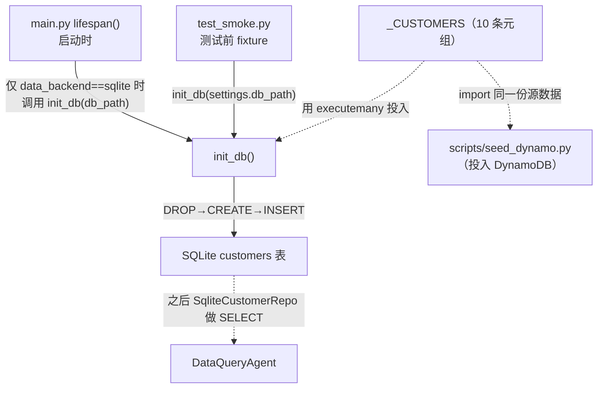
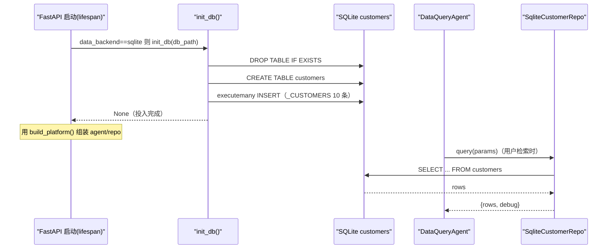

# 基本设计书（代码解说版）
## `backend/app/data/seed.py` — SQLite 种子数据初始化

> 本书面向初学者，用图和表解说「这个文件 · 以什么为输入 · 输出什么 · 被谁调用 · 内部如何运作 · 与哪些部件相互调用」。专业术语在 §7 术语表附中文注释。

---

## 0. 文档信息

| 项目 | 内容 |
|---|---|
| 对象文件 | `backend/app/data/seed.py` |
| 作用（一句话） | 为本地开发**创建 SQLite 客户表并投入初始数据(10 条)**。应用启动时调一次。生产(Aurora/DynamoDB)不用 |
| 所属层 | 数据层（`app/data`） |
| 公开函数 | `init_db(db_path)` |
| 公开常量 | `_CUSTOMERS`（10 条客户源数据。DynamoDB 种子也共用） |
| 依赖（import）目标 | `sqlite3` / `pathlib.Path` |
| 直接调用方 | `app/main.py`（`lifespan` 启动时，仅 `sqlite` 后端）／ `tests/test_smoke.py`（测试前准备）。`_CUSTOMERS` 还被 `scripts/seed_dynamo.py` import |
| 再导出 | `app/data/__init__.py` 公开 `init_db`（`from .data import init_db`） |

---

## 1. 概述（这个部件做什么）

`seed.py` 是给 `DataQueryAgent`（客户 DB 检索）查询用的、**在本地准备好营业 DB（客户表）**的脚本。具体做两件事：

1. **定义客户源数据** — `_CUSTOMERS` 里持有 10 条客户元组 `(name, region, industry, monthly_revenue, status, last_contact)`。
2. **建表＋投入** — 用 `init_db()` 创建 `customers` 表（每次重建），把上述 10 条一次性 INSERT。

> 💡 **设计意图**：生产里客户 DB 会是 Aurora 等 RDB，但**练习用一个文件的 SQLite 就够**。同一份 `_CUSTOMERS` 也被 `scripts/seed_dynamo.py` import 后投入 DynamoDB，于是**本地与生产的数据来源完全一致**（测试/演示的可复现性高）。

> 🔁 **幂等性（idempotent）**：`init_db()` 开头会 `DROP TABLE IF EXISTS` 后重建，于是**调多少次都是同一状态**（不会混入上次残渣）。每次启动都调也安全。

---

## 2. 系统内的位置（调用关系图）

`seed.py`（`init_db` 与 `_CUSTOMERS`）「从哪被调用、创建什么」的关系：

- **IN（进来侧）**：`main.py` 的 `lifespan`（启动钩子）仅在 `sqlite` 构成时调 `init_db()`。测试也在前准备时调。
- **OUT（出去侧）**：对 `sqlite3` 发 `DROP/CREATE/INSERT`，创建 `customers` 表。之后 `SqliteCustomerRepo` 对这张表做 SELECT。
- **共用**：`_CUSTOMERS` 常量也被 `scripts/seed_dynamo.py` import（本地与生产数据统一）。

---

## 3. 公开接口一览

| 名称 | 类别 | IN（主要输入） | OUT（返回值） | 大致用途 |
|---|---|---|---|---|
| `_CUSTOMERS` | 模块常量 | （静态） | `list[tuple]`（10 条） | 客户源数据。SQLite/Dynamo 两边的源头 |
| `init_db` | 同步函数 | `db_path: str \| Path` | `None` | 建表＋投入 10 条（幂等） |

---

## 4. 方法详细设计

每个要素按「作用 / IN / OUT / 调用处（被谁调用）/ 调用谁（依赖）/ 处理逻辑 / 注意点」拆解。

### 4.1 `_CUSTOMERS`（客户源数据常量, 行13〜25）

- **作用**：把要投入的 10 条客户，按列序 `(name, region, industry, monthly_revenue, status, last_contact)` 定义成元组列表。是 SQLite 的 `executemany` 与 DynamoDB 种子两边的**唯一源头（single source of truth）**。
- **输入(IN)**：无（静态数据） ／ **输出(OUT)**：`list[tuple]`（10 条）
- **调用处（被谁调用，文件:行号）**：
  - `init_db()` 内 `seed.py:49`（`executemany` 的参数）
  - `scripts/seed_dynamo.py:30`（`from app.data.seed import _CUSTOMERS`）→ 在 `seed_dynamo.py:49` 用 `enumerate` 后 put 进 DynamoDB
- **注意点**：列的排列必须与 `CREATE TABLE` 的 `INSERT` 列指定一致（位置依赖）。`region`/`industry`/`status` 的取值与 `customer_repo.py` 的 `ALLOWED_REGIONS`/`ALLOWED_INDUSTRIES`/`ALLOWED_STATUS` **保持整合**（检索白名单与数据对得上）。`status` 只有 `active`/`prospect`/`churned` 三种。

---

### 4.2 `init_db`（建表＋投入, 行28〜53）⭐

- **作用**：在指定路径的 SQLite 里（重建）创建 `customers` 表，并把 `_CUSTOMERS` 的 10 条一次性投入。
- **输入(IN)**

| 参数 | 类型 | 含义 |
|---|---|---|
| `db_path` | `str \| Path` | 创建·投入目标的 SQLite 文件路径（`settings.db_path`） |

- **输出(OUT)**：`None`（副作用：生成文件/表）
- **调用处（被谁调用，文件:行号）**：
  - `app/main.py:106`（`lifespan` 内，仅当 `settings.data_backend == "sqlite"` 时）
  - `tests/test_smoke.py:27`（测试前的准备）
  - ※ 因 `app/data/__init__.py:1` 用 `from .seed import init_db` 做了再导出，调用侧通过 `from .data import init_db`（`main.py:28`）取得
- **调用谁（依赖）**：`sqlite3.connect()` / `conn.execute()`（DROP·CREATE）/ `conn.executemany()`（INSERT）/ `conn.commit()` / `conn.close()`
- **处理逻辑（分步）**：
  1. 把 `db_path` 转成 `Path`，用 `sqlite3.connect()` 连接（文件不存在则新建）
  2. 用 `DROP TABLE IF EXISTS customers` **丢弃既存**（保证幂等性）
  3. `CREATE TABLE customers (...)`：`id` 是 `INTEGER PRIMARY KEY AUTOINCREMENT`，`monthly_revenue` 是 `INTEGER`，其余是 `TEXT NOT NULL`
  4. 用 `executemany(INSERT ..., _CUSTOMERS)` **一次性投入 10 条**（值用 `?` 占位符＝参数化）
  5. 用 `conn.commit()` 确认
  6. `finally` 中必定 `conn.close()`
- **注意点**：
  - **`DROP→CREATE` 重建**，所以每次启动数据都重置回初始状态（开发·测试向。不用于生产数据）。
  - INSERT 也用 `?` 占位符＝**参数化查询**（不把值嵌进 SQL 正文）。源数据虽是固定的，但作为习惯沿用安全写法。
  - `id` 用 `AUTOINCREMENT` 自动编号（`_CUSTOMERS` 不带 id）。另一边 `seed_dynamo.py` 另行赋 `id=f"cust-{i:03d}"`（因 DynamoDB 必需键）。
  - `main.py` **只在 `data_backend == "sqlite"` 分支**调用（`main.py:105`）。生产(dynamo)已由 `scripts/seed_dynamo.py` 投入完毕，故不调。

---

## 5. 数据流（启动 → 能查到客户为止）

从应用启动到 `DataQueryAgent` 能查客户为止的流程：

---

## 6. 相互引用表

把「从哪来、到哪去」汇成一表。可作为代码追踪的地图使用。

| 本文件的要素 | 调用处（被谁调用） | 调用谁（依赖） |
|---|---|---|
| `_CUSTOMERS` | `init_db`(`seed.py:49`), `scripts/seed_dynamo.py:30`(import)→`:49`(投入) | — （静态数据） |
| `init_db` | `main.py:106`(`lifespan`/sqlite 时), `test_smoke.py:27`（路径经 `data/__init__.py:1` 的再导出） | `sqlite3.connect/execute/executemany/commit/close` |

> 相关文件：`data/customer_repo.py`（这张表由 `SqliteCustomerRepo` 做 SELECT·列名/值整合）／`data/__init__.py`（再导出 `init_db`）／`main.py`（在 `lifespan` 启动时投入）／`scripts/seed_dynamo.py`（共用 `_CUSTOMERS` 投入 Dynamo）／`tests/test_smoke.py`（测试前投入）

---

## 7. 术语表

| 术语（日/英） | 中文注释 |
|---|---|
| シード / seed data | **种子数据／初始数据**。给空数据库灌入的初始记录，供开发/演示/测试使用 |
| SQLite | **轻量级嵌入式数据库**。整库就是一个文件，无需服务进程，本地开发最省事，免费 |
| 冪等 / idempotent | **幂等**。同一操作执行多次结果不变。本例 `DROP→CREATE→INSERT`，每次启动都回到同一初始态 |
| DROP TABLE IF EXISTS | **若表存在则先删除**。保证重建时不残留旧表结构/旧数据 |
| AUTOINCREMENT | **自增主键**。`id` 由数据库自动递增分配，无需手填 |
| executemany | **批量执行**。一条 SQL 模板配多组参数一次性插入，比逐条 INSERT 高效 |
| パラメータ化クエリ / parameterized query | **参数化查询（占位符绑定）**。值用 `?` 占位、单独传入，不把数据拼进 SQL 字符串（习惯性的安全写法） |
| single source of truth | **单一数据源**。同一份 `_CUSTOMERS` 同时喂给 SQLite 和 DynamoDB，确保本地/本番数据一致 |
| ライフサイクル / lifespan | **生命周期钩子**。FastAPI 启动/关闭时执行的回调，本例启动时建库灌数据 |
| Aurora | **AWS 托管关系型数据库**（MySQL/PostgreSQL 兼容）。本番顧客库会用它，练习用 SQLite 代替 |
| DynamoDB | **AWS 全托管 NoSQL 数据库**。本番另一选项；`scripts/seed_dynamo.py` 用同一 `_CUSTOMERS` 灌入（需自行造 `id` 主键） |
| ホワイトリスト整合 / whitelist consistency | **白名单一致性**。种子里的 region/industry/status 取值与 `customer_repo` 的 `ALLOWED_*` 白名单对齐，保证检索条件能命中数据 |

---

> **把本模板套到其他文件时**：§0〜§7 的框架原样使用，把 §4 的「作用/IN/OUT/调用处/调用谁/逻辑/注意点」逐一套到每个要素上填写即可。
