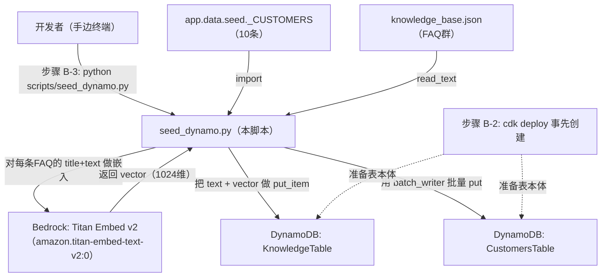
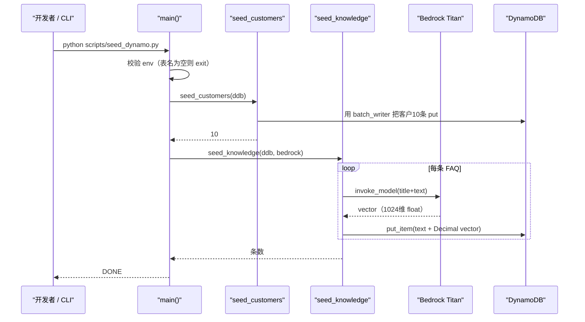

# 基本设计书（代码解说版）
## `scripts/seed_dynamo.py` — DynamoDB 初始数据投入脚本

> 本书面向初学者，用图和表讲解「这个脚本以什么为输入、输出什么、何时由谁执行、内部如何运作、与哪些 SDK/函数相互调用」。专业术语在 §7 术语表中附中文注释。

---

## 0. 文档信息

| 项目 | 内容 |
|---|---|
| 对象文件 | `scripts/seed_dynamo.py` |
| 作用（一句话） | 部署后向 **2 张 DynamoDB 表**只灌一次初始数据。客户表存原始数据，知识表则用 **Titan 预先计算嵌入向量**后保存 |
| 类别 | 运维脚本（Python） |
| 执行环境 | 手边终端。`default` profile / 东京区域。需要 `boto3` |
| 执行时机 | README **步骤 B-3**（向 `cdk deploy` 建好的表，在 seed 阶段**只 seed 一次**） |
| 主要依赖（SDK） | `boto3`（`dynamodb` resource / `bedrock-runtime` client）、`app.data.seed._CUSTOMERS` |
| 输入数据源 | `backend/app/data/seed.py` 的 `_CUSTOMERS`（客户）／ `backend/app/data/knowledge_base.json`（FAQ 知识） |

---

## 1. 概述（这个脚本做什么）

`seed_dynamo.py` 是一个**往空的 DynamoDB 表里放入首批数据**的一次性脚本。要做的有 2 件事：

1. **客户投入（`seed_customers`）** — 用 `batch_writer` 把 `_CUSTOMERS`（10 条营业客户）批量写入 `CustomersTable`。
2. **知识投入（`seed_knowledge`）** — 读取 `knowledge_base.json`（FAQ 群），把每条 FAQ 的 `title + text` 用 **Titan 只做一次嵌入向量化**，连同正文一起保存到 `KnowledgeTable`。

> 💡 **设计意图（2 点）**：
> ① **向量「投入时只算一次」并烧进表里**。如果每次生产检索请求都打 Bedrock，每次都要计费，所以**用预计算降低成本与延迟**（典型的 RAG 预处理）。
> ② DynamoDB **不能保存 `float`**，所以向量或金额要先**转成 `Decimal`** 再放进去。忘了这步 `boto3` 会抛类型错误。

---

## 2. 系统内的位置（执行时机流程）

把「何时、由谁执行、对哪个 AWS 资源起作用」画成图：



- **IN（输入侧）**：开发者在 `cdk deploy` 完成后，把 Outputs 的表名放进 env 后手动执行。
- **OUT（作用侧）**：向 `CustomersTable` 与 `KnowledgeTable` 两张表写入，知识侧会**调用 Bedrock(Titan)** 取得向量。属于**写入系**，原则上只执行一次。

---

## 3. 输入(参数/环境变量)·输出 一览

### 3.1 输入（环境变量）

| 环境变量 | 默认值 | 必须 | 含义 |
|---|---|---|---|
| `AWS_REGION` | `ap-northeast-1` | 推荐 | boto3 的目标区域（固定东京运营） |
| `CUSTOMERS_TABLE` | `""`（空） | **必须** | 客户表名。贴 CDK Outputs 的 `CustomersTableName`。未指定则**立即终止** |
| `KNOWLEDGE_TABLE` | `""`（空） | **必须** | 知识表名。贴 CDK Outputs 的 `KnowledgeTableName`。未指定则**立即终止** |
| `BEDROCK_EMBED_MODEL` | `amazon.titan-embed-text-v2:0` | 可选 | 用于嵌入的 Bedrock 模型 ID |

> 不使用参数（`sys.argv`）。配置**全部通过环境变量**传入。

### 3.2 输入（文件/代码）

| 类别 | 位置 | 内容 |
|---|---|---|
| Python | `app.data.seed._CUSTOMERS` | 10 条客户的元组 `(name, region, industry, revenue, status, last)`。与 SQLite 版**共享同一份原料** |
| JSON | `backend/app/data/knowledge_base.json` | FAQ 的数组。每个元素 `{id, title, text}` |

### 3.3 输出（产物·副作用）

| 类别 | 内容 |
|---|---|
| AWS 写入① | 向 `CustomersTable` 写 10 条客户（用 `batch_writer` 批量 put） |
| AWS 写入② | 向 `KnowledgeTable` 写 FAQ 条数（`id`/`title`/`text`/`vector`）。**会产生与 FAQ 条数相同次数的 Bedrock 调用** |
| 标准输出 | `[customers] ... N 件投入` / 每条 FAQ `seeded faq-xxx (...) dim=1024` / `[knowledge] ... 件投入` / `DONE` |
| 退出码 | 成功 `0` ／ 表名未指定时 `sys.exit(...)`（非 0，带消息） |

---

## 4. 处理步骤详细

把各函数按「作用 / IN / OUT / 执行时机 / 依赖 / 处理逻辑 / 注意点」拆解。

### 4.0 模块初始化（行16〜36）

- **作用**：让 import 可行，并读取配置值（env）。
- **输入(IN)**：环境变量群、文件路径
- **输出(OUT)**：常量 `REGION` / `CUSTOMERS_TABLE` / `KNOWLEDGE_TABLE` / `EMBED_MODEL` / `KB_JSON`，以及 import 进来的 `_CUSTOMERS`
- **依赖**：`sys.path.insert`（把 `backend` 加入路径）
- **处理逻辑（分步）**：
  1. 算出 `ROOT`，用 `sys.path.insert(0, str(ROOT / "backend"))` 让 **`app.*` 可被 import**（为与本体共享客户数据）。
  2. `from app.data.seed import _CUSTOMERS` 取入客户的原料。
  3. 从 env 读取表名·区域·模型 ID。
- **注意点**：因为 `sys.path` 的追加必须**先于 import 语句**，所以加了 `# noqa: E402`（抑制 import 位置的 lint 警告）。

---

### 4.1 `_embed`（文本 → 向量, 行39〜43）⭐

- **作用**：把 1 条文本交给 Bedrock(Titan)，以 **`Decimal` 的数组**返回嵌入向量。
- **输入(IN)**

| 参数 | 类型 | 含义 |
|---|---|---|
| `bedrock` | client | `boto3.client("bedrock-runtime")` |
| `text` | `str` | 想嵌入的字符串（FAQ 的 `title + text`） |

- **输出(OUT)**：`list[Decimal]`（DynamoDB 可保存的数值数组）
- **执行时机**：由 `seed_knowledge` 对每条 FAQ 调用 1 次。
- **依赖**：`bedrock.invoke_model` / `json.dumps` / `json.loads` / `Decimal`
- **处理逻辑（分步）**：
  1. 用 `bedrock.invoke_model(modelId=EMBED_MODEL, body=json.dumps({"inputText": text}))` 调用 Titan。
  2. 把响应 body 做 `json.loads`，取出 `["embedding"]`（float 的数组）。
  3. 把各元素转成 `Decimal(str(x))` 后返回（**经由 `str`** 以避免浮点的舍入误差）。
- **注意点**：用 **`Decimal(str(x))`** 而非 `Decimal(x)`（直接传 float）。把 float 直接 Decimal 化会带上无限位误差，先转成字符串再转换是惯用做法。

---

### 4.2 `seed_customers`（客户投入, 行46〜61）⭐

- **作用**：把 10 条客户批量写入 `CustomersTable`。
- **输入(IN)**：`ddb`（`boto3.resource("dynamodb")`）
- **输出(OUT)**：`int`（投入条数＝`len(_CUSTOMERS)`）。副作用是向表 put 10 条。
- **执行时机**：`main` 的前半。
- **依赖**：`ddb.Table(...).batch_writer()` / `bw.put_item`
- **处理逻辑（分步）**：
  1. `table = ddb.Table(CUSTOMERS_TABLE)` 抓住目标表。
  2. `with table.batch_writer() as bw:` 打开**批量写入上下文**。
  3. 用 `enumerate(..., start=1)` 遍历 `_CUSTOMERS`，以 `id = f"cust-{i:03d}"`（`cust-001`〜）编号。
  4. 把每行做成 `Item={...}` 后 `bw.put_item(...)`。`monthly_revenue` 转成 `Decimal(revenue)`（金额同样不可用 float）。
- **注意点**：`batch_writer` 会**内部缓冲，按 25 条为单位自动发送＋失败自动重试**，所以条数增加也高效。`id` 由应用侧编号（DynamoDB 没有 AUTOINCREMENT）。

---

### 4.3 `seed_knowledge`（FAQ＋向量投入, 行64〜73）⭐⭐

- **作用**：读取 FAQ，对每条 FAQ 做嵌入计算并连同正文一起保存。本脚本的主目的。
- **输入(IN)**：`ddb`（dynamodb resource）、`bedrock`（bedrock-runtime client）
- **输出(OUT)**：`int`（投入条数＝`len(docs)`）。副作用是向表 put FAQ 条数＋调用 Bedrock。
- **执行时机**：`main` 的后半。
- **依赖**：`KB_JSON.read_text` / `json.loads` / `self._embed`（模块函数）/ `table.put_item`
- **处理逻辑（分步）**：
  1. `docs = json.loads(KB_JSON.read_text(encoding="utf-8"))` 读取 FAQ 数组。
  2. 对每个 `d`，用 `vector = _embed(bedrock, f"{d['title']} {d['text']}")` 把**标题＋正文一起做成 1 个向量**。
  3. `table.put_item(Item={"id","title","text","vector"})` 逐条保存（不是 `batch_writer` 而是单发 put）。
  4. `print(f"  seeded {d['id']} ... dim={len(vector)}")` 边确认维数边推进。
- **注意点**：
  - 与客户侧不同，这里用**单发 `put_item`**。因为 Bedrock 调用是瓶颈＝写入频率低，所以优先逐条输出进度日志。
  - 把 `title + text` 拼接后嵌入＝意在检索时比「只标题」「只正文」**更少漏掉语义**。

---

### 4.4 `main`（入口, 行76〜90）

- **作用**：校验 env，创建 boto3 客户端，按客户 → 知识的顺序投入。
- **输入(IN)**：环境变量（表名）
- **输出(OUT)**：标准输出进度，最后 `DONE`
- **执行时机**：敲 `python scripts/seed_dynamo.py` 的瞬间。
- **依赖**：`boto3.resource("dynamodb")` / `boto3.client("bedrock-runtime")` / `seed_customers` / `seed_knowledge`
- **处理逻辑（分步）**：
  1. **守卫**：若 `CUSTOMERS_TABLE` 或 `KNOWLEDGE_TABLE` 为空，用 `sys.exit("... env で指定してください")` **立即终止**（防止误把未设置就跑）。
  2. `ddb = boto3.resource("dynamodb", region_name=REGION)`、`bedrock = boto3.client("bedrock-runtime", region_name=REGION)`。
  3. `seed_customers(ddb)` → print 条数。
  4. `seed_knowledge(ddb, bedrock)` → print 条数。
  5. print `DONE`。



- **注意点**：本脚本**不是幂等的**（用相同 `id` 再执行会覆盖）。客户因 `id` 固定不会重复，但**运营上「只执行一次」是原则**（README 也写明）。

---

## 5. 执行示例（命令）

```bash
# 步骤 B-3: 把 cdk deploy 的 Outputs 贴到 env 后执行
export AWS_REGION=ap-northeast-1
export CUSTOMERS_TABLE=<输出 CustomersTableName>
export KNOWLEDGE_TABLE=<输出 KnowledgeTableName>
python scripts/seed_dynamo.py

# 想换嵌入模型时（可选）
export BEDROCK_EMBED_MODEL=amazon.titan-embed-text-v2:0
python scripts/seed_dynamo.py
```

> 预期的标准输出（摘录）：
> ```
> [customers] -> CustomersTable-xxxx
> [customers] 10 件投入
> [knowledge] -> KnowledgeTable-xxxx (Titan で埋め込み計算)
>   seeded faq-001 (見積もりの有効期限) dim=1024
>   seeded faq-002 (支払いサイト) dim=1024
>   ...
> [knowledge] N 件投入
> DONE
> ```

---

## 6. 相互引用表

| 区分 | 对象 | 关系 |
|---|---|---|
| 执行方（人/步骤） | README **步骤 B-3** | `cdk deploy` 后由开发者手动执行 1 次 |
| 输入（客户） | `backend/app/data/seed.py:_CUSTOMERS` | 用 import 共享。与 SQLite 版同一份原料 |
| 输入（知识） | `backend/app/data/knowledge_base.json` | 用 `read_text` 读 FAQ 数组 |
| 调用 SDK | `boto3.resource("dynamodb")` / `boto3.client("bedrock-runtime")` | 写入与嵌入 |
| 调用 AWS | DynamoDB（`CustomersTable`/`KnowledgeTable`）/ Bedrock（Titan Embed v2） | 表由 CDK 事先创建 |
| 前工序（生产者） | `build_lambda.md`（B-1）→ `infra/` CDK（B-2） | 准备表本体 |
| 后工序（消费者） | 后端的检索处理 | 用已投入的向量做相似检索（不再重新嵌入） |
| 相关文档 | `make_token.md`（本地 `/chat` 验证用 JWT） | 投入后的动作确认，一脉相承 |

---

## 7. 术语表

| 术语（日/英） | 中文注释 |
|---|---|
| 埋め込み / embedding | **嵌入向量**。把文本转成语义化的数值向量。向量越近＝语义越近，用于检索 |
| Titan 埋め込み / Titan embedding | Amazon Bedrock 的嵌入模型 `amazon.titan-embed-text-v2:0`。本脚本用它把 FAQ 向量化（输出 1024 维） |
| `batch_writer` | DynamoDB 的**批量写入**辅助器。内部会按 25 条为单位拆分发送＋失败自动重试＋缓冲 |
| `Decimal` | Python 的**十进制定点小数**类型。DynamoDB 不接受 `float`，所以数值要转成 `Decimal` 保存 |
| `Decimal(str(x))` | 把 float 先**转成字符串再** Decimal 化的写法。避免 float 直接传入会带上的舍入误差，是惯用做法 |
| `invoke_model` | Bedrock 的**模型调用** API。传入 `modelId` 与 `body`(JSON) 调用一次模型 |
| `put_item` | 向 DynamoDB **写入 1 个条目**的 API。同 key 则覆盖（＝非幂等） |
| `boto3.resource` / `boto3.client` | AWS SDK for Python 的两种入口。`resource`＝高层(`Table` 等便利对象)，`client`＝低层(API 原样) |
| RAG（检索增强生成） | **检索增强生成**。检索与问题相近的知识，把该上下文交给 LLM 让它作答的方式。本脚本负责其**检索侧的预处理**（预先向量化） |
| 事前計算 / precompute | 不在每次检索时重新嵌入，而是**投入时只算一次**并保存好。以降低成本与延迟 |
| 冪等性 / idempotency | **幂等性**。同一操作做多少次结果都不变的性质。本脚本可能发生覆盖，所以「只执行一次」是原则 |
| 次元 / dimension（dim） | 向量的元素数。Titan v2 是 1024。`seed_knowledge` 在日志中输出 `dim=...` 来确认 |

---

> **若把本模板套用到其他文件**：§0〜§7 的框架照用，§4 的「作用/IN/OUT/执行时机/依赖/处理逻辑/注意点」逐个函数填进去即可。
