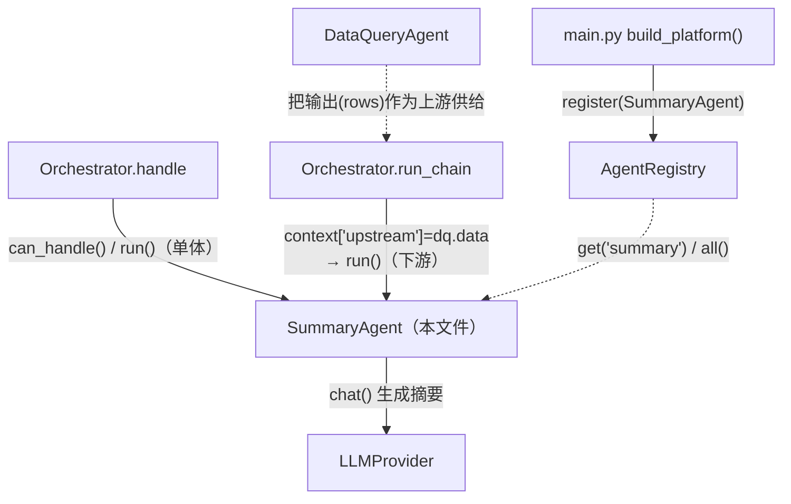
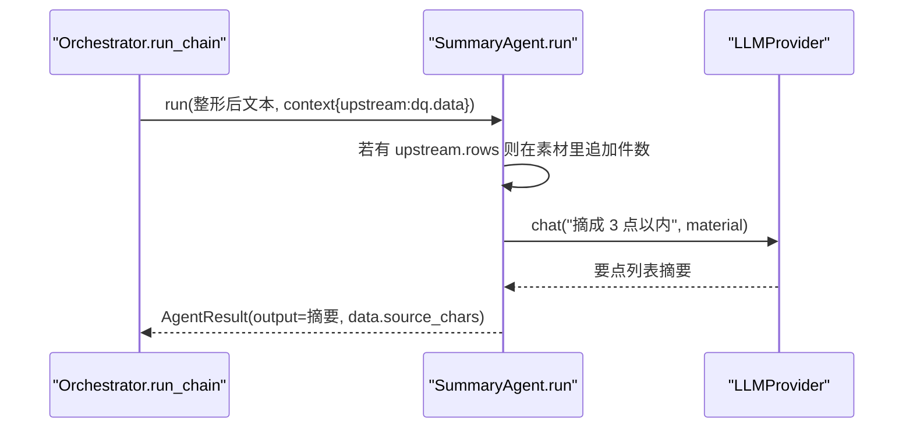
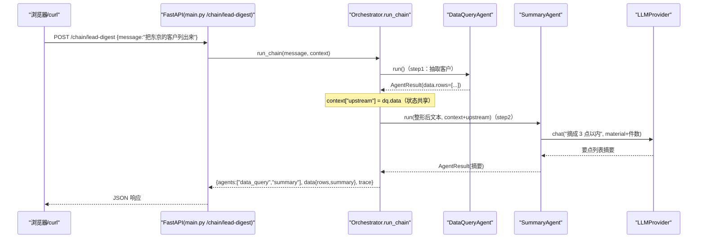

# 基本设计书（代码解说版）
## `backend/app/agents/summary_agent.py` — 摘要智能体

> 本书面向初学者，用图和表解说「这个文件：以什么为输入、输出什么、被谁调用、内部如何运作、与哪些部件相互调用」。专业术语在 §7 术语表附中文注释。

---

## 0. 文档信息

| 项目 | 内容 |
|---|---|
| 对象文件 | `backend/app/agents/summary_agent.py` |
| 作用（一句话） | 把输入文本（对话日志・会议纪要・**上游智能体的输出**）用 LLM 缩成简短摘要。既能单体使用，也能作链的**下游**的最小智能体 |
| 层级 | 智能体层（`app/agents`） |
| 公开类 | `SummaryAgent`（实现 `BaseAgent`） |
| 依赖（import）方 | `core.base_agent.AgentResult,BaseAgent` / `providers.base.LLMProvider` |
| 直接调用方 | `Orchestrator`（`route_by_rule`/`route_by_llm` 调 `can_handle()`，`_run_agent()`/`run_chain()` 调 `run()`）／ `app/main.py`（`register`）／ `tests/test_smoke.py` |

---

## 1. 概述（这个部件做什么）

`SummaryAgent`（摘要智能体）是三者中最简单的。把输入文本交给 LLM 做**抽取式摘要**（3 点以内的要点列表）即可。但它有两种角色：

1. **单体执行** — 直接处理「把这份会议纪要摘要一下」这类请求。
2. **链的下游** — 在 `run_chain` 中作为**接收 DataQuery 输出并摘要**的主角。经 `context["upstream"]` 把上游的结构化数据（rows 件数等）也加入摘要素材。

> 💡 **设计意图（关注点分离）**：`SummaryAgent` 不知道「**自己的文本是从哪来的**」。无论输入是 DB 检索结果、会议纪要还是邮件正文，都能用同一个 `run()` 处理。这种**对输入来源无感**正是链可自由重组的自由度之源（DataQuery→Summary 可以，别的 agent→Summary 也可以接）。

---

## 2. 系统内的位置（调用关系图）

`SummaryAgent` 与「上层(Orchestrator)调它」「它调下层(llm)」的关系，尤其是作为**链下游**的交接：



- **IN（被调用一侧）**：`Orchestrator` 调 `can_handle()`／`run()`（单体 or 链下游）。链式时上游 DataQuery 的结果会被堆进 `context["upstream"]` 传过来。
- **OUT（向外调用一侧）**：只调 `llm.chat()` 生成摘要。

---

## 3. 公开接口一览

| 方法 | 种别 | IN（主要输入） | OUT（返回值） | 用途速览 |
|---|---|---|---|---|
| `__init__` | 同步 | llm | （生成实例） | 接收依赖（LLM）并保存 |
| `can_handle` | 同步 | query, context | `float`（置信度） | 按摘要类关键词返回路由得分 |
| `run` | 异步 | query, context | `AgentResult` | **主处理**：加入上游数据生成摘要 |

---

## 4. 方法详细设计

各方法按「作用 / IN / OUT / 调用处 / 调用谁 / 处理逻辑 / 注意点」拆解。

### 4.1 `__init__`（构造函数, 行26〜27）

- **作用**：仅接收依赖（LLM）并保存。三者中依赖最少（既不需 DB 也不需 Embedder）。
- **输入(IN)**

| 参数 | 类型 | 含义 |
|---|---|---|
| `llm` | `LLMProvider` | 用于生成摘要的 LLM |

- **输出(OUT)**：无（生成实例）
- **调用处（被谁调用）**：`app/main.py:88`（`build_platform()` 内）、`tests/test_smoke.py:32`、`tests/test_smoke.py:38,40`（重复注册测试）
- **处理逻辑（分步编号）**：仅赋给 `self.llm`。

---

### 4.2 `can_handle`（路由得分, 行29〜31）

- **作用**：以 0.05〜0.9 的分数返回「问题是否适合摘要」。
- **输入(IN)**：`query: str`, `context: dict`（后者未用，仅为签名统一）
- **输出(OUT)**：`float` — 有命中则 `min(0.9, 0.3 + 0.2×命中数)`，无则 **0.05**（保守）
- **调用处（被谁调用）**：`Orchestrator.route_by_rule()` `orchestrator.py:54`（列举全部 agent 调用）
- **调用谁（依赖）**：无（扫描 `self._KEYWORDS`）
- **处理逻辑（分步编号）**：
  1. 数 `_KEYWORDS`（「要約」「まとめ」「サマリ」「要点」「整理して」「短く」）的命中数 `hits`
  2. `hits>0` → `min(0.9, 0.3 + 0.2×hits)`，`hits==0` → `0.05`
- **注意点**：命中 0 时的底值 0.05 比 Knowledge(0.2)・DataQuery(0.1) **都低**。除非明说「摘要」否则不主动举手＝偏向**链下游专用**的性格。

---

### 4.3 `run`（主处理：加入上游的摘要生成, 行33〜50）⭐

- **作用**：把输入文本（＋若有上游数据则其件数信息）交给 LLM，返回 3 点以内的要点列表摘要。
- **输入(IN)**：`query: str`（待摘要文本）, `context: dict`（可能含 `upstream`）／ **异步(async)**
- **输出(OUT)**：`AgentResult`

```json
{
  "agent": "summary",
  "output": "・东京/IT 客户 2 件\n・月营收最高为 ○○商事\n・...",
  "data": { "source_chars": 128 }
}
```

- **调用处（被谁调用）**：
  - `Orchestrator.run_chain()` `orchestrator.py:177`（链的 step2＝**作为下游**）
  - `Orchestrator._run_agent()` `orchestrator.py:102`（经 `handle()`＝单体执行，`/chat` 里来「摘要一下」时）
- **调用谁（依赖）**：`self.llm.chat()`
- **处理逻辑（分步编号）**：
  1. 看 `context.get("upstream")`。若经链式而来，里面有上游 DataQuery 的 `data`（含 rows）
  2. 若上游有 `rows`，则在摘要素材 `material` 后追加「（原数据件数: N 件）」（**状态共享的利用**）。没有则把 `query` 原样作素材
  3. 组「用日语 3 点以内列表、保留数字与专有名词」的 system 提示
  4. `llm.chat(system, material)` 生成摘要
  5. 把摘要文本和 `source_chars`（待摘要文本字数）放入 `AgentResult` 返回



- **注意点**：
  - 有无上游都能用**同一个 run() 处理**（即对输入来源无感）。这是链可重组的自由度之源。
  - 输出约束「保留数字与专有名词」，使摘要贴近营业一眼可抓的形态。

---

## 5. 数据流（作为链下游的流程）

`POST /chain/lead-digest` 跑 DataQuery→Summary 时，Summary 所处的位置：



---

## 6. 相互引用表

| 本文件的方法 | 调用处（被谁调用） | 调用谁（依赖） |
|---|---|---|
| `__init__` | `main.py:88`, `test_smoke.py:32,38,40` | — |
| `can_handle` | `Orchestrator.route_by_rule`(`orchestrator.py:54`) | `self._KEYWORDS`（仅扫描） |
| `run` | `Orchestrator.run_chain`(`orchestrator.py:177` 下游), `_run_agent`(`orchestrator.py:102` 单体) | `llm.chat()` |

> 相关文件：`core/base_agent.py`（`BaseAgent`/`AgentResult` 契约）／`providers/base.py`（`LLMProvider`）／`core/orchestrator.py`（`run_chain` 经 `context["upstream"]` 传上游数据）／`agents/dataquery_agent.py`（链的上游）

---

## 7. 术语表

| 术语（日/英） | 中文注释 |
|---|---|
| 抽出的要約 / extractive-style summary | **抽取式摘要倾向**。本实现要求「保留数字与专有名词」，结果偏向摘录关键信息而非自由复述（实际由 LLM 生成，prompt 约束其贴近原文要点） |
| 要約 / summarization | **摘要/概括**。把长文压缩成要点；本 agent 限定为 3 点以内的项目符号 |
| チェーン / chain | **链式调用**。多个 agent 串联，上一个的输出作为下一个的输入；本 agent 常作链尾 |
| 下流 / downstream | **下游**。链中靠后的环节；SummaryAgent 是 DataQuery→Summary 链的下游 |
| 上流 / upstream | **上游**。链中靠前的环节；其结果经 `context["upstream"]` 传递给下游 |
| 状態共有 / state sharing | **状态共享**。agent 间通过 `context` 字典传递中间结果，而非直接互相调用类 |
| 関心の分離 / separation of concerns | **关注点分离**。本 agent 不关心文本来源（DB/议事录/邮件皆可），只负责「要约」这一件事 |
| 入力源への無関心 / source-agnostic | **对输入来源无感**。同一个 `run()` 能处理任意来源的文本，是链可自由重组的前提 |
| 構造化データ / structured data | **结构化数据**。上游 `dq.data.rows`（list[dict]）；本 agent 只取其件数信息加入材料 |
| 自信度 / confidence score | **置信度**。`can_handle()` 返回的 0〜1 分数；本 agent 底值最低(0.05)，倾向只在明确「要约」时出手 |
| 非同期 / async・await | **异步**。`run()` 为 async，因 LLM 调用是 I/O 等待，异步利于并发处理多请求 |
