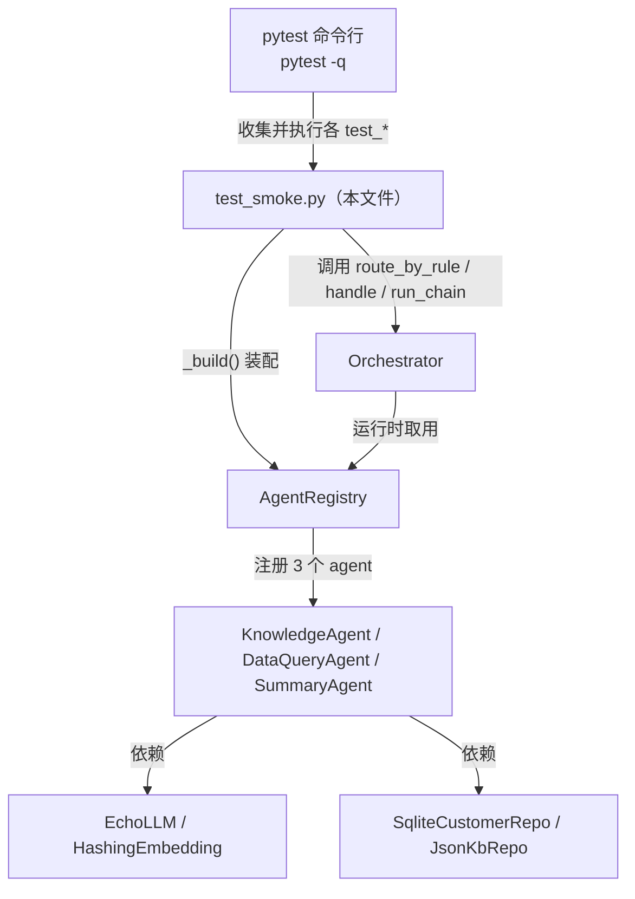
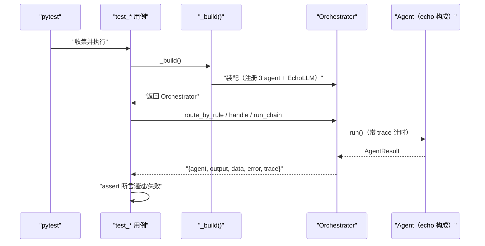

# 基本设计书（代码解说版）
## `backend/tests/test_smoke.py` — 冒烟测试（无模型・echo 构成下保证整体可跑）

> 本书面向初学者，用图和表解说「这个文件以什么为输入、输出什么、被谁调用、内部如何运转、与哪些部件相互调用」。专业术语在 §7 术语表附中文注释。

---

## 0. 文档信息

| 项目 | 内容 |
|---|---|
| 对象文件 | `backend/tests/test_smoke.py` |
| 作用（一句话） | **冒烟测试（smoke test）**。在「无 LLM 模型・无外部依赖・跳过认证」的 echo 构成下，验证「注册→路由→执行→串联→追踪」整条主链路能跑通 |
| 所属层 | 测试层（`backend/tests`） |
| 公开函数 | `_build`（测试装配辅助，非测试用例）／ `test_registry_rejects_duplicate` / `test_rule_routing_picks_dataquery` / `test_rule_routing_picks_summary` / `test_dataquery_returns_rows` / `test_chain_dataquery_then_summary` / `test_knowledge_low_similarity_refuses` / `test_trace_records_timing` |
| 依赖（import）对象 | `app.core`（`AgentRegistry` / `Orchestrator`）／ `app.agents`（3 个 agent）／ `app.providers`（`EchoLLM` / `HashingEmbedding`）／ `app.data`（`init_db` / `SqliteCustomerRepo` / `JsonKbRepo`）／ `app.config.settings` / `pytest` |
| 直接调用方 | `pytest`（命令行 `pytest -q` 自动收集执行） |

---

## 1. 概述

这是一组 **pytest 冒烟测试**。所谓「冒烟」＝不追求覆盖每个分支，只验证「把电源打开会不会冒烟」级别的最关键主链路是否健全。为做到**零外部依赖**，文件顶部（行12〜14）用 `os.environ.setdefault` 把运行环境切到本地替身：

- `LLM_BACKEND=echo` → 用 `EchoLLM`（规则式假 LLM，不连模型）
- `EMBED_BACKEND=hashing` → 用 `HashingEmbedding`（纯 Python 确定性向量化，不连模型）
- `DEV_NO_AUTH=1` → 跳过 JWT 认证

> 💡 **设计意图**：测试**必须实跑且可重复**。echo/hashing 替身保证「不联网、不花 token、结果确定」，因此这套测试能在 CI 与本地稳定复现，作为重构时的安全网（回归基线）。

> ⭐ **import 顺序的坑**：环境变量的 `setdefault`（行12〜14）必须**先于** `from app... import`（行16 起）执行。因为很多模块在 import 时就按 `settings` 决定用哪个 backend，晚设环境变量就来不及生效。代码用 `# noqa: E402`（行16 起）显式压制「import 不在文件顶部」的 lint 告警，正是为此。

---

## 2. 系统内的位置（调用关系图）

`test_smoke.py` 站在系统最外层，**只通过 `Orchestrator` 的公开接口**驱动整条链路：

- **IN（驱动过来的一侧）**：`pytest` 收集并执行所有 `test_*` 函数。
- **OUT（出去的一侧）**：测试调用 `Orchestrator` 与 `AgentRegistry` 的公开方法，间接驱动 agent、provider、repo。

---

## 3. 公开接口一览

| 名称 | 类型 | IN（主要输入） | OUT（返回/断言） | 大致用途 |
|---|---|---|---|---|
| `_build` | 同步辅助 | （无） | `Orchestrator` | 装配 echo 构成的编排器 |
| `test_registry_rejects_duplicate` | 同步用例 | （无） | 断言抛 `ValueError` | 验证重复 name 注册被拒 |
| `test_rule_routing_picks_dataquery` | 同步用例 | （无） | 断言路由到 `data_query` | 验证规则路由命中数据查询 |
| `test_rule_routing_picks_summary` | 同步用例 | （无） | 断言路由到 `summary` | 验证规则路由命中要约 |
| `test_dataquery_returns_rows` | 异步用例 | （无） | 断言 rows 非空・params 正确 | 验证数据查询端到端可出行 |
| `test_chain_dataquery_then_summary` | 异步用例 | （无） | 断言串联两步・有追踪 | 验证 chain 串联可跑 |
| `test_knowledge_low_similarity_refuses` | 异步用例 | （无） | 断言无 error | 验证库外话题不崩溃 |
| `test_trace_records_timing` | 异步用例 | （无） | 断言 total_ms・steps 数 | 验证追踪记录计时 |

---

## 4. 方法详细设计

每个函数拆为「作用 / 输入(IN) / 输出(OUT) / 调用处 / 调用谁 / 处理逻辑 / 注意点」。

### 4.1 `_build`（测试装配辅助, 行26〜33）⭐

- **作用**：装配一个「echo 构成」的 `Orchestrator`，供各异步用例复用。等价于生产里 `main.py` 的 `build_platform()`，但全部替换为本地替身。
- **输入(IN)**：无
- **输出(OUT)**：`Orchestrator`（已注册 3 个 agent，`router_llm` 用 `EchoLLM`，`default_agent="knowledge"`）
- **调用处**：`test_smoke.py:44, 50, 57, 69, 81, 89`（各 `test_*` 用例内 `orch = _build()`）
- **调用谁**：`init_db()` / `AgentRegistry()` / `EchoLLM()` / `HashingEmbedding()` / `JsonKbRepo()` / `SqliteCustomerRepo()` / 3 个 agent 的构造函数 / `Orchestrator()`
- **处理逻辑（分步）**：
  1. `init_db(settings.db_path)`（行27）— 初始化 SQLite 数据库（建表＋样例数据），保证后续查询有数据可出。
  2. `reg = AgentRegistry()`（行28）— 建空注册簿。
  3. `llm, emb = EchoLLM(), HashingEmbedding()`（行29）— 造两个本地替身：假 LLM 与确定性嵌入。
  4. `reg.register(KnowledgeAgent(llm, emb, JsonKbRepo(settings.kb_path)))`（行30）— 知识 agent 注入「LLM＋嵌入＋JSON 知识库仓库」。
  5. `reg.register(DataQueryAgent(llm, SqliteCustomerRepo(settings.db_path)))`（行31）— 数据查询 agent 注入「LLM＋SQLite 客户仓库」。
  6. `reg.register(SummaryAgent(llm))`（行32）— 要约 agent 只注入 LLM。
  7. `return Orchestrator(reg, router_llm=llm, default_agent="knowledge")`（行33）— 把注册簿与 router 用 LLM 交给编排器。
- **装配关系一览**

| agent | 注入的依赖 | 替身说明 |
|---|---|---|
| `KnowledgeAgent` | `EchoLLM`, `HashingEmbedding`, `JsonKbRepo(kb_path)` | LLM 与嵌入皆本地替身；知识库读 JSON 文件 |
| `DataQueryAgent` | `EchoLLM`, `SqliteCustomerRepo(db_path)` | 查询打到本地 SQLite（`init_db` 建好的库） |
| `SummaryAgent` | `EchoLLM` | 只需 LLM 做抽取式要约 |

- **注意点**：`_build` **本身不是测试用例**（无 `test_` 前缀，pytest 不会单独收集），只是供用例复用的工厂。它体现了**依赖注入(DI)**：agent 的 LLM/嵌入/仓库都从外部传入，因此能整组换成替身。

---

### 4.2 `test_registry_rejects_duplicate`（重复注册被拒, 行36〜40）

- **作用**：验证 `AgentRegistry.register` 对**重复 name** 抛 `ValueError`（fail-fast，不静默覆盖）。
- **输入(IN)**：无
- **输出(OUT)**：断言 `with pytest.raises(ValueError)` 成立
- **调用处**：`pytest`（自动收集）
- **调用谁**：`AgentRegistry()`（行37）/ `reg.register(SummaryAgent(EchoLLM()))`（行38、40）
- **处理逻辑（分步）**：
  1. 建空 `AgentRegistry`。
  2. 注册一个 `SummaryAgent`（成功）。
  3. 再注册同名（`name="summary"`）的 `SummaryAgent`，断言在 `pytest.raises(ValueError)` 块内抛错。
- **注意点**：这是唯一**不依赖 `_build()`** 的用例，单独验证 registry 的重复检测（对应 `registry.py` 的 §4.2 `register`）。

---

### 4.3 `test_rule_routing_picks_dataquery`（规则路由→数据查询, 行43〜46）

- **作用**：验证含「一覧」「顾客」等关键词的输入，规则路由会选 `data_query`。
- **输入(IN)**：无（内部固定 query `"東京の顧客を一覧で出して"`）
- **输出(OUT)**：断言 `name == "data_query"`
- **调用处**：`pytest`
- **调用谁**：`_build()`（行44）/ `orch.route_by_rule(...)`（行45）
- **处理逻辑（分步）**：①装配；②调 `route_by_rule(query, {})` 得 `(name, why)`；③断言 `name == "data_query"`（断言失败时把 `why` 打出来便于诊断）。
- **注意点**：直接测 `route_by_rule`（不走 `handle`），隔离验证路由打分逻辑（对应 `orchestrator.py` §4.2）。

---

### 4.4 `test_rule_routing_picks_summary`（规则路由→要约, 行49〜52）

- **作用**：验证含「要約」关键词的输入，规则路由会选 `summary`。
- **输入(IN)**：无（固定 query `"この議事録を要約して"`）
- **输出(OUT)**：断言 `name == "summary"`
- **调用处**：`pytest`
- **调用谁**：`_build()`（行50）/ `orch.route_by_rule(...)`（行51）
- **处理逻辑（分步）**：①装配；②调 `route_by_rule`；③断言 `name == "summary"`。
- **注意点**：与 4.3 成对，确认不同关键词分别命中不同 agent，间接验证多 agent 的 `can_handle` 打分能分出优劣。

---

### 4.5 `test_dataquery_returns_rows`（数据查询端到端, 行55〜64）⭐

- **作用**：验证 `data_query` agent 经 `handle()` 能真的从 SQLite 查出行，并正确抽取参数（白名单抽取 region/industry 生效）。
- **输入(IN)**：无（固定 query `"東京のIT顧客を出して"`，`route_mode="rule"`）
- **输出(OUT)**：多条断言（见下）
- **调用处**：`pytest`（`@pytest.mark.asyncio` 异步用例）
- **调用谁**：`_build()`（行57）/ `await orch.handle(query, {}, route_mode="rule")`（行58）
- **处理逻辑（分步）**：
  1. `res = await orch.handle("東京のIT顧客を出して", {}, route_mode="rule")`。
  2. 断言 `res["agent"] == "data_query"`（路由正确）。
  3. 断言 `res["error"] is None`（无异常）。
  4. 断言 `res["data"]["rows"]` 非空（东京/IT 至少 1 件）。
  5. 断言 `res["data"]["params"]["region"] == "東京"` 且 `["industry"] == "IT"`（参数抽取正确）。
- **注意点**：这是覆盖最广的用例——路由＋agent 执行＋SQLite 查询＋参数抽取一条龙。依赖 `_build()` 里 `init_db()` 已写入样例数据。

---

### 4.6 `test_chain_dataquery_then_summary`（串联两步, 行67〜75）⭐

- **作用**：验证 `run_chain()` 能把 `data_query` → `summary` 串起来跑，且追踪里留下两步记录。
- **输入(IN)**：无（固定 query `"東京の顧客を出して"`）
- **输出(OUT)**：断言执行顺序、data 含 summary、trace 含两步
- **调用处**：`pytest`（异步用例）
- **调用谁**：`_build()`（行69）/ `await orch.run_chain(query, {})`（行70）
- **处理逻辑（分步）**：
  1. `res = await orch.run_chain("東京の顧客を出して", {})`。
  2. 断言 `res["agents"] == ["data_query", "summary"]`（按序串联）。
  3. 断言 `"summary" in res["data"]`（下游产出已并入）。
  4. 从 `res["trace"]["steps"]` 取各 `step` 名，断言同时含 `"agent:data_query"` 与 `"agent:summary"`（观测可观测性）。
- **注意点**：验证「上游 `data_query` 的 `rows` 经 `context["upstream"]` 传给下游 `summary`」这一状态共享主线（对应 `orchestrator.py` §4.5）。

---

### 4.7 `test_knowledge_low_similarity_refuses`（库外话题不崩, 行78〜84）

- **作用**：验证对**知识库里没有**的话题（量子计算论文），系统不崩溃、不幻觉，诚实返回（`error` 为 `None`）。
- **输入(IN)**：无（固定 query `"量子コンピュータの最新論文を教えて"`，`route_mode="rule"`）
- **输出(OUT)**：断言路由到 knowledge/summary/data_query 之一、且 `error is None`
- **调用处**：`pytest`（异步用例）
- **调用谁**：`_build()`（行81）/ `await orch.handle(query, {}, route_mode="rule")`（行82）
- **处理逻辑（分步）**：
  1. `res = await orch.handle(...)`。
  2. 断言 `res["agent"] in ("knowledge", "summary", "data_query")`（路由去向不限）。
  3. 断言 `res["error"] is None`（即便低相似度也不抛错，而是优雅拒答）。
- **注意点**：聚焦「**幻觉防止＋健壮性**」——低相似度时返回「找不到」而非编造，整链路仍正常返回。

---

### 4.8 `test_trace_records_timing`（追踪记录计时, 行87〜92）

- **作用**：验证 `handle()` 的返回里追踪含有效计时（`total_ms ≥ 0`）和至少两步（route + agent）。
- **输入(IN)**：无（固定 query `"サポート対応時間は？"`，`route_mode="rule"`）
- **输出(OUT)**：断言 `total_ms >= 0` 且 `len(steps) >= 2`
- **调用处**：`pytest`（异步用例）
- **调用谁**：`_build()`（行89）/ `await orch.handle(query, {}, route_mode="rule")`（行90）
- **处理逻辑（分步）**：
  1. `res = await orch.handle(...)`。
  2. 断言 `res["trace"]["total_ms"] >= 0`（总耗时已记录）。
  3. 断言 `len(res["trace"]["steps"]) >= 2`（至少 route 一步＋agent 一步）。
- **注意点**：直接验证 `trace.py` 的可观测性产物（对应 `trace.py` §4.5 `to_dict`、§4.6 `_StepTimer` 的计时）。

---

## 5. 数据流

`pytest` 收集执行 → `_build()` 装配 echo 构成 → 用例调 `Orchestrator` 公开方法 → 断言结果：

- 要点：测试只触碰 `Orchestrator` 的**公开接口**，把整条链路当黑盒驱动；底层全是确定性替身，故结果稳定可复现。

---

## 6. 相互引用表

| 本文件的要素 | 调用处 | 调用谁（依赖） |
|---|---|---|
| `_build` | `test_smoke.py:44,50,57,69,81,89` | `init_db`, `AgentRegistry`, `EchoLLM`, `HashingEmbedding`, `JsonKbRepo`, `SqliteCustomerRepo`, 3 个 agent, `Orchestrator` |
| `test_registry_rejects_duplicate` | `pytest` | `AgentRegistry`, `SummaryAgent`, `EchoLLM` |
| `test_rule_routing_picks_dataquery` | `pytest` | `_build`, `Orchestrator.route_by_rule` |
| `test_rule_routing_picks_summary` | `pytest` | `_build`, `Orchestrator.route_by_rule` |
| `test_dataquery_returns_rows` | `pytest` | `_build`, `Orchestrator.handle` |
| `test_chain_dataquery_then_summary` | `pytest` | `_build`, `Orchestrator.run_chain` |
| `test_knowledge_low_similarity_refuses` | `pytest` | `_build`, `Orchestrator.handle` |
| `test_trace_records_timing` | `pytest` | `_build`, `Orchestrator.handle` |

> 关联文件：`orchestrator.py`（被测主体）／`registry.py`（重复注册检测）／`base_agent.py`（`AgentResult` 形状）／`trace.py`（计时断言）／`providers/local_provider.py`（`EchoLLM`/`HashingEmbedding` 替身）／`data/*`（`init_db`/仓库）

---

## 7. 术语表

| 术语（日/英） | 中文注释 |
|---|---|
| スモークテスト / smoke test | **冒烟测试**。不求全覆盖，只验证最关键主链路「通电不冒烟」级别的健全 |
| pytest | Python 的主流测试框架。自动收集 `test_*` 函数并执行、汇总结果 |
| `@pytest.mark.asyncio` | 标记**异步测试**。让 pytest 能 `await` 协程用例（需 `pytest-asyncio` 插件） |
| フィクスチャ / 装配（`_build`） | **装配辅助**。在测试前组装被测对象（这里手写工厂函数代替 fixture） |
| 依存性注入 / DI | **依赖注入**。agent 的 LLM/嵌入/仓库从外部传入，故可整组换成替身 |
| スタブ・モック / stub・mock | **替身**。`EchoLLM`/`HashingEmbedding` 是不联网、结果确定的假实现，供离线测试 |
| `EchoLLM` | 规则式假 LLM。看 system 提示词类型返回抽取式应答，不连真模型 |
| `HashingEmbedding` | 纯 Python 确定性嵌入。把字符 n-gram 哈希到固定维度，不连真模型 |
| `os.environ.setdefault` | 仅当环境变量未设时才设默认值；用于在 import 前固定 backend 选择 |
| `# noqa: E402` | 压制「import 不在文件顶部」的 lint 告警；此处为先设环境变量后导入而必需 |
| 幻覚防止 / hallucination guard | **幻觉防止**。知识库无命中时诚实拒答，不编造内容 |
| 観測可能性 / observability | **可观测性**。`trace` 里记录每步成败与耗时，测试据此断言计时 |
| 回帰テスト / regression test | **回归测试**。重构后重跑这套测试，确保旧行为未被破坏（安全网） |

---

> **把此模板套到其他文件时**：§0〜§7 框架照用，把 §4 的「作用/IN/OUT/调用处/调用谁/逻辑/注意点」逐个套到每个函数上填写即可。
