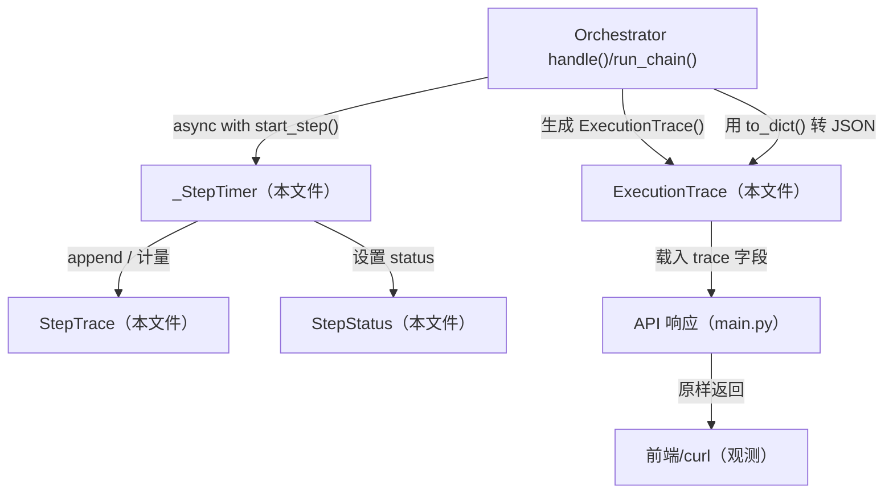
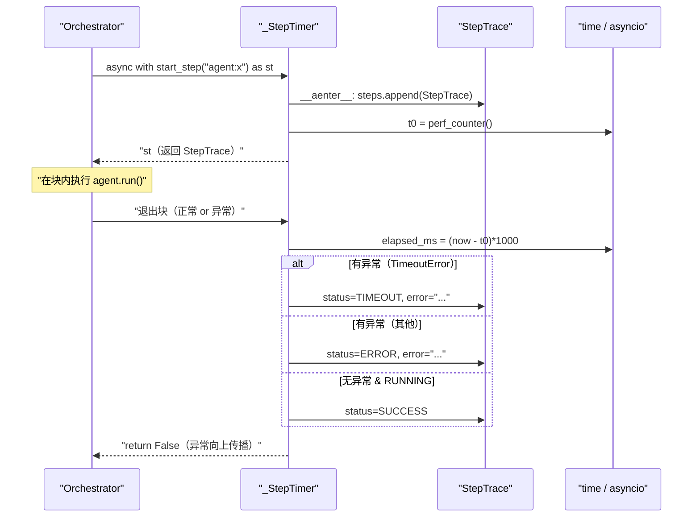
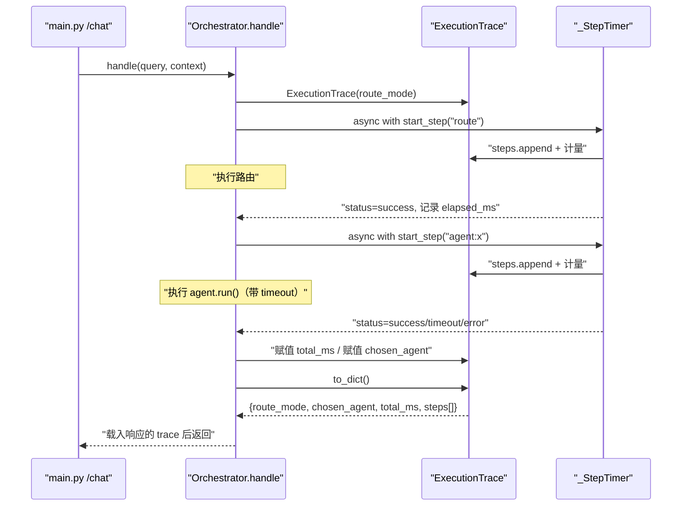

# 基本设计书（代码解说版）
## `backend/app/core/trace.py` — 执行追踪（可观测性）

> 本书面向初学者，用图和表解说「这个文件以什么为输入、输出什么、被谁调用、内部如何运转、与哪些部件相互调用」。专业术语在 §7 术语表附中文注释。

---

## 0. 文档信息

| 项目 | 内容 |
|---|---|
| 对象文件 | `backend/app/core/trace.py` |
| 作用（一句话） | 把 1 次请求的执行**按步计量・记录**，将「谁・是否成功・耗时几毫秒」可视化（可观测性）后载入 API 响应 |
| 所属层 | 核心层（`app/core`） |
| 公开类 | `StepStatus`（Enum）／ `StepTrace`（dataclass）／ `ExecutionTrace`（dataclass）／ `_StepTimer`（内部・异步上下文管理器） |
| 依赖（import）对象 | 仅标准库（`time` / `dataclasses` / `enum` / `asyncio`） |
| 直接调用方 | `core/orchestrator.py`（`handle()`・`run_chain()` 对各步计量） |

---

## 1. 概述

`trace.py` 是**可观测性（observability）的微型实现**。平台既然要编排多个 agent，就必须把「哪个 agent・是否成功・耗时几毫秒」可视化。没有它，遇到慢/失败就找不出元凶，无法运维。

它提供 4 个部件：

1. **`StepStatus`** — 表示步骤状态（`running` / `success` / `error` / `timeout`）的枚举型。
2. **`StepTrace`** — 单步的记录（step 名・status・耗时 ms・detail・error）。
3. **`ExecutionTrace`** — 1 次请求整体的追踪。把步骤群与总处理时间束在一起，用 `to_dict()` 转成 JSON。
4. **`_StepTimer`** — 配合 `async with`「测量起止时刻、把异常反映到 status」的幕后辅助。

> 💡 **设计意图**：不让各 agent 去写计量代码。orchestrator 只需写 `async with trace.start_step("agent:x") as st:`，就能**进入瞬间开始计量、离开瞬间自动记录耗时与成败**。＝把横切关注点（cross-cutting concern）集中到 `_StepTimer`。

---

## 2. 系统内的位置（调用关系图）

`trace.py` 只被 orchestrator 使用，结果随 API 响应输出到外部：

- **IN（调过来的一侧）**：`orchestrator.py` 创建 `ExecutionTrace`，用 `start_step()` 包住各处理，最后 `to_dict()`。
- **OUT（出去的一侧）**：除标准库外无依赖。生成的 dict 成为 API 响应的 `"trace"` 键。

---

## 3. 公开接口一览

| 名称 | 类型 | IN（主要输入） | OUT（返回值） | 大致用途 |
|---|---|---|---|---|
| `StepStatus` | Enum（继承 str） | — | `running`/`success`/`error`/`timeout` | 步骤状态的词汇 |
| `StepTrace` | dataclass | step, status, elapsed_ms, detail, error | （实例） | 单步的记录 |
| `ExecutionTrace` | dataclass | route_mode, chosen_agent, steps, total_ms | （实例） | 1 次请求整体的记录 |
| `ExecutionTrace.start_step` | 同步 | step（名字） | `_StepTimer` | 用 `async with` 开始计量 |
| `ExecutionTrace.to_dict` | 同步 | （无） | `dict` | 为响应转成 JSON |
| `_StepTimer.__aenter__` | 异步 | （无） | `StepTrace` | 开始计量・把 step 登入 steps |
| `_StepTimer.__aexit__` | 异步 | exc_type, exc, tb | `bool`（恒为 `False`） | 记录耗时・把异常反映到 status |

---

## 4. 类・方法详细设计

每个要素拆为「作用 / 输入(IN) / 输出(OUT) / 调用处 / 调用谁 / 处理逻辑 / 注意点」。

### 4.1 `StepStatus`（步骤状态的枚举, 行22〜26）

- **作用**：表示单步状态的**枚举型（Enum）**。同时继承了 `str`，所以值可直接当字符串用（便于 JSON 化）。
- **值**：`RUNNING="running"` / `SUCCESS="success"` / `ERROR="error"` / `TIMEOUT="timeout"`
- **输出(OUT)**：`StepStatus` 成员（用 `.value` 取字符串）
- **调用处**：
  - `trace.py:32`（`StepTrace.status` 的默认值 `StepStatus.RUNNING`）
  - `trace.py:86-91`（`_StepTimer.__aexit__` 中确定 status）
  - `core/orchestrator.py:27`（`from .trace import ExecutionTrace, StepStatus`）※现状 orchestrator 不直接设置 status，交给 `_StepTimer`
- **调用谁**：无
- **处理逻辑**：仅常量定义。
- **注意点**：`class StepStatus(str, Enum)` 的**多重继承**是要点。`StepStatus.SUCCESS == "success"` 成立，`to_dict()` 里写 `s.status.value` 就能取到裸字符串。

---

### 4.2 `StepTrace`（单步的记录, 行29〜35）

- **作用**：保存单步记录的 dataclass。
- **输入(IN)（字段）**

| 字段 | 类型 | 默认值 | 含义 |
|---|---|---|---|
| `step` | `str` | （必填） | 步骤名（`"route"` / `"agent:knowledge"` / `"connector:calendar"` 等） |
| `status` | `StepStatus` | `RUNNING` | 成败。初始为运行中，在 `__aexit__` 中确定 |
| `elapsed_ms` | `float` | `0.0` | 耗时（毫秒） |
| `detail` | `str` | `""` | 人类可读的简短说明（例：输出的前 80 字、命中件数） |
| `error` | `str \| None` | `None` | 错误字符串（仅异常时） |

- **输出(OUT)**：`StepTrace` 实例
- **调用处**：`trace.py:73`（`_StepTimer.__init__` 生成 `StepTrace(step=step)`）
- **调用谁**：无
- **处理逻辑**：数据容器。`detail` 由 orchestrator 侧赋值（例 `st.detail = result.output[:80]` @ `orchestrator.py:103`）。
- **注意点**：`status` 初值为 `RUNNING` 是关键。`__aexit__` 中若「无异常且仍是 RUNNING」则升格为 `SUCCESS`（见 4.6）。

---

### 4.3 `ExecutionTrace`（请求整体的记录, 行38〜65）⭐

- **作用**：1 次 `/chat`（或 `/chain`）执行的整体追踪。把多个 `StepTrace` 与总处理时间束在一起。
- **输入(IN)（字段）**

| 字段 | 类型 | 默认值 | 含义 |
|---|---|---|---|
| `route_mode` | `str` | `""` | `"rule"` / `"llm"` / `"chain"` |
| `chosen_agent` | `str` | `""` | 最终被选中的 agent 名（chain 时为 `"data_query→summary"`） |
| `steps` | `list[StepTrace]` | `[]`（`field(default_factory=list)`） | 各步记录的数组 |
| `total_ms` | `float` | `0.0` | 请求整体的处理时间（毫秒） |

- **输出(OUT)**：`ExecutionTrace` 实例
- **调用处**：
  - `core/orchestrator.py:111`（`handle()`：`ExecutionTrace(route_mode=route_mode)`）
  - `core/orchestrator.py:152`（`run_chain()`：`ExecutionTrace(route_mode="chain", chosen_agent="data_query→summary")`）
- **持有方法**：`start_step()`（4.4）／ `to_dict()`（4.5）
- **调用谁**：无（数据容器，方法见 4.4/4.5）
- **处理逻辑**：以 dataclass 持有四个字段，并提供 `start_step()`/`to_dict()` 两个方法。
- **注意点**：orchestrator 会**直接赋值** `trace.chosen_agent`（`orchestrator.py:120`）和 `trace.total_ms`（`:130,163,182`）来填充。追踪的规则是「即使失败也一定返回」（在 `handle` 的 `try/except` 之外做 `to_dict()`）。

---

### 4.4 `ExecutionTrace.start_step`（开始计量, 行46〜48）⭐

- **作用**：以 `async with trace.start_step("agent:x") as st:` 形式使用的计量入口。仅生成并返回 `_StepTimer`。
- **输入(IN)**

| 参数 | 类型 | 含义 |
|---|---|---|
| `step` | `str` | 步骤名（`"route"` / `"agent:data_query"` 等） |

- **输出(OUT)**：`_StepTimer`（异步上下文管理器）
- **调用处**：
  - `core/orchestrator.py:100`（`_run_agent`：`start_step(f"agent:{name}")`）
  - `core/orchestrator.py:114`（`handle`：`start_step("route")`）
  - `core/orchestrator.py:155`（`run_chain`：`start_step("agent:data_query")`）
  - `core/orchestrator.py:175`（`run_chain`：`start_step("agent:summary")`）
- **调用谁**：生成 `_StepTimer(self, step)`
- **处理逻辑**：`return _StepTimer(self, step)`。真正的计量开始・登记发生在 `_StepTimer.__aenter__` 侧。
- **注意点**：`start_step` 本身**还没开始计量**。进入 `async with` 的瞬间（`__aenter__`）才打时刻。

---

### 4.5 `ExecutionTrace.to_dict`（JSON 化, 行50〜65）

- **作用**：把整体追踪转成 API 响应用的裸 `dict`。把 `StepStatus` 转成 `.value`（字符串）、`float` 用 `round()` 取整。
- **输入(IN)**：无
- **输出(OUT)**：`dict`（`route_mode` / `chosen_agent` / `total_ms` / `steps[]`）
- **调用处**：
  - `core/orchestrator.py:136`（`handle` 的返回值 `"trace": trace.to_dict()`）
  - `core/orchestrator.py:168`（`run_chain` 提前结束时）
  - `core/orchestrator.py:187`（`run_chain` 正常结束时）
- **调用谁**：无（仅整形自身字段）
- **处理逻辑（分步）**：
  1. `total_ms` 用 `round(_, 1)` 取到小数 1 位。
  2. 用推导式遍历 `steps`，把每个 `StepTrace` 转成 `{step, status(=value), elapsed_ms(=round), detail, error}` 的 dict。
  3. 汇总返回。
- **注意点**：`status` 用 `s.status.value` 取**裸字符串而非枚举成员**。这样 `json` 序列化能直接通过（直接放 Enum 有时会卡住 JSON 化）。

---

### 4.6 `_StepTimer`（计量辅助・异步上下文管理器, 行68〜93）⭐

- **作用**：在步骤起止测时间、把异常反映到 `status` 的幕后。用 `async with` 语法使用（实现 `__aenter__` / `__aexit__`）。
- **输入(IN)（`__init__`）**：`trace: ExecutionTrace`, `step: str`
- **输出(OUT)（`__aenter__`）**：`StepTrace`（用 `as st:` 接收，可后续赋值 `st.detail` 等）
- **调用处**：`ExecutionTrace.start_step`（`trace.py:48`）是唯一的生成源。实际的 `async with` 在 orchestrator 各 `start_step(...)` 处（4.4 的一览）。
- **调用谁**：`time.perf_counter()`（高精度计量）／ `asyncio.TimeoutError`（类型判定）
- **处理逻辑（分步）**：
  1. **`__init__`**：创建并保持 `StepTrace(step=step)`（还不放入 steps）。
  2. **`__aenter__`**（进入 `async with` 的瞬间）：把 `StepTrace` **append** 到 `trace.steps`，用 `time.perf_counter()` 记录开始时刻，返回 `StepTrace`。
  3. **`__aexit__`**（离开 `async with` 的瞬间）：
     - 记录耗时 `elapsed_ms = (now - t0) * 1000`。
     - **若有异常**：`asyncio.TimeoutError` 则 `status=TIMEOUT`，其他则 `status=ERROR`，并把 `"类型名: 消息"` 放入 `error`。
     - **若无异常且仍是 RUNNING**，则升格为 `status=SUCCESS`。
     - **`return False`** ＝ 不吞掉异常，向上层（orchestrator）传播。
- **注意点**：`__aexit__` **返回 `False`** 至关重要。返回 `True` 会吞掉异常。这里只在追踪里刻下 status，**异常原样再抛给 orchestrator**，由 `handle()` 侧的 `try/except` 去整形（职责分离）。

---

## 5. 数据流

`handle()` 创建 `ExecutionTrace`，用 `_StepTimer` 对各步计量，最后 `to_dict()` 送进响应：

- 要点：计量绑定在 `async with` 的**进入/离开**上，所以 orchestrator 侧「包一下就行」。即使失败，`steps` 也会留下带 error 的记录，`to_dict()` 一定返回（死守可观测性）。

---

## 6. 相互引用表

| 本文件的要素 | 调用处 | 调用谁（依赖） |
|---|---|---|
| `StepStatus` | `trace.py:32,86-91`, `orchestrator.py:27`(import) | — |
| `StepTrace` | `trace.py:73`（`_StepTimer.__init__`） | — |
| `ExecutionTrace`（生成） | `orchestrator.py:111`(`handle`), `:152`(`run_chain`) | — |
| `start_step` | `orchestrator.py:100,114,155,175` | `_StepTimer` |
| `to_dict` | `orchestrator.py:136,168,187` | — |
| `_StepTimer.__aenter__` | （进入 `async with` 时自动） | `time.perf_counter` |
| `_StepTimer.__aexit__` | （离开 `async with` 时自动） | `time.perf_counter`, `asyncio.TimeoutError` |

> 关联文件：`orchestrator.py`（唯一使用者。`handle`/`run_chain` 做计量）／`main.py`（把 `trace` 载入响应返回）

---

## 7. 术语表

| 术语（日/英） | 中文注释 |
|---|---|
| 観測可能性 / observability | **可观测性**。记录每步成败、耗时，使运行后能追溯「谁慢了/谁失败了」 |
| トレース / trace | **追踪记录**。一次请求执行的「分步流水账」 |
| 列挙型 / Enum | **枚举**。把有限取值（running/success/error/timeout）定义成具名常量 |
| `str` 併用 Enum（mixed-in Enum） | 让枚举同时是字符串：`StepStatus.SUCCESS == "success"`，JSON 化时 `.value` 直接拿到字符串 |
| データクラス / dataclass | **数据类**。`@dataclass` 自动生成 `__init__` 的轻量结构体 |
| `field(default_factory=list)` | 可变默认值正确写法。每个实例新建独立空 list，避免共享同一 list 的 bug |
| 非同期コンテキストマネージャ / async context manager | **异步上下文管理器**。实现 `__aenter__`/`__aexit__`，配合 `async with` 在进入/退出时自动跑代码 |
| `__aenter__` / `__aexit__` | 进入 `async with` 时调 `__aenter__`，退出时调 `__aexit__`；后者收到异常信息可据此记录状态 |
| `time.perf_counter()` | **高精度计时器**。返回单调递增的秒数，适合测耗时（不受系统时钟调整影响） |
| 例外伝播 / exception propagation | **异常传播**。`__aexit__` 返回 `False`＝不吞掉异常，让它继续抛给上层（orchestrator） |
| タイムアウト / timeout | **超时**。`asyncio.TimeoutError` 对应专门的 `TIMEOUT` 状态，与普通 ERROR 区分 |
| 横断的関心事 / cross-cutting concern | **横切关注点**。计时/状态记录这种跨所有步骤都要做的事，集中到 `_StepTimer`，不让各 agent 重复写 |
| シリアライズ / serialize（JSON化） | **序列化**。`to_dict()` 把对象转成纯 dict，便于放进 HTTP JSON 响应 |
| 単調時計 / monotonic clock | **单调时钟**。`perf_counter` 只增不减，测时间差比墙钟（wall clock）可靠 |

---

> **把此模板套到其他文件时**：§0〜§7 框架照用，把 §4 的「作用/IN/OUT/调用处/调用谁/逻辑/注意点」逐个套到每个类・方法上填写即可。
